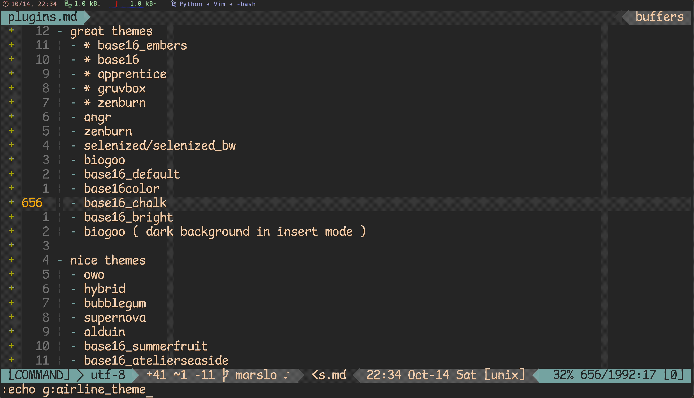
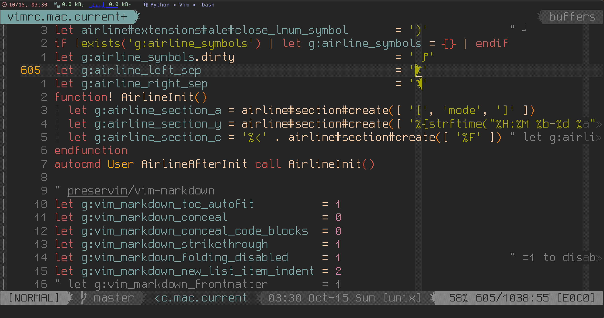
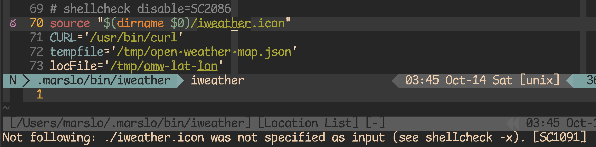
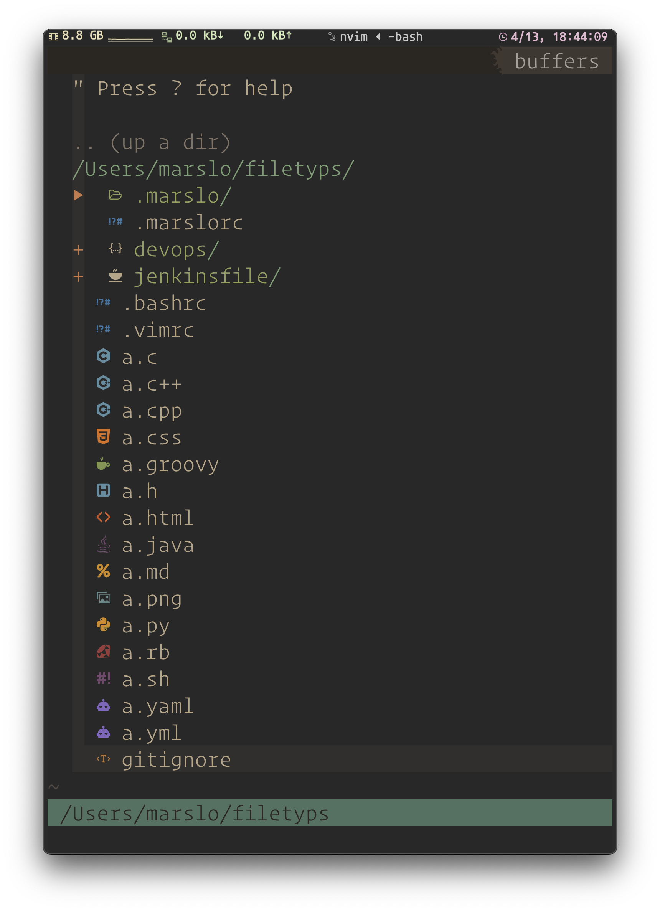
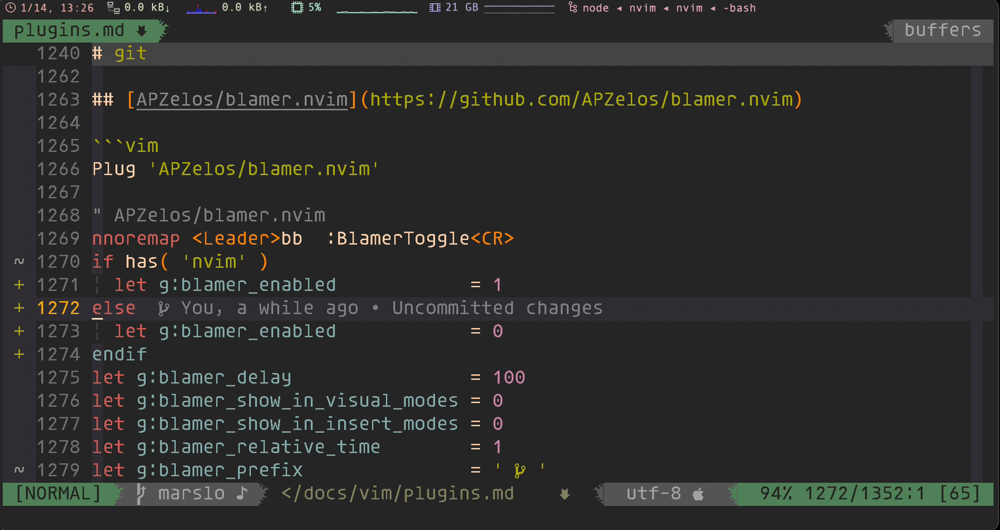

<!-- START doctoc generated TOC please keep comment here to allow auto update -->
<!-- DON'T EDIT THIS SECTION, INSTEAD RE-RUN doctoc TO UPDATE -->

- [highly recommended](#highly-recommended)
  - [LunarWatcher/auto-pairs](#lunarwatcherauto-pairs)
  - [junegunn/fzf.vim](#junegunnfzfvim)
  - [luochen1990/rainbow](#luochen1990rainbow)
  - [Yggdroot/indentLine](#yggdrootindentline)
  - [vim-airline/vim-airline](#vim-airlinevim-airline)
- [programming](#programming)
  - [vim-syntastic/syntastic](#vim-syntasticsyntastic)
  - [coc.nvim](#cocnvim)
    - [coc-snippets](#coc-snippets)
    - [extensions management](#extensions-management)
  - [nvim-treesitter/nvim-treesitter](#nvim-treesitternvim-treesitter)
  - [github/copilot.vim](#githubcopilotvim)
  - [tomtom/tcomment_vim](#tomtomtcomment_vim)
  - [dense-analysis/ale](#dense-analysisale)
  - [vim-syntastic/syntastic](#vim-syntasticsyntastic-1)
- [color and theme](#color-and-theme)
  - [scrooloose/nerdtree](#scrooloosenerdtree)
  - [ryanoasis/vim-devicons](#ryanoasisvim-devicons)
  - [RRethy/vim-hexokinase](#rrethyvim-hexokinase)
- [utils](#utils)
  - [vim-scripts/AuthorInfoDetect](#vim-scriptsauthorinfodetect)
  - [simnalamburt/vim-mundo](#simnalamburtvim-mundo)
  - [yegappan/mru](#yegappanmru)
- [markdown](#markdown)
  - [preservim/vim-markdown](#preservimvim-markdown)
  - [dhruvasagar/vim-table-mode](#dhruvasagarvim-table-mode)
  - [godlygeek/tabular](#godlygeektabular)
- [git](#git)
  - [airblade/vim-gitgutter](#airbladevim-gitgutter)
  - [tpope/vim-fugitive](#tpopevim-fugitive)
  - [APZelos/blamer.nvim](#apzelosblamernvim)
  - [zivyangll/git-blame.vim](#zivyangllgit-blamevim)
- [troubleshooting](#troubleshooting)
  - [airline](#airline)

<!-- END doctoc generated TOC please keep comment here to allow auto update -->


> references:
> - [* vimcolorschemes](https://vimcolorschemes.com/)
> - [Spelling And Grammar With Vim](https://www.vimfromscratch.com/articles/spell-and-grammar-vim)
> - [iMarslo: deprecated plugins](./deprecated.html)
> - dotfiles/vimrc
>   - [* amix/vimrc](https://github.com/amix/vimrc)
>   - [vim-devicon author: ryanoasis/dotfiles](https://github.com/ryanoasis/dotfiles/tree/master)



# highly recommended

> [!NOTE|label:references:]
> - [Vim Plugin Audit](https://tuckerchapman.com/2020/05/18/vim-plugin-audit/)

## [LunarWatcher/auto-pairs](https://github.com/LunarWatcher/auto-pairs/tree/master)

```vim
" LunarWatcher/auto-pairs
let g:AutoPairs                             = autopairs#AutoPairsDefine({ '<': '>' })
let g:AutoPairsMapBS                        = 1
let g:AutoPairsFlyMode                      = 0
let g:AutoPairsCompleteOnlyOnSpace          = 1
let g:AutoPairsNoJump                       = 0
let g:AutoPairsSpaceCompletionRegex         = '\w'
" to avoid impact with ctrl-p ( :Files )
let g:AutoPairsShortcutToggleMultilineClose = 0
let g:AutoPairsShortcutBackInsert           = '<M-b>'
let g:AutoPairsPrefix                       = '<M-j>'
let g:AutoPairsShortcutJump                 = '<M-n>'
let g:AutoPairsShortcutToggle               = '<M-j>'

augroup DevOps
  autocmd FileType markdown,html let g:AutoPairsCompleteOnlyOnSpace = 0
  autocmd FileType markdown,html let b:AutoPairs = autopairs#AutoPairsDefine({
        \ '<div>':'</div>', '<font>':'</font>', '<a>':'</a>', '<p>':'</p>',
        \ '<table>':'</table>', '<tbody>':'</tbody>',
        \ '<thread>':'</thread>', '<th>':'</th>', '<td>':'</td>'
        \ })
augroup END
```

[](../../screenshot/vim/vim-auto-pairs.gif)

## [junegunn/fzf.vim](https://github.com/junegunn/fzf.vim)
```vim
set runtimepath+=/usr/local/opt/fzf                                         " $ brew install fzf
Plug '/usr/local/opt/fzf'
Plug 'junegunn/fzf.vim'

" junegunn/fzf.vim
nnoremap <silent> <leader>ff :Files<CR>
nnoremap <silent> <leader>gf :GFiles<CR>
nnoremap <silent> <leader>ag :Ag<CR>
nnoremap <silent> <leader>l  :Buffers<CR>
nnoremap <silent> <Leader>H  :Helptags<CR>
nnoremap <silent> <Leader>g  :Commits<CR>
nnoremap <silent> <Leader>hh :History:<CR>
inoremap <expr> <c-x><c-k> fzf#vim#complete('cat /usr/share/dict/words')
inoremap <expr> <c-x><c-l> fzf#vim#complete(fzf#wrap({
  \ 'prefix': '^.*$',
  \ 'source': 'rg -n ^ --color always',
  \ 'options': '--ansi --delimiter : --nth 3..',
  \ 'reducer': { lines -> join(split(lines[0], ':\zs')[2:], '') }
\ }))
let g:fzf_vim                     = {}
let g:fzf_vim.preview_window      = [ 'right,50%', 'ctrl-\' ]
let g:fzf_vim.tags_command        = 'ctags -R'
let g:fzf_vim.commits_log_options = '--graph --color=always --format="%C(auto)%h%d %s %C(black)%C(bold)%cr"'
let $FZF_DEFAULT_COMMAND          = 'ag --hidden --ignore .git -l -g ""'
command! -bang -nargs=? -complete=dir Files
    \ call fzf#vim#files(<q-args>, {'options': ['--layout=reverse', '--info=inline', '--preview', 'bat --color=always {}']}, <bang>0)
command! -bang -complete=dir -nargs=? LS
    \ call fzf#run(fzf#wrap('ls', {'source': 'ls', 'dir': <q-args>}, <bang>0))
let g:fzf_layout                  = { 'window': { 'width': 0.9, 'height': 0.6, 'relative': v:true } }
let g:fzf_history_dir             = '~/.vim/cache/fzf-history'
let g:fzf_action                  = {
  \ 'ctrl-t': 'tab split',
  \ 'ctrl-x': 'split',
  \ 'ctrl-v': 'vsplit'
\ }
let g:fzf_colors                  = {
  \ 'fg':         ['fg', 'Normal'                               ] ,
  \ 'bg':         ['bg', 'Normal'                               ] ,
  \ 'preview-bg': ['bg', 'NormalFloat'                          ] ,
  \ 'hl':         ['fg', 'Comment'                              ] ,
  \ 'fg+':        ['fg', 'CursorLine', 'CursorColumn', 'Normal' ] ,
  \ 'bg+':        ['bg', 'CursorLine', 'CursorColumn'           ] ,
  \ 'hl+':        ['fg', 'Statement'                            ] ,
  \ 'info':       ['fg', 'PreProc'                              ] ,
  \ 'border':     ['fg', 'Ignore'                               ] ,
  \ 'prompt':     ['fg', 'Conditional'                          ] ,
  \ 'pointer':    ['fg', 'Exception'                            ] ,
  \ 'marker':     ['fg', 'Keyword'                              ] ,
  \ 'spinner':    ['fg', 'Label'                                ] ,
  \ 'header':     ['fg', 'Comment'                              ]
\ }
```

## [luochen1990/rainbow](https://github.com/luochen1990/rainbow)
```vim
Plug 'luochen1990/rainbow'

" luochen1990/rainbow
" for i in '75' '147' '108' '196' '208' '66' '106' '172' '115' '129'; do echo -e "\e[38;05;${i}m${i}"; done | column -c 250 -s ' '; echo -e "\e[m"
let g:rainbow_active    = 1
let g:rainbow_operators = 1
let g:rainbow_conf      = {
  \ 'guifgs' : [ '#6A5ACD', '#ff6347', '#b58900', '#9acd32', '#EEC900', '#9A32CD', '#EE7600', '#268bd2', '#183172' ],
  \ 'ctermfgs' : 'xterm-256color' == $TERM ? [ '75', '147', '108', '196', '208', '66', '106', '172', '115', '129' ] : [ 'lightblue', 'lightgreen', 'yellow', 'red', 'magenta' ],
  \ 'parentheses': ['start=/(/ end=/)/ fold', 'start=/\[/ end=/\]/ fold', 'start=/{/ end=/}/ fold'],
  \ 'operators': '_,_',
  \ 'separately': {
  \   '*': {},
  \   'markdown': {
  \     'parentheses_options': 'containedin=markdownCode contained',
  \   },
  \   'css': {
  \     'parentheses': [ ['(',')'], ['\[','\]'] ],
  \   },
  \   'scss': {
  \     'parentheses': [ ['(',')'], ['\[','\]'] ],
  \   },
  \   'stylus': {
  \     'parentheses': [ 'start=/{/ end=/}/ fold contains=@colorableGroup' ],
  \   },
  \   'vim': {
  \     'parentheses': ['start=/(/ end=/)/', 'start=/\[/ end=/\]/', 'start=/{/ end=/}/ fold', 'start=/(/ end=/)/ containedin=vimFuncBody', 'start=/\[/ end=/\]/ containedin=vimFuncBody', 'start=/{/ end=/}/ fold containedin=vimFuncBody'],
  \   },
  \   'html': {
  \     'parentheses': ['start=/\v\<((area|base|br|col|embed|hr|img|input|keygen|link|menuitem|meta|param|source|track|wbr)[ >])@!\z([-_:a-zA-Z0-9]+)(\s+[-_:a-zA-Z0-9]+(\=("[^"]*"|'."'".'[^'."'".']*'."'".'|[^ '."'".'"><=`]*))?)*\>/ end=#</\z1># fold'],
  \   },
  \   'nerdtree': 0
  \ }}
```

## [Yggdroot/indentLine](https://github.com/Yggdroot/indentLine)
```vim
Plug 'Yggdroot/indentLine'

" settings
nnoremap <leader>idl :IndentLineEnable<CR>

let g:indentLine_enabled              = 1
let g:indentLine_color_gui            = "#282828"
let g:indentLine_color_term           = 239
let g:indentLine_indentLevel          = 20
let g:indentLine_showFirstIndentLevel = 1
let g:indentLine_color_tty            = 0
let g:indentLine_faster               = 1
let g:indentLine_concealcursor        = 'inc'
let g:indentLine_conceallevel         = 2
if has( 'gui_running' ) || 'xterm-256color' == $TERM
  let g:indentLine_char               = '¦'
elseif has( 'win32' )
  let g:indentLine_color_term         = 8
  let g:indentLine_char               = '|'
else
  let g:indentLine_color_tty_dark     = 0
  let g:indentLine_char               = '¦'
endif
```

## [vim-airline/vim-airline](https://github.com/vim-airline/vim-airline)

> [!NOTE|label:references:]
> - [* iMarso : osx/apps/powerline](../osx/apps.html#powerline)
> - [* Getting started with vim-airline](https://tuckerchapman.com/2020/09/15/getting-started-vim-airline/)
> - [How do I fix the status bar symbols in the Airline plugin?](https://vi.stackexchange.com/a/16512/7389)
> - [Airline status line and tab line text changes colour when the vimrc is sourced.](https://www.reddit.com/r/vim/comments/q3ufc0/airline_status_line_and_tab_line_text_changes/)
> - [Vim Airline Setup](https://jnduli.co.ke/vim-airline-setup.html)
> - [autoload/airline/init.vim](https://github.com/vim-airline/vim-airline/blob/master/autoload/airline/init.vim)
> - [Getting started with vim-airline](https://tuckerchapman.com/posts/getting-started-vim-airline/)
> - section:
>   - [#787: How to modify contents of section Y?](https://github.com/vim-airline/vim-airline/issues/787#issue-84289641)
>   - [#1087: How to replace section_y with contents of section_x?](https://github.com/vim-airline/vim-airline/issues/1087)
>   - [#1845: how to disable additional section totally.](https://github.com/vim-airline/vim-airline/issues/1845#issuecomment-449700299)
> - tips:
>   - check loaded extensions : `:AirlineExtension`
>   - [#1373 How can I show system time in airline?](https://github.com/vim-airline/vim-airline/issues/1373#issuecomment-273040424)
>   - [* FAQ](https://github.com/vim-airline/vim-airline/wiki/FAQ)

```vim
Plug 'tpope/vim-fugitive'
Plug 'vim-airline/vim-airline'
Plug 'vim-airline/vim-airline-themes'

" vim-airline/vim-airline
let g:airline_powerline_fonts                      = 1
let g:airline_highlighting_cache                   = 1
let g:airline_detect_spelllang                     = 0              " disable spelling language
let g:airline_exclude_preview                      = 0              " disable in preview window
let g:airline_theme                                = 'base16_embers'" 'apprentice', 'base16', 'gruvbox', 'zenburn', 'base16_atelierheath'
let g:Powerline_symbols                            = 'fancy'
let g:airline_section_y                            = ''             " fileencoding
let g:airline_section_x                            = ''
let g:airline_section_z                            = "%3p%% %l/%L:%c [%B]"
let g:airline_skip_empty_sections                  = 1
let g:airline_detect_modified                      = 1
let g:airline_detect_paste                         = 1
let g:airline#extensions#wordcount#enabled         = 1
let g:airline#extensions#wordcount#filetypes       = '\vtext|nroff|plaintex'
let g:airline#extensions#quickfix#enabled          = 0
let g:airline#extensions#quickfix#quickfix_text    = 'Quickfix'
let g:airline_stl_path_style                       = 'short'
let g:airline#extensions#tabline#enabled           = 1              " ╮ enable airline tabline
let g:airline#extensions#tabline#fnamemod          = ':t'           " │
let g:airline#extensions#tabline#show_close_button = 0              " │ remove 'X' at the end of the tabline
let g:airline#extensions#tabline#show_buffers      = 1              " │
let g:airline#extensions#tabline#show_splits       = 0              " │ disables the buffer name that displays on the right of the tabline
let g:airline#extensions#tabline#tab_min_count     = 2              " │ minimum of 2 tabs needed to display the tabline
let g:airline#extensions#tabline#show_tabs         = 0              " │
let g:airline#extensions#tabline#tab_nr_type       = 1              " ╯ tab number
let g:airline#extensions#branch#format             = 2
let g:airline#extensions#fzf#enabled               = 1
let g:airline#extensions#nerdtree_statusline       = 1
let g:airline#extensions#syntastic#enabled         = 1
let g:airline#extensions#coc#enabled               = 1              " ╮
let g:airline#extensions#coc#show_coc_status       = 0              " │
let g:airline#extensions#coc#error_symbol          = ' ✗:'          " ├ coc
let g:airline#extensions#coc#warning_symbol        = ' ⍨:'          " │
let g:airline#extensions#coc#stl_format_err        = '%C(␊%L)'      " │
let g:airline#extensions#coc#stl_format_warn       = '%C(␊%L)'      " ╯
let g:airline#extensions#ale#enabled               = 0              " ╮
let g:airline#extensions#ale#error_symbol          = ' ᓆ :'         " │
let g:airline#extensions#ale#warning_symbol        = ' ᣍ :'         " ├ ale
let g:airline#extensions#ale#show_line_numbers     = 0              " │
let g:airline#extensions#ale#open_lnum_symbol      = '(␊:'          " │
let g:airline#extensions#ale#close_lnum_symbol     = ')'            " ╯
" let g:airline_mode_map                           = { '__': '-', 'n' : 'N', 'i' : 'I', 'R' : 'R', 'c' : 'C', 'v' : 'V', 'V' : 'V', '': 'V', 's' : 'S', 'S' : 'S', '': 'S', }
if !exists('g:airline_symbols') | let g:airline_symbols = {} | endif
let g:airline_symbols.dirty                        = ' ♪'
let g:airline_left_sep                             = ''
let g:airline_right_sep                            = ''
function! AirlineInit()
  let g:airline_section_a = airline#section#create([ '[', 'mode', ']' ])
  let g:airline_section_y = airline#section#create([ '%{strftime("%H:%M %b-%d %a")} ', '['.&ff.']' ])
  let g:airline_section_c = '%<' . airline#section#create([ '%F' ]) " let g:airline_section_c = '%<' . '%{expand(%:p:~)}'
endfunction
autocmd User AirlineAfterInit call AirlineInit()
```

[](../../screenshot/vim/vim-airline-ale-3.png)

- tips
  - [remove section_<x>](https://stackoverflow.com/a/45150368/2940319)
    ```vim
    let g:airline_section_<x>         = ''                          " remove the filetype part
    let g:airline_skip_empty_sections = 1                           " remove separators for empty sections
    ```

  - setup short mode
    ```vim
    let g:airline_mode_map = { '__': '-', 'n' : 'N', 'i' : 'I', 'R' : 'R', 'c' : 'C', 'v' : 'V', 'V' : 'V', '': 'V', 's' : 'S', 'S' : 'S', '': 'S', }
    ```

  - unicode symbols

    > [!NOTE|label:symbols]
    > - [`:help airline`](https://github.com/vim-airline/vim-airline/blob/master/doc/airline.txt)
    >   ```vim
    >   " powerline symbols
    >   let g:airline_left_sep          = ''     " \ue0b0
    >   let g:airline_left_alt_sep      = ''     " \ue0b1
    >   let g:airline_right_sep         = ''     " \ue0b2
    >   let g:airline_right_alt_sep     = ''     " \ue0b3
    >   let g:airline_symbols.branch    = ''     " \ue0a0
    >   let g:airline_symbols.colnr     = ' ℅:'   " \u2105 \u3a
    >   let g:airline_symbols.readonly  = ''     " \ue0a2
    >   let g:airline_symbols.linenr    = ' :'   " \ue0a1
    >   let g:airline_symbols.maxlinenr = '☰ '    " \u2630
    >   let g:airline_symbols.dirty     = '⚡'    " \u26a1
    >
    >   " old vim-powerline symbols
    >   let g:airline_left_sep          = '⮀'     " \u2b80
    >   let g:airline_left_alt_sep      = '⮁'     " \u2b81
    >   let g:airline_right_sep         = '⮂'     " \u2b82
    >   let g:airline_right_alt_sep     = '⮃'     " \u2b83
    >   let g:airline_symbols.branch    = '⭠'     " \u2b60
    >   let g:airline_symbols.readonly  = '⭤'     " \u2b64
    >   let g:airline_symbols.linenr    = '⭡'     " \u2b61
    >
    >   " unicode symbols
    >   let g:airline_left_sep           = '»'    " \u00bb
    >   let g:airline_left_sep           = '▶'    " \u25b6
    >   let g:airline_right_sep          = '«'    " \u00ab
    >   let g:airline_right_sep          = '◀'    " \u25c0
    >   let g:airline_symbols.colnr      = ' ㏇:' " \u33C7
    >   let g:airline_symbols.colnr      = ' ℅:'  " \u2105
    >   let g:airline_symbols.crypt      = '🔒'   " \U0001f512
    >   let g:airline_symbols.linenr     = '☰'    " \u2630
    >   let g:airline_symbols.linenr     = ' ␊:'  " \u240a
    >   let g:airline_symbols.linenr     = ' ␤:'  " \u2424
    >   let g:airline_symbols.linenr     = '¶'    " \u00b6
    >   let g:airline_symbols.maxlinenr  = ''
    >   let g:airline_symbols.maxlinenr  = '㏑'   " \u33d1
    >   let g:airline_symbols.branch     = '⎇'    " \u2387
    >   let g:airline_symbols.paste      = 'ρ'    " \u03c1
    >   let g:airline_symbols.paste      = 'Þ'    " \u00de
    >   let g:airline_symbols.paste      = '∥'    " \u2225
    >   let g:airline_symbols.spell      = 'Ꞩ'    " \ua7a8
    >   let g:airline_symbols.notexists  = 'Ɇ'    " \u0246
    >   let g:airline_symbols.notexists  = '∄'    " \u2204
    >   let g:airline_symbols.whitespace = 'Ξ'    " \u039e
    >   ```
    >
    > - [`:help airline-customization`](https://vi.stackexchange.com/a/3363/7389)
    >   ```vim
    >   " unicode symbols
    >   let g:airline_left_sep           = '»'
    >   let g:airline_left_sep           = '▶'
    >   let g:airline_right_sep          = '«'
    >   let g:airline_right_sep          = '◀'
    >   let g:airline_symbols.linenr     = '␊'
    >   let g:airline_symbols.linenr     = '␤'
    >   let g:airline_symbols.linenr     = '¶'
    >   let g:airline_symbols.branch     = '⎇'
    >   let g:airline_symbols.paste      = 'ρ'
    >   let g:airline_symbols.paste      = 'Þ'
    >   let g:airline_symbols.paste      = '∥'
    >   let g:airline_symbols.whitespace = 'Ξ'
    >   ```

    ```vim
    let g:airline_symbols.branch         = '⎇'                    " ╮
    let g:airline_symbols.paste          = 'ρ'                    " ├ unicode symbols
    let g:airline_symbols.dirty          = ' ↯'                   " ╯
    ```

  - [get theme randomly](https://github.com/vim-airline/vim-airline-themes/issues/170#issuecomment-476524390)

    > [!NOTE]
    > - [#2145 : Align section C to the left when overflowed](https://github.com/vim-airline/vim-airline/issues/2145#issuecomment-673640814)

    ```vim
    let g:airline_theme                  = 'random'
    ```

#### sections

> [!NOTE|label:references:]
> - [#696 : Accents may cause status line exceed width](https://github.com/vim-airline/vim-airline/issues/696#issuecomment-75034875)

```vim
let g:airline_section_x                          = "%-{strftime(\"%H:%M\ %d/%m/%y\")} %1*--%n%%--%*"
let g:airline_section_y                          = "%{&fenc}%{&bomb ? '[bom]' : ''}%{strlen(&ff) > 0 ? '['.&ff.']' : ''}"
let g:airline#parts#ffenc#skip_expected_string   ='utf-8[unix]'
let g:airline_section_c_only_filename            = 0

function! AirlineInit()
  " NORMAL  docs/vim/
  let g:airline_section_a = airline#section#create([ 'mode', '  ', '%{join( split(getcwd(), "/")[-2:-1], "/" )}', '/' ])
  " NORMAL  docs/vim/plugins.md
  let g:airline_section_a = airline#section#create([ 'mode', '  ', '%{join( split(expand("%:p"), "/")[-3:-1], "/" )}' ])
  let g:airline_section_y = airline#section#create(['%{strftime("%H:%M %b-%d %a")} ', '['.&ff.']'])
  let g:airline_section_c = '%<' . airline#section#create(['%{expand("%:p:~")}'])
endfunction
autocmd User AirlineAfterInit call AirlineInit()
```

- section_a

  > [!NOTE|label:paths:]
  > - show relative path `%F` : `let g:airline_section_c = airline#section#create([ '%F' ])` -> `~/.vimrc`
  > - show filename only `%f` : `let g:airline_section_c = airline#section#create([ '%f' ])` -> `.vimrc`

  [](../../screenshot/vim/vim-airline-section_a-default.png)

  [](../../screenshot/vim/vim-airline-section_a-short.png)

  - via function
    ```vim
    function! ShortPath()
      let pathlist=split(expand("%:p:~"), "/")
      return len(pathlist) < 3 ? join( pathlist[-2:-1], "/" ) : join( pathlist[-3:-1], "/" )
    endfunction
    " or"
    function! ShortPath()
      let pathlist=split(expand("%:p:~"), "/")
      if len(pathlist) < 3 | let final_result=join( pathlist[-2:-1], "/" ) | else | let final_result=join( pathlist[-3:-1], "/" ) | endif
      return final_result
    endfunction

    let g:airline_section_a = airline#section#create([ 'mode', '  ', ShortPath() ])
    ```

    - i.e.:
      ```vim
      function! ShortPath()
        let pathlist=split(expand("%:p:~"), "/")
        return len(pathlist) < 3 ? join( pathlist[-2:-1], "/" ) : join( pathlist[-3:-1], "/" )
      endfunction
      function! AirlineInit()
        let g:airline_section_a = airline#section#create([ '[', 'mode', ']', '  ', '%{&fenc}', '  ', ShortPath() ])
        let g:airline_section_y = airline#section#create([ '%{strftime("%H:%M %b-%d %a")} ', '['.&ff.']' ])
        let g:airline_section_c = '%<' . airline#section#create([ '%F' ]) " let g:airline_section_c = '%<' . '%{expand(%:p:~)}'
      endfunction
      autocmd User AirlineAfterInit call AirlineInit()
      ```

      [](../../screenshot/vim/vim-airline-section_a-shortpath-1.png)

  - via `%{}`
    ```vim
    function! AirlineInit()
      let pathlist=split( expand("%:p:~"), "/" )
      let g:airline_section_a = airline#section#create([ 'mode', '  ', '%{len(pathlist) < 3 ? join( pathlist[-2:-1], "/" ) : join( pathlist[-3:-1], "/" )}'])
    endfunction
    autocmd User AirlineAfterInit call AirlineInit()
    ```

    [](../../screenshot/vim/vim-airline-section_a-shortpath-2.png)


- sections with length limitation
  - `%<'`: `let g:airline_section_c = '%<' . airline#section#create(['%{expand("%:p:~")}'])`
  - [`%-0.xx{}`](https://github.com/vim-airline/vim-airline/issues/1485#issuecomment-309734370) : `let g:airline_section_c = '%<' . '%-0.13{expand("%:p:~")}'`

  - i.e.:
    ```vim
    let g:airline_section_c = '%<' . '%-0.20{expand("%:p:~")}'
    " <docs/vim/plugins.md

    let g:airline_section_c = '%<' . '%{expand("%:p:~")}'
    " ~/path/to/ibook/docs/vim/plugins.md

    let g:airline_section_c = airline#section#create(['%F'])
    " ~/path/to/book/docs/vim/plugins.md
    ```

#### themes

> - [n-st/vim-airline-screenshots](https://github.com/n-st/vim-airline-screenshots)
> - [* Change the vim-airline theme](https://github.com/vim-airline/vim-airline/wiki/Screenshots)
>   - `:AirlineTheme random` : `let g:airline_theme='random'` : `:echo g:airline_theme`
>     [](../../screenshot/vim/vim-AirlineTheme-random.gif)
>   - [tomorrow](https://github.com/vim-airline/vim-airline/wiki/Screenshots#tomorrow-1)
>   - [distinguished](https://github.com/vim-airline/vim-airline/wiki/Screenshots#distinguished)
>   - [base16](https://github.com/vim-airline/vim-airline/wiki/Screenshots#base16)
>   - [angr](https://github.com/vim-airline/vim-airline/wiki/Screenshots#angr)
>   - [zenburn](https://github.com/vim-airline/vim-airline/wiki/Screenshots#zenburn)
>   - [zenburn](https://github.com/vim-airline/vim-airline/wiki/Screenshots#zenburn)
>   - [wombat](https://github.com/vim-airline/vim-airline/wiki/Screenshots#wombat)

- great themes
  - * base16_embers
    [](../../screenshot/vim/vim-airline-base16_embers_2.gif)

  - * base16
    [](../../screenshot/vim/vim-airline-base16.gif)

  - * apprentice
    [](../../screenshot/vim/vim-airline-apprentice.gif)

  - * gruvbox
    [](../../screenshot/vim/vim-airline-gruvbox.gif)

  - * zenburn
    [](../../screenshot/vim/vim-airline-zenburn.gif)

  - angr
  - selenized/selenized_bw
  - biogoo
  - base16_default
  - base16color
  - base16_chalk
  - base16_bright
  - biogoo ( dark background in insert mode )

- nice themes
  - owo
  - hybrid
  - bubblegum
  - supernova
  - alduin
  - base16_summerfruit
  - base16_atelierseaside
  - raven ( no background color )
  - peaksea ( no background color change )

# programming
## [vim-syntastic/syntastic](https://github.com/vim-syntastic/syntastic)

> [!NOTE|label:references:]
> - [#1577 : Unknown function: SyntasticStatuslineFlag](https://github.com/vim-syntastic/syntastic/issues/1577)
> - [In Editor Linting with Syntastic](https://medium.com/usevim/in-editor-linting-with-syntastic-6814122bdbec)
>   ```vim
>   :SyntasticInfo
>   ```

[](../../screenshot/vim/vim-syntastic-style-warning.png)

[](../../screenshot/vim/vim-syntastic-error.png)

```vim
Plug 'vim-syntastic/syntastic'

" syntastic settings                                                " Plug 'vim-syntastic/syntastic'
set statusline+=%#warningmsg#
set statusline+=%{SyntasticStatuslineFlag()}
set statusline+=%*
let g:syntastic_always_populate_loc_list = 1
let g:syntastic_auto_loc_list            = 1
let g:syntastic_check_on_open            = 1
let g:syntastic_check_on_wq              = 0
let g:syntastic_loc_list_height          = 2
let g:syntastic_ignore_files             = ['\.py$']
let g:syntastic_html_tidy_ignore_errors  = [" proprietary attribute \"ng-"]
let g:syntastic_enable_signs             = 1
let g:syntastic_info_symbol              = 'ೲ'                      " ࠵ ϊ
let g:syntastic_error_symbol             = '✗'                      " ஓ ௐ ྾
let g:syntastic_warning_symbol           = '⍨'                      " ᓆ ᓍ
let g:syntastic_style_error_symbol       = '⍥'
let g:syntastic_style_warning_symbol     = 'ఠ'                      " ⍤ ൠ
highlight link SyntasticErrorSign        Error
highlight link SyntasticWarningSign      GruvboxYellow
highlight link SyntasticStyleErrorSign   GruvboxRedSign
highlight link SyntasticStyleWarningSign GruvboxPurpleSign
```

<!--sec data-title="former version" data-id="section0" data-show=true data-collapse=true ces-->
  ```vim
  Bundle 'vim-syntastic/syntastic'

  " configure syntastic syntax checking to check on open as well as save
  set statusline+=%#warningmsg#
  set statusline+=\ %{SyntasticStatuslineFlag()}                      " vim-syntastic/syntastic
  set statusline+=\ %* |
  let g:syntastic_always_populate_loc_list  = 1
  let g:syntastic_auto_loc_list             = 1
  let g:syntastic_check_on_open             = 1
  let g:syntastic_check_on_wq               = 0
  let g:syntastic_loc_list_height           = 2
  let g:syntastic_ignore_files              = ['\.py$']
  let g:syntastic_html_tidy_ignore_errors   = [" proprietary attribute \"ng-"]
  ```
<!--endsec-->

## [coc.nvim](https://github.com/neoclide/coc.nvim)

> [!TIP|label:references:]
> - [CocList 入坑指南](https://zhuanlan.zhihu.com/p/71846145) | [coc.nvim 插件体系 - 介绍](https://zhuanlan.zhihu.com/p/65524706)
> - [* Language servers](https://github.com/neoclide/coc.nvim/wiki/Language-servers)
> - [NeoVim for Java Development (COC)](https://javadev.org/devtools/ide/neovim/coc/)
> - [dansomething/coc-groovy](https://github.com/dansomething/coc-groovy)
> - [Manage coc extensions](https://github.com/neoclide/coc.nvim/wiki/Using-coc-extensions#manage-coc-extensions)
> - [nicknisi/dotfiles/config/nvim/coc-settings.json](https://github.com/nicknisi/dotfiles/blob/master/config/nvim/coc-settings.json)
> - [YongJieYongJie/dotfiles/coc-settings.json](https://github.com/YongJieYongJie/dotfiles/blob/master/coc-settings.json)

- initialize
  ```bash
  $ pip install jedi
  ```

  ```vim
  " install
  Plug 'neoclide/coc.nvim', { 'branch': 'release' }

  " neoclide/coc.nvim
  set updatetime=300
  set signcolumn=yes
  let g:coc_global_extensions = [
    \   'coc-sh',
    \   'coc-groovy', 'coc-java',
    \   'coc-json',
    \   'coc-css', 'coc-htmlhint', 'coc-html-css-support',
    \   'coc-pyright',
    \   'coc-snippets',
    \   'coc-docker',
    \   'coc-emoji'
    \ ]
  function! CheckBackspace() abort
    let col = col('.') - 1
    return !col || getline('.')[col - 1]  =~# '\s'
  endfunction
  function! ShowDocumentation()
    if CocAction('hasProvider', 'hover')
      call CocActionAsync('doHover')
    else
      call feedkeys('K', 'in')
    endif
  endfunction
  autocmd FileType json syntax match Comment +\/\/.\+$+
  autocmd FileType html let b:coc_root_patterns = ['.git', '.env', 'tailwind.config.js', 'tailwind.config.cjs']
  inoremap <silent><expr> <DOWN>
        \ coc#pum#visible() ? coc#pum#next(1) : CheckBackspace()
        \                   ? "\<DOWN>" : coc#refresh()
  inoremap <expr><UP> coc#pum#visible() ? coc#pum#prev(1) : "\<C-h>"
  inoremap <silent><expr> <C-M>
       \ coc#pum#visible() ? coc#pum#confirm() : "\<C-g>u\<CR>\<c-r>=coc#on_enter()\<CR>"
  command! -nargs=0 OR  :call CocActionAsync('runCommand', 'editor.action.organizeImport')
  nmap     <silent>[g   <Plug>(coc-diagnostic-prev)
  nmap     <silent>]g   <Plug>(coc-diagnostic-next)
  nmap     <silent>gd   <Plug>(coc-definition)
  nmap     <silent>gy   <Plug>(coc-type-definition)
  nmap     <silent>gi   <Plug>(coc-implementation)
  nmap     <silent>gr   <Plug>(coc-references)
  nnoremap <silent>K    :call ShowDocumentation()<CR>
  nmap     <leader>cl   <Plug>(coc-codelens-action)
  " coc-snippets ( ctrl-j )
  imap <C-l> <Plug>(coc-snippets-expand)
  vmap <C-j> <Plug>(coc-snippets-select)
  let g:coc_snippet_next = '<c-j>'
  let g:coc_snippet_prev = '<c-k>'
  imap <C-j> <Plug>(coc-snippets-expand-jump)
  inoremap <silent><expr> <C-j>
        \ pumvisible() ? coc#_select_confirm() :
        \ coc#expandableOrJumpable() ? "\<C-r>=coc#rpc#request('doKeymap', ['snippets-expand-jump',''])\<CR>" :
        \ CheckBackSpace() ? "\<TAB>" :
        \ coc#refresh()
  function! CheckBackSpace() abort
    let col = col('.') - 1
    return !col || getline('.')[col - 1]  =~# '\s'
  endfunction
  ```

- open configure file ( `coc-settings.json` )
  ```vim
  :CocConfig
  ```

  - [language server setup](https://www.narga.net/how-to-set-up-code-completion-for-vim/)
    ```json
    {
        "languageserver": {
            "intelephense": {
                "command": "intelephense",
                "args": ["--stdio"],
                "filetypes": ["php"],
                "initializationOptions": {
                    "storagePath": "/tmp/intelephense"
                }
            }
        },
    }
    ```

- check information
  ```vim
  :CocInfo
  :checkhealth
  :CocOpenLog
  :CocCommand workspace.showOutput
  ```

- CocConfig:
  ```json
  {
    "codeLens.enable": true,
    "java.referencesCodeLens.enabled": true,
    "diagnostic.displayByAle": false,
    "diagnostic.errorSign": "✘",
    "diagnostic.infoSign": "ᓆ",
    "diagnostic.warningSign": "ᑹ",
    "diagnostic.hintSign": "➤",
    "diagnostic-languageserver.filetypes": {
      "yaml": [ "yamllint" ],
      "vim": "vint",
      "sh": "shellcheck"
    },
    "html-css-support.styleSheets": [
        "https://cdn.jsdelivr.net/npm/bootstrap@4.5.3/dist/css/bootstrap.min.css",
        "/style.css",
        "style.css"
    ],
    "html-css-support.enabledLanguages": [ "html", "markdown" ],
    "coc.source.file.ignoreHidden": false,
    "snippets.userSnippetsDirectory": "~/.marslo/vimrc.d/snips"
  }
    ```

  - start completion from 2nd string
    ```json
    {
      "suggest.minTriggerInputLength": 2
    }
  ```

  - cause issue of trigger

    > [!TIP]
    > - support autoTrigger: `always`, `trigger`

    ```json
    {
      "suggest.autoTrigger": "trigger",
      "suggest.triggerCompletionWait": 50
    }
    ```

[](../../screenshot/vim/nvim-coc-copilot-snippets.gif)

[](../../screenshot/vim/nvim-treesitter-coc-lspconfig.gif)

- troubleshooting

  > [!NOTE|label:references:]
  > - [#805 ALE diagnostic signs don't appear](https://github.com/neoclide/coc.nvim/issues/805)
  > - [#3402 Can coc vim display all message diagnostic in lines of code](https://github.com/neoclide/coc.nvim/issues/3402)
  > - [Debug language server](https://github.com/neoclide/coc.nvim/wiki/Debug-language-server#using-output-channel)

  ```bash
  $ rust-analyzer --help
  error: 'rust-analyzer' is not installed for the toolchain 'stable-x86_64-unknown-linux-gnu'

  $ rustup component add rust-analyzer
  ```

### [coc-snippets](https://github.com/neoclide/coc-snippets)

> [!NOTE|label:references:]
> - [Configure snippets workflow](https://github.com/neoclide/coc.nvim/wiki/Using-snippets#configure-snippets-workflow)
> - [Snippets with CoC](https://www.chiarulli.me/Neovim/17-snippets/)
> - [Coc.nvim completion and snippets are conflicting](https://www.reddit.com/r/neovim/comments/yl5t0o/cocnvim_completion_and_snippets_are_conflicting/)
> - ultisnips:
>   - [ultisnips/doc/UltiSnips.txt](https://github.com/SirVer/ultisnips/blob/master/doc/UltiSnips.txt)
>   - [UltiSnips Screencast Episode 1](https://www.sirver.net/blog/2011/12/30/first-episode-of-ultisnips-screencast/)
>   - [UltiSnips Screencast Episode 2](https://www.sirver.net/blog/2012/01/08/second-episode-of-ultisnips-screencast/)
>   - [UltiSnips 2.0 and Screencast Episode 3](https://www.sirver.net/blog/2012/02/05/third-episode-of-ultisnips-screencast/)
>   - [UltiSnips Screencast Episode 4](https://www.sirver.net/blog/2012/03/31/fourth-episode-of-ultisnips-screencast/)

[](../../screenshot/vim/nvim-coc-snippet.gif)

```vim
" ~/.vimrc.d/extension
Plug 'neoclide/coc.nvim', { 'branch': 'release' }
Plug 'honza/vim-snippets'
let g:coc_global_extensions = [ 'coc-snippets' ]

" coc-snippets ( ctrl-j )
imap <C-l> <Plug>(coc-snippets-expand)
vmap <C-j> <Plug>(coc-snippets-select)
let g:coc_snippet_next = '<c-j>'
let g:coc_snippet_prev = '<c-k>'
imap <C-j> <Plug>(coc-snippets-expand-jump)
inoremap <silent><expr> <C-j>
      \ pumvisible() ? coc#_select_confirm() :
      \ coc#expandableOrJumpable() ? "\<C-r>=coc#rpc#request('doKeymap', ['snippets-expand-jump',''])\<CR>" :
      \ CheckBackSpace() ? "\<TAB>" :
      \ coc#refresh()
function! CheckBackSpace() abort
  let col = col('.') - 1
  return !col || getline('.')[col - 1]  =~# '\s'
endfunction
```
```vim
" ~/.vimrc.d/hightlight
" coc-snippet
highlight! link snipLeadingSpaces snipComment
```

- commands
  ```vim
  :CocList snippets
  :CocCommand snippets.openSnippetFiles
  :CocCommand snippets.editSnippets
  :CocCommand snippets.openOutput

  :CocCommand workspace.showOutput snippets
  [Info  - 04:39:05.988] Using ultisnips directories:
  [
    "UltiSnips",
    "/Users/marslo/.config/coc/ultisnips"
  ]
  [Info  - 04:39:06.009] Loading textmate snippets from filetypes: groovy
  ```

### extensions management

> [!NOTE|label:references:]
> - [Implemented coc extensions](https://github.com/neoclide/coc.nvim/wiki/Using-coc-extensions#implemented-coc-extensions)
>   - [yuki-yano/fzf-preview.vim](https://github.com/yuki-yano/fzf-preview.vim)
>   - [neoclide/coc-highlight](https://github.com/neoclide/coc-highlight)
>   - [yaegassy/coc-pylsp](https://github.com/yaegassy/coc-pylsp) | [fannheyward/coc-pyright](https://github.com/fannheyward/coc-pyright) | [yaegassy/coc-pydocstring](https://github.com/yaegassy/coc-pydocstring) | [neoclide/coc-python](https://github.com/neoclide/coc-python)
>   - [xiyaowong/coc-symbol-line](https://github.com/xiyaowong/coc-symbol-line)
>   - [neoclide/coc-pairs](https://github.com/neoclide/coc-pairs)

- list all installed
  ```vim
  :CocList extensions

  $ ls ~/.config/coc/extensions/node_modules
  coc-css     coc-emoji   coc-html-css-support  coc-java  coc-omni     coc-sh        coc-tag
  coc-docker  coc-groovy  coc-htmlhint          coc-json  coc-pyright  coc-snippets
  ```

- add/remove execute:
  ```bash
  :CocInstall coc-sh coc-groovy coc-json coc-css coc-pyright coc-snippets coc-emoji coc-omni coc-tag coc-htmlhint coc-html-css-support coc-docker
  :CocInstall @yaegassy/coc-tailwindcss3
  :CocUninstall coc-git
  ```

- or
  ```bash
  $ nvim -c 'CocInstall -sync coc-groovy \
                              coc-java \
                              coc-css \
                              coc-pyright \
                              coc-snippet \
                              coc-emoji \
                              coc-tag \
                              coc-docker\
                              coc-htmlhint\
                              coc-html-css-support \
                              coc-sh \
                              coc-omni|q'
  ```

- [using custom registry](https://github.com/neoclide/coc.nvim/wiki/Using-coc-extensions#using-custom-registry)
  ```bash
  $ cat ~/.npmrc
  coc.nvim:registry=https://registry.npmjs.org/
  ```

- [update extensions](https://github.com/neoclide/coc.nvim/wiki/Using-coc-extensions#update-extensions)
  ```vim
  :CocUpdate
  :CocUpdateSync
  ```
  ```bash
  # or
  $ vim -c 'CocUpdateSync|q'
  ```

## [nvim-treesitter/nvim-treesitter](https://github.com/nvim-treesitter/nvim-treesitter)

> [!NOTE]
> - if install from standalone package, `tree-sitter` required
>   - osx: `$ brew install tree-sitter`
> - [Vim/Neovim 代码高亮插件 -- nvim-treesitter](https://zhuanlan.zhihu.com/p/609164334)
> - [#1097 tree-sitter executable not found](https://github.com/nvim-treesitter/nvim-treesitter/issues/1097)
> - [Tree-sitter CLI](https://github.com/tree-sitter/tree-sitter/blob/master/cli/README.md)

[](../../screenshot/vim/nvim-treesitter.gif)

```bash
# tree-sitter executable not found
$ cargo install tree-sitter-cli
# or
$ sudo npm i -g tree-sitter-cli
# or
$ brew install tree-sitter

$ which -a tree-sitter
~/.cargo/bin/tree-sitter
# macos
$ which -a tree-sitter
/usr/local/bin/tree-sitter
```

- others
  ```bash
  $ pip3 install tree_sitter
  ```

- configure
  ```vim
  Plug 'nvim-treesitter/nvim-treesitter', { 'do': ':TSUpdate' }
  ```

  ```lua
  -- ~/.config/nvim/init.vim
  require('config/nvim-treesitter')

  -- ~/.config/nvim/lua/config/nvim-treesitter.lua
  require'nvim-treesitter.configs'.setup {
    ensure_installed = { "c", "lua", "vim", "vimdoc", "query", "python", "bash", "groovy", "java", "yaml", "xml", "cmake", "css", "dockerfile", "git_config", "gitcommit", "gitignore", "jq", "json", "markdown", "ssh_config", "vimdoc", "ini" },
    sync_install = true,
    -- install automatically
    auto_install = true,
    ignore_install = { "javascript" },
    indent = {
      enable = true,
      disable = { "markdown" },
    },
    incremental_selection = {
      enable = true,
      keymaps = {
        init_selection = "<CR>",
        node_incremental = "<CR>",
        node_decremental = "<BS>",
        scope_incremental = "<TAB>",
      },
    },
    highlight = {
      enable = true,
      disable = { "markdown" },
      additional_vim_regex_highlighting = false,
    },
  }
  require("nvim-treesitter.install").prefer_git = true
  ```

- install manually
  ```vim
  :TSInstall bash css gitcommit git_config gpg html java jq lua python xml yaml
  ```

- commands
  ```vim
  :TSBufToggle highlight
  :TSInstallInfo
  :TSModuleInfo
  :checkhealth nvim-treesitter
  :echo nvim_get_runtime_file('*/lua.so', v:true)
  ['/Users/marslo/.vim/plugged/nvim-treesitter/parser/lua.so', '/usr/local/Cellar/neovim/0.9.5/lib/nvim/parser/lua.so']
  ```

## [github/copilot.vim](https://github.com/github/copilot.vim)

> [!NOTE|label:references:]
> - [Getting started with GitHub Copilot](https://docs.github.com/en/copilot/using-github-copilot/getting-started-with-github-copilot?tool=vimneovim)
> - [Installing the GitHub Copilot extension in Vim/Neovim on macOS](https://docs.github.com/en/copilot/using-github-copilot/getting-started-with-github-copilot?tool=vimneovim#prerequisites-3)
> - [Managing billing for GitHub Copilot](https://docs.github.com/en/billing/managing-billing-for-github-copilot)
> - [GitHub CoPilot self-signed certificate error in Intellij](https://sidd.io/2023/01/github-copilot-self-signed-cert-issue/)
> - [* Using Github Copilot with Vim](https://ovid.github.io/articles/using-github-copilot-with-vim.html)
> - [* Cautiously Configuring Copilot](https://code.kiwi.com/articles/cautiously-configuring-copilot/)
> - [* Configuring GitHub Copilot in your environment](https://docs.github.com/en/copilot/configuring-github-copilot/configuring-github-copilot-in-your-environment?tool=vimneovim)

[](../../screenshot/vim/nvim-copilot.gif)

- setup
  ```vim
  Plug 'github/copilot.vim'

  " github/copilot.vim
  let g:copilot_proxy            = 'http://proxy.sample.com:8080'
  let g:copilot_proxy_strict_ssl = v:false
  let g:copilot_filetypes        = {
      \ '*': v:false,
      \ 'gitcommit': v:true,
      \ 'markdown': v:true,
      \ 'yaml': v:true,
      \ 'groovy': v:true,
      \ 'python': v:true,
      \ 'Jenkinsfile': v:true,
      \ 'sh': v:true
      \ }
  " disable for extra large file
  autocmd BufReadPre *
      \ let f=getfsize(expand("<afile>"))
      \ | if f > 100000 || f == -2
      \ |   let b:copilot_enabled = v:false
      \ | endif
  " invpaste -> paste in insert/normal/visual mode
  noremap <leader>pp :set invpaste<cr>
  map <silent> <F2>  :Copilot disable<CR>
  ```

  ```vim
  :Copilot setup

  " check status
  :Copilot status
  Copilot: Ready
  " or
  Copilot: Disabled for filetype=c by g:copilot_filetypes

  :Copilot log
  :resize -5

  :Copilot panel
  ```

- config

  > [!NOTE|label:references:]
  > - copilot enable/disable for filetypes:
  >   - [vimrc solution](https://github.com/orgs/community/discussions/29977#discussioncomment-3451927)
  >   - [init.lua solution](https://github.com/orgs/community/discussions/38074#discussioncomment-8430826)

  ```vim
  let g:copilot_proxy = '192.168.100.1:8080'
  let g:copilot_proxy_strict_ssl = v:false
  ```

- self-signed certificate error

  > [!NOTE|label:references:]
  > - [IntelliJ IDEA and Github Copilot: not working due to self signed certificate](https://stackoverflow.com/a/75247385/2940319)
  > - [SSL Converter](https://www.sslshopper.com/ssl-converter.html)
  > - [* Installing custom certificates](https://docs.github.com/en/copilot/configuring-github-copilot/configuring-network-settings-for-github-copilot#installing-custom-certificates)
  >   - [Add certificates to a keychain using Keychain Access on Mac](https://support.apple.com/en-gb/guide/keychain-access/kyca2431/mac)
  >   - [Installing a root CA certificate in the trust store](https://ubuntu.com/server/docs/security-trust-store)
  >   - [Installing the trusted root certificate in windows](https://learn.microsoft.com/en-us/skype-sdk/sdn/articles/installing-the-trusted-root-certificate)

  ```vim
  $ openssl x509 -inform der -in <exported_cert>.cer -out mycert.pem
  $ export NODE_EXTRA_CA_CERTS="/path/to/mycert.pem"

  # or
  $ keytool -import -storepass changeit -keystore PATH_TO_YOUR_INTELLIJ_JRE/lib/security/cacerts -file PATH_TO_YOUR_CUSTOM_ROOTCA.pem
  ```

- [vscode](https://stackoverflow.com/a/55191955/2940319)
  ```json
  // settings.json
  {
    "http.proxyStrictSSL": false,
    "http.proxy": "http://proxy.sample.com:8080",
  }
  ```

## [tomtom/tcomment_vim](https://github.com/tomtom/tcomment_vim)
```vim
Plug 'tomtom/tcomment_vim'

" tomtom/tcomment_vim
" g:tcomment_mapleader1 = ','
map  <leader>x gcc
vmap <leader>x <c-_>b
nmap <C-/>     gcc
imap <C-/>     <c-_><c-_>
vmap <C-/>     <c-_>b
```

## [dense-analysis/ale](https://github.com/dense-analysis/ale)
```vim
" ~/.vimrc.d/extension
Plug 'stephpy/vim-yaml'                                             " ╮ yaml
Plug 'pedrohdz/vim-yaml-folds'                                      " ╯
Plug 'dense-analysis/ale'

" pedrohdz/vim-yaml-folds                                           " brew install yamllint; pipx install yamllint
set foldlevelstart=20

" dense-analysis/ale
" error: ✘ 👾 💣  🙅 🤦; warning: ⚠ ⸮ ⸘ ☹ info: ⸚ ϔ 𐘿 𐰦 ; style_error: ᑹ ; style_warning: ᓏ
let g:ale_echo_msg_format                 = '[%linter%] %code%: %s [%severity%] '
let g:ale_virtualtext_prefix              = '%comment% %type% [%code%]: '
let g:ale_sign_error                      = '💢'
let g:ale_sign_warning                    = 'ᑹᑹ'
let g:ale_sign_info                       = 'ᓆ'
let g:ale_sign_style_error                = '⍥'
let g:ale_sign_style_warning              = 'ᓍ'
let g:ale_lint_on_text_changed            = 'never'
let g:ale_fix_on_save                     = 0
let g:ale_lint_on_save                    = 1
let g:ale_warn_about_trailing_blank_lines = 1
let g:ale_warn_about_trailing_whitespace  = 1
let g:ale_set_balloons                    = 1
let g:ale_hover_to_preview                = 1
let g:ale_floating_preview                = 1
let g:ale_close_preview_on_insert         = 1
```

## [vim-syntastic/syntastic](https://github.com/vim-syntastic/syntastic)
```vim
" vim-syntastic/syntastic
" info: ࠵ ೲ; error: ஓ ௐ ྾; warning ᓆ ᓍ 𐘿; style_warning: ⍤ ൠ
set statusline+=%#warningmsg#
if has('unix')
  set statusline+=\ %{SyntasticStatuslineFlag()}
endif
set statusline+=\ %* |
let g:syntastic_always_populate_loc_list = 1
let g:syntastic_auto_loc_list            = 1
let g:syntastic_check_on_open            = 1
let g:syntastic_check_on_wq              = 0
let g:syntastic_loc_list_height          = 2
let g:syntastic_ignore_files             = ['\.py$']
let g:syntastic_html_tidy_ignore_errors  = [" proprietary attribute \"ng-"]
let g:syntastic_enable_signs             = 1
let g:syntastic_info_symbol              = 'ϊ'
let g:syntastic_error_symbol             = '✗'
let g:syntastic_warning_symbol           = '⍨'
let g:syntastic_style_error_symbol       = '⍥'
let g:syntastic_style_warning_symbol     = 'ఠ'
let g:syntastic_dockerfile_checkers      = [ 'hadolint' ]
highlight link SyntasticErrorSign        Error
highlight link SyntasticWarningSign      GruvboxYellow
highlight link SyntasticStyleErrorSign   GruvboxRedSign
highlight link SyntasticStyleWarningSign GruvboxPurpleSign
```

# color and theme

> [!NOTE|label:references:]
> - [Highlighting color strings with correspondent color](https://vi.stackexchange.com/a/26891/7389)
> - plugins:
>   - [chrisbra/Colorizer](https://github.com/chrisbra/Colorizer)
>   - [gko/vim-coloresque](https://github.com/gko/vim-coloresque)
>   - [ap/vim-css-color](https://github.com/ap/vim-css-color)
>   - [skammer/vim-css-color](https://github.com/skammer/vim-css-color)
>   - [lifepillar/vim-colortemplate](https://github.com/lifepillar/vim-colortemplamarkdownRulete)
> - theme
>   - [rafi/awesome-vim-colorschemes](https://github.com/rafi/awesome-vim-colorschemes)
>   - [morhetz/gruvbox](https://github.com/morhetz/gruvbox) | [sainnhe/gruvbox-material](https://github.com/sainnhe/gruvbox-material) | [luisiacc/gruvbox-baby](https://github.com/luisiacc/gruvbox-baby) | [ellisonleao/gruvbox.nvim](https://github.com/ellisonleao/gruvbox.nvim)
> - wallpapers
>   - [FrenzyExists/wallpapers](https://github.com/FrenzyExists/wallpapers/tree/main)

```vim
set encoding=UTF-8
if has('win32') || has('win64')
  set guifont=OperatorMonoLig\ Nerd\ Font\ Mono:h29
else
  set guifont=OperatorMono\ Nerd\ Font:h29
  set renderoptions=type:directx,renmode:5
endif
```
- more
  ```vim
  set guifont=Agave\ Nerd\ Font\ Mono:h32
  set guifont=JetBrainsMono\ Nerd\ Font\ Mono:h26
  set guifont=OperatorMono\ Nerd\ Font:h29
  set renderoptions=type:directx,gamma:1.5,contrast:0.5,geom:1,renmode:5,taamode:1,level:0.5
  ```

## [scrooloose/nerdtree](https://github.com/preservim/nerdtree)

> [!NOTE|label:references:]
> - [#201 - File coloring based on type.](https://github.com/preservim/nerdtree/issues/201)
> - configs
>   - [bdryanovski/vimrc/vimsrc/_plugins.vim](https://github.com/bdryanovski/vimrc/blob/master/vimsrc/_plugins.vim#L128)

[](../../screenshot/vim/nvim-nerdtree-devicon-highlight-snippets-copilot.gif)

```vim
Plug 'scrooloose/nerdtree'

" scrooloose/nerdtree
map <C-A-n> :NERDTreeToggle<CR>
nnoremap <silent> <leader>nt :NERDTreeToggle<CR>
let NERDTreeShowHidden            = 1
let NERDTreeHighlightCursorline   = 0
let g:NERDTreeShowLineNumbers     = 0
let g:NERDTreeQuitOnOpen          = 1
let g:NERDTreeWinPos              = 'left'
let g:NERDTreeWinSize             = 25
" will cause tiagofumo/vim-nerdtree-syntax-highlight highlight issue
" let g:NERDTreeFileLines         = 1
let g:NERDTreeDirArrowExpandable  = '+'
let g:NERDTreeDirArrowCollapsible = '⏵'
let g:NERDTreeIgnore              = [
      \ '^.*history$',
      \ '.*iterm2_shell_integration.*',
      \ '^.*\.swp',
      \ '.*\.log',
      \ '.wget-hsts',
      \ '.DS_Store',
      \ '^__pycache__$',
      \ 'vim_mru_files',
      \ 'viminfo',
      \ '^node_modules$',
      \ '^.git$',
      \ '^.Trash$',
      \ 'NERDTree.*',
      \ 'CFUserTextEncoding',
      \ '.*tags',
      \ '.cache',
      \ '.bundle',
      \ '.bash_.*',
      \ '.gradle.*',
      \ '.gnupg'
      \]
autocmd BufEnter * if winnr() == winnr('h') && bufname('#') =~ 'NERD_tree_\d\+' && bufname('%') !~ 'NERD_tree_\d\+' && winnr('$') > 1 |
    \ let buf=bufnr() | buffer# | execute "normal! \<C-W>w" | execute 'buffer'.buf | endif
autocmd BufEnter * if winnr('$') == 1 && exists('b:NERDTree') && b:NERDTree.isTabTree() | quit | endif
" start nerdtree when vim start
autocmd VimEnter *  NERDTree
```

## [ryanoasis/vim-devicons](https://github.com/ryanoasis/vim-devicons)

> [!NOTE|label:unicodes]
> - [vim-devicon](https://github.com/ryanoasis/vim-devicons)
>   - [FAQ & Troubleshooting](https://github.com/ryanoasis/vim-devicons/wiki/FAQ-&-Troubleshooting)
>   - [Extra Configuration](https://github.com/ryanoasis/vim-devicons/wiki/Extra-Configuration#character-mappings)
>   - [Usage](https://github.com/ryanoasis/vim-devicons/wiki/usage)
>   - [vim-scripts/vim-webdevicons/readme.md](https://github.com/vim-scripts/vim-webdevicons/blob/master/readme.md)
> - bracket issue in nerdtree
>   - [Square brackets around icons](https://github.com/ryanoasis/vim-devicons/wiki/FAQ-&-Troubleshooting#square-brackets-around-icons)
>   - [#37 - g:webdevicons_conceal_nerdtree_brackets](https://github.com/ryanoasis/vim-devicons/issues/37#issuecomment-93743685)
>   - [#185 - docs(readme): fix conflict with NERDTree](https://github.com/luochen1990/rainbow/pull/185)
>   - [Remove those rectangular bracket around folder icon?](https://www.reddit.com/r/neovim/comments/n31xfr/remove_those_rectangular_bracket_around_folder/)
> - configs
>   - [bdryanovski/vimrc/vimsrc/_plugins.vim](https://github.com/bdryanovski/vimrc/blob/master/vimsrc/_plugins.vim#L47-L70)
>   - [LumpyChen/Conf-mac/Vim/.vimrc.bundles.local](https://github.com/LumpyChen/Conf-mac/blob/master/Vim/.vimrc.bundles.local#L8)
>   - [zeorin/dotfiles/.vimrc](https://github.com/zeorin/dotfiles/blob/e01cebffcd11763ac647aad160eeba861758b348/.vimrc#L850) | [latest](https://github.com/zeorin/dotfiles/blob/b5bddeef0694acaf7cbb1da3e48862d1d0cd8a3e/.vimrc#L876)
>   - [skbolton/titan/nvim/nvim/plugin/filesystem.vim](https://github.com/skbolton/titan/blob/b6c44d3c9b6aab2ae011d6072ca0e2a5a254a82a/nvim/nvim/plugin/filesystem.vim#L19)
>   - [#276 - The symbol for opened folder in NERDTree is not working](https://github.com/ryanoasis/vim-devicons/issues/276#issue-470708269)
>   - [NERDTreeExtensionHighlightColor](https://github.com/tiagofumo/vim-nerdtree-syntax-highlight/issues/6#issuecomment-242753362)
>   - [* init.vim](https://gist.github.com/asilvadesigns/0882eb61977b24813fb3c6e4c6fbc8c7#file-init-vim-L380)
> - icons:
>   - [* iMarslo: devicons](../tools/fonts.md#devicons)
>   - [filetype: U+E5FA to U+E9F9](https://utf8-chartable.de/unicode-utf8-table.pl?start=58874&number=1024&utf8=dec&unicodeinhtml=hex)
> - requires [nerd fonts](https://github.com/ryanoasis/nerd-fonts) | [nerd fonts preview and download](https://www.nerdfonts.com/font-downloads)

[](../../screenshot/vim/nvim-nerdtree-devicon-highlight.png)

```vim
" ryanoasis/vim-devicons
let g:WebDevIconsOS                                                    = 'Darwin'
let g:DevIconsEnableFoldersOpenClose                                   = 1
let g:DevIconsEnableFolderExtensionPatternMatching                     = 0
let g:DevIconsDefaultFolderOpenSymbol                                  = ''
let g:WebDevIconsUnicodeDecorateFolderNodesDefaultSymbol               = ''
let g:WebDevIconsUnicodeDecorateFileNodesExtensionSymbols              = {}
let g:WebDevIconsUnicodeDecorateFileNodesExtensionSymbols['log']       = ''
let g:WebDevIconsUnicodeDecorateFileNodesExtensionSymbols['json']      = ''
let g:WebDevIconsUnicodeDecorateFileNodesExtensionSymbols['md']        = ''
let g:WebDevIconsUnicodeDecorateFileNodesExtensionSymbols['perm']      = '󰌋'
let g:WebDevIconsUnicodeDecorateFileNodesExtensionSymbols['groovy']    = ''
let g:WebDevIconsUnicodeDecorateFileNodesExtensionSymbols['sh']        = '󱆃'
let g:WebDevIconsUnicodeDecorateFileNodesExtensionSymbols['yaml']      = '󱚥'
let g:WebDevIconsUnicodeDecorateFileNodesExtensionSymbols['yml']       = '󱚥'
let g:WebDevIconsUnicodeDecorateFileNodesExtensionSymbols['gitcommit'] = ''
let g:WebDevIconsUnicodeDecorateFileNodesExactSymbols                  = {}
let g:WebDevIconsUnicodeDecorateFileNodesExactSymbols['jenkinsfile']   = ''
let g:WebDevIconsUnicodeDecorateFileNodesExactSymbols['devops']        = '󰘦'
let g:WebDevIconsUnicodeDecorateFileNodesExactSymbols['vimrc.d']       = '󰷺'
let g:WebDevIconsUnicodeDecorateFileNodesExactSymbols['vars']          = '󱆃'
let g:WebDevIconsUnicodeDecorateFileNodesExactSymbols['src']           = '󰵮'
let g:WebDevIconsUnicodeDecorateFileNodesPatternSymbols                = {}
let g:WebDevIconsUnicodeDecorateFileNodesPatternSymbols['.*ignore$']   = ''
let g:WebDevIconsUnicodeDecorateFileNodesPatternSymbols['.*rc$']       = '󱔁'
let g:WebDevIconsUnicodeDecorateFileNodesPatternSymbols['.*git.*$']    = ''
if exists('g:loaded_webdevicons') | call webdevicons#refresh() | endif
autocmd filetype nerdtree set conceallevel=3
autocmd filetype nerdtree set concealcursor=nvic

" tiagofumo/vim-nerdtree-syntax-highlight
" #293739 #BDBB72 #808000 #ba55d3 #183172 #0d6efd #3a346f #fd7e14 #d63384 #6c71c4
let g:NERDTreeSyntaxEnabledExtensions                 = ['rb', 'lua', 'vim', 'sh', 'py', 'groovy', 'css', 'html', 'json', 'log']
let g:NERDTreeSyntaxEnabledExactMatches               = ['.marslo', 'jenkins', 'virtualization', 'vimrc.d', 'devops', 'vars', 'jenkinsfile', '.vimrc']
let g:NERDTreeExtensionHighlightColor                 = {}
let g:NERDTreeExtensionHighlightColor['groovy']       = '8FAA54'       " #8FAA54
let g:NERDTreeExtensionHighlightColor['log']          = '44788E'       " #44788E
let g:NERDTreeExtensionHighlightColor['yaml']         = '9370db'       " #9370db
let g:NERDTreeExtensionHighlightColor['yml']          = '9370db'       " #9370db
let g:NERDTreeExtensionHighlightColor['png']          = '719899'       " #719899
let g:NERDTreeExtensionHighlightColor['css']          = 'fd7e14'       " #fd7e14
let g:NERDTreeExactMatchHighlightColor                = {}
let g:NERDTreeExactMatchHighlightColor['README']      = '0099BD'       " #0099BD
let g:NERDTreePatternMatchHighlightColor              = {}
let g:NERDTreePatternMatchHighlightColor['.*rc$']     = '616E88'       " #616E88
let g:NERDTreePatternMatchHighlightColor['.*git.*$']  = '6c71c4'       " #6c71c4
let g:NERDTreePatternMatchHighlightColor['.*rc$']     = '4682b4'       " #4682b4
let g:NERDTreePatternMatchHighlightColor['.*ignore$'] = 'cd853f'       " #cd853f
let g:NERDTreePatternMatchHighlightColor['.*\.bak$']  = '293739'       " #293739
```

- default settings
  ```vim
  let g:WebDevIconsUnicodeDecorateFolderNodes        = 1
  let g:WebDevIconsNerdTreeAfterGlyphPadding         = ' '
  let g:webdevicons_enable_nerdtree                  = 1
  let g:webdevicons_enable_unite                     = 1
  let g:webdevicons_enable_vimfiler                  = 1
  let g:webdevicons_conceal_nerdtree_brackets        = 1
  let g:WebDevIconsNerdTreeGitPluginForceVAlign      = 1
  let g:DevIconsEnableFolderExtensionPatternMatching = 0

  :echo g:WebDevIconsUnicodeDecorateFileNodesExtensionSymbols
  {'erl': '', 'styl': '', 'db': '', 'rmd': '', 'c++': '', 'pyc': '', 'pyd': '', 'go': '', 'suo':
  '', 'lua': '', 'bash': '', 'pyo': '', 'mustache': '', 'gif': '', 'nix': '', 'jsx': '', 'leex':
  '', 'lhs': '', 'sol': 'ﲹ', 'scala': '', 'zsh': '', 'jpeg': '', 'pem': '', 'ts': '', 'xcplaygroun
  d': '', 'fsi': '', 'coffee': '', 'scss': '', 'js': '', 'gitcommit': '', 'xul': '', 'mdx': '', '
  less': '', 'fish': '', 'htm': '', 'rb': '', 'f#': '', 'c': '', 'd': '', 'md': '', 'webp': '',
  'h': '', 'mli': 'λ', 'mk': '', 'rs': '', 'haml': '', 'png': '', 'hh': '', 'php': '', 'cc': '',
  't': '', 'jl': '', 'json': '', 'cljc': '', 'exs': '', 'jenkinsfile': '', 'hs': '', 'sql': '', '
  ico': '', 'ps1': '', 'cs': '', 'bmp': '', 'sln': '', 'cljs': '', 'html': '', 'cpp': '', 'hrl':
  '', 'ml': 'λ', 'sass': '', 'vue': '﵂', 'awk': '', 'conf': '', 'pl': '', 'pm': '', 'cp': '', 'rli
  b': '', 'pp': '', 'tex': 'ﭨ', 'elm': '', 'jpg': '', 'toml': '', 'webmanifest': '', 'mjs': '', 's
  wift': '', 'r': 'ﳒ', 'ai': '', 'fs': '', 'csh': '', 'psd': '', 'psb': '', 'heex': '', 'rss': ''
  , 'cxx': '', 'css': '', 'log': '', 'rake': '', 'sh': '', 'hpp': '', 'bat': '', 'fsx': '', 'ini'
  : '', 'gemspec': '', 'markdown': '', 'hbs': '', 'twig': '', 'rproj': '鉶', 'yaml': '', 'fsscript'
  : '', 'ksh': '', 'vim': '', 'ejs': '', 'clj': '', 'ex': '', 'edn': '', 'slim': '', 'eex': '',
  'tsx': '', 'dump': '', 'groovy': '', 'py': '', 'hxx': '', 'diff': '', 'dart': '', 'java': '', '
  yml': ''}

  :echo g:WebDevIconsUnicodeDecorateFileNodesExactSymbols
  {'.vimrc': '', 'gruntfile.coffee': '', '_gvimrc': '', '_vimrc': '', 'dropbox': '', '.gvimrc': '',
   'license': '󰌋', 'procfile': '', 'config.ru': '', 'gemfile': '', '.gitignore': '', 'COMMIT_EDITMSG'
  : '', 'src': '', '.gitmodules': '', 'makefile': '', 'rakefile': '', '.bashprofile': '', 'gulpfile
  .coffee': '', 'gruntfile.js': '', '.zshenv': '', 'gruntfile.ls': '', 'node_modules': '', 'gulpfile
  .js': '', '.bashrc': '', 'robots.txt': '󰚩', '.zshrc': '', 'mix.lock': '', 'gulpfile.ls': '', 'exac
  t-match-case-sensitive-2': '2', 'docker-compose.yml': '', '.gitconfig': '', '.gitattributes': '', 'r
  eact.jsx': '', 'exact-match-case-sensitive-1.txt': '1', 'dockerfile': '', '.zprofile': '', 'cmakelis
  ts.txt': '', '.ds_store': '', 'favicon.ico': ''}
  ```

<!--sec data-title="full config" data-id="section1" data-show=true data-collapse=true ces-->
```vim
Plug 'ryanoasis/vim-devicons'
Plug 'tiagofumo/vim-nerdtree-syntax-highlight'

" ryanoasis/vim-devicons
let g:WebDevIconsOS                                               = 'Darwin'
let g:WebDevIconsUnicodeDecorateFolderNodes                       = 1
let g:WebDevIconsNerdTreeAfterGlyphPadding                        = ' '
let g:webdevicons_enable_nerdtree                                 = 1
let g:webdevicons_enable_unite                                    = 1
let g:webdevicons_enable_vimfiler                                 = 1
let g:webdevicons_conceal_nerdtree_brackets                       = 1
let g:DevIconsEnableFoldersOpenClose                              = 1
let g:DevIconsDefaultFolderOpenSymbol                             = ''
let g:WebDevIconsUnicodeDecorateFolderNodesDefaultSymbol          = ''
let g:DevIconsEnableFolderExtensionPatternMatching                = 1
let g:WebDevIconsNerdTreeGitPluginForceVAlign                     = 1
let g:WebDevIconsUnicodeDecorateFileNodesExtensionSymbols         = {}
let g:WebDevIconsUnicodeDecorateFileNodesExtensionSymbols['log']  = ''
let g:WebDevIconsUnicodeDecorateFileNodesExtensionSymbols['json'] = ''
let g:WebDevIconsUnicodeDecorateFileNodesExtensionSymbols['md']   = ''
let g:WebDevIconsUnicodeDecorateFileNodesExactSymbols             = {}
let g:WebDevIconsUnicodeDecorateFileNodesExactSymbols['src']      = ''
if exists('g:loaded_webdevicons') | call webdevicons#refresh() | endif

" tiagofumo/vim-nerdtree-syntax-highlight
let s:brown       = "905532"                                      " #905532
let s:aqua        = "3AFFDB"                                      " #3AFFDB
let s:blue        = "689FB6"                                      " #689FB6
let s:darkBlue    = "44788E"                                      " #44788E
let s:purple      = "834F79"                                      " #834F79
let s:lightPurple = "834F79"                                      " #834F79
let s:red         = "AE403F"                                      " #AE403F
let s:beige       = "F5C06F"                                      " #F5C06F
let s:yellow      = "F09F17"                                      " #F09F17
let s:orange      = "D4843E"                                      " #D4843E
let s:darkOrange  = "F16529"                                      " #F16529
let s:pink        = "CB6F6F"                                      " #CB6F6F
let s:salmon      = "EE6E73"                                      " #EE6E73
let s:green       = "8FAA54"                                      " #8FAA54
let s:lightGreen  = "31B53E"                                      " #31B53E
let s:white       = "FFFFFF"                                      " #FFFFFF
let s:rspec_red   = 'FE405F'                                      " #FE405F
let s:git_orange  = 'F54D27'                                      " #F54D27
let g:NERDTreeHighlightCursorline                        = 1
let g:NERDTreeExtensionHighlightColor                    = {}
let g:NERDTreeExtensionHighlightColor['groovy']          = s:beige
let g:NERDTreeExtensionHighlightColor['md']              = "CC6666"
let g:NERDTreeExactMatchHighlightColor                   = {}
let g:NERDTreeExactMatchHighlightColor['.gitignore']     = s:git_orange
let g:NERDTreePatternMatchHighlightColor                 = {}
let g:NERDTreePatternMatchHighlightColor['.*\.md$']      = s:yellow
let g:WebDevIconsDefaultFolderSymbolColor                = s:beige
let g:WebDevIconsDefaultFileSymbolColor                  = s:darkBlue
let g:NERDTreeSyntaxEnabledExtensions                    = ['rb', 'sh', 'py', 'groovy', 'css', 'html']
let g:NERDTreeSyntaxEnabledExactMatches                  = ['.marslo', 'jenkins', 'virtualization', 'devops']
```
<!--endsec-->

- [more settings for vim-devicon](https://github.com/zeorin/dotfiles/blob/e01cebffcd11763ac647aad160eeba861758b348/.vimrc#L850) | [latest](https://github.com/zeorin/dotfiles/blob/b5bddeef0694acaf7cbb1da3e48862d1d0cd8a3e/.vimrc)
  ```vim
  Plug 'ryanoasis/vim-devicons'

  let g:WebDevIconsUnicodeDecorateFolderNodes = 1
  let g:DevIconsEnableFoldersOpenClose = 1
  if exists("g:loaded_webdevicons") | call webdevicons#refresh() | endif
  augroup devicons
    autocmd!
    autocmd FileType nerdtree setlocal nolist
    autocmd FileType nerdtree syntax match hideBracketsInNerdTree "\]" contained conceal containedin=ALL
    autocmd FileType nerdtree syntax match hideBracketsInNerdTree "\[" contained conceal containedin=ALL
    autocmd FileType nerdtree setlocal conceallevel=3
    autocmd FileType nerdtree setlocal concealcursor=nvic
  augroup END
  function! DeviconsColors(config)
    let colors = keys(a:config)
    augroup devicons_colors
      autocmd!
      for color in colors
        if color == 'normal'
          exec 'autocmd FileType nerdtree,startify if &background == ''dark'' | '.
            \ 'highlight devicons_'.color.' guifg='.g:sol.gui.base01.' ctermfg='.g:sol.cterm.base01.' | '.
            \ 'else | '.
            \ 'highlight devicons_'.color.' guifg='.g:sol.gui.base1.' ctermfg='.g:sol.cterm.base1.' | '.
            \ 'endif'
        elseif color == 'emphasize'
          exec 'autocmd FileType nerdtree,startify if &background == ''dark'' | '.
            \ 'highlight devicons_'.color.' guifg='.g:sol.gui.base1.' ctermfg='.g:sol.cterm.base1.' | '.
            \ 'else | '.
            \ 'highlight devicons_'.color.' guifg='.g:sol.gui.base01.' ctermfg='.g:sol.cterm.base01.' | '.
            \ 'endif'
        else
          exec 'autocmd FileType nerdtree,startify highlight devicons_'.color.' guifg='.g:sol.gui[color].' ctermfg='.g:sol.cterm[color]
        endif
        exec 'autocmd FileType nerdtree,startify syntax match devicons_'.color.' /\v'.join(a:config[color], '|').'/ containedin=ALL'
      endfor
    augroup END
  endfunction
  let g:devicons_colors = {
    \'normal': ['', '', '', '', ''],
    \'emphasize': ['', '', '', '', '', '', '', '', '', '', ''],
    \'yellow': ['', '', ''],
    \'orange': ['', '', '', 'λ', '', ''],
    \'red': ['', '', '', '', '', '', '', '', ''],
    \'magenta': [''],
    \'violet': ['', '', '', ''],
    \'blue': ['', '', '', '', '', '', '', '', '', '', '', '', ''],
    \'cyan': ['', '', '', ''],
    \'green': ['', '', '', '']
  \}
  call DeviconsColors(g:devicons_colors)
  ```

## [RRethy/vim-hexokinase](https://github.com/RRethy/vim-hexokinase)
```vim
Plug 'rrethy/vim-hexokinase', { 'do': 'make hexokinase' }

" rrethy/vim-hexokinase
let g:Hexokinase_highlighters  = [ 'backgroundfull' ]              " available options: 'virtual', 'sign_column', 'background', 'backgroundfull', 'foreground', 'foregroundfull'
let g:Hexokinase_optInPatterns = [
\     'full_hex',
\     'triple_hex',
\     'rgb',
\     'rgba',
\     'hsl',
\     'hsla',
\     'colour_names'
\ ]
let g:Hexokinase_ftEnabled     = [ 'css', 'html', 'javascript']    " not recommended
```

# utils
## [vim-scripts/AuthorInfoDetect](https://github.com/vim-scripts/AuthorInfo)
```vim
Plug 'marslo/authorinfo'

noremap <leader>aid :AuthorInfoDetect<CR>
let g:vimrc_author = 'marslo'
let g:vimrc_email  = 'marslo.jiao@gmail.com'
autocmd BufWritePre, FileWritePre * :AuthorInfoDetect<CR>
autocmd BufWritePre               * :AuthorInfoDetect<CR>
```

## [simnalamburt/vim-mundo](https://github.com/simnalamburt/vim-mundo)
```vim
" ~/.vimrc
if has( 'persistent_undo' )
  if has('nvim')
    let target_path = expand( '~/.vim/undo' )
    set undodir=expand('~/.vim/undo')
  else
    let target_path = expand( '~/.vim/undo/vundo' )
  endif
  if !isdirectory( target_path )
    call system( 'mkdir -p ' . target_path )
  endif
  set undofile
  let &undodir=target_path
endif
```

```vim
" ~/.vimrc.d/extension
Plug 'simnalamburt/vim-mundo'

"simnalamburt/vim-mundo
noremap <Leader>u :MundoToggle<CR>
let g:mundo_prefer_python3 = 1
let g:mundo_width          = 26
```

## [yegappan/mru](https://github.com/yegappan/mru)
```vim
noremap <leader>re :MRU<CR>
let MRU_Auto_Close    = 1                                           " most recently used(mru)
let MRU_Max_Entries   = 10
let MRU_Exclude_Files = '^/tmp/.*\|^/temp/.*\|^/media/.*\|^/mnt/.*'
```

# markdown
## [preservim/vim-markdown](https://github.com/preservim/vim-markdown)
```vim
Plug 'preservim/vim-markdown'

" preservim/vim-markdown
let g:vim_markdown_toc_autofit          = 1
let g:vim_markdown_conceal              = 0
let g:vim_markdown_conceal_code_blocks  = 0
let g:vim_markdown_strikethrough        = 1
let g:vim_markdown_folding_disabled     = 1                         " =1 to disable folding
let g:vim_markdown_new_list_item_indent = 2
```
- other configurations
  ```vim
  let g:vim_markdown_frontmatter        = 1
  let g:vim_markdown_json_frontmatter   = 1
  let g:vim_markdown_autowrite          = 1
  let g:vim_markdown_follow_anchor      = 1
  let g:vim_markdown_anchorexpr         = "'<<'.v:anchor.'>>'"
  ```

## [dhruvasagar/vim-table-mode](https://github.com/dhruvasagar/vim-table-mode)
```vim
Plug 'dhruvasagar/vim-table-mode'

noremap <Leader>tm :TableModeToggle<CR>
let g:tabular_loaded             = 1
let g:table_mode_corner          = '|'
let g:table_mode_header_fillchar = '-'
let g:table_mode_align_char      = ":"
let g:table_mode_corner          = "|"
let g:table_mode_align_char      = ":"
" let g:table_mode_corner_corner = '+'
```
- automatic alignment table in markdown
  ```vim
  function! s:isAtStartOfLine(mapping)
    let text_before_cursor = getline('.')[0 : col('.')-1]
    let mapping_pattern = '\V' . escape(a:mapping, '\')
    let comment_pattern = '\V' . escape(substitute(&l:commentstring, '%s.*$', '', ''), '\')
    return (text_before_cursor =~? '^' . ('\v(' . comment_pattern . '\v)?') . '\s*\v' . mapping_pattern . '\v$')
  endfunction
  inoreabbrev <expr> <bar><bar>
            \ <SID>isAtStartOfLine('\|\|') ?
            \ '<c-o>:TableModeEnable<cr><bar><space><bar><left><left>' : '<bar><bar>'
  inoreabbrev <expr> __
            \ <SID>isAtStartOfLine('__') ?
            \ '<c-o>:silent! TableModeDisable<cr>' : '__'
  ```

## [godlygeek/tabular](https://github.com/godlygeek/tabular)
```vim
Plug 'godlygeek/tabular'

" settings
if exists(":Tabularize")
  nmap <Leader>a= :Tabularize /=<CR>
  vmap <Leader>a= :Tabularize /=<CR>
  nmap <leader>a: :Tabularize /:\zs<CR>
  vmap <leader>a: :Tabularize /:\zs<CR>
  inoremap <silent> <Bar>   <Bar><Esc>:call <SID>table_auto_align()<CR>
endif
```

- [function for auto-alignment](https://github.com/marslo/dotfiles/blob/main/.marslo/vimrc.d/functions#L119)
  ```bash
  function! s:table_auto_align()
    let p = '^\s*|\s.*\s|\s*$'
    if exists(':Tabularize') && getline('.') =~# '^\s*|'
      \ && (getline(line('.')-1) =~# p || getline(line('.')+1) =~# p)
      let column = strlen(substitute(getline('.')[0:col('.')],'[^|]','','g'))
      let position = strlen(matchstr(getline('.')[0:col('.')],'.*|\s*\zs.*'))
      Tabularize/|/l1
      normal! 0
      call search(repeat('[^|]*|',column).'\s\{-\}'.repeat('.',position),'ce',line('.'))
    endif
  endfunction
  ```

# git
- call bash cmd in silent mode
  ```vim
  nnoremap <leader>mp  :execute 'silent !git push --force' \| redraw!<CR>
  " or to call gitalias
  nnoremap <leader>mp  :execute 'silent !git mp' \| redraw!<CR>
  ```

[](../../screenshot/vim/nvim-git-blamer-blame.gif)

## [airblade/vim-gitgutter](https://github.com/airblade/vim-gitgutter)

> [!NOTE|label:references:]
> - [GitGutter Documentation](https://jisaacks.github.io/GitGutter/)
> - [Can't enable gitgutter with GitGutterEnable after disabling it on startup](https://github.com/airblade/vim-gitgutter/issues/409)
> - [How to display in real time](https://github.com/airblade/vim-gitgutter/issues/579)

```vim
Plug 'airblade/vim-gitgutter'

" airblade/vim-gitgutter
set updatetime=250
set signcolumn=yes
let g:gitgutter_enabled          = 1
let g:gitgutter_realtime         = 0
let g:gitgutter_eager            = 0
if has('win32') || has('win64')
  let g:gitgutter_git_executable = 'c:\iMarslo\myprograms\Git\bin\git.exe'
else
  let g:gitgutter_git_executable = '/usr/local/bin/git'
endif
highlight clear SignColumn
```

## [tpope/vim-fugitive](https://github.com/tpope/vim-fugitive)
```vim
Plug 'tpope/vim-fugitive'

" fugitive
nnoremap <leader>mp :silent exec '! git mp'<CR>
nnoremap <Leader>ga :Git add %:p<CR><CR>
nnoremap <Leader>gs :Gstatus<CR>
nnoremap <leader>gl :silent! Glog<CR>:bot copen<CR>
nnoremap <leader>gp :Ggrep<Space>
nnoremap <leader>gb :Git branch<Space>
nnoremap <leader>go :Git checkout<Space>
nnoremap <leader>gc :Git commit -am ""<Left>
command! -bar -nargs=* Gpull execute 'Git pull'
command! -bar -nargs=* Gpush execute 'Git push'
```

## [APZelos/blamer.nvim](https://github.com/APZelos/blamer.nvim)

```vim
Plug 'APZelos/blamer.nvim'

" APZelos/blamer.nvim
nnoremap <Leader>bb  :BlamerToggle<CR>
if has( 'nvim' )
  let g:blamer_enabled            = 1
else
  let g:blamer_enabled            = 0
endif
let g:blamer_delay                = 100
let g:blamer_show_in_visual_modes = 0
let g:blamer_show_in_insert_modes = 0
let g:blamer_relative_time        = 1
let g:blamer_prefix               = '  '
let g:blamer_template             = '<committer> • <commit-short> • <summary>'
```

## [zivyangll/git-blame.vim](https://github.com/zivyangll/git-blame.vim)
```vim
" zivyangll/git-blame.vim
nnoremap <Leader>ebb :<C-u>call gitblame#echo()<CR>
```

# troubleshooting
## airline

> [!NOTE|label:references:]
> - fonts
>   - [Why vim-airline is not showing symbols properly?](https://stackoverflow.com/a/34210791/2940319)
>   - [The powerline font symbols are not showing up](https://github.com/vim-airline/vim-airline/wiki/FAQ#the-powerline-font-symbols-are-not-showing-up)
>   - [lujiacn/Monaco for Powerline.md](https://gist.github.com/lujiacn/32b598b1a6a43c996cbd93d42d466466)
>     ```vim
>     if has("mac") || has("macunix")
>         set guifont=Monaco\ for\ Powerline:h24
>     elseif has("win32") || has("win64")
>         set guifont=Monaco\ for\ Powerline:h14:cANSI
>         set renderoptions=type:directx,renmode:5
>     endif
>     ```

- solution : install powerline fonts

  > [!NOTE]
  > - [* powerline/fonts](https://github.com/powerline/fonts)
  > - [supermarin/powerline-fonts](https://github.com/supermarin/powerline-fonts)

  ```bash
  $ git clone git@github.com:powerline/fonts.git ${iRCHOME}/utils/
  $ git clone git@github.com:supermarin/powerline-fonts.git ${iRCHOME}/utils/

  $ cd ${iRCHOME}/utils/fonts
  $ ./install.sh
  ```
