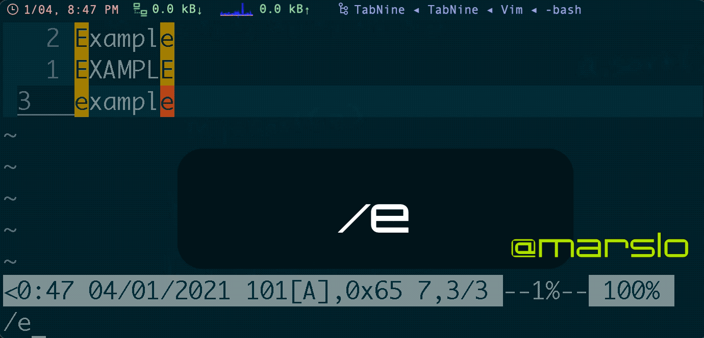
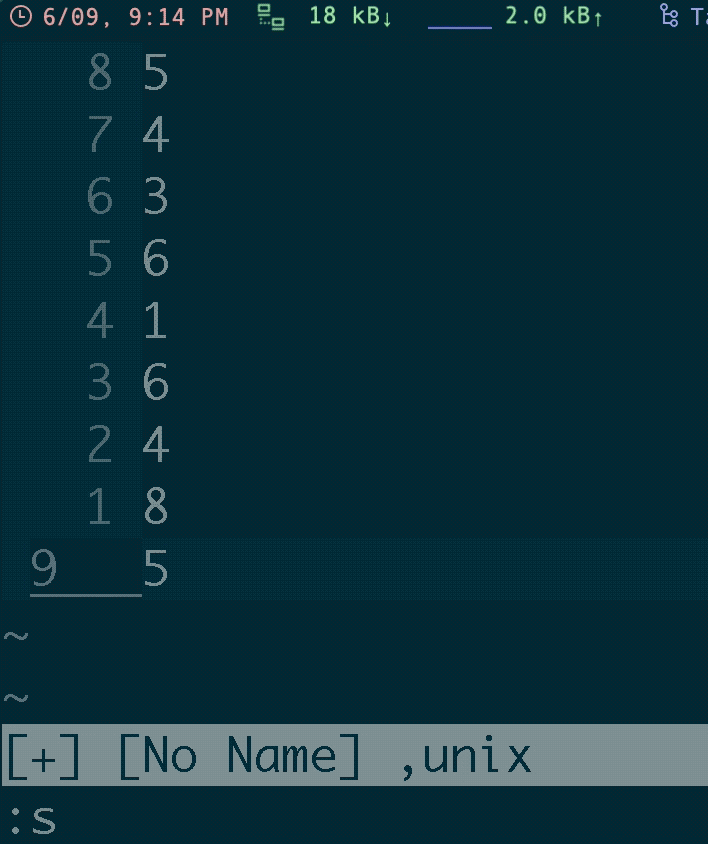
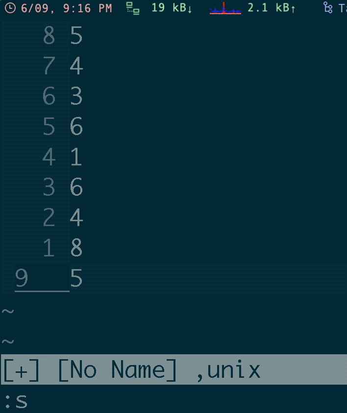
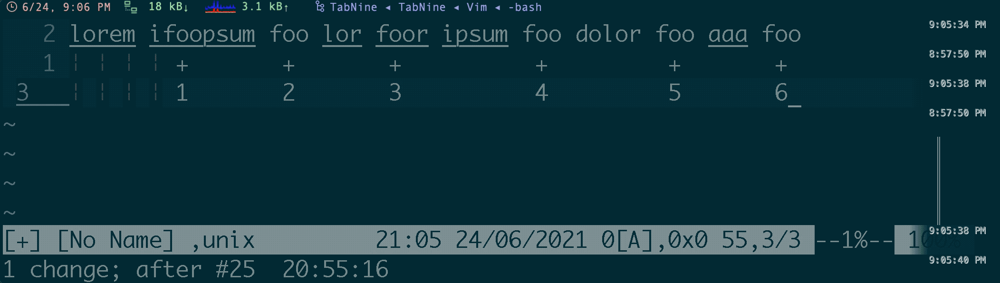
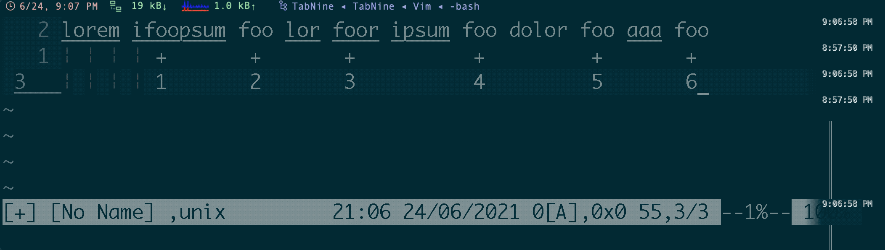

<!-- START doctoc generated TOC please keep comment here to allow auto update -->
<!-- DON'T EDIT THIS SECTION, INSTEAD RE-RUN doctoc TO UPDATE -->
**Table of Contents**  *generated with [DocToc](https://github.com/thlorenz/doctoc)*

- [combine multiple lines with or without space](#combine-multiple-lines-with-or-without-space)
- [search (in)sensitive](#search-insensitive)
- [sort lines](#sort-lines)
- [list all `filetype`](#list-all-filetype)
- [run vim commands in terminal](#run-vim-commands-in-terminal)
- [vim open file and go to specific function or linenumber](#vim-open-file-and-go-to-specific-function-or-linenumber)
- [Using vim as a man-page viewer under Unix](#using-vim-as-a-man-page-viewer-under-unix)
- [newline `\r`](#newline-%5Cr)
- [vim regex](#vim-regex)
- [vim pattern](#vim-pattern)
- [run command in multiple buffers](#run-command-in-multiple-buffers)

<!-- END doctoc generated TOC please keep comment here to allow auto update -->

### combine multiple lines with or without space
- with space: `J`
- without space: `gJ`


### [search (in)sensitive](https://stackoverflow.com/a/2288438/2940319)
> reference:
> - [7. Ignoring case in a pattern](https://vimhelp.org/pattern.txt.html#%2F%5Cc)

|   cmd   | `ignorecase` | `smartcase` | matches     |
|:-------:|:------------:|:-----------:|-------------|
|  `foo`  |     `off`    |      -      | foo         |
|  `foo`  |     `on`     |      -      | foo Foo FOO |
|  `foo`  |     `on`     |     `on`    | foo Foo FOO |
|  `Foo`  |     `on`     |     `on`    | Foo         |
|  `Foo`  |     `on`     |      -      | foo Foo FOO |
| `\cfoo` |       -      |      -      | foo Foo FOO |
| `foo\C` |       -      |      -      | foo         |

```vim
:set ignorecase
:set smartcase
/example      " Case insensitive
/Example      " Case sensitive
/example\C    " Case sensitive
/Example\c    " Case insensitive
```


#### search with `\V`

|     pattern    | result                                                                                                                                                                                                                                             |
|:--------------:|----------------------------------------------------------------------------------------------------------------------------------------------------------------------------------------------------------------------------------------------------|
|  `/a.k.a<CR>`  | b<span style="background-color:#333; color:#eee">a</span><span style="background-color: #777; color: #eee">ckward</span><br> <span style="background-color:#333; color:#eee">a</span><span style="background-color: #777; color: #eee">.k.a</span> |
| `/a\.k\.a<CR>` | backward<br> <span style="background-color:#333; color:#eee">a</span><span style="background-color: #777; color: #eee">.k.a</span>                                                                                                                 |
|  `/Va.k.a<CR>` | backward<br> <span style="background-color:#333; color:#eee">a</span><span style="background-color: #777; color: #eee">.k.a</span>                                                                                                                 |

### [sort lines](https://vim.fandom.com/wiki/Sort_lines)
> - [How to sort using visual blocks](https://vim.fandom.com/wiki/How_to_sort_using_visual_blocks)

- sort
  ```vim
  :{range}sort
  ```
  

- sort and unique
  ```vim
  :{range}sort u
  ```
  

### [list all `filetype`](https://vi.stackexchange.com/a/14990/7389)
```
:echo getcompletion('', 'filetype')
```
- or
  ```vim
  :echo getcompletion('c', 'filetype')
  ```
- [or](https://vi.stackexchange.com/a/5782/7389) and use: `for f in GetFiletypes() | echo f | endfor`
  ```vim
  function! GetFiletypes()
    " Get a list of all the runtime directories by taking the value of that
    " option and splitting it using a comma as the separator.
    let rtps = split(&runtimepath, ",")
    " This will be the list of filetypes that the function returns
    let filetypes = []

    " Loop through each individual item in the list of runtime paths
    for rtp in rtps
      let syntax_dir = rtp . "/syntax"
      " Check to see if there is a syntax directory in this runtimepath.
      if (isdirectory(syntax_dir))
        " Loop through each vimscript file in the syntax directory
        for syntax_file in split(glob(syntax_dir . "/*.vim"), "\n")
          " Add this file to the filetypes list with its everything
          " except its name removed.
          call add(filetypes, fnamemodify(syntax_file, ":t:r"))
        endfor
      endif
    endfor

    " This removes any duplicates and returns the resulting list.
    " NOTE: This might not be the best way to do this, suggestions are welcome.
    return uniq(sort(filetypes))
  endfunction
  ```

### run vim commands in terminal
> ```vim
> $ man vim
> ...
> OPTIONS
>   +{command}
>   -c {command}
>              {command} will be executed after the first file has been read.  {command} is interpreted
>              as an Ex command.  If the {command} contains spaces it must be enclosed in double quotes
>              (this depends on the shell that is used).  Example: Vim "+set si" main.c
>              Note: You can use up to 10 "+" or "-c" commands.
>
>   --cmd {command}
>              Like using "-c", but the command is executed just before processing any vimrc file.  You
>              can use up to 10 of these commands, independently from "-c" commands.
> ```

```vim
$ vim -es -c "set ff? | q"
  fileformat=unix
```

### [vim open file and go to specific function or linenumber](https://www.cyberciti.biz/faq/linux-unix-command-open-file-linenumber-function/)
```bash
$ vim +commandHere filename

# or
$ vim +linenumber filename
```

- [without fold](https://stackoverflow.com/a/10392451/2940319)
  ```bash
  $ vim +linenumber filename -c 'normal zR'
  ```

### [Using vim as a man-page viewer under Unix](https://vim.fandom.com/wiki/Using_vim_as_a_man-page_viewer_under_Unix)
```vim
export PAGER="/bin/sh -c \"unset PAGER;col -b -x | \
       vim -R -c 'set ft=man nomod nolist' -c 'map q :q<CR>' \
       -c 'map <SPACE> <C-D>' -c 'map b <C-U>' \
       -c 'nmap K :Man <C-R>=expand(\\\"<cword>\\\")<CR><CR>' -\""
```

- additional highlight
  ```vim
  " DrChip's additional man.vim stuff
  syn match manSectionHeading "^\s\+[0-9]\+\.[0-9.]*\s\+[A-Z].*$" contains=manSectionNumber
  syn match manSectionNumber "^\s\+[0-9]\+\.[0-9]*" contained
  syn region manDQString start='[^a-zA-Z"]"[^", )]'lc=1 end='"' contains=manSQString
  syn region manSQString start="[ \t]'[^', )]"lc=1 end="'"
  syn region manSQString start="^'[^', )]"lc=1 end="'"
  syn region manBQString start="[^a-zA-Z`]`[^`, )]"lc=1 end="[`']"
  syn region manBQSQString start="``[^),']" end="''"
  syn match manBulletZone transparent "^\s\+o\s" contains=manBullet
  syn case match
  syn keyword manBullet contained o
  syn match manBullet contained "\[+*]"
  syn match manSubSectionStart "^\*" skipwhite nextgroup=manSubSection
  syn match manSubSection ".*$" contained

  hi link manSectionNumber Number
  hi link manDQString String
  hi link manSQString String
  hi link manBQString String
  hi link manBQSQString String
  hi link manBullet Special
  hi manSubSectionStart term=NONE cterm=NONE gui=NONE ctermfg=black ctermbg=black guifg=navyblue guibg=navyblue
  hi manSubSection term=underline cterm=underline gui=underline ctermfg=green guifg=green
  ```

### [newline `\r`](https://stackoverflow.com/a/71334/2940319)

- reference:
  - [Why is \r a newline for Vim?](https://stackoverflow.com/a/73438/2940319)
<p></p>
- [Vim documentation: pattern](http://vimdoc.sourceforge.net/htmldoc/pattern.html#/%5Cr) :
  - `\n` matches an end of line (newline)
  - `\r` matches a carriage return (more precisely it’s treated as the input `CR`))



### [vim regex](http://vimregex.com/)

### [vim pattern](https://vimhelp.org/pattern.txt.html)
> reference:
> - [magic](https://vimhelp.org/pattern.txt.html#%2Fmagic)

#### overview of multi items

| pattern   | magic       | nomagic     | matches of the preceding atom                        |
| :-------: | :---------: | :---------: | -----------------------------------------------------|
| `/star`   | `*`         | `\*`        | 0 or more  &emsp; (as many as possible)              |
| `/\+`     | `\+`        | `\+`        | 1 or more  &emsp; (as many as possible)              |
| `/\=`     | `\=`        | `\=`        | 0 or 1     &emsp; (as many as possible)              |
| `/\?`     | `\?`        | `\?`        | 0 or 1     &emsp; (as many as possible)              |
| `/\{`     | `\{n,m}`    | `\{n,m}`    | n to m     &emsp; (as many as possible)              |
|           | `\{n}`      | `\{n}`      | n          &emsp; exactly                            |
|           | `\{n,}`     | `\{n,}`     | at least n &emsp; (as many as possible)              |
|           | `\{,m}`     | `\{,m}`     | 0 to m     &emsp; (as many as possible)              |
|           | `\{}`       | `\{}`       | 0 or more  &emsp; (as many as possible. same as `*`) |
| `/\{-`    | `\{-n,m}`   | `\{-n,m}`   | n to m     &emsp; (as few as possible)               |
|           | `\{-n}`     | `\{-n}`     | n    &emsp;&emsp; exactly                            |
|           | `\{-n,}`    | `\{-n,}`    | at least n &emsp; (as few as possible)               |
|           | `\{-,m}`    | `\{-,m}`    | 0 to m     &emsp; (as few as possible)               |
|           | `\{-}`      | `\{-}`      | 0 or more  &emsp; (as few as possible)               |


#### overview of ordinary atoms

| pattern |  magic  | nomagic | matches                                         |
|:-------:|:-------:|:-------:|-------------------------------------------------|
|   `/^`  |   `^`   |   `^`   | start-of-line (at start of pattern) /zero-width |
|  `/\^`  |   `\^`  |   `\^`  | literal '^'                                     |
|  `/\_^` |  `\_^`  |  `\_^`  | start-of-line (used anywhere) /zero-width       |
|  ` /$`  |   `$`   |   `$`   | end-of-line (at end of pattern) /zero-width     |
|  `/\$`  |   `\$`  |   `\$`  | literal '$'                                     |
|  `/\_$` |  `\_$`  |  `\_$`  | end-of-line (used anywhere) /zero-width         |
|   `/.`  |   `.`   |   `\.`  | any single character (not an end-of-line)       |
|  `/\_.` |  `\_.`  |  `\_.`  | any single character or end-of-line             |
|  `/\<`  |   `\<`  |  `\< `  | beginning of a word /zero-width                 |
|  `/\>`  |   `\>`  |  `\> `  | end of a word /zero-width                       |
|  `/\zs` |  `\zs`  |  `\zs`  | anything, sets start of match                   |
|  `/\ze` |  `\ze`  |  `\ze`  | anything, sets end of match                     |
|  `/\%^` |  `\%^`  |  `\%^`  | beginning of file /zero-width<br> E71           |
|  `/\%$` |  `\%$`  |  `\%$`  | end of file /zero-width                         |
|  `/\%V` |  `\%V`  |  `\%V`  | inside Visual area /zero-width                  |
|  `/\%#` |  `\%#`  |  `\%#`  | cursor position /zero-width                     |
| `/\%'m` |  `\%'m` |  `\%'m` | mark m position /zero-width                     |
|  `/\%l` | `\%23l` | `\%23l` | in line 23 /zero-width                          |
|  `/\%c` | `\%23c` | `\%23c` | in column 23 /zero-width                        |
|  `/\%v` | `\%23v` | `\%23v` | in virtual column 23 /zero-width                |


#### [matches the N pattern](https://stackoverflow.com/a/5424784/2940319)
- every 3rd
  ```vim
  \(.\{-}\zsfoo\)\{3}
  ```
  

- the 3rd
  ```vim
  ^\(.\{-}\zsPATTERN\)\{3}
  ```
  


[`\v`: the following chars in the pattern are "very magic"](https://vimhelp.org/pattern.txt.html#%2F%5Cv):
- `^\(.\{-}\zsPATTERN\)\{N}` == > `\v^(.{-}\zsPATTERN){N}`
- `^\(.\{-}\zs=\)\{N}`       == > `\v^(.{-}\zs\=){N}`

NOTICE: after using `\v` the `=` should using `\=` instead


### [run command in multiple buffers](https://vim.fandom.com/wiki/Run_a_command_in_multiple_buffers)

**related commands**:
- `:argdo` : all files in argument list
- `:bufdo` : all buffers
- `:tabdo` : all tabs
- `:windo` : all windows

**reference**:
- [Search and replace in multiple buffers](https://vim.fandom.com/wiki/Search_and_replace_in_multiple_buffers)


```vim
:bufdo <command>
```

- replace
  ```vim
  # regular
  :%s/<str>/<str_new>/ge

  # for all buffers
  :bufdo %s/<str>/<str_new>/ge | update
  ```

- force the `bufdo` to continue without saving files via `:bufdo!`
