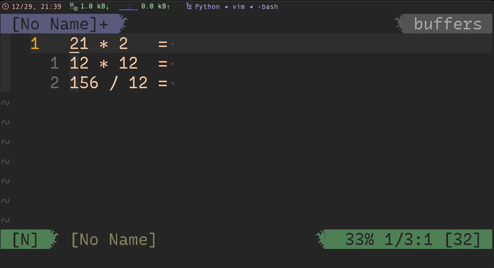
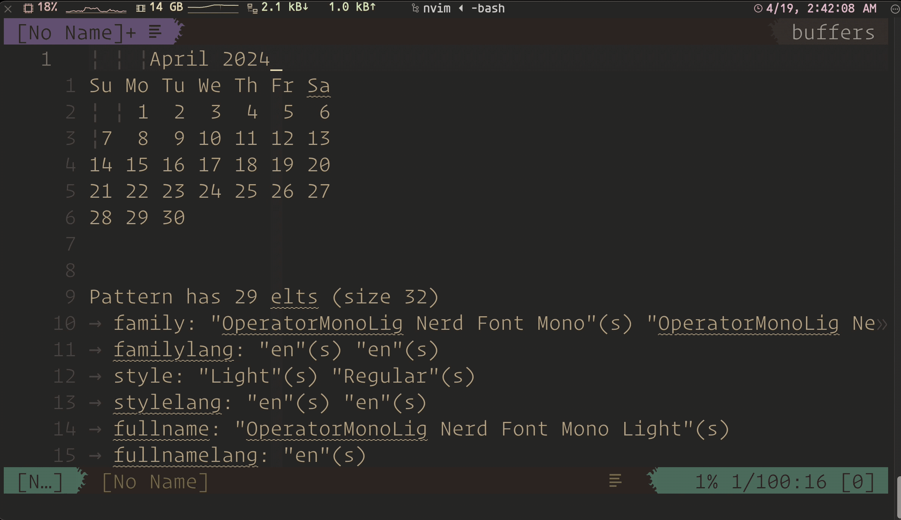
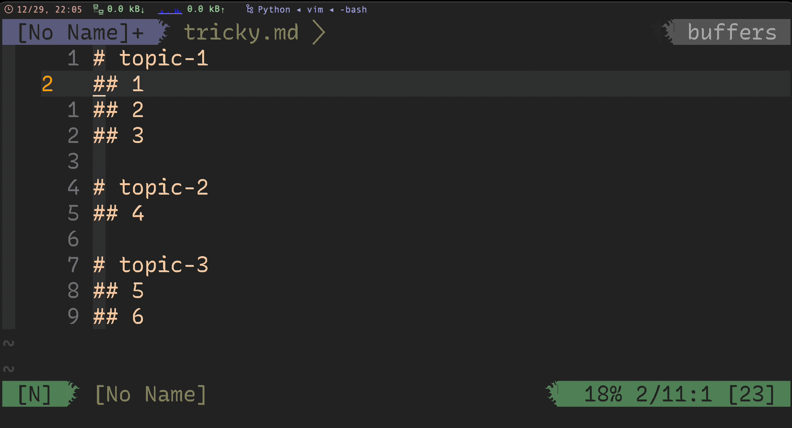

<!-- START doctoc generated TOC please keep comment here to allow auto update -->
<!-- DON'T EDIT THIS SECTION, INSTEAD RE-RUN doctoc TO UPDATE -->

- [mode](#mode)
  - [`diff` mode](#diff-mode)
  - [`terminal` mode](#terminal-mode)
- [shortcuts](#shortcuts)
  - [combine multiple lines with or without space](#combine-multiple-lines-with-or-without-space)
  - [Capitalize words and regions easily](#capitalize-words-and-regions-easily)
  - [Switching case of characters](#switching-case-of-characters)
  - [counter](#counter)
  - [delete line without copy to default register](#delete-line-without-copy-to-default-register)
  - [`ctrl-k` delete to end of line in command mode](#ctrl-k-delete-to-end-of-line-in-command-mode)
  - [g ctrl-g](#g-ctrl-g)
- [commands](#commands)
  - [paste command result to vim](#paste-command-result-to-vim)
  - [search (in)sensitive](#search-insensitive)
  - [search in visual mode](#search-in-visual-mode)
  - [sort lines](#sort-lines)
  - [list all `filetype`](#list-all-filetype)
  - [newline `\r`](#newline-%5Cr)
  - [redirect cmd](#redirect-cmd)
  - [format json in vim](#format-json-in-vim)
  - [run command in multiple buffers](#run-command-in-multiple-buffers)
  - [close buffer when close window](#close-buffer-when-close-window)
  - [switch in buffers](#switch-in-buffers)
  - [show ascii under cursor](#show-ascii-under-cursor)
  - [open vim with specific line Number](#open-vim-with-specific-line-number)
  - [navigate to Nth column](#navigate-to-nth-column)
  - [jumplist](#jumplist)
  - [print path](#print-path)
  - [format html](#format-html)
  - [encryption with Vim](#encryption-with-vim)
- [config](#config)
  - [get platform](#get-platform)
  - [disable vim beep](#disable-vim-beep)
  - [pastetoggle](#pastetoggle)
  - [Change up to next underscore "_" in vim](#change-up-to-next-underscore-_-in-vim)
- [run vim commands in terminal](#run-vim-commands-in-terminal)
  - [vim open file and go to specific function or linenumber](#vim-open-file-and-go-to-specific-function-or-linenumber)
  - [using vim as a man-page viewer under unix](#using-vim-as-a-man-page-viewer-under-unix)
- [vim regex](#vim-regex)
- [vim pattern](#vim-pattern)
  - [overview of multi items](#overview-of-multi-items)
  - [overview of ordinary atoms](#overview-of-ordinary-atoms)
  - [matches the N pattern](#matches-the-n-pattern)
- [characters](#characters)
- [micro](#micro)
  - [stop macro at the end of line](#stop-macro-at-the-end-of-line)
- [others](#others)
  - [startup-options](#startup-options)
  - [How to Open Files with Vim](#how-to-open-files-with-vim)
  - [comments](#comments)
  - [statueline](#statueline)
  - [ctags](#ctags)

<!-- END doctoc generated TOC please keep comment here to allow auto update -->

> [!TIP|label:references:]
> - [* Vim help files](https://vimhelp.org/#reference_toc)
> - [* Vim Cheat Sheet](https://vim.rtorr.com/)
> - [* vim : tip](https://vim.fandom.com/wiki/Category:VimTip)
> - [* vimtricks](https://vimtricks.com/)
> - [* Best Vim Tips](https://vim.fandom.com/wiki/Best_Vim_Tips)
> - [Vim run autocmd on all filetypes EXCEPT](https://stackoverflow.com/a/6496995/2940319)

## mode
### `diff` mode

> [!NOTE|label:references:]
> - [Trigger OptionSet autocommand on entering diff mode](https://groups.google.com/g/vim_dev/c/x8yHR_EujV4/m/z6Jvi9w0BgAJ)
> - [How to execute a function when a diff closes](https://vi.stackexchange.com/q/11057/7389)
> - [How to change editor options when switching to diff mode?](https://vi.stackexchange.com/a/38300/7389)
> - [#1545 - OptionSet diff is not invoked on closing the diff window](https://github.com/tpope/vim-fugitive/issues/1545)

```vim
:echo &diff
1
```

- example
  ```vim
  autocmd BufEnter * if &diff | let g:blamer_enabled=0 | endif            " ╮ disable git blame in diff mode
  autocmd BufEnter * if ! empty(&key) | let g:blamer_enabled=0 | endif    " ╯ and encrypt mode
  ```

- [change cursor shape in diff mode](https://github.com/marslo/dotfiles/blob/main/.marslo/vimrc.d/theme#L77)
  ```vim
  " setup cursor shape to block in diff mode
  function! CursorShapeInDiffMode()
    if &diff
      if $TERM_PROGRAM =~ "iTerm"
        let &t_SI = "\<Esc>]50;CursorShape=1\x7"
        let &t_SR = "\<Esc>]50;CursorShape=2\x7"
        let &t_EI = "\<Esc>]50;CursorShape=2\x7"
      else
        let &t_SI = "\e[1 q"
        let &t_SR = "\e[2 q"
        let &t_EI = "\e[2 q"
      endif
    endif
  endfunction
  autocmd BufRead,BufEnter,BufNewFile * :call CursorShapeInDiffMode()
  ```

- [disable cursor line in diff mode](https://vi.stackexchange.com/a/12852/7389)
  ```vim
  autocmd WinEnter * if &diff | set nocursorline | endif

  " or
  au OptionSet diff let &cul=!v:option_new

  " or
  augroup CursorLine
    au!
    au FilterWritePost * if &diff | let &cul=0 |endif
    au BufEnter * if !&diff | let &cul=1 |endif
  augroup end
  ```

### `terminal` mode

> [!NOTE|label:references:]
> - [Nvim_terminal_emulator](https://neovim.io/doc/user/nvim_terminal_emulator.html)
>   - Options:          ['modified'](https://neovim.io/doc/user/options.html#'modified'), ['scrollback'](https://neovim.io/doc/user/options.html#'scrollback')
>   - Events:           [TermOpen](https://neovim.io/doc/user/autocmd.html#TermOpen), [TermEnter](https://neovim.io/doc/user/autocmd.html#TermEnter), [TermLeave](https://neovim.io/doc/user/autocmd.html#TermLeave), [TermClose](https://neovim.io/doc/user/autocmd.html#TermClose)
>   - Highlight groups: [hl-TermCursor](https://neovim.io/doc/user/syntax.html#hl-TermCursor), [hl-TermCursorNC](https://neovim.io/doc/user/syntax.html#hl-TermCursorNC)
> - [autocmd-intro](https://neovim.io/doc/user/autocmd.html#TermOpen)
> - [How to tell when in terminal mode?](https://www.reddit.com/r/neovim/comments/ca6ga3/comment/et6mz6t/?utm_source=share&utm_medium=web3x&utm_name=web3xcss&utm_term=1&utm_content=share_button)
> - [Why neovim's terminal is differ from vim's terminal?](https://www.reddit.com/r/neovim/comments/vjquxc/comment/idmmmr7/?utm_source=share&utm_medium=web3x&utm_name=web3xcss&utm_term=1&utm_content=share_button)
> - [Map a key on a terminal buffer whose corresponding job is already finished](https://vi.stackexchange.com/q/25577/7389)
> - [`buftype`](https://vimhelp.org/options.txt.html#%27buftype%27)
>   - `<empty>`  : normal buffer
>   - `acwrite`  : buffer will always be written with `BufWriteCmd`s
>   - `help`     : help buffer (do not set this manually)
>   - `nofile`   : buffer is not related to a file, will not be written
>   - `nowrite`  : buffer will not be written
>   - `quickfix` : list of errors `:cwindow` or locations `:lwindow`
>   - `terminal` : `terminal-emulator` buffer
>   - `prompt`   : buffer where only the last line can be edited, meant to be used by a plugin, see |prompt-buffer|

```vim
:echo &buftype
terminal
```

- autocmd
  ```vim
  autocmd! TermOpen,TermEnter * :IndentLinesDisable
  autocmd! TermOpen           * setlocal nonumber norelativenumber modifiable nospell

  " others
  autocmd! BufEnter * if &buftype ==# 'terminal' | setlocal ma | endif
  autocmd! TermOpen,BufEnter term://* :IndentLinesDisable
  autocmd TermClose * echom 'Terminal exited with status '..v:event.status
  ```

  - more

    > [!NOTE|label:more:]
    > - [fabi1cazenave/termopen.vim](https://github.com/fabi1cazenave/termopen.vim)
    > - [How to create <C-w> in Terminal mode?](https://www.reddit.com/r/neovim/comments/zudmd8/comment/j1j7thf/?utm_source=share&utm_medium=web3x&utm_name=web3xcss&utm_term=1&utm_content=share_button) | [nomainchapou/nostalgic-term.nvim](https://github.com/romainchapou/nostalgic-term.nvim)
    > - [to display a terminal split at the very bottom of vim window](https://www.reddit.com/r/vim/comments/8n5bzs/comment/dzt3fix/?utm_source=share&utm_medium=web3x&utm_name=web3xcss&utm_term=1&utm_content=share_button)

    ```bash
    " go back to insert mode when entering the terminal window
    autocmd BufEnter * if &buftype == 'terminal' | :startinsert | endif

    function! NeovimTermOpen()
      :split
      :terminal
      :startinsert
    endfunction

    cabbrev ter call NeovimTermOpen()
    ```

  - [startinsert](https://vi.stackexchange.com/a/3765/7389)
    ```vim
    autocmd BufWinEnter,WinEnter term://* startinsert
    autocmd BufLeave term://* stopinsert

    # or https://vi.stackexchange.com/q/25577/7389
    autocmd TermOpen * startinsert
    au BufEnter * if &buftype == 'terminal' | :startinsert | endif

    # or https://vi.stackexchange.com/a/25579/7389
    autocmd TerminalOpen * nnoremap <buffer> <c-p> :bdelete!<CR>
    ```

- [keymap](https://www.reddit.com/r/neovim/comments/vjquxc/comment/idmmmr7/?utm_source=share&utm_medium=web3x&utm_name=web3xcss&utm_term=1&utm_content=share_button)
  ```vim
  tnoremap <Esc> <C-\><C-n>
  tnoremap <expr> <C-R> '<C-\><C-N>"'.nr2char(getchar()).'pi'
  ```

- usage:
  - open `top` command line in vsplit
    ```vim
    :vsplit term://top
    " or
    :vnew | term top
    ```

  - [open terminal in top pannel](https://www.reddit.com/r/neovim/comments/wjnmpp/comment/ijigdvl/?utm_source=share&utm_medium=web3x&utm_name=web3xcss&utm_term=1&utm_content=share_button)
    ```vim
    :split | resize 10 | terminal
    ```

  - [open terminal when vim start](https://neovim.io/doc/user/nvim_terminal_emulator.html#terminal-start)
    ```vim
    autocmd VimEnter * ++nested split term://bash
    ```

## shortcuts
### combine multiple lines with or without space
- with space: `J`
- without space: `gJ` or [`:j!`](https://til.hashrocket.com/posts/5c3xzpe97z-preserve-whitespace-while-joining-in-vim)


### [Capitalize words and regions easily](https://vim.fandom.com/wiki/Capitalize_words_and_regions_easily)

|   shortcut   | comments                                              |
|:------------:|-------------------------------------------------------|
|     `gcw`    | capitalize word (from cursor position to end of word) |
|     `gcW`    | capitalize WORD (from cursor position to end of WORD) |
|    `gciw`    | capitalize inner word (from start to end)             |
|    `gciW`    | capitalize inner WORD (from start to end)             |
|    `gcis`    | capitalize inner sentence                             |
|     `gc$`    | capitalize until end of line (from cursor postition)  |
|    `gcgc`    | capitalize whole line (from start to end)             |
|     `gcc`    | capitalize whole line                                 |
| `{Visual}gc` | capitalize highlighted text                           |

```vim
" vimrc
if ( &tildeop )
  nmap gcw  guw~l
  nmap gcW  guW~l
  nmap gciw guiw~l
  nmap gciW guiW~l
  nmap gcis guis~l
  nmap gc$  gu$~l
  nmap gcgc guu~l
  nmap gcc  guu~l
  vmap gc   gu~l
else
  nmap gcw  guw~h
  nmap gcW  guW~h
  nmap gciw guiw~h
  nmap gciW guiW~h
  nmap gcis guis~h
  nmap gc$  gu$~h
  nmap gcgc guu~h
  nmap gcc  guu~h
  vmap gc   gu~h
endif
```

### [Switching case of characters](https://vim.fandom.com/wiki/Switching_case_of_characters)

> [!NOTE|label:references:]
> - [* Switching case of characters](https://vim.fandom.com/wiki/Switching_case_of_characters#Twiddle_case)
> - [* Changing case with regular expressions](https://vim.fandom.com/wiki/Changing_case_with_regular_expressions)

- lowercase
  ```vim
  gu

  " example
  Hello -> hello
  ```

- uppercase
  ```vim
  gU

  " example
  Hello -> HELLO
  ```

- reverse
  ```vim
  g~

  " example
  Hello -> hELLO
  ```

- more
  - `g~3w` : toggle case of the next three words
  - `g~$` : toggle case to the end of line
  - `g~iw` : toggle case of the current word (inner word – cursor anywhere in word)
  - `g~~` == `g~g~` : toggle case of the current line (same as V~ - cursor anywhere in the line)
  - `gUU` == `gUgU` : to uppercase of the current line (same as V~ - cursor anywhere in the line)
  - `guu` == `gugu` : to lowercase of the current line (same as V~ - cursor anywhere in the line)

### counter

> [!NOTE|label:references]
> - [Simple calculations with Vim's expression register](http://vimcasts.org/transcripts/56/en/)

```vim
nnoremap <leader>cr  0yt=A<C-r>=<C-r>"<CR><Esc>
```



### [delete line without copy to default register](https://til.hashrocket.com/posts/u86r0vdytl-deleting-lines-without-copying-to-default-register)

> [!NOTE|label:references:]
> - [Vim registers: The basics and beyond](https://www.brianstorti.com/vim-registers/)
> - [How to delete (not cut) in Vim?](https://stackoverflow.com/a/11993928/2940319)
> - [Registers](https://learnvim.irian.to/basics/registers)
> - [`:@` Execute the contents of register](https://vimhelp.org/repeat.txt.html#%3A%40)

```vim
"_dd
```

- or `~/.vimrc`
  ```vim
  nnoremap rdd  "_dd
  nnoremap rdw  "_dw
  ```

### [`ctrl-k` delete to end of line in command mode](https://unix.stackexchange.com/a/477697/29178)
```vim
cnoremap <C-k> <C-\>e(strpart(getcmdline(), 0, getcmdpos() - 1))<CR>
```

### [g ctrl-g](https://hashrocket.com/blog/posts/10-vim-commands-for-a-better-workflow)



## commands
### [paste command result to vim](https://hashrocket.com/blog/posts/10-vim-commands-for-a-better-workflow)

> [!NOTE|label:references:]
> - [Open the output of a shell command in a split pane](https://superuser.com/a/868955/112396)
> - [How to insert the result of a command into the text in vim?](https://unix.stackexchange.com/a/8104/29178)
> - [:r! :read!](https://vimhelp.org/insert.txt.html#%3Ar%21)

```vim
" in cursor position"
:.! <command>

" read!
:r! <command>

" in new buffer"
:new | 0read ! <command>
```


### [search (in)sensitive](https://stackoverflow.com/a/2288438/2940319)

> [!NOTE|label:reference:]
> - [7. Ignoring case in a pattern](https://vimhelp.org/pattern.txt.html#%2F%5Cc)

|   CMD   | `ignorecase` | `smartcase` | MATCHES     |
|:-------:|:------------:|:-----------:|-------------|
|  `foo`  |     `off`    |      -      | foo         |
|  `foo`  |     `on`     |      -      | foo Foo FOO |
|  `foo`  |     `on`     |     `on`    | foo Foo FOO |
|  `Foo`  |     `on`     |     `on`    | Foo         |
|  `Foo`  |     `on`     |      -      | foo Foo FOO |
| `\cfoo` |       -      |      -      | foo Foo FOO |
| `foo\C` |       -      |      -      | foo         |

```vim
:set ignorecase
:set smartcase
/example      " Case insensitive
/Example      " Case sensitive
/example\C    " Case sensitive
/Example\c    " Case insensitive
```


#### search with `\V`

|     pattern    | result                                                                                                                                                                                                                                             |
|:--------------:|----------------------------------------------------------------------------------------------------------------------------------------------------------------------------------------------------------------------------------------------------|
|  `/a.k.a<CR>`  | b<span style="background-color:#333; color:#eee">a</span><span style="background-color: #777; color: #eee">ckward</span><br> <span style="background-color:#333; color:#eee">a</span><span style="background-color: #777; color: #eee">.k.a</span> |
| `/a\.k\.a<CR>` | backward<br> <span style="background-color:#333; color:#eee">a</span><span style="background-color: #777; color: #eee">.k.a</span>                                                                                                                 |
|  `/Va.k.a<CR>` | backward<br> <span style="background-color:#333; color:#eee">a</span><span style="background-color: #777; color: #eee">.k.a</span>                                                                                                                 |


### search in visual mode

> [!NOTE]
> - ["Find next" in Vim](https://stackoverflow.com/a/23475249/2940319)

- `v` go to visual mode
- `/KEYWORDS` search next KEYWORDS | `?KEYWORDS` search previous KEYWORDS
- <kbd>enter</kbd>



### [sort lines](https://vim.fandom.com/wiki/Sort_lines)

> [!NOTE|label:references:]
> - [How to sort using visual blocks](https://vim.fandom.com/wiki/How_to_sort_using_visual_blocks)
> - [Reverse sort lines in Vim](https://til.hashrocket.com/posts/kxno5ays5l-reverse-sort-lines-in-vim)

- sort
  ```vim
  :{range}sort

  " or
  :sort n

  " reverse sort
  :sort nr
  ```

  

- sort and unique
  ```vim
  :{range}sort u
  ```
  

### [list all `filetype`](https://vi.stackexchange.com/a/14990/7389)
```
:echo getcompletion('', 'filetype')
```

- or
  ```vim
  :echo getcompletion('c', 'filetype')
  ```

- [or](https://vi.stackexchange.com/a/5782/7389) and use: `for f in GetFiletypes() | echo f | endfor`
  ```vim
  function! GetFiletypes()
    " Get a list of all the runtime directories by taking the value of that
    " option and splitting it using a comma as the separator.
    let rtps = split(&runtimepath, ",")
    " This will be the list of filetypes that the function returns
    let filetypes = []

    " Loop through each individual item in the list of runtime paths
    for rtp in rtps
      let syntax_dir = rtp . "/syntax"
      " Check to see if there is a syntax directory in this runtimepath.
      if (isdirectory(syntax_dir))
        " Loop through each vimscript file in the syntax directory
        for syntax_file in split(glob(syntax_dir . "/*.vim"), "\n")
          " Add this file to the filetypes list with its everything
          " except its name removed.
          call add(filetypes, fnamemodify(syntax_file, ":t:r"))
        endfor
      endif
    endfor

    " This removes any duplicates and returns the resulting list.
    " NOTE: This might not be the best way to do this, suggestions are welcome.
    return uniq(sort(filetypes))
  endfunction
  ```

### [newline `\r`](https://stackoverflow.com/a/71334/2940319)


- reference:
  - [Why is \r a newline for Vim?](https://stackoverflow.com/a/73438/2940319)
<p></p>
- [Vim documentation: pattern](http://vimdoc.sourceforge.net/htmldoc/pattern.html#/%5Cr) :
  - `\n` matches an end of line (newline)
  - `\r` matches a carriage return (more precisely it’s treated as the input `CR`))


### redirect cmd

> [!NOTE|label:references:]
> - [Vim save highlight info screen to file](https://stackoverflow.com/a/16049993/2940319)
> - [:redir](https://vimdoc.sourceforge.net/htmldoc/various.html#%3aredir)
> - [Capture ex command output](https://vim.fandom.com/wiki/Capture_ex_command_output)
> - [How to redirect ex command output into current buffer or file?](https://stackoverflow.com/a/2573758/2940319)
> - [* vim tips: Capture ex command output](https://vim.fandom.com/wiki/Capture_ex_command_output)

- redir to file
  ```vim
  :redir > ~/Desktop/debug.txt
  :silent highlight
  :redir END
  ```
  - [or](https://stackoverflow.com/a/28314082/2940319)
    ```vim
    :write | redir >> % | silent registers | redir END | edit
    ```

- to new window
  ```bash
  :redir @a | silent digraph | redir END | new +setl\ buftype=nofile\ bufhidden=wipe | put! a
  ```

- to [TabMessage](https://vim.fandom.com/wiki/Capture_ex_command_output)

  > [!NOTE|label:references:]
  > - [Using tab pages](https://vim.fandom.com/wiki/Using_tab_pages)

  ```vim
  function! TabMessage( cmd )
    redir => message
    silent execute a:cmd
    redir END
    if empty( message )
      echoerr "no output"
    else
      tabnew               " use "new" instead of "tabnew" below if you prefer split windows instead of tabs
      setlocal buftype=nofile bufhidden=wipe noswapfile nobuflisted nomodified
      silent put=message
    endif
  endfunction
  command! -nargs=+ -complete=command TabMessage call TabMessage(<q-args>)

  " usage:
  :TabMessage highlight
  ```


### format json in vim

> [!NOTE|label:references:]
> - [How to format a JSON file in vim](https://golang.cafe/blog/how-to-format-a-json-file-in-vim.html)
> - [How to format JSON file in Vim](https://vi.stackexchange.com/a/19950/7389)

```vim
:%!jq .

" or
:%!python -m json.tool
```

### [run command in multiple buffers](https://vim.fandom.com/wiki/Run_a_command_in_multiple_buffers)


> **related commands**:
> - `:argdo` : all files in argument list
> - `:bufdo` : all buffers
> - `:tabdo` : all tabs
> - `:windo` : all windows
>
> **reference**:
> - [Search and replace in multiple buffers](https://vim.fandom.com/wiki/Search_and_replace_in_multiple_buffers)


```vim
:bufdo <command>
```

- replace
  ```vim
  # regular
  :%s/<str>/<str_new>/ge

  # for all buffers
  :bufdo %s/<str>/<str_new>/ge | update
  ```

- force the `bufdo` to continue without saving files via `:bufdo!`

### close buffer when close window
- commands
  ```vim
  :windo bd
  :%bd
  :silent clear
  ```

- autocmd
  ```vim
  autocmd VimLeave * silent clear                                         " :windo bd
  autocmd VimLeave * silent :%bd
  ```

### switch in buffers

- next buffer: <kbd>ctrl</kbd> + <kbd>^</kbd>
- previous buffer: <kbd>ctrl</kbd> + <kbd>6</kbd>
- first: `:1b<CR>`
- last: `:$b<CR>`


### show ascii under cursor

> [!NOTE|label:references:]
> - [various.txt](https://vimhelp.org/various.txt.html)
> - [`:as` or `:ascii`](https://vimhelp.org/various.txt.html#%3Aascii)
> - [VimTricks : Inspect Character Under Cursor in Vim](https://vimtricks.com/p/inspect-character-under-cursor-in-vim/)

- keyboard
  - <kbd>g</kbd><kbd>a</kbd>
- commands
  ```vim
  :as

  " or
  :ascii

  " or shortcut `ga` : https://til.hashrocket.com/posts/lsqojsbmmn-get-character-without-diacritical-mark-in-vim
  ```


### open vim with specific line Number

> [!NOTE|label:reference]
> - [Edit A File Starting On The Last Line](https://til.hashrocket.com/posts/3ocvjcyneg-edit-a-file-starting-on-the-last-line)
> - [Edit A File At A Specific Line Number In Vim](https://til.hashrocket.com/posts/uso1sxu4w6-edit-a-file-at-a-specific-line-number-in-vim)

```bash
# last line
$ vim + /path/to/file

# specific line
$ vim +123 /path/to/file

" or https://til.hashrocket.com/posts/joyovn3pau-go-to-file-with-line-number
$ vim /path/to/file:123
```

### [navigate to Nth column](https://til.hashrocket.com/posts/mt22lzymns-navigate-to-the-nth-column-on-a-line-in-vim)
```vim
N|

" i.e.: go to 15th column of current line
15|
```

### jumplist

> [!TIP|label:tips:]
> - `:help ''`
> - `:help ```

```vim
" check jump list
:jumps

" clear jump list
:clearjumps

" jump back https://til.hashrocket.com/posts/ue7f2hf8x2-jump-back-
''

" jump previous
``
```

### [print path](https://til.hashrocket.com/posts/virxsxedc9-print-the-relative-path-of-the-current-file)

- relative path:
  <kbd>ctrl</kbd> + <kbd>g</kbd>
  or
  ```vim
  :file
  ```

- [print filename](https://til.hashrocket.com/posts/bm2kh55onn-get-the-path-to-the-current-buffer-in-vim)

  ```vim
  :echo @%
  ```

- print full path

  ```vim
  :echo expand('%:p')
  ```

### [format html](https://stackoverflow.com/a/63425256/2940319)
```vim
:%s/></>\r</g
gg=G
```

### encryption with Vim

```vim
set cryptmethod=blowfish2
```

- encrypt
  ```bash
  $ vim -x file.txt
  :w!

  # or
  :set key=<password>
  :wa!
  ```

- decrypt
  ```bash
  $ vim -X file.txt

  " or in vim
  :set key=
  :wa!
  ```

## config
### get platform

> [!NOTE|label:references:]
> - [How to detect the OS from a Vim script?](https://stackoverflow.com/a/57015339/2940319)
> - [zeorin/dotfiles/.vimrc](https://github.com/zeorin/dotfiles/blob/e5400e2d14b97d6073842f605370f5cf57722fca/.vimrc#L84-L92)

```vim
" to avoid `system('uname')` issue in powershell/gvim/cmd
" previous solution: https://stackoverflow.com/a/57015339/2940319
"   let uname = substitute(system('uname'),'\n','','')
"   if uname == 'Linux'
" to avoid `Can't open file /proc/version` in MacOS using:
" - `has('linux')` instead of `has('unix')`
" - `has('unix') && !has('macunix')` if `has('linux')` not supported
function! IsWSL()
  if has( 'linux' )
    let lines = readfile( '/proc/version' )
    if lines[0] =~ 'Microsoft'
      return 1
    endif
  endif
  return 0
endfunction

function! IsWindows()
  return ( has('win32') || has('win64') )
endfunction

function! IsLinux()
  return has('unix') && has('linux') && !has('macunix')
endfunction

function! IsMac()
  return has('macunix')
endfunction
```

### disable vim beep
```vim
# ~/.vimrc
set noerrorbells novisualbell visualbell                            " ┐ turn off
set t_vb=                                                           " ┘ error/normal beep/flash
```

### pastetoggle

> [!NOTE|label:references:]
> - [Automatically set paste mode in Vim when pasting in insert mode](https://coderwall.com/p/if9mda/automatically-set-paste-mode-in-vim-when-pasting-in-insert-mode)
> - [option.txt paste](https://vimhelp.org/options.txt.html#%27paste%27)

- `:set paste`
- `:set nopaste`
- `:set pastetoggle=<F2>`

- details

  > When the ['paste'](https://vimhelp.org/options.txt.html#%27paste%27) option is switched on (also when it was already on):
  >   - [mapping](https://vimhelp.org/map.txt.html#mapping) in [Insert](https://vimhelp.org/insert.txt.html#Insert) mode and [Command-line](https://vimhelp.org/cmdline.txt.html#Command-line) mode is disabled
  >   - [abbreviations](https://vimhelp.org/map.txt.html#abbreviations) are disabled
  >   - ['autoindent'](https://vimhelp.org/options.txt.html#%27autoindent%27) is reset
  >   - ['expandtab'](https://vimhelp.org/options.txt.html#%27expandtab%27) is reset
  >   - ['hkmap'](https://vimhelp.org/options.txt.html#%27hkmap%27) is reset
  >   - ['revins'](https://vimhelp.org/options.txt.html#%27revins%27) is reset
  >   - ['ruler'](https://vimhelp.org/options.txt.html#%27ruler%27) is reset
  >   - ['showmatch'](https://vimhelp.org/options.txt.html#%27showmatch%27) is reset
  >   - ['smarttab'](https://vimhelp.org/options.txt.html#%27smarttab%27) is reset
  >   - ['softtabstop'](https://vimhelp.org/options.txt.html#%27softtabstop%27) is set to 0
  >   - ['textwidth'](https://vimhelp.org/options.txt.html#%27textwidth%27) is set to 0
  >   - ['wrapmargin'](https://vimhelp.org/options.txt.html#%27wrapmargin%27) is set to 0
  >   - ['varsofttabstop'](https://vimhelp.org/options.txt.html#%27varsofttabstop%27) is made empty
  > These options keep their value, but their effect is disabled:
  >   - ['cindent'](https://vimhelp.org/options.txt.html#%27cindent%27)
  >   - ['formatoptions'](https://vimhelp.org/options.txt.html#%27formatoptions%27) is used like it is empty
  >   - ['indentexpr'](https://vimhelp.org/options.txt.html#%27indentexpr%27)
  >   - ['lisp'](https://vimhelp.org/options.txt.html#%27lisp%27)
  >   - ['smartindent'](https://vimhelp.org/options.txt.html#%27smartindent%27)

### [Change up to next underscore "_" in vim](https://til.hashrocket.com/posts/uanfzuizgu-change-up-to-next-underscore-in-vim)

```vim
set iskeyword-=_
nnoremap <leader>e :set iskeyword-=_<cr>diw:set iskeyword+=_<cr>i
```

## run vim commands in terminal

> [!NOTE|label:manual:]
> ```vim
> $ man vim
> ...
> OPTIONS
>   +{command}
>   -c {command}
>              {command} will be executed after the first file has been read.  {command} is interpreted
>              as an Ex command.  If the {command} contains spaces it must be enclosed in double quotes
>              (this depends on the shell that is used).  Example: Vim "+set si" main.c
>              Note: You can use up to 10 "+" or "-c" commands.
>
>   --cmd {command}
>              Like using "-c", but the command is executed just before processing any vimrc file.  You
>              can use up to 10 of these commands, independently from "-c" commands.
> ```

```vim
$ vim -es -c "set ff? | q"
  fileformat=unix
```

### [vim open file and go to specific function or linenumber](https://www.cyberciti.biz/faq/linux-unix-command-open-file-linenumber-function/)
```bash
$ vim +commandHere filename

# or
$ vim +linenumber filename
```

- [without fold](https://stackoverflow.com/a/10392451/2940319)
  ```bash
  $ vim +linenumber filename -c 'normal zR'
  ```

### [using vim as a man-page viewer under unix](https://vim.fandom.com/wiki/Using_vim_as_a_man-page_viewer_under_Unix)
```vim
export PAGER="/bin/sh -c \"unset PAGER;col -b -x | \
       vim -R -c 'set ft=man nomod nolist' -c 'map q :q<CR>' \
       -c 'map <SPACE> <C-D>' -c 'map b <C-U>' \
       -c 'nmap K :Man <C-R>=expand(\\\"<cword>\\\")<CR><CR>' -\""
```

- additional highlight
  ```vim
  " DrChip's additional man.vim stuff
  syn match manSectionHeading "^\s\+[0-9]\+\.[0-9.]*\s\+[A-Z].*$" contains=manSectionNumber
  syn match manSectionNumber "^\s\+[0-9]\+\.[0-9]*" contained
  syn region manDQString start='[^a-zA-Z"]"[^", )]'lc=1 end='"' contains=manSQString
  syn region manSQString start="[ \t]'[^', )]"lc=1 end="'"
  syn region manSQString start="^'[^', )]"lc=1 end="'"
  syn region manBQString start="[^a-zA-Z`]`[^`, )]"lc=1 end="[`']"
  syn region manBQSQString start="``[^),']" end="''"
  syn match manBulletZone transparent "^\s\+o\s" contains=manBullet
  syn case match
  syn keyword manBullet contained o
  syn match manBullet contained "\[+*]"
  syn match manSubSectionStart "^\*" skipwhite nextgroup=manSubSection
  syn match manSubSection ".*$" contained

  hi link manSectionNumber Number
  hi link manDQString String
  hi link manSQString String
  hi link manBQString String
  hi link manBQSQString String
  hi link manBullet Special
  hi manSubSectionStart term=NONE cterm=NONE gui=NONE ctermfg=black ctermbg=black guifg=navyblue guibg=navyblue
  hi manSubSection term=underline cterm=underline gui=underline ctermfg=green guifg=green
  ```


## [vim regex](http://vimregex.com/)

## [vim pattern](https://vimhelp.org/pattern.txt.html)
> reference:
> - [magic](https://vimhelp.org/pattern.txt.html#%2Fmagic)

### overview of multi items

| pattern   | magic       | nomagic     | matches of the preceding atom                        |
| :-------: | :---------: | :---------: | -----------------------------------------------------|
| `/star`   | `*`         | `\*`        | 0 or more  &emsp; (as many as possible)              |
| `/\+`     | `\+`        | `\+`        | 1 or more  &emsp; (as many as possible)              |
| `/\=`     | `\=`        | `\=`        | 0 or 1     &emsp; (as many as possible)              |
| `/\?`     | `\?`        | `\?`        | 0 or 1     &emsp; (as many as possible)              |
| `/\{`     | `\{n,m}`    | `\{n,m}`    | n to m     &emsp; (as many as possible)              |
|           | `\{n}`      | `\{n}`      | n          &emsp; exactly                            |
|           | `\{n,}`     | `\{n,}`     | at least n &emsp; (as many as possible)              |
|           | `\{,m}`     | `\{,m}`     | 0 to m     &emsp; (as many as possible)              |
|           | `\{}`       | `\{}`       | 0 or more  &emsp; (as many as possible. same as `*`) |
| `/\{-`    | `\{-n,m}`   | `\{-n,m}`   | n to m     &emsp; (as few as possible)               |
|           | `\{-n}`     | `\{-n}`     | n    &emsp;&emsp; exactly                            |
|           | `\{-n,}`    | `\{-n,}`    | at least n &emsp; (as few as possible)               |
|           | `\{-,m}`    | `\{-,m}`    | 0 to m     &emsp; (as few as possible)               |
|           | `\{-}`      | `\{-}`      | 0 or more  &emsp; (as few as possible)               |


### overview of ordinary atoms

| pattern |  magic  | nomagic | matches                                         |
|:-------:|:-------:|:-------:|-------------------------------------------------|
|   `/^`  |   `^`   |   `^`   | start-of-line (at start of pattern) /zero-width |
|  `/\^`  |   `\^`  |   `\^`  | literal '^'                                     |
|  `/\_^` |  `\_^`  |  `\_^`  | start-of-line (used anywhere) /zero-width       |
|  ` /$`  |   `$`   |   `$`   | end-of-line (at end of pattern) /zero-width     |
|  `/\$`  |   `\$`  |   `\$`  | literal '$'                                     |
|  `/\_$` |  `\_$`  |  `\_$`  | end-of-line (used anywhere) /zero-width         |
|   `/.`  |   `.`   |   `\.`  | any single character (not an end-of-line)       |
|  `/\_.` |  `\_.`  |  `\_.`  | any single character or end-of-line             |
|  `/\<`  |   `\<`  |  `\< `  | beginning of a word /zero-width                 |
|  `/\>`  |   `\>`  |  `\> `  | end of a word /zero-width                       |
|  `/\zs` |  `\zs`  |  `\zs`  | anything, sets start of match                   |
|  `/\ze` |  `\ze`  |  `\ze`  | anything, sets end of match                     |
|  `/\%^` |  `\%^`  |  `\%^`  | beginning of file /zero-width<br> E71           |
|  `/\%$` |  `\%$`  |  `\%$`  | end of file /zero-width                         |
|  `/\%V` |  `\%V`  |  `\%V`  | inside Visual area /zero-width                  |
|  `/\%#` |  `\%#`  |  `\%#`  | cursor position /zero-width                     |
| `/\%'m` |  `\%'m` |  `\%'m` | mark m position /zero-width                     |
|  `/\%l` | `\%23l` | `\%23l` | in line 23 /zero-width                          |
|  `/\%c` | `\%23c` | `\%23c` | in column 23 /zero-width                        |
|  `/\%v` | `\%23v` | `\%23v` | in virtual column 23 /zero-width                |


### [matches the N pattern](https://stackoverflow.com/a/5424784/2940319)
- every 3rd
  ```vim
  \(.\{-}\zsfoo\)\{3}
  ```
  

- the 3rd
  ```vim
  ^\(.\{-}\zsPATTERN\)\{3}
  ```
  


[`\v`: the following chars in the pattern are "very magic"](https://vimhelp.org/pattern.txt.html#%2F%5Cv):
- `^\(.\{-}\zsPATTERN\)\{N}` == > `\v^(.{-}\zsPATTERN){N}`
- `^\(.\{-}\zs=\)\{N}`       == > `\v^(.{-}\zs\=){N}`

NOTICE: after using `\v` the `=` should using `\=` instead


## characters

> [!NOTE|label:references:]
> - [* digraph.txt:digraph-table](https://vimhelp.org/digraph.txt.html#digraph-table)
> - [* :help i_CTRL-V](https://vimhelp.org/insert.txt.html#i_CTRL-V)
> - [* :help i_CTRL-K](https://vimhelp.org/insert.txt.html#i_CTRL-K)
> - [Vim Digraphs and Ligatures](https://alpha2phi.medium.com/vim-digraphs-and-ligatures-7dec3cb0a623)
> - [Vi(m) tip #2: Entering greek/math symbols using vim digraphs](https://www.alecjacobson.com/weblog/?p=443)
> - [Is there a way to search inside the digraphs in Vim](https://stackoverflow.com/a/26234078/2940319)
> - [youtube : Input Special / Foreign / Non-Keyboard Characters - Vim Tips (2)](https://www.youtube.com/watch?v=Za5GRXP1ycM)
> - [vimticks : Insert special • characters](https://vimtricks.com/p/insert-special-characters/)

- [:help i_CTRL-V_digit](https://vimhelp.org/insert.txt.html#i_CTRL-V_digit)

| first      | char        | mode | max nr of chars |   max value  |
|------------|-------------|:----:|:---------------:|:------------:|
| (none)     | decimal     |   3  |       255       |       -      |
| `o` or `O` | octal       |   3  |       377       |     (255)    |
| `x` or `X` | hexadecimal |   2  |        ff       |     (255)    |
| `u`        | hexadecimal |   4  |       ffff      |    (65535)   |
| `U`        | hexadecimal |   8  |     7fffffff    | (2147483647) |


- show all digraphs

  > [!NOTE|label:references:]
  > - [* iMarslo : redirect cmd](#redirect-cmd)

  ```vim
  :redir @a | silent digraph | redir END | new +setl\ buftype=nofile\ bufhidden=wipe | put! a

  : or
  :redir @a | silent digraph | redir END | new +setl\ buftype=nofile\ bufhidden=wipe | put! a | on
  ```

#### insert unicode
- via hex

  > [!NOTE|label:references:]
  > - [* iMarlso : show ascii under cursor](#show-ascii-under-cursor)
  > - [Unicode Chart](https://www.ssec.wisc.edu/~tomw/java/unicode.html)
  > - [List of Unicode characters](https://en.wikipedia.org/wiki/List_of_Unicode_characters)
  > - [List of Unicode Symbols: Complete Unicode Character Table on One Page](https://symbl.cc/en/unicode/table/)

  - i.e.:
    - `2b38` : [⬸  : Leftwards Arrow with Dotted Stem](https://symbl.cc/en/2B38/)
    - `2911` : [⤑ : Rightwards Arrow with Dotted Stem](https://symbl.cc/en/2911/)

    - steps:
      - <kbd>esc</kbd> : return to normal mode ( optional )
      - <kbd>i</kbd> || <kbd>o</kbd> || <kbd>a</kbd> || ... : insert mode
      - <kbd>ctrl</kbd> + <kbd>v</kbd>
      - insert `u2b38` or `u2911` : 4 digits using `u`

    

  - emoji
    - `1F92A` : [🤪 : Grinning Face With One Large And One Small Eye Emoji](https://symbl.cc/en/1F92A/)
    - `1F926` : [🤦 : Face Palm Emoji](https://symbl.cc/en/1F926/)

    - steps:
      - <kbd>esc</kbd> : return to normal mode ( optional )
      - <kbd>i</kbd> || <kbd>o</kbd> || <kbd>a</kbd> || ... : insert mode
      - <kbd>ctrl</kbd> + <kbd>v</kbd>
      - insert `U2b38` or `U2911` : >4 digits using `U`

    

- via digraph char

  > [!NOTE|label:refrences:]
  > - [:help digraph-table](https://vimhelp.org/digraph.txt.html#digraph-table)
  > - [:help i_ctrl-k](https://vimhelp.org/insert.txt.html#i_CTRL-K)

  - i.e.:
    - `3c ㈢ 12834`
    - `4c ㈣ 12835`
    - `5c ㈤ 12836`

    - steps:
      - <kbd>esc</kbd> : return to normal mode ( optional )
      - <kbd>i</kbd> || <kbd>o</kbd> || <kbd>a</kbd> || ... : insert mode
      - <kbd>ctrl</kbd> + <kbd>k</kbd>
      - insert `3c` or `4c` or `5c`

    

## micro

> [!NOTE|label:references:]
> - [How do I stop a recursive macro at the end of the line?](https://vi.stackexchange.com/a/6427/7389)

### stop macro at the end of line
```vim
:let a=line('.')
<....>                  " do micro
:if line('.')==a | exec 'normal @q' | endif
"                                |
"                                v
"                           micro name
```


## others

> [!NOTE|label:references:]
> - [Insert current date or time](https://vim.fandom.com/wiki/Insert_current_date_or_time)
> - [Insert current directory name](https://vim.fandom.com/wiki/Insert_current_directory_name)
> - [Insert current filename](https://vim.fandom.com/wiki/Insert_current_filename)
> - [Insert line numbers](https://vim.fandom.com/wiki/Insert_line_numbers)
> - [To switch back to normal mode automatically after inaction](https://vim.fandom.com/wiki/To_switch_back_to_normal_mode_automatically_after_inaction)
> - [Using Git from Vim](https://vim.fandom.com/wiki/Using_Git_from_Vim)
> - [Word count](https://vim.fandom.com/wiki/Word_count)

### [startup-options](https://vimhelp.org/starting.txt.html)

> [!NOTE|label:references:]
> - [`:help edit-binary`](https://vimhelp.org/editing.txt.html#edit-binary)

- binary mode by [`-b`](https://vimhelp.org/starting.txt.html#-b)
  - `binary` on
  - `textwidth` 0
  - `modeline` off
  - `expandtab` off

### [How to Open Files with Vim](https://tuckerchapman.com/2021/02/16/vim-open-files/)

### comments

> [!NOTE|label:references:]
> - [Command line tricks](https://vim.fandom.com/wiki/Command_line_tricks)
> - [Comment Lines according to a given filetype](https://vim.fandom.com/wiki/Comment_Lines_according_to_a_given_filetype)
> - [Comment lines in different filetypes](https://vim.fandom.com/wiki/Comment_lines_in_different_filetypes)
> - [Comment your code blocks automatically](https://vim.fandom.com/wiki/Comment_your_code_blocks_automatically)
> - [Insert comment boxes in your code](https://vim.fandom.com/wiki/Insert_comment_boxes_in_your_code)

### statueline

> [!NOTE|label:references:]
> - [Insert current date or time](https://vim.fandom.com/wiki/Insert_current_date_or_time)
> - [Build your own Vim statusline](https://shapeshed.com/vim-statuslines/)

- sample
  ```vim
  if has('statusline')
    set laststatus=2
    set statusline=%#User2#%m%r%*\ %F\ %y,%{&fileformat}
    " set statusline+=\ %{FugitiveStatusline()}                     " set statusline+=\ %{fugitive#statusline()}
    set statusline+=%=\ %-{strftime(\"%H:%M\ %d/%m/%Y\")}\ %b[A],0x%B\ %c%V,%l/%L\ %1*--%n%%--%*\ %p%%\ |
  endif
  ```

- [vim-airline](https://github.com/vim-airline/vim-airline)

### ctags

> [!NOTE|label:references:]
> - [* preservim/tagbar](https://github.com/preservim/tagbar/wiki#ansible)
> - [kornicameister/dotfiles/ctags.d](https://github.com/kornicameister/dotfiles/tree/master/ctags.d)
> - [mfwarren/.ctags for groovy](https://gist.github.com/mfwarren/793482)
> - [ik5/dotfiles/.ctags](https://github.com/ik5/dotfiles/blob/master/ctags)
> - [aiya000/dotfiles/.ctags.d](https://github.com/aiya000/dotfiles/tree/main/.ctags.d)
> - [dansomething/dotfiles](https://github.com/dansomething/dotfiles)
> - groovy
>   - [groovytags](https://bitbucket.org/sw-samuraj/groovytags/src/develop/)
>   - [sw-samuraj/vim-gradle](https://bitbucket.org/sw-samuraj/vim-gradle/src/develop/)
>   - [vim-scripts/vim-gradle](https://github.com/vim-scripts/vim-gradle)
>   - [#84 groovy support? : Put this in ~/.ctags](https://github.com/preservim/tagbar/issues/84#issuecomment-6615001)
> - [`genctags`](https://github.com/nemausus/dotfiles/blob/master/bashrc#L94C1-L96C2)

```bash
# Generates ctags.
#   Usage: exfind folly,common cpp,h,thrift | genctags
function genctags () {
  ctags --c++-kinds=+p --extras=+q -L -
}
```
