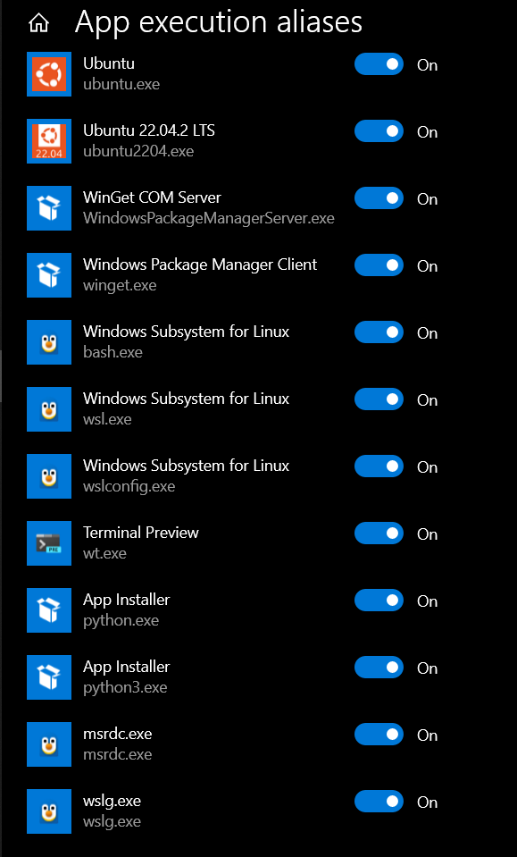
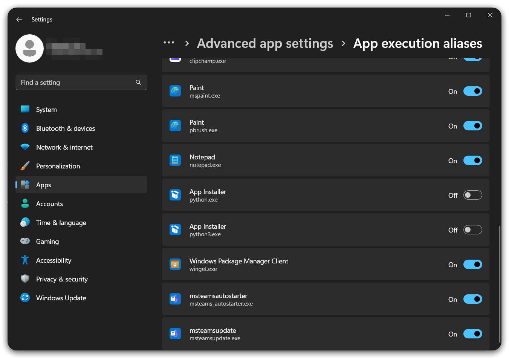

<!-- START doctoc generated TOC please keep comment here to allow auto update -->
<!-- DON'T EDIT THIS SECTION, INSTEAD RE-RUN doctoc TO UPDATE -->

- [startup scripts](#startup-scripts)
- [chars](#chars)
  - [`listchars` shows `▯` ( unknown character )](#listchars-shows-%E2%96%AF--unknown-character-)
- [python](#python)
  - [`MatchTagAlways unavaiable: requries python`](#matchtagalways-unavaiable-requries-python)
  - [`vim: error while loading shared libraries: libpython3.11.so.1.0`](#vim-error-while-loading-shared-libraries-libpython311so10)
  - [`E370: Could not load library "msys-python3.11.dll"`](#e370-could-not-load-library-msys-python311dll)
  - [windows app settings](#windows-app-settings)
- [vimrc](#vimrc)
  - [`verbose`](#verbose)
  - [`echo`](#echo)
  - [start time](#start-time)
  - [`profile`](#profile)
  - [`messages`](#messages)
  - [Vim has unexpected key presses on startup, what could be causing this?](#vim-has-unexpected-key-presses-on-startup-what-could-be-causing-this)
  - [Tmux is changing part of the background in vim](#tmux-is-changing-part-of-the-background-in-vim)

<!-- END doctoc generated TOC please keep comment here to allow auto update -->

> [!TIP|label:references:]
> - [* Vim help files](https://vimhelp.org/#reference_toc)
> - [Troubleshooting](https://vim.fandom.com/wiki/Troubleshooting)
> - [Debugging Vim](https://inlehmansterms.net/2014/10/31/debugging-vim/)
> - [Debugging Vim by example](https://codeinthehole.com/tips/debugging-vim-by-example/)
> - [* iMarslo : run vim commands in terminal](./tricky.html#run-vim-commands-in-terminal)
> - [* iMarlso : redirect cmd result into file](./tricky.html#redirect-cmd-result-into-file)
> - [Time your Vim commands](https://vim.fandom.com/wiki/Time_your_Vim_commands)

## startup scripts

> [!TIP]
> - [* iMarslo : redirect cmd](./tricky.html#redirect-cmd)
> - [Debug unexpected option settings](https://vim.fandom.com/wiki/Debug_unexpected_option_settings)

- [v9 logfile](https://vi.stackexchange.com/a/3595/7389)
  ```bash
  $ vim -V9logfile.log
  ```

- [step debug](https://vi.stackexchange.com/a/2064/7389)
  ```bash
  $ vim --noplugin -D
  ```

- list startup script files
  ```vim
  :scriptnames
  ```

- list all shortcut mapping
  ```vim
  :verbose map
  :map
  :nmap
  :vmap
  :imap
  ```

  - [redirect all contents to a file](https://stackoverflow.com/a/15756785/2940319)
    ```vim
    :redir > ~/Desktop/debug.txt
    :silent verbose map
    :redir END
    ```

- [check customized completion](https://github.com/xavierd/clang_complete/issues/452#issuecomment-139872204)
  ```vim
  :set completefunc?
  completefunc=youcompleteme#CompleteFunc
  ```

- show terminal type
  ```vim
  :TERM_PROGRAM
  iTerm.app
  ```

- [How to prevent MacVim from inheriting .profile as if it was Bash itself?](https://apple.stackexchange.com/a/137354/254265)
  ```bash
  $ defaults write org.vim.MacVim MMLoginShell 0
  ```

## chars

> [!NOTE|label:references:]
> - [guifont](https://vimdoc.sourceforge.net/htmldoc/options.html#'guifont')
> - [guifontset](https://vimdoc.sourceforge.net/htmldoc/options.html#'guifontset')
> - [guifontwide](https://vimdoc.sourceforge.net/htmldoc/options.html#'guifontwide')


### `listchars` shows `▯` ( unknown character )


> [!NOTE|label:show printable non-ASCII characters:]
> reference:
> - [VIM学习笔记 非可见字符(Listchars)](https://zhuanlan.zhihu.com/p/25801800)

- reason
  - `guifont` doesn't support.
  - i.e.:
    - [Comic Mono in Windows](https://dtinth.github.io/comic-mono-font/)

- debug
  - [`:digraphs`](https://vimdoc.sourceforge.net/htmldoc/digraph.html)


## python

> [!NOTE|label:referenes:]
> - python arch version should be exact same with gvim arch version
>   - python x64 <-> gvim x64
>   - python x86 <-> gvim x86
> - [`:help feature-list`](https://vimhelp.org/builtin.txt.html#feature-list)
> - [`:help if_pyth`](https://vimhelp.org/if_pyth.txt.html#if_pyth.txt)
>   - [`pythonthreedll`](https://vimhelp.org/options.txt.html#%27pythonthreedll%27)
>   - [`pythonthreehome`](https://vimhelp.org/options.txt.html#%27pythonthreehome%27) <-> `env.PYTHONHOME`
> - label to check:
>   - `+python3/dyn`
>   - `+python/dyn`

- debug

  - `:echo has(python3)`
  - `:py3 print('hello')`
  - `:set pythonthreedll?`

  - full commands:
    ```vim
    :echo has('python3')          " expected: 1
    :echo has('python3')
    :echo has('python3_dynamic')
    :echo has('python3_compiled')

    " others
    :echo has('python')
    :echo has('python_dynamic')
    :echo has('python_compiled')

    " or
    :python3 print('hello')       " expected: hello
    :py3 print('hello')           " expected: hello
    ```

- specific settings

  ```vim
  set pythonthreedll=c:\path\to\python\python37.dll
  set pythonthreehome=c:\path\to\python
  ```

### `MatchTagAlways unavaiable: requries python`

- issue
  ```vim
  $ vim
  MatchTagAlways unavaiable: requires python

  :py3 print('hello')
  the Python library could not be load
  ```

- generic solution
  ```vim
  let g:python3_host_prog = '/path/to/python3'

  # in linux/osx
  let g:python3_host_prog = expand(trim( system('comamnd -v python3') ))
  ```

- environment
  - os: ubuntu 22.04.3 LTS
  - python
    - installed from apt ppa sources
    - environment
      - /usr/local/bin/python3 -> /usr/local/bin/python -> /usr/bin/python3.12
      - /usr/local/bin/python3-config -> /usr/local/bin/python-config -> /usr/bin/python3.12

- solution

  > [!NOTE]
  > - [vim: Could not load library libpython](https://stackoverflow.com/a/47133334/2940319)

  ```bash
  $ sudo ldconfig
  # and re-build
  ```

### `vim: error while loading shared libraries: libpython3.11.so.1.0`

- issue
  ```bash
  $ vim
  vim: error while loading shared libraries: libpython3.11.so.1.0: cannot open shared object file: No such file or directory
  ```

- env
  - os: CentOS 8.3
  - python: build from source, in `/opt/python/Python3.11.6`

- solution
  ```bash
  $ export LD_LIBRARY_PATH=/opt/python/Python3.11.6:$LD_LIBRARY_PATH
  ```

### `E370: Could not load library "msys-python3.11.dll"`

- solution
  ```bash
  > cd c:\iMarslo\myprograms\Python3.11
  > cp python3.11.dll to msys-python3.11.dll

  # check $PATH contains `C:\iMarslo\myprograms\Python3.11`
  ```

### windows app settings

> [!NOTE|label:references:]
> - [CMD opens Windows Store when I type 'python'](https://stackoverflow.com/a/58773979/2940319)
> - [The Python executable is not recognized on Windows 10](https://stackoverflow.com/a/66547100/2940319)
>   - app location: `%LocalAppData%\Microsoft\WindowsApps`
> - [Typing “python” on Windows 10 (version 1903) command prompt opens Microsoft store](https://superuser.com/a/1461471/112396)
> - [3. Using Python on Windows](https://docs.python.org/3.7/using/windows.html#using-python-on-windows)
>   - [3.2. The Microsoft Store package](https://docs.python.org/3.7/using/windows.html#the-microsoft-store-package)
>   - [3.5. Alternative bundles](https://docs.python.org/3.7/using/windows.html#alternative-bundles)
>   - [3.6. Configuring Python](https://docs.python.org/3.7/using/windows.html#configuring-python)
>     - [`PYTHONPATH`](https://docs.python.org/3.7/using/cmdline.html#envvar-PYTHONPATH)

- solution
  - windows 10
    - **Settings** -> **Apps** -> **Apps & features** -> **App Execution alias**
    - disable both `python.exe` and `python3.exe`

    

  - windows 11
    - **Settings** -> **Apps** -> **Advanced app settings** -> **App Execution alias**
    - disable both `python.exe` and `python3.exe`

    

- solution
  - delete both `python.exe` and `python3.exe` from `%LocalAppData%\Microsoft\WindowsApps`
  - setup environment variable for manual-installation ( `%LocalAppData\Programs\Python\Python311` by default )

  ```batch
  > cd %LocalAppData%\Microsoft\WindowsApps
  > del python.exe
  > del python3.exe
  ```

  - [install via nuget.exe](https://docs.python.org/3.7/using/windows.html#the-nuget-org-packages)
    ```batch
    > nuget.exe install python -ExcludeVersion -OutputDirectory .
    > nuget.exe install pythonx86 -ExcludeVersion -OutputDirectory .
    ```

- [know issues](https://docs.python.org/3.7/using/windows.html#known-issues)

  > [!NOTE]
  > - [3.8. Python Launcher for Windows](https://docs.python.org/3.7/using/windows.html#python-launcher-for-windows)

  - Currently, the `py.exe` launcher cannot be used to start Python when it has been installed from the Microsoft Store.

## vimrc

> [!NOTE|label:references:]
> - [Unicode in vimrc no longer displaying correctly](https://vi.stackexchange.com/q/26374/7389)

### `verbose`

> [!NOTE|label:references:]
> - [why my option not working](https://codeinthehole.com/tips/debugging-vim-by-example/#why-isnt-my-option-working)
> - [Vim Verbose Map](https://til.hashrocket.com/posts/hlnjrntqfq-vim-verbose-map)
>
> | VALUE | COMMENTS                                                     |
> | ----- | ------------------------------------------------------------ |
> | >= 1  | When the viminfo file is read or written.                    |
> | >= 2  | When a file is ":source"'ed.                                 |
> | >= 5  | Every searched tags file and include file.                   |
> | >= 8  | Files for which a group of autocommands is executed.         |
> | >= 9  | Every executed autocommand.                                  |
> | >= 12 | Every executed function.                                     |
> | >= 13 | When an exception is thrown, caught, finished, or discarded. |
> | >= 14 | Anything pending in a ":finally" clause.                     |
> | >= 15 | Every executed Ex command (truncated at 200 characters).     |


```vim
:verbose set fileencodings?
```

- general debugging with verbose

  ```vim
  set verbose=9
  # or
  set verbosefile=filename.txt

  " set verbose on startup
  vim -V9 file.text
  ```

### `echo`
```vim
:echo has('multi_byte')
:echo has('multi_lang')
```

### start time

> [!NOTE|label:references:]
> - [why is vim slow to start up](https://codeinthehole.com/tips/debugging-vim-by-example/#why-is-vim-slow-to-start-up)
> - [How can I reduce startup time for vim?](https://stackoverflow.com/q/21194354/2940319)
> - [slow-start](https://vimdoc.sourceforge.net/htmldoc/starting.html#slow-start)
> - [startup](https://vimdoc.sourceforge.net/htmldoc/starting.html#startup)

```bash
$ vim --startuptime vim.log

# compare with non-profile loaded
$ vim +q -u NONE -U NONE -N --startuptime startup-no-config.txt

# verify with specific ft
$ vim --startuptime python-startup.txt -c ":set ft=python" python-startup.txt
```

### `profile`

> [!NOTE|label:references:]
> - [why is "{ACTION}" slow](https://codeinthehole.com/tips/debugging-vim-by-example/#why-is-action-slow)
> - [profiling](https://vimdoc.sourceforge.net/htmldoc/repeat.html#profiling)

```vim
:profile start profile.log
:profile func *
:profile file *

{SLOW ACTIONS}

:profile pause
:qa!
```

### `messages`
```vim
:messages
```

### [Vim has unexpected key presses on startup, what could be causing this?](https://superuser.com/a/553610/112396)
```bash
$ vim --cmd 'set t_RV='
:echo v:termresponse
# result :  ^[[>41;2500;0c
```
- more:
  ```vim
  :help 'ttymouse'
  :help t_RV
  :help v:termresponse
  ```

### [Tmux is changing part of the background in vim](https://vi.stackexchange.com/a/247/7389)
```vim
if &term =~ '256color'
  " disable Background Color Erase (BCE)
  set t_ut=
endif
set ttyfast
```
