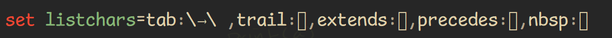

<!-- START doctoc generated TOC please keep comment here to allow auto update -->
<!-- DON'T EDIT THIS SECTION, INSTEAD RE-RUN doctoc TO UPDATE -->
**Table of Contents**  *generated with [DocToc](https://github.com/thlorenz/doctoc)*

- [chars](#chars)
  - [`listchars` shows `▯` ( unknown character )](#listchars-shows-%E2%96%AF--unknown-character-)
- [python](#python)
- [vimrc](#vimrc)
  - [`verbose`](#verbose)
  - [`echo`](#echo)
  - [start time](#start-time)
  - [`profile`](#profile)
  - [`messages`](#messages)

<!-- END doctoc generated TOC please keep comment here to allow auto update -->

> [!TIP|label:references:]
> - [Debugging Vim](https://inlehmansterms.net/2014/10/31/debugging-vim/)
> - [Debugging Vim by example](https://codeinthehole.com/tips/debugging-vim-by-example/)

## chars

> [!NOTE|label:references:]
> - [guifont](https://vimdoc.sourceforge.net/htmldoc/options.html#'guifont')
> - [guifontset](https://vimdoc.sourceforge.net/htmldoc/options.html#'guifontset')
> - [guifontwide](https://vimdoc.sourceforge.net/htmldoc/options.html#'guifontwide')

### `listchars` shows `▯` ( unknown character )



- reason
  - `guifont` doesn't support.
  - i.e.:
    - [Comic Mono in Windows](https://dtinth.github.io/comic-mono-font/)

- debug
  - [`:digraphs`](https://vimdoc.sourceforge.net/htmldoc/digraph.html)


## python

> [!NOTE|label:referenes:]
> - python arch version should be exact same with gvim arch version
>   - python x64 <-> gvim x64
>   - python x86 <-> gvim x86

- debug
  - `:echo has(python3)`
  - `:py3 print('hello')`
  - `:set pythonthreedll?`

- specific settings

  ```vim
  set pythonthreedll=c:\path\to\python\python37.dll
  set pythonthreehome=c:\path\to\python
  ```

## vimrc

> [!NOTE|label:references:]
> - [Unicode in vimrc no longer displaying correctly](https://vi.stackexchange.com/q/26374/7389)

### `verbose`

> [!NOTE|label:references:]
> - [why my option not working](https://codeinthehole.com/tips/debugging-vim-by-example/#why-isnt-my-option-working)
>
> | VALUE | COMMENTS                                                     |
> | ----- | ------------------------------------------------------------ |
> | >= 1  | When the viminfo file is read or written.                    |
> | >= 2  | When a file is ":source"'ed.                                 |
> | >= 5  | Every searched tags file and include file.                   |
> | >= 8  | Files for which a group of autocommands is executed.         |
> | >= 9  | Every executed autocommand.                                  |
> | >= 12 | Every executed function.                                     |
> | >= 13 | When an exception is thrown, caught, finished, or discarded. |
> | >= 14 | Anything pending in a ":finally" clause.                     |
> | >= 15 | Every executed Ex command (truncated at 200 characters).     |


```vim
:verbose set fileencodings?
```

- general debugging with verbose

  ```vim
  set verbose=9
  # or
  set verbosefile=filename.txt

  " set verbose on startup
  vim -V9 file.text
  ```

### `echo`
```vim
:echo has('multi_byte')
:echo has('multi_lang')
```

### start time

> [!NOTE|label:references:]
> - [why is vim slow to start up](https://codeinthehole.com/tips/debugging-vim-by-example/#why-is-vim-slow-to-start-up)
> - [How can I reduce startup time for vim?](https://stackoverflow.com/q/21194354/2940319)
> - [slow-start](https://vimdoc.sourceforge.net/htmldoc/starting.html#slow-start)
> - [startup](https://vimdoc.sourceforge.net/htmldoc/starting.html#startup)

```bash
$ vim --startuptime vim.log

# compare with non-profile loaded
$ vim +q -u NONE -U NONE -N --startuptime startup-no-config.txt

# verify with specific ft
$ vim --startuptime python-startup.txt -c ":set ft=python" python-startup.txt
```

### `profile`

> [!NOTE|label:references:]
> - [why is "{ACTION}" slow](https://codeinthehole.com/tips/debugging-vim-by-example/#why-is-action-slow)
> - [profiling](https://vimdoc.sourceforge.net/htmldoc/repeat.html#profiling)

```vim
:profile start profile.log
:profile func *
:profile file *

{SLOW ACTIONS}

:profile pause
:qa!
```

### `messages`
```vim
:messages
```
