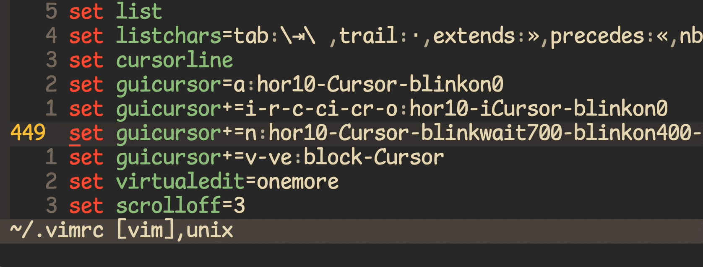

<!-- START doctoc generated TOC please keep comment here to allow auto update -->
<!-- DON'T EDIT THIS SECTION, INSTEAD RE-RUN doctoc TO UPDATE -->
**Table of Contents**  *generated with [DocToc](https://github.com/thlorenz/doctoc)*

- [check python enabled](#check-python-enabled)
- [check where vim executable package](#check-where-vim-executable-package)
- [check vimdoc with keyword](#check-vimdoc-with-keyword)
- [tricky](#tricky)
- [Capitalize words and regions easily](#capitalize-words-and-regions-easily)
- [Switching case of characters](#switching-case-of-characters)
- [cursor and cursor shape](#cursor-and-cursor-shape)
- [vimrc examples](#vimrc-examples)

<!-- END doctoc generated TOC please keep comment here to allow auto update -->


> reference:
> - [Bram Moolenaar](https://www.moolenaar.net/)
> - [vim:tip](https://vim.fandom.com/wiki/Category:VimTip)
> - [Best Vim Tips](https://vim.fandom.com/wiki/Best_Vim_Tips)
> - [Search for visually selected text](https://vim.fandom.com/wiki/Search_for_visually_selected_text)
> - [Mastering Vim Grammar](https://irian.to/blogs/mastering-vim-grammar/)
> - [Syntax highlighting is extremely slow when scrolling up in recent version (v8.0.1599) #2712](https://github.com/vim/vim/issues/2712)
>  - [Slow vim in huge projects](https://www.reddit.com/r/vim/comments/ng59kz/slow_vim_in_huge_projects/)
> - [Setting up Vim for YAML editing](https://www.arthurkoziel.com/setting-up-vim-for-yaml/)


### check python enabled

> [!NOTE|label:to check:]
> - `+python3/dyn`
> - `+python/dyn`

```vim
:echo has('python')
:echo has('python3')
:echo has('python_dynamic')
:echo has('python3_dynamic')
:echo has('python_compiled')
:echo has('python3_compiled')
```

### check where vim executable package
```vim
:echo v:progpath
```

### [check vimdoc with keyword](https://www.reddit.com/r/vim/comments/ng59kz/comment/gyrceos/?utm_source=share&utm_medium=web2x&context=3)
```vim
:helpgrep <keyword>

" i.e.
:helpgrep slow
```

[or](https://stackoverflow.com/a/48858718/2940319)
  ```vim
  :echo $VIM
  ```

### tricky
- List startup script files
  ```vim
  :scriptnames
  ```

- [check customized completion](https://github.com/xavierd/clang_complete/issues/452#issuecomment-139872204)
  ```vim
  :set completefunc?
  completefunc=youcompleteme#CompleteFunc
  ```

- show terminal type
  ```vim
  :TERM_PROGRAM
  iTerm.app
  ```

- show printable non-ASCII characters
  > reference:
  > - [VIM学习笔记 非可见字符(Listchars)](https://zhuanlan.zhihu.com/p/25801800)

  ```vim
  " for listchars
  :digraphs
  ```

- [filetype in vim language](https://stackoverflow.com/a/63255521/2940319)
  ```vim
  if index(['vim', 'c', 'cpp'], &filetype) != -1
    echom "hello!"
  endif
  ```

  [or](https://stackoverflow.com/a/29407473/2940319)
  ```vim
  let fts = ['c', 'cpp']
  if index(fts, &filetype) == -1
    " do stuff
  endif
  ```

### [Capitalize words and regions easily](https://vim.fandom.com/wiki/Capitalize_words_and_regions_easily)

|   shortcut   | comments                                              |
|:------------:|-------------------------------------------------------|
|     `gcw`    | capitalize word (from cursor position to end of word) |
|     `gcW`    | capitalize WORD (from cursor position to end of WORD) |
|    `gciw`    | capitalize inner word (from start to end)             |
|    `gciW`    | capitalize inner WORD (from start to end)             |
|    `gcis`    | capitalize inner sentence                             |
|     `gc$`    | capitalize until end of line (from cursor postition)  |
|    `gcgc`    | capitalize whole line (from start to end)             |
|     `gcc`    | capitalize whole line                                 |
| `{Visual}gc` | capitalize highlighted text                           |

### [Switching case of characters](https://vim.fandom.com/wiki/Switching_case_of_characters)
- lowercase all
  ```vim
  gu
  ```
- uppercase all
  ```vim
  gU
  ```
- reverse all
  ```vim
  g~
  ```

### cursor and cursor shape

> [!NOTE|label:references:]
> - [cursor shape](https://vim.fandom.com/wiki/Change_cursor_shape_in_different_modes)
>   - mode settings:
>     - [t_SI](https://vimdoc.sourceforge.net/htmldoc/term.html#t_SI) = INSERT mode : `let &t_SI.="\e[5 q"`
>     - t_SR = REPLACE mode : `let &t_SR.="\e[4 q"`
>     - [t_EI](https://vimdoc.sourceforge.net/htmldoc/term.html#t_EI) = NORMAL mode (ELSE) : `let &t_EI.="\e[1 q"`
>   - cursor settings:
>     - 1 -> blinking block
>     - 2 -> solid block
>     - 3 -> blinking underscore
>     - 4 -> solid underscore
>     - 5 -> blinking vertical bar
>     - 6 -> solid vertical bar
> - [andyfowler/.vimrc](https://gist.github.com/andyfowler/1195581)
> - [Change cursor shape in different modes](https://vim.fandom.com/wiki/Change_cursor_shape_in_different_modes)
> - [Vim change block cursor when in insert mode](https://stackoverflow.com/a/58042687/2940319)
> - [Configuring the cursor](https://vim.fandom.com/wiki/Configuring_the_cursor)
> - [:help guicorsor](https://vimdoc.sourceforge.net/htmldoc/options.html#'guicursor')
> - [* iMarslo : redirect message into file](./tricky.html#redirect-cmd-result-into-file)


#### guicursor
```bash
$ /Applications/MacVim.app/Contents/bin/mvim -u NONE \
                                             -c 'redir > ~/Desktop/guicursor.txt' \
                                             -c 'echo &guicursor' \
                                             -c 'redir END' \
                                             -c 'q'
$ cat ~/Desktop/guicursor.txt
n-v-c:block-Cursor/lCursor,ve:ver35-Cursor,o:hor50-Cursor,i-ci:ver25-Cursor/lCursor,r-cr:hor20-Cursor/lCursor,sm:block-Cursor-blinkwait175-blinkoff150-blinkon175

# after modified
$ /Applications/MacVim.app/Contents/bin/mvim -c 'redir! > ~/Desktop/guicursor.txt' \
                                             -c 'echo &guicursor' \
                                             -c 'redir END' \
                                             -c 'q'
$ cat ~/Desktop/guicursor.txt
a:hor10-Cursor-blinkon0,i-r-c-ci-cr-o:hor10-iCursor-blinkon0,n:hor10-Cursor-blinkwait700-blinkon400-blinkoff250,v-ve:block-Cursor
```



#### cursorcolumn

> [!NOTE|label:references:]
> - [Setting Vim cursorline colors?](https://stackoverflow.com/a/29207563/2940319)

```vim
set cursorcolumn
autocmd InsertEnter * highlight CursorColumn ctermfg=White ctermbg=Yellow cterm=bold guifg=white guibg=yellow gui=bold
autocmd InsertLeave * highlight CursorColumn ctermfg=Black ctermbg=Yellow cterm=bold guifg=Black guibg=yellow gui=NONE

" or simplely via
set cursorcolumn
highlight CursorColumn ctermfg=White ctermbg=gray cterm=bold guifg=white guibg=gray gui=bold
```

### vimrc examples

- [reiter/.vim-files/vimrc](https://github.com/jreiter/.vim-files/blob/master/vimrc)
