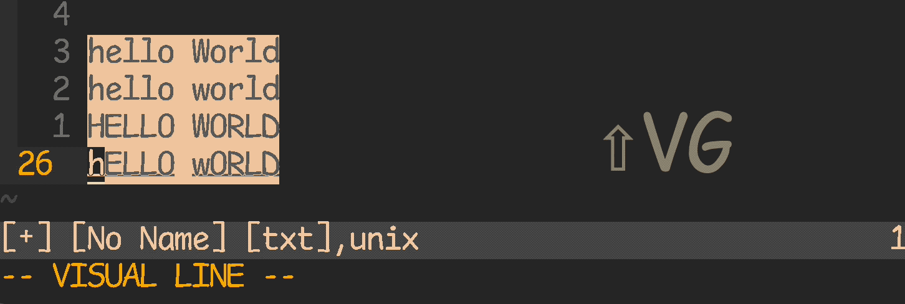

<!-- START doctoc generated TOC please keep comment here to allow auto update -->
<!-- DON'T EDIT THIS SECTION, INSTEAD RE-RUN doctoc TO UPDATE -->
**Table of Contents**  *generated with [DocToc](https://github.com/thlorenz/doctoc)*

- [autocmd](#autocmd)
  - [autocmd BufWritePre except](#autocmd-bufwritepre-except)
  - [stop gitblame in diff mode](#stop-gitblame-in-diff-mode)
  - [disable line number in terminal](#disable-line-number-in-terminal)
  - [automatic cleanup tailing space when save](#automatic-cleanup-tailing-space-when-save)
  - [automatic save](#automatic-save)
  - [edit binary using xxd-format](#edit-binary-using-xxd-format)
- [system](#system)
  - [filetype in vim language](#filetype-in-vim-language)
  - [show path of current file](#show-path-of-current-file)
  - [Putting the current file on the Windows clipboard](#putting-the-current-file-on-the-windows-clipboard)
  - [map overview](#map-overview)
- [functions](#functions)
  - [TwiddleCase](#twiddlecase)
  - [open html in terminal](#open-html-in-terminal)
  - [OpenInFreshWindowOrNewTab](#openinfreshwindowornewtab)
  - [GetFiletypes](#getfiletypes)
  - [IgnoreSpells](#ignorespells)
  - [IgnoreCamelCaseSpell](#ignorecamelcasespell)
  - [TabMessage](#tabmessage)
  - [BSkipQuickFix](#bskipquickfix)
  - [TriggerYCM](#triggerycm)
- [commands](#commands)
  - [get path](#get-path)
- [settings](#settings)
  - [theme](#theme)

<!-- END doctoc generated TOC please keep comment here to allow auto update -->

> [!NOTE|label:references:]
> - [Learn Vimscript the Hard Way](https://learnvimscriptthehardway.stevelosh.com/)
> - [Learn Vim the Smart Way](https://learnvim.irian.to/)
> - [Effective VimScript](https://www.arp242.net/effective-vimscript.html)
> - [eval.txt:expr2](https://vimhelp.org/eval.txt.html#expr2)
> - [syntax.txt](https://vimhelp.org/syntax.txt.html#syntax)

## autocmd

> [!TIP|label:references:]
> - [Triggering a function with BufEnter](https://vi.stackexchange.com/a/11363/7389)
> ```
>  autocmd BufEnter *.p[lm]  nmap <buffer> ;t :call RunPerlTests()<CR>
>  "       |        |        |     |       |  |
>  "       |        |        |     |       |  +-- `{rhs}` of the mapping
>  "       |        |        |     |       +-- `{lhs}` of the mapping
>  "       |        |        |     +-- argument to pass to `:nmap`; limits the scope of the mapping to the current buffer
>  "       |        |        +-- mapping command to execute
>  "       |        +-- pattern to limit the scope of the autocmd to certain filetypes
>  "       +-- event of the autocmd
> ```
> - [Vim’s event model](https://web.archive.org/web/20220121051339/https://developer.ibm.com/tutorials/l-vim-script-5/)
> - [Listing 1. Event sequence in a simple Vim editing session](https://vi.stackexchange.com/a/4495/7389)
>   - `BufWinEnter` : create a default window
>   - `BufEnter`    : create a default buffer
>   - `VimEnter`    : start the Vim session):edit demo.txt
>   - `BufNew`      : create a new buffer to contain demo.txt
>   - `BufAdd`      : add that new buffer to the session’s buffer list
>   - `BufLeave`    : exit the default buffer
>   - `BufWinLeave` : exit the default window
>   - `BufUnload`   : remove the default buffer from the buffer list
>   - `BufDelete`   : deallocate the default buffer
>   - `BufReadCmd`  : read the contexts of demo.txt into the new buffer
>   - `BufEnter`    : activate the new buffer
>   - `BufWinEnter` : activate the new buffer's window
>   - `InsertEnter` : swap into Insert mode

### [autocmd BufWritePre except](https://stackoverflow.com/q/6496778/2940319)

- [funciton](https://stackoverflow.com/a/6496995/2940319)
  ```vim
  fun! StripTrailingWhitespace()
    " don't strip on these filetypes
    if &ft =~ 'ruby\|javascript\|perl'
      return
    endif
    %s/\s\+$//e
  endfun
  autocmd BufWritePre * call StripTrailingWhitespace()

  " or
  fun! StripTrailingWhitespace()
    " only strip if the b:noStripeWhitespace variable isn't set
    if exists('b:noStripWhitespace')
      return
    endif
    %s/\s\+$//e
  endfun

  autocmd BufWritePre * call StripTrailingWhitespace()
  autocmd FileType ruby,javascript,perl let b:noStripWhitespace=1
  ```
  - redraw
    ```vim
    fun! ReplaceTabToSpace()
      # don't strip on these filetypes
      if &ft =~ 'ruby\|javascript\|perl\|ltsv'
        return
      endif
      %s/\s\+$//e
    endfun
    autocmd BufWritePre * call ReplaceTabToSpace()
    ```

- [blacklist](https://stackoverflow.com/a/10410590/2940319)
  ```vim
  let blacklist = ['rb', 'js', 'pl']
  autocmd BufWritePre  *  if index(blacklist, &ft) < 0 | do somthing you like | endif
  ```

- [`@<!`](https://stackoverflow.com/a/67463224/2940319)
  ```vim
  autocmd BufWritePre  *\(.out\|.diffs\)\@<!  <your_command>

  " i.e.:
  autocmd Syntax       *\(^rst\)\@<!          :redraw!
  ```
  - redraw
    ```vim
    autocmd BufWritePre *\(.ltsv\|.diffs\)\@<! :retab!    " automatic retab
    ```

### stop gitblame in diff mode

> [!NOTE|label:references:]
> - [How to disable plugin for vimdiff?](https://www.reddit.com/r/vim/comments/4bh0mo/comment/d19hv5u/?utm_source=share&utm_medium=web2x&context=3)
> - [Make vim switch to other window after opening a diff](https://vi.stackexchange.com/a/8606/7389)

```vim
autocmd BufEnter              *                      if &diff         | let g:blamer_enabled=0 | endif    " ╮ disable diff mode
autocmd BufEnter              *                      if ! empty(&key) | let g:blamer_enabled=0 | endif    " ╯ and encrypt mode
```

### disable line number in terminal

> [!NOTE|label:references:]
> - [Can you target a specific window with autocmd?](https://www.reddit.com/r/vim/comments/ekwyin/can_you_target_a_specific_window_with_autocmd/)

```vim
augroup numbertoggle
        autocmd!
        autocmd BufEnter,FocusGained,InsertLeave * if &buftype != 'terminal' |  set relativenumber | endif
        autocmd BufLeave,FocusLost,InsertEnter * if &buftype != 'termina' | set norelativenumber | endif
        au BufEnter * if &buftype == 'terminal' | :set nonumber | endif
 augroup END
```

- [or](https://www.reddit.com/r/vim/comments/ekwyin/comment/fdf9d9b/?utm_source=share&utm_medium=web2x&context=3)
  ```vim
  let b:visualnum_enabled = 0
  ```

### automatic cleanup tailing space when save

```bash
autocmd BufWritePre              *                      :%s/\s\+$//e | %s/\r$//e   " automatic remove trailing space

# others
autocmd FileType                 sh,bash,shell  slient  :redraw
autocmd BufWritePre,BufWritePost *.sh           slient  :redraw                    " for shellcheck lint
```

### automatic save

> [!NOTE|label:references:]
> - [Listing 3. Autocommand to autosave when leaving an editor window](https://web.archive.org/web/20220121051339/https://developer.ibm.com/tutorials/l-vim-script-5/)

```vim
autocmd  FocusLost  *.txt   :    if &modified && g:autosave_on_focus_change
autocmd  FocusLost  *.txt   :    write
autocmd  FocusLost  *.txt   :    echo "Autosaved file while you were absent"
autocmd  FocusLost  *.txt   :    endif
```

- clean way to handle multiple autocommands
  ```vim
  function! Highlight_cursor ()
      set cursorline
      redraw
      sleep 1
      set nocursorline
  endfunction
  function! Autosave ()
     if &modified && g:autosave_on_focus_change
         write
         echo "Autosaved file while you were absent"
     endif
  endfunction

  autocmd  FocusGained  *.txt   :call Highlight_cursor()
  autocmd  FocusLost    *.txt   :call Autosave()
  ```

### [edit binary using xxd-format](https://vi.stackexchange.com/a/2237/7389)

> [!NOTE|label:manual:]
> - [:h hex-editing](https://vimhelp.org/tips.txt.html#hex-editing)

```vim
" If one has a particular extension that one uses for binary files (such as exe,
" bin, etc), you may find it helpful to automate the process with the following
" bit of autocmds for your <.vimrc>.  Change that "*.bin" to whatever
" comma-separated list of extension(s) you find yourself wanting to edit:

" vim -b : edit binary using xxd-format!
augroup Binary
  au!
  au BufReadPre   *.bin let &bin=1
  au BufReadPost  *.bin if &bin    | %!xxd
  au BufReadPost  *.bin set ft=xxd | endif
  au BufWritePre  *.bin if &bin    | %!xxd -r
  au BufWritePre  *.bin endif
  au BufWritePost *.bin if &bin    | %!xxd
  au BufWritePost *.bin set nomod  | endif
augroup END
```

## system

### [filetype in vim language](https://stackoverflow.com/a/63255521/2940319)
```vim
if index(['vim', 'c', 'cpp'], &filetype) != -1
  echom "hello!"
endif
```

- [or](https://stackoverflow.com/a/29407473/2940319)
  ```vim
  let fts = ['c', 'cpp']
  if index(fts, &filetype) == -1
    " do stuff
  endif
  ```

### show path of current file

> [!TIP]
> references:
> - [How can I see the full path of the current file?](https://vi.stackexchange.com/a/1885/7389)
> - [vimtip : Get the name of the current file](https://vim.fandom.com/wiki/Get_the_name_of_the_current_file)
> - [How to find out which file is currently opened in vim?](https://unix.stackexchange.com/a/104902/29178)

| COMMANDS                  | RESULT                                   | EXPLAIN                                                            |
|---------------------------|------------------------------------------|--------------------------------------------------------------------|
| `:echo @%`                | `tricky.md`                              | directory/name of file (relative to the current working directory) |
| `:echo expand('%:t')`     | `tricky.md`                              | name of file ('tail')                                              |
| `:echo expand('%:p')`     | `/Users/marslo/ibook/docs/vim/tricky.md` | full path                                                          |
| `:echo expand('%:p:h')`   | `/Users/marslo/ibook/docs/vim`           | directory containing file ('head')                                 |
| `:echo expand('%:p:h:t')` | `vim`                                    | direct folder name                                                 |
| `:echo expand('%:r')`     | `tricky`                                 | name of file less one extension ('root')                           |
| `:echo expand('%:e')`     | `md`                                     | name of file's extension ('extension')                             |

- others
  - <kbd>ctrl</kbd> + <kbd>g</kbd>
  - `:f`


### [Putting the current file on the Windows clipboard](https://vim.fandom.com/wiki/Putting_the_current_file_on_the_Windows_clipboard)

> [!NOTE|label:references:]
> - [Using the Windows clipboard in Cygwin Vim](https://vim.fandom.com/wiki/Using_the_Windows_clipboard_in_Cygwin_Vim)

```vim
command! Copyfile let @*=substitute(expand("%:p"), '/', '\', 'g')
:map <Leader>cf :Copyfile<CR>

" or
nn <silent><C-G> :let @*=expand('%:p')<CR>:f<CR>
```

### [map overview](https://vimhelp.org/map.txt.html#map-overview)

> [!NOTE|label:references:]
> - [* vim tisp : Mapping keys in Vim - Tutorial (Part 1)](https://vim.fandom.com/wiki/Mapping_keys_in_Vim_-_Tutorial_(Part_1))
> - [* vim tips : Mapping keys in Vim - Tutorial (Part 2)](https://vim.fandom.com/wiki/Mapping_keys_in_Vim_-_Tutorial_(Part_2))

| COMMANDS |   COMMANDS  |   REMOVE  | MODES                                    |
|:--------:|:-----------:|:---------:|------------------------------------------|
|  `:map`  |  `:noremap` |  `:unmap` | Normal, Visual, Select, Operator-pending |
|  `:nmap` | `:nnoremap` | `:nunmap` | Normal                                   |
|  `:vmap` | `:vnoremap` | `:vunmap` | Visualm Select                           |
|  `:smap` | `:snoremap` | `:sunmap` | Select                                   |
|  `:xmap` | `:xnoremap` | `:xunmap` | Visual                                   |
|  `:omap` | `:onoremap` | `:ounmap` | Operator-pending                         |
|  `:map!` | `:noremap!` | `:unmap!` | Insert, Command-line                     |
|  `:imap` | `:inoremap` | `:iunmap` | Insert                                   |
|  `:lmap` | `:lnoremap` | `:lunmap` | Insert, Command-line, Lang-Arg           |
|  `:cmap` | `:cnoremap` | `:cunmap` | Command-line                             |
|  `:tmap` | `:tnoremap` | `:tunmap` | Terminal-Job                             |


- [map table](https://vimhelp.org/map.txt.html#map-table)

| MODE COMAMDN | NORM | INS | CMD | VIS | SEL | OPR | TERM | LANG |
|--------------|:----:|:---:|:---:|:---:|:---:|:---:|:----:|:----:|
| `[nore]map`  |  yes |  -  |  -  | yes | yes | yes |   -  |   -  |
| `n[nore]map` |  yes |  -  |  -  |  -  |  -  |  -  |   -  |   -  |
| `[nore]map!` |   -  | yes | yes |  -  |  -  |  -  |   -  |   -  |
| `i[nore]map` |   -  | yes |  -  |  -  |  -  |  -  |   -  |   -  |
| `c[nore]map` |   -  |  -  | yes |  -  |  -  |  -  |   -  |   -  |
| `v[nore]map` |   -  |  -  |  -  | yes | yes |  -  |   -  |   -  |
| `x[nore]map` |   -  |  -  |  -  | yes |  -  |  -  |   -  |   -  |
| `s[nore]map` |   -  |  -  |  -  |  -  | yes |  -  |   -  |   -  |
| `o[nore]map` |   -  |  -  |  -  |  -  |  -  | yes |   -  |   -  |
| `t[nore]map` |   -  |  -  |  -  |  -  |  -  |  -  |  yes |   -  |
| `l[nore]map` |   -  | yes | yes |  -  |  -  |  -  |   -  |  yes |


| COMMANDS |   COMMANDS  |  COMMANDS |   COMMANDS   | Normal | Visual+Select | Operator-pending |
|:--------:|:-----------:|:---------:|:------------:|:------:|:-------------:|:----------------:|
|  `:map`  |  `:noremap` |  `:unmap` |  `:mapclear` |   yes  |      yes      |        yes       |
|  `:nmap` | `:nnoremap` | `:nunmap` | `:nmapclear` |   yes  |       -       |         -        |
|  `:vmap` | `:vnoremap` | `:vunmap` | `:vmapclear` |    -   |      yes      |         -        |
|  `:omap` | `:onoremap` | `:ounmap` | `:omapclear` |    -   |       -       |        yes       |

## functions

### [TwiddleCase](https://vim.fandom.com/wiki/Switching_case_of_characters#Twiddle_case)

> [!TIP|label:references:]
> - [change.txt](https://vimhelp.org/change.txt.html)
>   - [`:help s/\u` : next character made uppercase](https://vimhelp.org/change.txt.html#s%2F%5Cu)
>   - examples:
>     - `:s/a\|b/xxx\0xxx/g` :  modifies "a b" to "xxxaxxx xxxbxxx"
>     - `:s/\([abc]\)\([efg]\)/\2\1/g  modifies "af fa bg" to "fa fa gb"
>     - `:s/abcde/abc^Mde/` :  modifies "abcde"to "abc", "de" (two lines)
>     - `:s/$/\^M/` :    modifies "abcde" to "abcde^M"
>     - `:s/\w\+/\u\0/g` :  modifies "bla bla" to "Bla Bla"
>     - `:s/\w\+/\L\u\0/g` :  modifies "BLA bla" to "Bla Bla"
> - cmd:
>   - `:s/\<\(\w\)\(\w*\)\>/\u\1\L\2/g`
>   - `:s/\<\(\w\)\(\S*\)/\u\1\L\2/g`
>   - `:s#\v(\w)(\S*)#\u\1\L\2#g`
>
> - [* iMarslo : switching case of characters via shortcuts](./tricky.html#switching-case-of-characters)

```vim
function! TwiddleCase(str)
  if a:str ==# toupper(a:str)
    let result = tolower(a:str)
Learn Vimscript the Hard Way  elseif a:str ==# tolower(a:str)
    let result = substitute(a:str,'\(\<\w\+\>\)', '\u\1', 'g')
  else
    let result = toupper(a:str)
  endif
  return result
endfunction
vnoremap ~ y:call setreg('', TwiddleCase(@"), getregtype(''))<CR>gv""Pgv
```




### [open html in terminal](https://vim.fandom.com/wiki/Preview_current_HTML_file)

> [!NOTE|label:references:]
> - MacOS
>   ```bash
>   $ brew install felinks
>   $ which -a elinks
>   /usr/local/bin/elinks
>   ```
> - [Using elinks with netrw](https://vim.fandom.com/wiki/Using_elinks_with_netrw)
> - [Preview current HTML file](https://vim.fandom.com/wiki/Preview_current_HTML_file)

```vim
" brew install felinks
" which elinks: /usr/local/bin/elinks
function! ViewHtmlText(url)
  if !empty(a:url)
    new
    setlocal buftype=nofile bufhidden=hide noswapfile
    execute 'r !elinks ' . a:url . ' -dump -dump-width ' . winwidth(0)
    1d
  endif
endfunction
" save and view text for current html file.
nnoremap <Leader>H :update<Bar>call ViewHtmlText(expand('%:p'))<CR>
" view text for visually selected url.
vnoremap <Leader>h y:call ViewHtmlText(@@)<CR>
" View text for URL from clipboard.
" on linux, use @* for current selection or @+ for text in clipboard.
nnoremap <Leader>h :call ViewHtmlText(@+)<CR>
```

### [OpenInFreshWindowOrNewTab](https://www.reddit.com/r/vim/comments/qhr8zf/comment/higm5xh/?utm_source=share&utm_medium=web2x&context=3)
```vim
function! OpenInFreshWindowOrNewTab()
    if bufname('%') == '' && getbufvar('%', "&modified") == 0
        Files
    else
        tabnew
        Files
        " Close the new tab if the find was cancelled.
        if bufname('%') == ''
            tabclose
        endif
    endif
endfunction
nnoremap ; :call OpenInFreshWindowOrNewTab()<cr>
```

### [GetFiletypes](https://vi.stackexchange.com/a/5782/7389)
```vim
function! GetFiletypes()
  " https://vi.stackexchange.com/a/5782/7389
  " Get a list of all the runtime directories by taking the value of that
  " option and splitting it using a comma as the separator.
  let rtps      = split( &runtimepath, "," )
  " This will be the list of filetypes that the function returns
  let filetypes = []

  " Loop through each individual item in the list of runtime paths
  for rtp in rtps
    let syntax_dir = rtp . "/syntax"
    " Check to see if there is a syntax directory in this runtimepath.
    if ( isdirectory(syntax_dir) )
      " Loop through each vimscript file in the syntax directory
      for syntax_file in split( glob(syntax_dir . "/*.vim"), "\n" )
        " Add this file to the filetypes list with its everything
        " except its name removed.
        call add( filetypes, fnamemodify(syntax_file, ":t:r") )
      endfor
    endif
  endfor

  " This removes any duplicates and returns the resulting list.
  " NOTE: This might not be the best way to do this, suggestions are welcome.
  return uniq( sort(filetypes) )
endfunction
```

### IgnoreSpells
```vim
" spell
" set spellcamelcase=1
" ignore CamelCase words when spell checking
function! IgnoreSpells()
  syntax match Url "\w\+:\/\/[:/?#[\]@!$&'()*+,;=0-9[:lower:][:upper:]_\-.~]\+" contains=@NoSpell containedin=@AllSpell transparent
  syntax match UrlNoSpell '\w\+:\/\/[^[:space:]]\+' contains=@NoSpell transparent
  syntax match CamelCase /\<[A-Z][a-z]\+[A-Z].\{-}\>/ contains=@NoSpell transparent
  " or syn match myExNonWords +\<\p*[^A-Za-z \t]\p*\>+ contains=@NoSpell
  " or syn match myExCapitalWords +\<\w*[A-Z]\K*\>\|'s+ contains=@NoSpell
  syntax match mixedCase /\<[a-z]\+[A-Z].\{-}\>/ contains=@NoSpell transparent
  syntax cluster Spell add=Url
  syntax cluster Spell add=UrlNoSpell
  syntax cluster Spell add=CamelCase
  syntax cluster Spell add=mixedCase
endfunction
autocmd BufRead,BufNewFile * :call IgnoreSpells()
" ignore capital check
set spellcapcheck=
```

### IgnoreCamelCaseSpell
```vim
" spell
" set spellcamelcase=1
" Ignore CamelCase words when spell checking
fun! IgnoreCamelCaseSpell()
  syn match CamelCase /\<[A-Z][a-z]\+[A-Z].\{-}\>/ contains=@NoSpell transparent
  syn match mixedCase /\<[a-z]\+[A-Z].\{-}\>/ contains=@NoSpell transparent
  syn cluster Spell add=CamelCase
  syn cluster Spell add=mixedCase
endfun
autocmd BufRead,BufNewFile * :call IgnoreCamelCaseSpell()
syn match UrlNoSpell '\w\+:\/\/[^[:space:]]\+' contains=@NoSpell
```

### TabMessage
```vim
" redir into new tab: https://vim.fandom.com/wiki/Capture_ex_command_output; https://vim.fandom.com/wiki/Capture_ex_command_output
" `gt`, `:tabfirst`, `:tabnext`, `:tablast` ... to switch tabs : https://vim.fandom.com/wiki/Alternative_tab_navigation
function! TabMessage(cmd)
  redir => message
  silent execute a:cmd
  redir END
  if empty(message)
    echoerr "no output"
  else
    " use "new" instead of "tabnew" below if you prefer split windows instead of tabs
    tabnew
    setlocal buftype=nofile bufhidden=wipe noswapfile nobuflisted nomodified
    silent put=message
  endif
endfunction
command! -nargs=+ -complete=command TabMessage call TabMessage(<q-args>)
```

### [BSkipQuickFix](https://vi.stackexchange.com/a/19420/7389)
```vim
" switch avoid quickfix : https://vi.stackexchange.com/a/19420/7389
function! BSkipQuickFix(command)
  let start_buffer = bufnr('%')
  execute a:command
  while &buftype ==# 'quickfix' && bufnr('%') != start_buffer
    execute a:command
  endwhile
endfunction

nnoremap <Tab>      :call BSkipQuickFix("bn")<CR>
nnoremap <S-Tab>    :call BSkipQuickFix("bp")<CR>
nnoremap <leader>bp :call BSkipQuickFix("bn")<CR>
nnoremap <leader>bn :call BSkipQuickFix("bp")<CR>
```

### TriggerYCM
```vim
function! TriggerYCM()
  if g:loaded_youcompleteme == 1
    let g:loaded_youcompleteme = 0
  else
    let g:loaded_youcompleteme = 1
  endif
endfunction
nnoremap <C-y> :call TriggerYCM()<CR>

```

## commands

> [!NOTE|label:references:]
> - [Avoiding the "Hit ENTER to continue" prompts](https://vim.fandom.com/wiki/Avoiding_the_%22Hit_ENTER_to_continue%22_prompts)
> - [`:help hint-enter`](https://vimhelp.org/message.txt.html#hit-enter)
> - [`:help avoid-hint-enter`](https://vimhelp.org/version5.txt.html#avoid-hit-enter)
> - [`:help <q-args>`](https://vimhelp.org/map.txt.html#%3Cq-args%3E)
>   - [`:help q-args-example`](https://vimhelp.org/map.txt.html#q-args-example)
> - [How to execute shell commands silently?](https://vi.stackexchange.com/a/1958/7389)
> - [How do I execute an external command without jumping out of vim?](https://vi.stackexchange.com/a/9805/7389)
> - [excuting vim command silently then echo in vim](https://stackoverflow.com/a/37272102/2940319)
> - [silent vs. silent! - What is the difference?](https://vi.stackexchange.com/q/34346/7389)

- execute [`doctoc`](https://github.com/thlorenz/doctoc) in vim via command `:Toc`
  ```vim
  command! -nargs=0 Toc execute 'silent ! /usr/local/bin/doctoc --github --maxlevel 3 %' | execute 'redraw!'

  # for automatic cmd
  autocmd BufWritePost *\(.md\)  silent :Toc                 " automatic build doctoc when save it
  ```

### get path

> [!NOTE|label:references:]
> - [`:help expand`](https://vimhelp.org/builtin.txt.html#expand%28%29)
>
> | MODIFIERS | COMMENTS                           |
> |:---------:|------------------------------------|
> |    `:p`   | expand to full path                |
> |    `:h`   | head (last path component removed) |
> |    `:t`   | tail (last path component only)    |
> |    `:r`   | root (one extension removed)       |
> |    `:e`   | extension only                     |
>
> - [`:help filename-modifiers`](https://vimhelp.org/cmdline.txt.html#filename-modifiers)
>
> | MODIFIERS            |                        RESULTS |
> |:---------------------|-------------------------------:|
> | `:p`                 | `/home/mool/vim/src/version.c` |
> | `:p:.`               |                `src/version.c` |
> | `:p:~`               |          `~/vim/src/version.c` |
> | `:h`                 |                          `src` |
> | `:p:h`               |           `/home/mool/vim/src` |
> | `:p:h:h`             |               `/home/mool/vim` |
> | `:t`                 |                    `version.c` |
> | `:p:t`               |                    `version.c` |
> | `:r`                 |                  `src/version` |
> | `:p:r`               |   `/home/mool/vim/src/version` |
> | `:t:r`               |                      `version` |
> | `:e`                 |                            `c` |
> | `:s?version?main?`   |                   `src/main.c` |
> | `:s?version?main?:p` |    `/home/mool/vim/src/main.c` |
> | `:p:gs?/?\\?`        | `\home\mool\vim\src\version.c` |
>
> - [`:help extension-removal`](https://vimhelp.org/cmdline.txt.html#extension-removal)
>
> | MODIFIES   | EXPLANATION                            |
> |:-----------|----------------------------------------|
> | `%`        | current file name                      |
> | `%<`       | current file name without extension    |
> | `#`        | alternate file name for current window |
> | `#<`       | idem, without extension                |
> | `#31`      | alternate file number 31               |
> | `#31<`     | idem, without extension                |
> | `<cword>`  | word under the cursor                  |
> | `<cWORD>`  | WORD under the cursor (see `WORD` )    |
> | `<cfile>`  | path name under the cursor             |
> | `<cfile><` | idem, without extension                |
>
> - [Learn Vimscript the Hard Way : String Functions](https://learnvimscriptthehardway.stevelosh.com/chapters/27.html)
> - [Learn Vimscript the Hard Way : Lists](https://learnvimscriptthehardway.stevelosh.com/chapters/35.html)

```vim
:echo expand("%:p")
/Users/marslo/ibook/docs/vim/viml.md
:echo expand("%:p:~")
~/ibook/docs/vim/viml.md
:echo getcwd()
/Users/marslo/ibook/docs/vim

:echo fnamemodify('.', ':p:h:t')               " https://stackoverflow.com/a/13940563/2940319
vim
:echo fnamemodify(getcwd(), ':t')              " https://vi.stackexchange.com/a/15047/7389
vim
:echo substitute(getcwd(), '^.*/', '', '')
vim

:echo expand("%:t")
viml.md
:echo expand("%:r")
viml
```

- get home

  > [!NOTE|label:references:]
  > - [vim’s lcd command](https://benatkin.com/2011/11/04/vims-lcd-command/)
  > - [vim's lcd command](https://www.reddit.com/r/vim/comments/m0pwu/comment/c2x5mla/?utm_source=share&utm_medium=web2x&context=3)
  >   ```vim
  >   autocmd BufEnter * lcd %:p:h
  >   ```
  > - [Set working directory to the current file](https://vim.fandom.com/wiki/Set_working_directory_to_the_current_file)

  ```vim
  :lcd
  ```

## settings
- [Capitalize](https://vim.fandom.com/wiki/Capitalize_words_and_regions_easily)
  ```vim
  " https://vim.fandom.com/wiki/Capitalize_words_and_regions_easily
  if ( &tildeop )
    nnoremap gcw  guw~l
    nnoremap gcW  guW~l
    nnoremap gciw guiw~l
    nnoremap gciW guiW~l
    nnoremap gcis guis~l
    nnoremap gc$  gu$~l
    nnoremap gcgc guu~l
    nnoremap gcc  guu~l
    vnoremap gc   gu~l
  else
    nnoremap gcw  guw~h
    nnoremap gcW  guW~h
    nnoremap gciw guiw~h
    nnoremap gciW guiW~h
    nnoremap gcis guis~h
    nnoremap gc$  gu$~h
    nnoremap gcgc guu~h
    nnoremap gcc  guu~h
    vnoremap gc   gu~h
  endif
  nnoremap gcc :s/\v<(.)(\w*)/\u\1\L\2/g<CR>
  nnoremap gcgc gcc
  ```

- [comments](https://stackoverflow.com/a/1676672/2940319)
  ```vim
  " Commenting blocks of code.
  augroup commenting_blocks_of_code
    autocmd!
    autocmd FileType c,cpp,java,scala let b:comment_leader = '// '
    autocmd FileType sh,ruby,python   let b:comment_leader = '# '
    autocmd FileType conf,fstab       let b:comment_leader = '# '
    autocmd FileType tex              let b:comment_leader = '% '
    autocmd FileType mail             let b:comment_leader = '> '
    autocmd FileType vim              let b:comment_leader = '" '
  augroup END
  noremap <silent> ,cc :<C-B>silent <C-E>s/^/<C-R>=escape(b:comment_leader,'\/')<CR>/<CR>:nohlsearch<CR>
  noremap <silent> ,cu :<C-B>silent <C-E>s/^\V<C-R>=escape(b:comment_leader,'\/')<CR>//e<CR>:nohlsearch<CR>
  ```

### theme
- solarized
  ```vim
  """ solarized
  colorscheme solarized
  set termguicolors
  let g:solarized_termcolors      = 256
  let &t_8f                       = "\<esc>[38;2;%lu;%lu;%lum"
  let &t_8b                       = "\<esc>[48;2;%lu;%lu;%lum"
  let g:solarized_termtrans       = 1
  let g:solarized_extra_hi_groups = 1
  let g:solarized_visibility      = "high"
  let g:solarized_contrast        = "high"
  let s:base03                    = "255"
  ```

