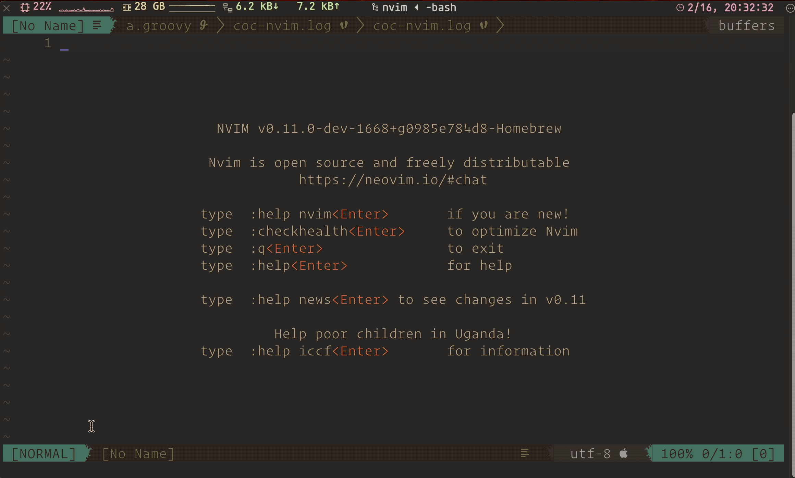
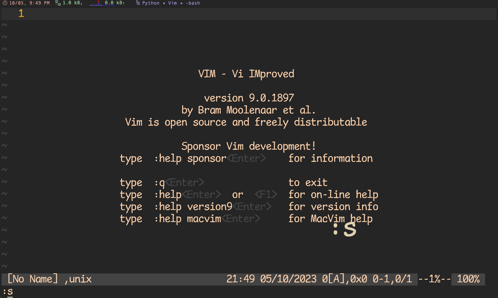
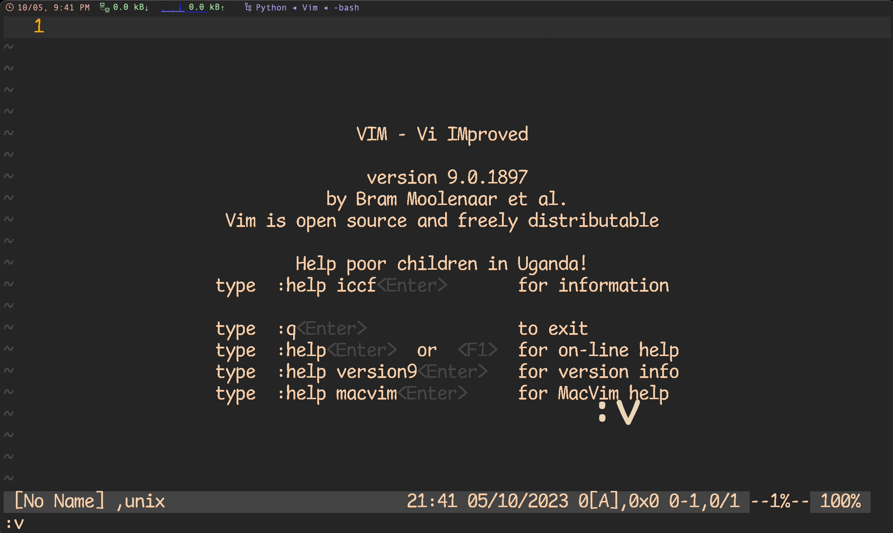
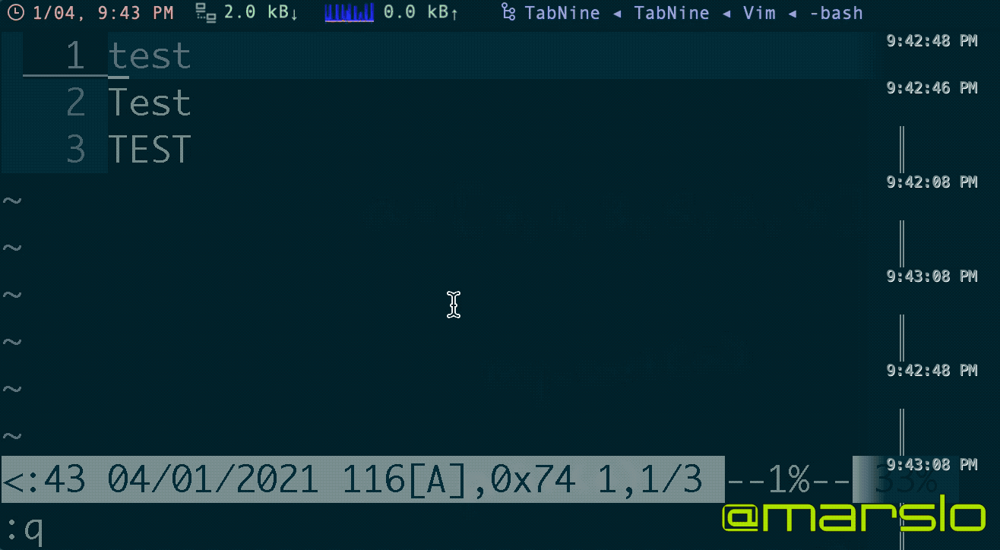

<!-- START doctoc generated TOC please keep comment here to allow auto update -->
<!-- DON'T EDIT THIS SECTION, INSTEAD RE-RUN doctoc TO UPDATE -->

- [open command in a new window](#open-command-in-a-new-window)
- [move between windows](#move-between-windows)
- [resize](#resize)
  - [horizontal resize](#horizontal-resize)
  - [vertical resize](#vertical-resize)
- [quickfix](#quickfix)

<!-- END doctoc generated TOC please keep comment here to allow auto update -->


> reference:
> - [windows.txt](https://vimhelp.org/windows.txt.html)
> - [Maximize current window](https://vim.fandom.com/wiki/Maximize_current_window)
>   - `:only`
> - [Maximize or restore window](https://vim.fandom.com/wiki/Maximize_or_restore_window)
> - [Maximize or set initial window size](https://vim.fandom.com/wiki/Maximize_or_set_initial_window_size)
> - [Maximize window and return to previous split structure](https://vim.fandom.com/wiki/Maximize_window_and_return_to_previous_split_structure)
> - [Quick window resizing](https://vim.fandom.com/wiki/Quick_window_resizing)
> - [Window zooming convenience](https://vim.fandom.com/wiki/Window_zooming_convenience)


## open command in a new window

> [!TIP|label:reference:]
> - [windows.txt - new](https://vimhelp.org/windows.txt.html#%3Anew)
> **[CTRL-W](https://vimhelp.org/index.txt.html#CTRL-W) n**                        <kbd>CTRL-W_n</kbd>
> **[CTRL-W](https://vimhelp.org/index.txt.html#CTRL-W) [CTRL-N](https://vimhelp.org/motion.txt.html#CTRL-N)**                   <kbd>CTRL-W_CTRL-N</kbd>
> **:[N]new [[++opt]](https://vimhelp.org/editing.txt.html#%5B%2B%2Bopt%5D) [[+cmd]](https://vimhelp.org/editing.txt.html#%5B%2Bcmd%5D)**          <kbd>:new</kbd>
>     Create a new window and start editing an empty file in it.
>     Make new window N high (default is to use half the existing
>     height).  Reduces the current window height to create room (and
>     others, if the ['equalalways'](https://vimhelp.org/options.txt.html#%27equalalways%27) option is set and ['eadirection'](https://vimhelp.org/options.txt.html#%27eadirection%27)
>     isn't "hor").
>     Also see [++opt](https://vimhelp.org/editing.txt.html#%2B%2Bopt) and [+cmd](https://vimhelp.org/editing.txt.html#%2Bcmd).
>     If ['fileformats'](https://vimhelp.org/options.txt.html#%27fileformats%27) is not empty, the first format given will be
>     used for the new buffer.  If ['fileformats'](https://vimhelp.org/options.txt.html#%27fileformats%27) is empty, the
>     ['fileformat'](https://vimhelp.org/options.txt.html#%27fileformat%27) of the current buffer is used.  This can be
>     overridden with the [++opt](https://vimhelp.org/editing.txt.html#%2B%2Bopt) argument.
>     Autocommands are executed in this order:
>     1. [WinLeave](https://vimhelp.org/autocmd.txt.html#WinLeave) for the current [window](https://vimhelp.org/windows.txt.html#window)
>     2. [WinEnter](https://vimhelp.org/autocmd.txt.html#WinEnter) for the new [window](https://vimhelp.org/windows.txt.html#window)
>     3. [BufLeave](https://vimhelp.org/autocmd.txt.html#BufLeave) for the current buffer
>     4. [BufEnter](https://vimhelp.org/autocmd.txt.html#BufEnter) for the new buffer
>     This behaves like a "[:split](https://vimhelp.org/windows.txt.html#%3Asplit)" first, and then an "[:enew](https://vimhelp.org/editing.txt.html#%3Aenew)"
>     command.

```vim
" :[N]new [++opt] [+cmd] {file}

:<n>command +<command>
" |    |        + the command will be execute
" |    + command to create new window. i.e.: new, vnew, split/sp, vsplit/vsp
" + line number or column number
```



## move between windows

|   COMMANDS  | SHORTCUT                                      |
|:-----------:|-----------------------------------------------|
| `:wincmd l` | <kbd>ctrl</kbd> + <kbd>w</kbd> ⇢ <kbd>l</kbd> |
| `:wincmd h` | <kbd>ctrl</kbd> + <kbd>w</kbd> ⇢ <kbd>h</kbd> |
| `:wincmd j` | <kbd>ctrl</kbd> + <kbd>w</kbd> ⇢ <kbd>j</kbd> |
| `:wincmd k` | <kbd>ctrl</kbd> + <kbd>w</kbd> ⇢ <kbd>k</kbd> |
| `:wincmd r` | <kbd>ctrl</kbd> + <kbd>w</kbd> ⇢ <kbd>r</kbd> |

## resize

> [!NOTE|label:reference:]
> - [Resize splits more quickly](https://vim.fandom.com/wiki/Resize_splits_more_quickly)
> - maximium split window: <kbd>ctrl</kbd> + <kbd>w</kbd> ⇢ <kbd>_</kbd>
> - maximium vsplit window: <kbd>ctrl</kbd> + <kbd>w</kbd> ⇢ <kbd>|</kbd>
> - resize window: <kbd>ctrl</kbd> + <kbd>w</kbd> ⇢ <kbd>|</kbd>

### horizontal resize
  > `:res` is the shortcut of `:resize`

| COMMANDS OR SHORTCUT                          | COMMENTS                      |
|:----------------------------------------------|-------------------------------|
| `:res[ize] n`                                 | setup the width to <n> lines  |
| `:res[ize] -n`                                | reduce <n> lines of the width |
| `:res[ize] +n`                                | extend <n> lines of the width |
| <kbd>ctrl</kbd> + <kbd>w</kbd> ⇢ <kbd>+</kbd> | extend 1 line                 |
| `:wincmd +`                                   | extend 1 line                 |
| <kbd>ctrl</kbd> + <kbd>w</kbd> ⇢ <kbd>-</kbd> | reduce 1 line                 |
| `:wincmd -`                                   | reduce 1 line                 |
| <kbd>ctrl</kbd> + <kbd>w</kbd> ⇢ <kbd>=</kbd> | resize to default: `50%`      |
| `:wincmd =`                                   | resize to default: `50%`      |
| <kbd>ctrl</kbd> + <kbd>w</kbd> ⇢ <kbd>_</kbd> | maximum the window            |
| `:wincmd _`                                   | maximum the window            |



### vertical resize

| COMMANDS OR SHORTCUT                               | COMMENTS                        |
|:---------------------------------------------------|---------------------------------|
| `:vertical res[ize] n`                             | setup the width to <n> columns  |
| `:vertical res[ize] -n`                            | reduce <n> columns of the width |
| `:vertical res[ize] +n`                            | extend <n> columns of the width |
| <kbd>ctrl</kbd> + <kbd>w</kbd> ⇢ <kbd>&gt;</kbd>   | extend 1 column                 |
| `:wincmd >`                                        | extend 1 column                 |
| <kbd>ctrl</kbd> + <kbd>w</kbd> ⇢ <kbd>&lt;</kbd>   | reduce 1 column                 |
| `:wincmd <`                                        | reduce 1 column                 |
| <kbd>ctrl</kbd> + <kbd>w</kbd> ⇢ <kbd>=</kbd>      | resize to default: `50%`        |
| `:wincmd =`                                        | resize to default: `50%`        |
| <kbd>ctrl</kbd> + <kbd>w</kbd> ⇢ <kbd>&#124;</kbd> | maximum the window              |
| `:wincmd ⎮`                                        | maximum the window              |



## [quickfix](http://vimdoc.sourceforge.net/htmldoc/quickfix.html)



- [automatically fitting a quickfix window height](https://vim.fandom.com/wiki/Automatically_fitting_a_quickfix_window_height)
  ```
   .vimrc
  au FileType qf call AdjustWindowHeight(3, 10)
  function! AdjustWindowHeight(minheight, maxheight)
    exe max([min([line("$"), a:maxheight]), a:minheight]) . "wincmd _"
  endfunction
  ```
