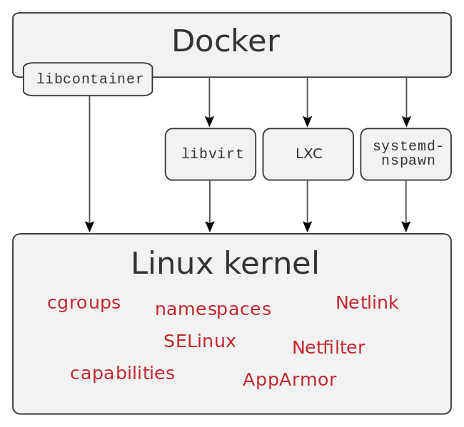
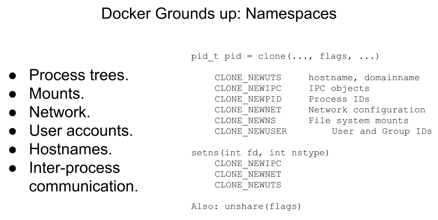

<!-- START doctoc generated TOC please keep comment here to allow auto update -->
<!-- DON'T EDIT THIS SECTION, INSTEAD RE-RUN doctoc TO UPDATE -->
**Table of Contents**  *generated with [DocToc](https://github.com/thlorenz/doctoc)*

- [docker internals](#docker-internals)
  - [cgoups](#cgoups)
  - [namespace](#namespace)
  - [docker daemon](#docker-daemon)
- [init](#init)
  - [install](#install)
  - [troubleshooting](#troubleshooting)
- [enable tcp port 2375 for external connection to docker](#enable-tcp-port-2375-for-external-connection-to-docker)
- [docker completion](#docker-completion)
  - [complete alias](#complete-alias)
  - [Linux](#linux)
  - [OSX](#osx)
- [docker build](#docker-build)
- [docker ps](#docker-ps)
  - [list without wrap](#list-without-wrap)
  - [filter](#filter)
  - [ps format](#ps-format)
- [docker stats](#docker-stats)
- [docker inspect](#docker-inspect)
- [docker proxy](#docker-proxy)
- [check docker layer](#check-docker-layer)
- [media type](#media-type)
  - [`manifest.v2+json`](#manifestv2json)
  - [sample json](#sample-json)

<!-- END doctoc generated TOC please keep comment here to allow auto update -->


> reference:
> - [cheatsheet](https://github.com/collabnix/dockerlabs/tree/master/cheatsheet)
> - [Docker 学习笔记](https://blog.opskumu.com/docker.html)
> - [什么是 Docker](https://yeasy.gitbook.io/docker_practice/introduction/what)
> - [Understanding the Docker Internals](https://medium.com/%40BeNitinAgarwal/undersanding-the-docker-internals-7ccb052ce9fe)
> - [Ideas for a cgroups UI](https://mairin.wordpress.com/2011/05/13/ideas-for-a-cgroups-ui/)
> - [Configure Liveness, Readiness and Startup Probes](https://kubernetes.io/docs/tasks/configure-pod-container/configure-liveness-readiness-startup-probes/#defining-a-liveness-command)
> - [Docker for Windows: Deploying a docker-compose app to local Kubernetes](https://marcesher.com/2018/03/28/docker-for-windows-deploying-a-docker-compose-app-to-local-kubernetes/)
> - [Windows for Linux Nerds](https://blog.jessfraz.com/post/windows-for-linux-nerds/)
> - [Running Docker on WSL2 without Docker Desktop](https://technotes.adelerhof.eu/wsl/docker_on_wsl2/)
> - [Copy Docker repositories](https://technotes.adelerhof.eu/post/migrate_docker/)
> - [Docker storage drivers](https://docs.docker.com/storage/storagedriver/select-storage-driver/)
> - [About storage drivers](https://docs.docker.com/storage/storagedriver/)
> - [Docker In Docker](https://blog.mafeifan.com/DevOps/Docker/Docker-%E5%AD%A6%E4%B9%A0%E7%B3%BB%E5%88%9727-Docker-in-Docker.html#docker-in-docker)
> - [* ContainerSSH/ContainerSSH](https://github.com/ContainerSSH/ContainerSSH)
> - [WebAssembly: Docker without containers!](https://wasmlabs.dev/articles/docker-without-containers/)


## docker internals


### cgoups


### namespace


### docker daemon

> [!TIP|label:references:]
> - [Protect the Docker daemon socket](https://docs.docker.com/engine/security/protect-access/)
> - [Configure and troubleshoot the Docker daemon](https://docs.docker.com/config/daemon/)
> - [Set Up Docker with TLS](https://www.labkey.org/Documentation/wiki-page.view?name=dockerTLS)
> - [How to Configure Docker daemon with a configuration file?](https://www.devopsschool.com/blog/how-to-configure-docker-daemon-with-a-configuration-file/)

## init

> [!NOTE|label:references:]
> - [Install Docker Engine on CentOS](https://docs.docker.com/engine/install/centos/)
> - [Linux post-installation steps for Docker Engine](https://docs.docker.com/engine/install/linux-postinstall/)

### install
- environment cleanup
  ```bash
  $ sudo dnf remove docker \
                    docker-client \
                    docker-client-latest \
                    docker-common \
                    docker-latest \
                    docker-latest-logrotate \
                    docker-logrotate \
                    docker-engine
  ```
- repo setup
  ```bash
  $ sudo dnf install -y yum-utils
  $ sudo yum-config-manager --add-repo https://download.docker.com/linux/centos/docker-ce.repo
  $ sudo dnf makecache
  ```

- install
  ```bash
  $ sudo dnf install -y docker-ce docker-ce-cli containerd.io docker-buildx-plugin docker-compose-plugin
  # or
  $ sudo dnf install -y docker-ce docker-ce-cli containerd.io

  # or
  $ sudo dnf install -y docker-ce-19.03.15-3.el8 docker-ce-cli-19.03.15-3.el8 containerd.io

  # or
  $ sudo dnf install -y docker-ce-19.03.15-3.el8 \
                        docker-ce-cli-19.03.15-3.el8 \
                        containerd.io \
                        docker-compose-plugin-2.16.0-1.el8 \
                        docker-scan-plugin-0.23.0-3.el8 \
                        docker-buildx-plugin-0.10.2-1.el8
  ```

  - to get available version:
    ```bash
    $ sudo dnf list docker-ce --showduplicates | grep 19\.03
    docker-ce.x86_64               3:19.03.15-3.el8                @docker-ce-stable
    docker-ce.x86_64               3:19.03.13-3.el8                docker-ce-stable
    docker-ce.x86_64               3:19.03.14-3.el8                docker-ce-stable
    docker-ce.x86_64               3:19.03.15-3.el8                docker-ce-stable
    ```

- enable service
  ```bash
  $ sudo systemctl enable --now docker
  Created symlink /etc/systemd/system/multi-user.target.wants/docker.service → /usr/local/lib/systemd/system/docker.service.
  ```

- account settings
  ```bash
  $ sudo usermod -aG docker $(whoami)
  ```

- teardown
  ```bash
  $ sudo dnf remove -y docker-ce docker-ce-cli containerd.io docker-compose-plugin docker-scan-plugin docker-buildx-plugin
  ```

### troubleshooting
#### [problem with installed package podman](https://forums.docker.com/t/problem-with-installed-package-podman/116529/2)

- issue
  ```bash
  $ sudo yum install docker-ce-19.03.15-3.el8 \
                     docker-ce-cli-19.03.15-3.el8 \
                     containerd.io \
                     docker-buildx-plugin \
                     docker-compose-plugin
  Docker CE Stable - x86_64                                                              272 kB/s |  43 kB     00:00
  Error:
   Problem 1: problem with installed package podman-1.6.4-10.module_el8.2.0+305+5e198a41.x86_64
    - package podman-1.6.4-10.module_el8.2.0+305+5e198a41.x86_64 requires runc >= 1.0.0-57, but none of the providers can be installed
    - package podman-3.3.1-9.module_el8.5.0+988+b1f0b741.x86_64 requires runc >= 1.0.0-57, but none of the providers can be installed
    - package containerd.io-1.6.21-3.1.el8.x86_64 conflicts with runc provided by runc-1.0.0-65.rc10.module_el8.2.0+305+5e198a41.x86_64
    - package containerd.io-1.6.21-3.1.el8.x86_64 obsoletes runc provided by runc-1.0.0-65.rc10.module_el8.2.0+305+5e198a41.x86_64
    - package containerd.io-1.6.21-3.1.el8.x86_64 conflicts with runc provided by runc-1.0.2-1.module_el8.5.0+911+f19012f9.x86_64
    - package containerd.io-1.6.21-3.1.el8.x86_64 obsoletes runc provided by runc-1.0.2-1.module_el8.5.0+911+f19012f9.x86_64
    - cannot install the best candidate for the job
    - package runc-1.0.0-66.rc10.module_el8.5.0+1004+c00a74f5.x86_64 is filtered out by modular filtering
    - package runc-1.0.0-72.rc92.module_el8.5.0+1006+8d0e68a2.x86_64 is filtered out by modular filtering
   Problem 2: problem with installed package buildah-1.11.6-7.module_el8.2.0+305+5e198a41.x86_64
    - package buildah-1.11.6-7.module_el8.2.0+305+5e198a41.x86_64 requires runc >= 1.0.0-26, but none of the providers can be installed
    ...
    - package buildah-1.11.6-7.module_el8.2.0+305+5e198a41.x86_64 requires runc >= 1.0.0-26, but none of the providers can be installed
    - package buildah-1.22.3-2.module_el8.5.0+911+f19012f9.x86_64 requires runc >= 1.0.0-26, but none of the providers can be installed
    - package containerd.io-1.3.7-3.1.el8.x86_64 conflicts with runc provided by runc-1.0.0-65.rc10.module_el8.2.0+305+5e198a41.x86_64
    ...
  ```

- [solution : remove podman](https://www.ibm.com/docs/en/eam/4.2?topic=questions-troubleshooting-tips#uninstall_podman)
  ```bash
  $ sudo dnf remove buildah skopeo podman containers-common atomic-registries docker container-tools
  $ sudo rm -rf /etc/containers/* /var/lib/containers/* /etc/docker /etc/subuid* /etc/subgid*
  $ cd ~ && rm -rf /.local/share/containers/
  ```

#### `Error: Transaction test error`

- issue
  ```bash
  $ sudo dnf install -y docker-ce-19.03.15-3.el8 docker-ce-cli-19.03.15-3.el8 containerd.io docker-compose-plugin-2.16.0-1.el8 docker-scan-plugin-0.23.0-3.el8 docker-buildx-plugin-0.10.2-1.el8
  Error: Transaction test error:
    file /usr/libexec/docker/cli-plugins/docker-buildx from install of docker-buildx-plugin-0:0.10.2-1.el8.x86_64 conflicts with file from package docker-ce-cli-1:19.03.15-3.el8.x86_64
  ```

- solution: using latest `docker-ce-cli`

  ```bash
  $ sudo dnf install -y docker-ce-19.03.15-3.el8 docker-ce-cli containerd.io docker-compose-plugin docker-scan-plugin docker-buildx-plugin
  CentOS Stream 8 - AppStream                                              14 MB/s |  34 MB     00:02
  CentOS Stream 8 - BaseOS                                                6.4 MB/s |  53 MB     00:08
  CentOS Stream 8 - Extras                                                 31 kB/s |  18 kB     00:00
  CentOS Stream 8 - Extras common packages                                9.6 kB/s | 6.9 kB     00:00
  Docker CE Stable - x86_64                                               289 kB/s |  51 kB     00:00
  Dependencies resolved.
  ========================================================================================================
   Package                  Arch      Version                                   Repository           Size
  ========================================================================================================
  Installing:
   containerd.io            x86_64    1.6.24-3.1.el8                            docker-ce-stable     34 M
   docker-buildx-plugin     x86_64    0.11.2-1.el8                              docker-ce-stable     13 M
   docker-ce                x86_64    3:19.03.15-3.el8                          docker-ce-stable     24 M
   docker-ce-cli            x86_64    1:24.0.7-1.el8                            docker-ce-stable    7.2 M
   docker-compose-plugin    x86_64    2.21.0-1.el8                              docker-ce-stable     13 M
   docker-scan-plugin       x86_64    0.23.0-3.el8                              docker-ce-stable    3.8 M
  Installing dependencies:
   container-selinux        noarch    2:2.224.0-1.module_el8+712+4cd1bd69       appstream            70 k
   libcgroup                x86_64    0.41-19.el8                               baseos               70 k

  Transaction Summary
  ========================================================================================================
  Install  8 Packages

  Total download size: 95 M
  Installed size: 376 M
  Downloading Packages:
  (1/8): containerd.io-1.6.24-3.1.el8.x86_64.rpm                           24 MB/s |  34 MB     00:01
  (2/8): container-selinux-2.224.0-1.module_el8+712+4cd1bd69.noarch.rpm    49 kB/s |  70 kB     00:01
  (3/8): libcgroup-0.41-19.el8.x86_64.rpm                                  48 kB/s |  70 kB     00:01
  (4/8): docker-buildx-plugin-0.11.2-1.el8.x86_64.rpm                      30 MB/s |  13 MB     00:00
  (5/8): docker-compose-plugin-2.21.0-1.el8.x86_64.rpm                     31 MB/s |  13 MB     00:00
  (6/8): docker-ce-cli-24.0.7-1.el8.x86_64.rpm                            7.2 MB/s | 7.2 MB     00:00
  (7/8): docker-scan-plugin-0.23.0-3.el8.x86_64.rpm                        12 MB/s | 3.8 MB     00:00
  (8/8): docker-ce-19.03.15-3.el8.x86_64.rpm                               14 MB/s |  24 MB     00:01
  --------------------------------------------------------------------------------------------------------
  Total                                                                    26 MB/s |  95 MB     00:03
  Running transaction check
  Transaction check succeeded.
  Running transaction test
  Transaction test succeeded.
  Running transaction
    Preparing        :                                                                                1/1
    Installing       : docker-compose-plugin-2.21.0-1.el8.x86_64                                      1/8
    Running scriptlet: docker-compose-plugin-2.21.0-1.el8.x86_64                                      1/8
    Running scriptlet: container-selinux-2:2.224.0-1.module_el8+712+4cd1bd69.noarch                   2/8
    Installing       : container-selinux-2:2.224.0-1.module_el8+712+4cd1bd69.noarch                   2/8
    Running scriptlet: container-selinux-2:2.224.0-1.module_el8+712+4cd1bd69.noarch                   2/8
    Installing       : containerd.io-1.6.24-3.1.el8.x86_64                                            3/8
    Running scriptlet: containerd.io-1.6.24-3.1.el8.x86_64                                            3/8
    Installing       : docker-scan-plugin-0.23.0-3.el8.x86_64                                         4/8
    Running scriptlet: docker-scan-plugin-0.23.0-3.el8.x86_64                                         4/8
    Installing       : docker-buildx-plugin-0.11.2-1.el8.x86_64                                       5/8
    Running scriptlet: docker-buildx-plugin-0.11.2-1.el8.x86_64                                       5/8
    Installing       : docker-ce-cli-1:24.0.7-1.el8.x86_64                                            6/8
    Running scriptlet: docker-ce-cli-1:24.0.7-1.el8.x86_64                                            6/8
    Running scriptlet: libcgroup-0.41-19.el8.x86_64                                                   7/8
    Installing       : libcgroup-0.41-19.el8.x86_64                                                   7/8
    Running scriptlet: libcgroup-0.41-19.el8.x86_64                                                   7/8
  /sbin/ldconfig: /usr/lib64/llvm15/lib/libclang.so.15 is not a symbolic link

    Installing       : docker-ce-3:19.03.15-3.el8.x86_64                                              8/8
    Running scriptlet: docker-ce-3:19.03.15-3.el8.x86_64                                              8/8
    Running scriptlet: container-selinux-2:2.224.0-1.module_el8+712+4cd1bd69.noarch                   8/8
    Running scriptlet: docker-ce-3:19.03.15-3.el8.x86_64                                              8/8
  /sbin/ldconfig: /usr/lib64/llvm15/lib/libclang.so.15 is not a symbolic link

    Verifying        : container-selinux-2:2.224.0-1.module_el8+712+4cd1bd69.noarch                   1/8
    Verifying        : libcgroup-0.41-19.el8.x86_64                                                   2/8
    Verifying        : containerd.io-1.6.24-3.1.el8.x86_64                                            3/8
    Verifying        : docker-buildx-plugin-0.11.2-1.el8.x86_64                                       4/8
    Verifying        : docker-ce-3:19.03.15-3.el8.x86_64                                              5/8
    Verifying        : docker-ce-cli-1:24.0.7-1.el8.x86_64                                            6/8
    Verifying        : docker-compose-plugin-2.21.0-1.el8.x86_64                                      7/8
    Verifying        : docker-scan-plugin-0.23.0-3.el8.x86_64                                         8/8

  Installed:
    container-selinux-2:2.224.0-1.module_el8+712+4cd1bd69.noarch
    containerd.io-1.6.24-3.1.el8.x86_64
    docker-buildx-plugin-0.11.2-1.el8.x86_64
    docker-ce-3:19.03.15-3.el8.x86_64
    docker-ce-cli-1:24.0.7-1.el8.x86_64
    docker-compose-plugin-2.21.0-1.el8.x86_64
    docker-scan-plugin-0.23.0-3.el8.x86_64
    libcgroup-0.41-19.el8.x86_64
  Complete!

  $ sudo dnf list --installed | grep -E 'docker|container'
  container-selinux.noarch                           2:2.224.0-1.module_el8+712+4cd1bd69                   @appstream
  containerd.io.x86_64                               1.6.24-3.1.el8                                        @docker-ce-stable
  containernetworking-plugins.x86_64                 1:1.3.0-2.module_el8+461+0c6b54ea                     @AppStream
  docker-buildx-plugin.x86_64                        0.11.2-1.el8                                          @docker-ce-stable
  docker-ce.x86_64                                   3:19.03.15-3.el8                                      @docker-ce-stable
  docker-ce-cli.x86_64                               1:24.0.7-1.el8                                        @docker-ce-stable
  docker-compose-plugin.x86_64                       2.21.0-1.el8                                          @docker-ce-stable
  docker-scan-plugin.x86_64                          0.23.0-3.el8                                          @docker-ce-stable
  systemd-container.x86_64                           239-76.el8                                            @anaconda
  ```

## [enable tcp port 2375 for external connection to docker](https://gist.github.com/styblope/dc55e0ad2a9848f2cc3307d4819d819f)


> references:
> - [* Configure where the Docker daemon listens for connections](https://docs.docker.com/engine/install/linux-postinstall/#configure-where-the-docker-daemon-listens-for-connections)
> - [* styblope/docker-api-port.md](https://gist.github.com/styblope/dc55e0ad2a9848f2cc3307d4819d819f)
> - [* Configure the daemon](https://docs.docker.com/config/daemon/)
>   - [Configure remote access for Docker daemon](https://docs.docker.com/config/daemon/remote-access/)
>   - [Protect the Docker daemon socket](https://docs.docker.com/engine/security/protect-access/)
>   - [Configure and troubleshoot the Docker daemon](https://docs.docker.com/config/daemon/)
>   - [Control Docker with systemd](https://docs.docker.com/config/daemon/systemd/)
>   - [Configure the daemon for IPv6](https://docs.docker.com/config/daemon/ipv6/)
>   - [Docker and iptables](https://docs.docker.com/network/iptables/)
> - [Install Docker Engine on Debian](https://docs.docker.com/engine/install/debian/#install-using-the-convenience-script)
> - [Install Docker Engine on CentOS](https://docs.docker.com/engine/install/centos/)
> - [Docker security : Docker daemon attack surface](https://docs.docker.com/engine/security/#docker-daemon-attack-surface)



> [!TIP]
> - to check service
>   ```bash
>   $ sudo systemd-analyze verify <name.service>
>   ```
> - enable service if necessary
>   ```bash
>   $ sudo systemctl enable containerd.service
>   Created symlink /etc/systemd/system/multi-user.target.wants/containerd.service → /usr/lib/systemd/system/containerd.service
>   ```

```bash
# prepare
$ sudo systemctl stop docker.service
$ sudo systemctl stop docker.socket
```

- via `daemon.json`
  ```bash
  $ cat /etc/docker/daemon.json
  {
    "hosts": ["unix:///var/run/docker.sock", "tcp://127.0.0.1:2375"]
  }
  # or
  $ cat /etc/docker/daemon.json
  {
    "hosts": ["unix:///var/run/docker.sock", "fd://", "tcp://127.0.0.1:2375"]
  }

  $ sudo systemctl edit docker.service
  ```

- via `override.conf`
  ```bash
  $ cat /etc/systemd/system/docker.service.d/override.conf
  [Service]
  ExecStart=
  ExecStart=/usr/bin/dockerd -H fd:// -H tcp://127.0.0.1:2375 [--containerd=/run/containerd/containerd.sock] [--config-file /etc/docker/daemon.json]

  $ sudo systemctl daemon-reload
  $ sudo systemctl restart docker.service

  # result
  $ sudo netstat -lntp | grep dockerd
  tcp6       0      0 :::2375                 :::*                    LISTEN      5649/dockerd
  ```

- result
  ```bash
  $ sudo cat /etc/docker/daemon.json
  {
    "hosts": ["unix:///var/run/docker.sock", "fd://", "tcp://0.0.0.0:2375"]
  }

  $ sudo cat /etc/systemd/system/docker.service.d/docker.conf
  [Service]
  ExecStart=
  ExecStart=/usr/bin/dockerd

  $ docker -H tcp://0.0.0.0:2376 pull ubuntu:18.04
  18.04: Pulling from library/ubuntu
  a404e5416296: Pull complete
  Digest: sha256:ca70a834041dd1bf16cc38dfcd24f0888ec4fa431e09f3344f354cf8d1724499
  Status: Downloaded newer image for ubuntu:18.04
  ```
  - verify
    ```bash
    $ ip -4 a s en1
    5: en1: <BROADCAST,MULTICAST,UP,LOWER_UP> mtu 1500 qdisc mq state UP group default qlen 1000
        inet x.x.x.x/24 brd x.x.x.255 scope global noprefixroute en1
           valid_lft forever preferred_lft forever

    $ nc -zv <target.ip.address> 2375
    Connection to target.ip.address 2375 port [tcp/*] succeeded!

    $ docker -H tcp://<target.ip.address>:2375 images
    REPOSITORY   TAG       IMAGE ID       CREATED       SIZE
    ubuntu       18.04     71eaf13299f4   2 weeks ago   63.1MB
    ```

- or modify in `/lib/systemd/system/docker.service`
  ```bash
  # Replacing this line:
  ExecStart=/usr/bin/dockerd -H fd:// --containerd=/run/containerd/containerd.sock
  #                          |      |
  #                           ------
  #                       remove `-H fd://`

  # With this line:
  ExecStart=/usr/bin/dockerd --containerd=/run/containerd/containerd.sock [--tls=false]
  ```

- or via `socat`
  ```bash
  exec socat -d TCP-LISTEN:2375,fork UNIX-CONNECT:/var/run/docker.sock
  ```

<!--sec data-title="cat /usr/lib/systemd/system/docker.service" data-id="section0" data-show=true data-collapse=true ces-->
```bash
$ sudo cat /usr/lib/systemd/system/docker.service
[Unit]
Description=Docker Application Container Engine
Documentation=https://docs.docker.com
After=network-online.target docker.socket firewalld.service containerd.service time-set.target
Wants=network-online.target containerd.service
Requires=docker.socket

[Service]
Type=notify
# the default is not to use systemd for cgroups because the delegate issues still
# exists and systemd currently does not support the cgroup feature set required
# for containers run by docker
#         remove if enable remote access in /etc/docker/daemon.json
#                           ---+--
#                          |      |
ExecStart=/usr/bin/dockerd -H fd:// --containerd=/run/containerd/containerd.sock
ExecReload=/bin/kill -s HUP $MAINPID
TimeoutStartSec=0
RestartSec=2
Restart=always

# Note that StartLimit* options were moved from "Service" to "Unit" in systemd 229.
# Both the old, and new location are accepted by systemd 229 and up, so using the old location
# to make them work for either version of systemd.
StartLimitBurst=3

# Note that StartLimitInterval was renamed to StartLimitIntervalSec in systemd 230.
# Both the old, and new name are accepted by systemd 230 and up, so using the old name to make
# this option work for either version of systemd.
StartLimitInterval=60s

# Having non-zero Limit*s causes performance problems due to accounting overhead
# in the kernel. We recommend using cgroups to do container-local accounting.
LimitNOFILE=infinity
LimitNPROC=infinity
LimitCORE=infinity

# Comment TasksMax if your systemd version does not support it.
# Only systemd 226 and above support this option.
TasksMax=infinity

# set delegate yes so that systemd does not reset the cgroups of docker containers
Delegate=yes

# kill only the docker process, not all processes in the cgroup
KillMode=process
OOMScoreAdjust=-500

[Install]
WantedBy=multi-user.target
```
<!--endsec-->

## docker completion


> references:
> - [command-line completion](https://docs.docker.com/compose/completion/)


### complete alias

> [docker/tricky](tricky.html##complete-alias)


### [Linux](https://stackoverflow.com/a/34350381/2940319)
```bash
$ curl -fsSL https://raw.githubusercontent.com/docker/cli/master/contrib/completion/bash/docker \
       -o /etc/bash_completion.d/docker
```

- load completion
  ```bash
  $ grep 'bash_completion' /etc/bashrc
  if [ -f /usr/share/bash-completion/bash_completion ]; then
    source /usr/share/bash-completion/bash_completion
  fi

  $ cat /usr/share/bash-completion/bash_completion
  ...
  2070 # source compat completion directory definitions
  2071 compat_dir=${BASH_COMPLETION_COMPAT_DIR:-/etc/bash_completion.d}
  2072 if [[ -d $compat_dir && -r $compat_dir && -x $compat_dir ]]; then
  2073     for i in "$compat_dir"/*; do
  2074         [[ ${i##*/} != @($_backup_glob|Makefile*|$_blacklist_glob) \
  2075             && -f $i && -r $i ]] && . "$i"
  2076     done
  2077 fi
  2078 unset compat_dir i _blacklist_glob
  2079
  2080 # source user completion file
  2081 user_completion=${BASH_COMPLETION_USER_FILE:-~/.bash_completion}
  2082 [[ ${BASH_SOURCE[0]} != $user_completion && -r $user_completion ]] \
  2083     && . $user_completion
  2084 unset user_completion
  ...
  ```

### OSX
```bash
bashComp="$(brew --prefix)/etc/bash_completion.d"
bashComp2="$(brew --prefix)/etc/profile.d/bash_completion.sh"
dApp="/Applications/Docker.app"
dmver='0.16.2'
gitcontent='https://raw.githubusercontent.com'
dm="${gitcontent}/docker/machine/v${dmver}/contrib/completion/bash/docker-machine.bash"
curlOpt='-x 127.0.0.1:1087 -fsSL'

brew install bash-completion@2
sudo curl ${curlOpt} ${dm} --output ${bashComp}/docker-machine.bash
for _i in docker.bash-completion docker-compose.bash-completion; do
  ln -s ${dApp}/Contents/Resources/etc/${_i} ${bashComp}/${_i}
done

cat > ~/.bash_profile << EOF
if command -v brew > /dev/null; then
  # bash-completion
  [ -f "${bashComp}" ] && export BASH_COMPLETION_COMPAT_DIR="${bashComp}" && source "${bashComp}";
  # bash-completion@2
  [ -f "${bashComp2}" ] && source "${bashComp2}";
fi
EOF
```

- result
  ```bash
  $ complete -p d
  complete -F _complete_alias d
  $ complete -p dls
  complete -F _complete_alias dls

  # others:
  $ complete -p k
  complete -F _complete_alias k
  $ complete -p git
  complete -o bashdefault -o default -o nospace -F __git_wrap__git_main git
  ```

## docker build
> [Best practices for writing Dockerfiles](https://docs.docker.com/develop/develop-images/dockerfile_best-practices/)
> [Create a base image](https://docs.docker.com/develop/develop-images/baseimages/)
> [Dockerfile reference](https://docs.docker.com/engine/reference/builder/#entrypoint)

```bash
$ docker build \
         --no-cache \
         --build-arg REPO=<private.registry.com> \
         --build-arg TAG=1.4-bionic \
         -t <private.registry.com>/devops/jnlp.bionic \
         -f devops-jnlp .
```

## docker ps


> references:
> - [docker ps](https://docs.docker.com/engine/reference/commandline/ps)


### list without wrap
```bash
$ docker ps -a --no-trunc
```

- [or](https://github.com/moby/moby/issues/40405#issuecomment-578066973)
  ```bash
  $ curl --unix-socket /var/run/docker.sock 'http://localhost/containers/json'
  ```

- i.e.:
  ```bash
  $ docker ps -a --no-trunc --filter name=marslo*
  ```

#### [list full container id](https://forums.docker.com/t/how-to-get-a-full-id-of-a-certain-container/2418)
```bash
$ docker ps -aq --no-trunc
```

- [or](https://forums.docker.com/t/how-to-get-a-full-id-of-a-certain-container/2418/3)
  
  ```bash
  $ docker inspect --format="{{.Id}}" d40df87b2f87
  d40df87b2f87261152d2541b870c6b801c031f8df969e4bd3e9b3c607e6c1698
  ```
  

### [filter](https://docs.docker.com/engine/reference/commandline/ps/#filtering)

> [!NOTE|label:references:]
> - [Filtering](https://docs.docker.com/engine/reference/commandline/ps/#filter)
>
> | FILTER                | DESCRIPTION                                                                                                                   |
> | --------------------- | ----------------------------------------------------------------------------------------------------------------------------- |
> | `id`                  | Container's ID                                                                                                                |
> | `name`                | Container's name                                                                                                              |
> | `label`               | An arbitrary string representing either a key or a key-value pair. Expressed as <key> or <key>=<value>                        |
> | `exited`              | An integer representing the container's exit code. Only useful with --all.                                                    |
> | `status`              | One of created, restarting, running, removing, paused, exited, or dead                                                        |
> | `ancestor`            | Filters containers which share a given image as an ancestor. Expressed as <image-name>[:<tag>], <image id>, or <image@digest> |
> | `before` or `since`   | Filters containers created before or after a given container ID or name                                                       |
> | `volume`              | Filters running containers which have mounted a given volume or bind mount.                                                   |
> | `network`             | Filters running containers connected to a given network.                                                                      |
> | `publish` or `expose` | Filters containers which publish or expose a given port. Expressed as <port>[/<proto>] or <startport-endport>/[<proto>]       |
> | `health`              | Filters containers based on their healthcheck status. One of starting, healthy, unhealthy or none.                            |
> | `isolation`           | Windows daemon only. One of default, process, or hyperv.                                                                      |
> | `is-task`             | Filters containers that are a "task" for a service. Boolean option (true or false)                                            |

- [via name](https://stackoverflow.com/a/34497614/2940319)
  ```bash
  $ docker ps -aqf "name=mycontainer"
  77745046363d
  ```
- filter with image

  
  ```bash
  $ docker ps -a --no-trunc --filter ancestor='busybox:latest'

  # for jenkins/jenkins
  $ docker ps -a --filter ancestor=jenkins/jenkins:2.401.2-lts-jdk11 --format "{{.ID}}"
  ```
  

- filter with exit code
  ```bash
  $ docker ps -a --filter 'exited=0'
  ```
- filter with status
  ```bash
  $ docker ps --filter status=running
  ```
- filter with tag
  ```bash
  $ docker images --filter "reference=*/*/*/*:1.4-bionic-dind"
  ```

### [ps format](https://docs.docker.com/engine/reference/commandline/ps/#formatting)

> see [iMarslo : docker/show](show.html#ps-format)


## docker stats

> see [docker/show](show.html#docker-stats)


## docker inspect

> see [docker/show](show.html)


## docker proxy

> see [docker/tricky](tricky.html#docker-with-proxy)


## check docker layer

> references:
> - [docker history](https://stackoverflow.com/a/30133768/2940319)


```bash
$ docker history [--no-trunc=true] <image>:<tag>
IMAGE               CREATED             CREATED BY                                      SIZE                COMMENT
af73a9899a8f        6 months ago        /bin/sh -c #(nop) WORKDIR /home/devops          0B
e96534e326ed        6 months ago        /bin/sh -c #(nop)  VOLUME [/home/devops/.ssh]   0B
4d3392929105        6 months ago        |5 VERSION=1.6 gid=1000 group=devops uid=100…   884B
8abbc25a66a4        6 months ago        |5 VERSION=1.6 gid=1000 group=devops uid=100…   812B
4cf413ae805e        6 months ago        /bin/sh -c #(nop)  USER devops                  0B
d1d88d88e61b        6 months ago        |5 VERSION=1.6 gid=1000 group=devops uid=100…   1.45GB
4b305ec8942c        6 months ago        /bin/sh -c #(nop) COPY file:c19a45386e5be7e4…   411B
a36e97b18597        6 months ago        |5 VERSION=1.6 gid=1000 group=devops uid=100…   398kB
7abf758ac126        6 months ago        /bin/sh -c #(nop)  USER root                    0B
b7cc7e6545cf        6 months ago        /bin/sh -c #(nop)  ENV DEBIAN_FRONTEND=nonin…   0B
4aa2bff1261d        6 months ago        /bin/sh -c #(nop)  ENV HOME=/home/devops        0B
97c1260a833a        6 months ago        /bin/sh -c #(nop)  ARG gid=1000                 0B
1641eb4e6b1a        6 months ago        /bin/sh -c #(nop)  ARG uid=1000                 0B
f550761577d3        6 months ago        /bin/sh -c #(nop)  ARG group=devops             0B
25f225d7fdaa        6 months ago        /bin/sh -c #(nop)  ARG user=devops              0B
ea3b83e6ee69        6 months ago        /bin/sh -c #(nop)  ARG VERSION=1.6              0B
cf8ee6149a83        6 months ago        /bin/sh -c #(nop)  LABEL description=specifi…   0B
3c8433a403ad        6 months ago        /bin/sh -c #(nop)  LABEL maintainer=marslo@x…   0B
e7d65936ff5d        6 months ago        /bin/sh -c #(nop)  LABEL version=1.6            0B
ac9cd6bdb0cf        6 months ago        /bin/sh -c #(nop)  MAINTAINER marslo <marslo…   0B
ad080923604a        7 months ago        /bin/sh -c #(nop)  CMD ["bash"]                 0B
<missing>           7 months ago        /bin/sh -c #(nop) ADD file:40290d9a94ae76c35…   63.1MB
```


## media type

> [!TIP]
> references:
> - [image manifest version 2, schema 1](https://docs.docker.com/registry/spec/manifest-v2-1/)
> - [image manifest version 2, schema 2](https://docs.docker.com/registry/spec/manifest-v2-2/)
> - [update deprecated schema image manifest version 2, v1 images](https://docs.docker.com/registry/spec/deprecated-schema-v1/)
> - [docker engine 19.03 release notes](https://docs.docker.com/engine/release-notes/19.03/)
> - [what is a docker image manifest?](https://www.howtogeek.com/devops/what-is-a-docker-image-manifest/)

### `manifest.v2+json`

> [!NOTE]
> mediaType in manifest should be 'application/vnd.docker.distribution.manifest.v2+json' not 'application/vnd.oci.image.manifest.v1+json'

- docker version
  ```bash
  $ docker -v
  Docker version 19.03.2, build 6a30dfc
  ```
- [solution](https://docs.docker.com/registry/spec/deprecated-schema-v1/#update-to-image-manifest-version-2-schema-2)

  > [!TIP]
  > One way to upgrade an image from image manifest version 2, schema 1 to schema 2 is to `docker pull` the image and then `docker push` the image with a current version of Docker. Doing so will automatically convert the image to use the latest image manifest specification.
  > Converting an image to image manifest version 2, schema 2 converts the manifest format, but does not update the contents within the image. Images using manifest version 2, schema 1 may contain unpatched vulnerabilities. We recommend looking for an alternative image or rebuilding it.
  >

### sample json

<!--sec data-title="application/vnd.docker.distribution.manifest.v2+json" data-id="section1" data-show=true data-collapse=true ces-->
```bash
$ docker manifest inspect artifactory.domain.com/docker/devops/jenkins:2.387.1-lts
WARN[0000] Conmon at /usr/libexec/podman/conmon invalid: outdated conmon version
WARN[0000] Warning! The manifest type application/vnd.docker.distribution.manifest.v2+json is not a manifest list but a single image.
{
    "schemaVersion": 2,
    "mediaType": "application/vnd.docker.distribution.manifest.v2+json",
    "config": {
        "mediaType": "application/vnd.docker.container.image.v1+json",
        "size": 13129,
        "digest": "sha256:d5ed2ceef0ec08e9044ebb39812f211d64dbcdfce775cc6b0460ca289193416f"
    },
    "layers": [
        {
            "mediaType": "application/vnd.docker.image.rootfs.diff.tar.gzip",
            "size": 55045922,
            "digest": "sha256:32fb02163b6bb519a30f909008e852354dae10bdfd6b34190dbdfe8f15403ea0"
        },
        {
            "mediaType": "application/vnd.docker.image.rootfs.diff.tar.gzip",
            "size": 51628196,
            "digest": "sha256:c09d5e9e1188f3fff7a4f8c3c7c330fde5184cba1c6f0c92526b8b7bd0ac7c26"
        },
        {
            "mediaType": "application/vnd.docker.image.rootfs.diff.tar.gzip",
            "size": 8929986,
            "digest": "sha256:a56533012712c1db623da3e5e9c2d0276301c82db0a2e7a82debfb57e5d916f2"
        },
        {
            "mediaType": "application/vnd.docker.image.rootfs.diff.tar.gzip",
            "size": 1244,
            "digest": "sha256:7936e107ffe73b406a0d02edf9bb02b983534d803bb06fd03dc38dac4b6cfe2a"
        },
        {
            "mediaType": "application/vnd.docker.image.rootfs.diff.tar.gzip",
            "size": 189,
            "digest": "sha256:3ca683058265b99b65bbc69b9e8fa4c46e830db35aad614706200e6cf0c30d8a"
        },
        {
            "mediaType": "application/vnd.docker.image.rootfs.diff.tar.gzip",
            "size": 98119982,
            "digest": "sha256:c2ecd304b4b84ef6154bd85e13360f0b015e39057a329698617ce0a53ed6cf32"
        },
        {
            "mediaType": "application/vnd.docker.image.rootfs.diff.tar.gzip",
            "size": 202,
            "digest": "sha256:be3512d810d65f00f28af0885e2f30833263ee061528e20c7fee21664f1572b8"
        },
        {
            "mediaType": "application/vnd.docker.image.rootfs.diff.tar.gzip",
            "size": 5841675,
            "digest": "sha256:56b37d7c2a7a3c93fd013cb1ad5652f8cea3910ecc0274d73064bba27ab57864"
        },
        {
            "mediaType": "application/vnd.docker.image.rootfs.diff.tar.gzip",
            "size": 76925753,
            "digest": "sha256:99ed1e723e52507ce2d615e1682d673c3ffcec5f5b68c266db70d829ef4be208"
        },
        {
            "mediaType": "application/vnd.docker.image.rootfs.diff.tar.gzip",
            "size": 1932,
            "digest": "sha256:256db5485b1399ecbd58c2558388fc9a4ff1caaaeacbdfe23127c7f13b1ee98b"
        },
        {
            "mediaType": "application/vnd.docker.image.rootfs.diff.tar.gzip",
            "size": 1170,
            "digest": "sha256:ee8c7eaf5e6bd8c45e503756da48e80137def6765017148ce9f2af66ce97244b"
        },
        {
            "mediaType": "application/vnd.docker.image.rootfs.diff.tar.gzip",
            "size": 374,
            "digest": "sha256:509f66c2f3174642f0eb3e3b2e8a70da698f613042ec65f525c476afe0b6b7d5"
        },
        {
            "mediaType": "application/vnd.docker.image.rootfs.diff.tar.gzip",
            "size": 271,
            "digest": "sha256:820296a845d636be13276fdf3bdae7fdf2ac00d401182632d1ab450e26353674"
        }
    ]
}
```
<!--endsec-->

<!--sec data-title="application/vnd.docker.distribution.manifest.list.v2+json" data-id="section2" data-show=true data-collapse=true ces-->
```bash
$ docker manifest inspect docker.io/jenkins/jenkins:2.387.1-lts
WARN[0000] Conmon at /usr/libexec/podman/conmon invalid: outdated conmon version
{
    "schemaVersion": 2,
    "mediaType": "application/vnd.docker.distribution.manifest.list.v2+json",
    "manifests": [
        {
            "mediaType": "application/vnd.oci.image.manifest.v1+json",
            "size": 2765,
            "digest": "sha256:005fcb5c3017ef120d0d9d8d8925e9248ff6e2cf2b5e18b527b01459c7b2b3f4",
            "platform": {
                "architecture": "amd64",
                "os": "linux"
            }
        },
        {
            "mediaType": "application/vnd.oci.image.manifest.v1+json",
            "size": 2765,
            "digest": "sha256:023fd7da56df685064940ff19c03c835e5fc3643ced00cc2bd792e2379cad2c3",
            "platform": {
                "architecture": "arm64",
                "os": "linux"
            }
        },
        {
            "mediaType": "application/vnd.oci.image.manifest.v1+json",
            "size": 2765,
            "digest": "sha256:4b5c14cabb880c1080ac6d07bcefb379fbf31f821556073205ac28f14ed55cf2",
            "platform": {
                "architecture": "s390x",
                "os": "linux"
            }
        },
        {
            "mediaType": "application/vnd.oci.image.manifest.v1+json",
            "size": 566,
            "digest": "sha256:797e205c02212b0ee424969f3441dd23fca9a1157add0211e5f63eab440254ea",
            "platform": {
                "architecture": "unknown",
                "os": "unknown"
            }
        },
        {
            "mediaType": "application/vnd.oci.image.manifest.v1+json",
            "size": 566,
            "digest": "sha256:150e17c6e040dcb86dbb29144a330a4c48be97949bc74ba270796b8bda419b49",
            "platform": {
                "architecture": "unknown",
                "os": "unknown"
            }
        },
        {
            "mediaType": "application/vnd.oci.image.manifest.v1+json",
            "size": 566,
            "digest": "sha256:d4dcd45f608ade71e0c6d4ac68ff8aa4f34826f8181d2e18797101c55eb6ea77",
            "platform": {
                "architecture": "unknown",
                "os": "unknown"
            }
        }
    ]
}
```
<!--endsec-->
