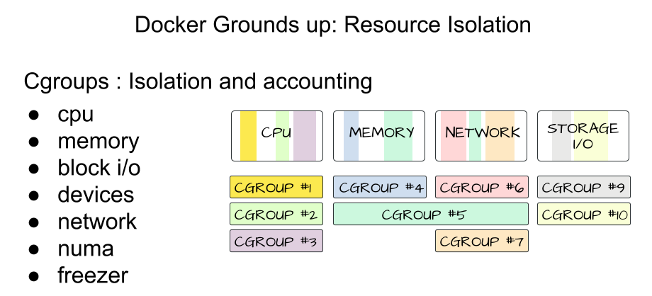

<!-- START doctoc generated TOC please keep comment here to allow auto update -->
<!-- DON'T EDIT THIS SECTION, INSTEAD RE-RUN doctoc TO UPDATE -->
**Table of Contents**  *generated with [DocToc](https://github.com/thlorenz/doctoc)*

- [docker internals](#docker-internals)
  - [cgoups](#cgoups)
  - [namespace](#namespace)
- [docker completion](#docker-completion)
  - [OSX](#osx)
- [docker build](#docker-build)
- [docker run](#docker-run)
  - [run into dind](#run-into-dind)
  - [run to override ENTRYPOINT](#run-to-override-entrypoint)
  - [runtime options with memory, cpus, and gpus](#runtime-options-with-memory-cpus-and-gpus)
- [docker exec](#docker-exec)
  - [login docker container as root](#login-docker-container-as-root)
- [docker ps](#docker-ps)
  - [list without wrap](#list-without-wrap)
  - [filter](#filter)
  - [format](#format)
- [docker rmi](#docker-rmi)
- [docker rm](#docker-rm)

<!-- END doctoc generated TOC please keep comment here to allow auto update -->

> reference:
> - [Docker 学习笔记](https://blog.opskumu.com/docker.html)
> - [Understanding the Docker Internals](https://medium.com/@BeNitinAgarwal/understanding-the-docker-internals-7ccb052ce9fe)
> - [Ideas for a cgroups UI](https://mairin.wordpress.com/2011/05/13/ideas-for-a-cgroups-ui/)

## docker internals


### cgoups



### namespace


## docker completion
### OSX
```bash
bashComp="$(brew --prefix)/etc/bash_completion.d"
bashComp2="$(brew --prefix)/etc/profile.d/bash_completion.sh"
dApp="/Applications/Docker.app"
dmver='0.16.2'
gitcontent='https://raw.githubusercontent.com'
dm="${gitcontent}/docker/machine/v${dmver}/contrib/completion/bash/docker-machine.bash"
curlOpt='-x 127.0.0.1:1087 -fsSL'

brew install bash-completion@2
sudo curl ${curlOpt} ${dm} --output ${bashComp}/docker-machine.bash
for _i in docker.bash-completion docker-compose.bash-completion; do
  ln -s ${dApp}/Contents/Resources/etc/${_i} ${bashComp}/${_i}
done

cat > ~/.bash_profile << EOF
if command -v brew > /dev/null; then
  # bash-completion
  [ -f "${bashComp}" ] && export BASH_COMPLETION_COMPAT_DIR="${bashComp}" && source "${bashComp}";
  # bash-completion@2
  [ -f "${bashComp2}" ] && source "${bashComp2}";
fi
EOF

```
- result
  ```bash
  $ complete -p d
  complete -F _complete_alias d
  $ complete -p dls
  complete -F _complete_alias dls

  # others:
  $ complete -p k
  complete -F _complete_alias k
  $ complete -p git
  complete -o bashdefault -o default -o nospace -F __git_wrap__git_main git
  ```

## docker build
> [Best practices for writing Dockerfiles](https://docs.docker.com/develop/develop-images/dockerfile_best-practices/)
> [Create a base image](https://docs.docker.com/develop/develop-images/baseimages/)
> [Dockerfile reference](https://docs.docker.com/engine/reference/builder/#entrypoint)

```bash
$ docker build \
         --no-cache \
         --build-arg REPO=<private.registry.com> \
         --build-arg TAG=1.4-bionic \
         -t <private.registry.com>/devops/jnlp.bionic \
         -f devops-jnlp .
```

## docker run
### run into dind
```bash
$ docker run \
         --name "marslo" \
         --privileged \
         --rm \
         -it \
         -v /var/run/docker.sock:/var/run/docker.sock
         docker:dind

$ ubuntu@01acbffd94ec:~$ docker --version
Docker version 18.06.1-ce, build e68fc7a
```

### run to override ENTRYPOINT
```bash
$ docker run \
         --name marslo \
         -it \
         --entrypoint /bin/bash \
         docker:dind
```

### [runtime options with memory, cpus, and gpus](https://docs.docker.com/config/containers/resource_constraints/)
> reference:
> - [Docker容器CPU、memory资源限制](https://blog.csdn.net/czz1141979570/article/details/105980641/)
> - [Memory Resource Controller](https://www.kernel.org/doc/Documentation/cgroup-v1/memory.txt)
> - [CPU Accounting Controller](https://www.kernel.org/doc/Documentation/cgroup-v1/cpuacct.txt)
> - [CFS Bandwidth Control](https://www.kernel.org/doc/Documentation/scheduler/sched-bwc.txt)
> - [RedHat: 3.3. CPUACCT](https://access.redhat.com/documentation/en-us/red_hat_enterprise_linux/6/html/resource_management_guide/sec-cpuacct)
> - [RedHat: 3.4. CPUSET](https://access.redhat.com/documentation/en-us/red_hat_enterprise_linux/6/html/resource_management_guide/sec-cpuset)



> Brief summary of control files
> - `/sys/fs/cgroup/memory/docker/ID/memory.usage_in_bytes` : show current usage for memory
> - `/sys/fs/cgroup/memory/docker/ID/memory.limit_in_bytes` : set/show limit of memory usage
> - `/sys/fs/cgroup/cpuacct/docker/ID/cpuacct.usage` : show the total CPU time (in nanoseconds) consumed by all tasks in this cgroup
> - `/sys/fs/cgroup/cpuacct/docker/ID/cpuacct.stat` : show the user and system CPU time consumed by all tasks in this cgroup
> - `/sys/fs/cgroup/cpuacct/docker/ID/cpuacct.usage_percpu`: show the CPU time (in nanoseconds) consumed on each CPU by all tasks in this cgroup


- memory
  ```bash
  $ docker run \
           --name marslo \
           -it \
           --entrypoint /bin/bash \
           --memory=4G \
           --oom-kill-disable \         // optional
           docker:dind
  ```

- cpu
  ```bash
  $ docker run \
           --name marslo \
           -it \
           --entrypoint /bin/bash \
           --cpus="4" \
           docker:dind
  ```


## docker exec
### login docker container as root
```bash
$ docker run -d <image>:<tag>
$ docker exec --privileged -u root -it <image-id> /bin/bash
```

## docker ps
### list without wrap
```bash
$ docker ps -a --no-trunc
```

[or](https://github.com/moby/moby/issues/40405#issuecomment-578066973)
```bash
$ curl --unix-socket /var/run/docker.sock 'http://localhost/containers/json'
```

- i.e.:
  ```bash
  $ docker ps -a --no-trunc --filter name=marslo*
  ```

#### [list full container id](https://forums.docker.com/t/how-to-get-a-full-id-of-a-certain-container/2418)
```bash
$ docker ps -aq --no-trunc
```

- [or](https://forums.docker.com/t/how-to-get-a-full-id-of-a-certain-container/2418/3)
  
  ```bash
  $ docker inspect --format="{{.Id}}" d40df87b2f87
  d40df87b2f87261152d2541b870c6b801c031f8df969e4bd3e9b3c607e6c1698
  ```
  

### [filter](https://docs.docker.com/engine/reference/commandline/ps/#filtering)
- filter with image
  ```bash
  $ docker ps -a --no-trunc --filter ancestor='busybox:latest'
  ```
- filter with exit code
  ```bash
  $ docker ps -a --filter 'exited=0'
  ```
- filter with status
  ```bash
  $ docker ps --filter status=running
  ```
- filter with tag
  ```bash
  $ docker images --filter "reference=*/*/*/*:1.4-bionic-dind"
  ```

### [format](https://docs.docker.com/engine/reference/commandline/ps/#formatting)
- id and command

  
  ```bash
  $ docker ps --no-trunc --format "{{.ID}}: {{.Command}}"
  ```
  

- id, image and commands

  
  ```bash
  $ docker ps --no-trunc --format "{{.ID}}: {{.Command}}: {{.Image}}"
  ```
  

- [log path](https://stackoverflow.com/a/41147654/2940319)
  > [HOW TO REDIRECT DOCKER LOGS TO A SINGLE FILE](https://www.scalyr.com/blog/how-to-redirect-docker-logs-to-a-single-file)

  
  ```bash
  $ docker inspect --format='{{.LogPath}}' containername
  ```
  

- [with table](https://stackoverflow.com/q/34748747/2940319)
  
  ```bash
  $ docker ps --format "table {{.Image}}\t{{.Names}}\t{{.Ports}}\t{{.Status}}"
  ```
  

## docker rmi
- remove via docker image
  
  ```bash
  $ docker rmi -f $(docker images "*/*/*/myimage" --format "{{.ID}}")
  ```
  

  - or
    
    ```bash
    $ docker images "*/*/*/myimage" --format "{{.ID}}" | xargs docker rmi -f
    ```
    

- [remove `<none>` tag images](https://stackoverflow.com/a/33913711/2940319)
  ```bash
  $ docker images -q -f "dangling=true" | xargs docker rmi -f --no-trunc
  ```

  [or](https://stackoverflow.com/a/59933159/2940319)
  ```bash
  $ docker image prune --filter="dangling=true"
  ```

## docker rm
- [remove all stopped container](https://stackoverflow.com/a/61866643/2940319)
  
  ```bash
  $ docker ps --filter "status=exited" --format '{{.ID}}' | xargs docker rm -f
  ```
  
  - or
    ```bash
    $ docker rm $(docker ps -aq --filter "status=exited")
    ```
