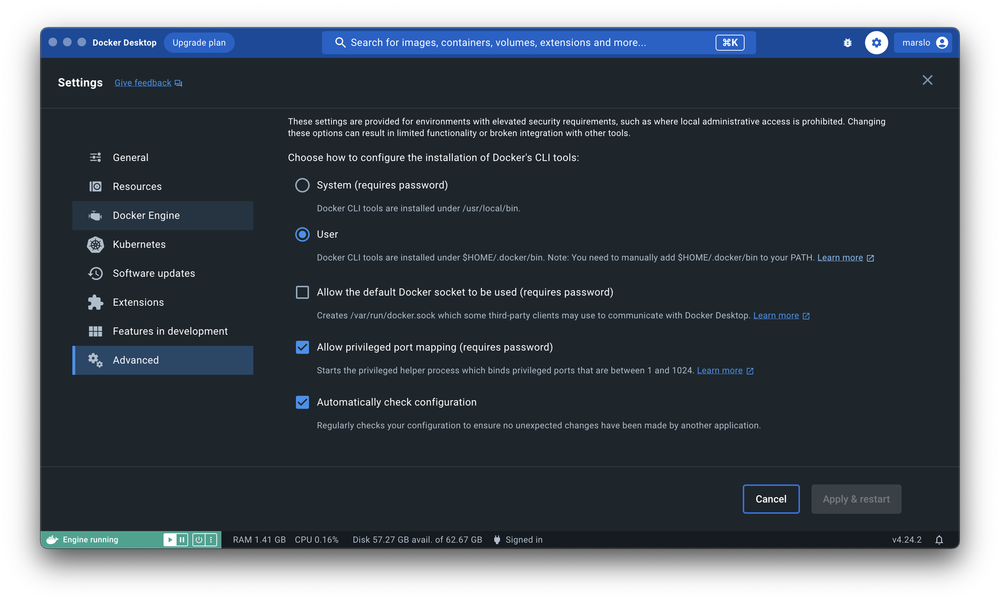

<!-- START doctoc generated TOC please keep comment here to allow auto update -->
<!-- DON'T EDIT THIS SECTION, INSTEAD RE-RUN doctoc TO UPDATE -->

- [docker with proxy](#docker-with-proxy)
  - [docker pull](#docker-pull)
  - [docker build](#docker-build)
  - [docker build with GPG key proxy](#docker-build-with-gpg-key-proxy)
- [docker for osx](#docker-for-osx)
  - [`docker: command cannot be found`](#docker-command-cannot-be-found)
- [command-line auto completion](#command-line-auto-completion)
  - [Linux](#linux)
  - [osx](#osx)
- [others](#others)
- [complete alias](#complete-alias)
- [get tags](#get-tags)
  - [from artifactory](#from-artifactory)
  - [from docker hub](#from-docker-hub)
- [run inside windows docker image](#run-inside-windows-docker-image)
  - [add contents](#add-contents)
  - [get contents](#get-contents)
  - [list item](#list-item)
  - [execute](#execute)

<!-- END doctoc generated TOC please keep comment here to allow auto update -->

## docker with proxy
### [docker pull](https://www.thegeekdiary.com/how-to-configure-docker-to-use-proxy/)
```bash
$ sudo mkdir -p /etc/systemd/system/docker.service.d
$ cat /etc/systemd/system/docker.service.d/http-proxy.conf
[Service]
Environment="HTTPS_PROXY=http://sample.proxy.com:80"
Environment="HTTP_PROXY=http://sample.proxy.com:80"
Environment="ALL_PROXY=http://sample.proxy.com:80"
systemctl daemon-reload;systemctl start docker

$ sudo systemctl daemon-reload
$ sudo systemctl restart docker

# verify
$ systemctl show docker --property Environment
Environment=HTTPS_PROXY=http://sample.proxy.com:80 HTTP_PROXY=http://sample.proxy.com:80 ALL_PROXY=http://sample.proxy.com:80
```

- for socks5
  ```bash
  $ [ ! -d /etc/systemd/system/docker.service.d ] && sudo mkdir -p /etc/systemd/system/docker.service.d
  $ sudo bash -c "cat > /etc/systemd/system/docker.service.d/socks5-proxy.conf" << EOF
  [Service]
  Environment="ALL_PROXY=socks5://sample.proxy.com:80"
  Environment="NO_PROXY=localhost,127.0.0.1,130.147.0.0/16,130.145.0.0/16"
  EOF

  $ sudo systemctl daemon-reload
  $ sudo systemctl enable docker.service
  $ sudo systemctl restart docker.service
  ```

- [or](https://docs.docker.com/config/daemon/systemd/)
  ```bash
  # for rootless mode
  $ mkdir -p ~/.config/systemd/user/docker.service.d/
  # or regular mode
  $ sudo mkdir -p /etc/systemd/system/docker.service.d

  $ sudo bash -c "cat > /etc/systemd/system/docker.service.d" << EOF
  [Service]
  Environment="HTTP_PROXY=http://sample.proxy.com:80"
  Environment="HTTPS_PROXY=https://sample.proxy.com:443"
  Environment="NO_PROXY=localhost,127.0.0.1,sample.docker-registry.com,.corp"
  EOF

  $ sudo systemctl daemon-reload
  $ sudo systemctl restart docker

  # verify
  $ systemctl show docker --property Environment
  Environment=HTTP_PROXY=http://sample.proxy.com:80 HTTPS_PROXY=http://sample.proxy.com:443 NO_PROXY=localhost,127.0.0.1,sample.docker-registry.com,.corp
  ```

### [docker build](https://docs.docker.com/network/proxy/)
```bash
$ mkdir -p ~/.docker
$ cat > ~/.docker/config.json << EFO
{
 "proxies":
 {
   "default":
   {
     "httpProxy": "http://sample.proxy.com:80",
     "httpsProxy": "http://sample.proxy.com:80",
     "allProxy": "http://sample.proxy.com:80",
     "noProxy": "*.sample.domain1.com,.domain2.com,127.0.0.0/8"
   }
 }
}
EOF
```

- or via [`--build-arg`](https://dev.to/zyfa/setup-the-proxy-for-dockerfile-building--4jc8):
  ```bash
  $ docker build \
           --build-arg http_proxy=http://sample.proxy.com:80 \
           --build-arg https_proxy=http://sample.proxy.com:443 \
          .
  ```

- details

  |   VARIABLE  | DOCKERFILE EXAMPLE                               | DOCKER RUN EXAMPLE                                             |
  |:-----------:|:-------------------------------------------------|----------------------------------------------------------------|
  |  HTTP_PROXY | ENV HTTP_PROXY="http://sample.proxy.com:80"      | --env HTTP_PROXY="http://sample.proxy.com:80"                  |
  | HTTPS_PROXY | ENV HTTPS_PROXY="https://sample.proxy.com:80"    | --env HTTPS_PROXY="https://sample.proxy.com:80"                |
  |  FTP_PROXY  | ENV FTP_PROXY="ftp://sample.proxy.com:80"        | --env FTP_PROXY="ftp://sample.proxy.com:80"                    |
  |   NO_PROXY  | ENV NO_PROXY="*.sample.domain1.com,.domain2.com" | --env NO_PROXY="*.sample.domain1.com,.domain2.com,127.0.0.0/8" |


### docker build with GPG key proxy
- without proxy
  ```docker
  ...
  gpg --batch \
      --keyserver https://keyserver.ubuntu.com:80 \
      --recv-keys 3FA7E0328081BFF6A14DA29AA6A19B38D3D831E
  ...

  # result
  gpg: keyserver receive failed: Connection timed out
  ```

- GPG with proxy
  ```docker
  ...
  apt-key adv --keyserver-options http-proxy=http://sample.proxy.com:80 \
              --keyserver hkp://keyserver.ubuntu.com:80 \
              --recv-keys 3FA7E0328081BFF6A14DA29AA6A19B38D3D831EF \
  ...

  # result
  Executing: /tmp/apt-key-gpghome.uegAG54mKu/gpg.1.sh --keyserver-options http-proxy=http://sample.proxy.com:80 --keyserver hkp://keyserver.ubuntu.com:80 --recv-keys 3FA7E0328081BFF6A14DA29AA6A19B38D3D831EF
  gpg: key A6A19B38D3D831EF: 2 signatures not checked due to missing keys
  gpg: key A6A19B38D3D831EF: public key "Xamarin Public Jenkins (auto-signing) <releng@xamarin.com>" imported
  gpg: Total number processed: 1
  gpg:               imported: 1
  gpg: keybox '/tmp/tmp.jad0qVCQ6v/pubring.kbx' created
  gpg: WARNING: nothing exported
  Warning: apt-key output should not be parsed (stdout is not a terminal)
  ```

## docker for osx

> [!TIP|label:references:]
> - [#6793: Docker not found when freshly installed on Mac](https://github.com/docker/for-mac/issues/6793)
> - [Installing symlinks](https://docs.docker.com/desktop/mac/permission-requirements/#installing-symlinks)

### `docker: command cannot be found`



- using user
  ```bash
  $ export $HOME/.docker/bin:$PATH
  ```

- using system
  ```bash
  $ ln -sf $HOME/.docker/bin/docker /usr/local/bin/docker
  # or
  $ ln -s /Applications/Docker.app/Contents/Resources/bin/docker /usr/local/bin/docker

  $ sudo ln -s -f $HOME/.docker/run/docker.sock /var/run/docker.sock
  ```

  - modify `~/.docker/config.json` if necessary
    ```diff
    {
            "auths": {},
    -        "credsStore": "desktop",
    +        "credStore": "desktop",
            "currentContext": "desktop-linux"
    }
    ```

## command-line auto completion

> [!TIP]
> reference:
> - [Enable Docker command-line auto completion in bash on Centos/Ubuntu](https://ismailyenigul.medium.com/enable-docker-command-line-auto-completion-in-bash-on-centos-ubuntu-5f1ac999a8a6)
> - [completion/bash/docker](https://github.com/docker/docker-ce/blob/master/components/cli/contrib/completion/bash/docker)
> - [Perform tab-completion for aliases in Bash](https://brbsix.github.io/2015/11/23/perform-tab-completion-for-aliases-in-bash/)

### Linux
```bash
$ dpkg -L docker-ce-cli | grep completion
/usr/share/bash-completion
/usr/share/bash-completion/completions
/usr/share/bash-completion/completions/docker
/usr/share/fish/vendor_completions.d
/usr/share/fish/vendor_completions.d/docker.fish
/usr/share/zsh/vendor-completions
/usr/share/zsh/vendor-completions/_docker
```
- rpm
  ```bash
  $ rpm -ql docker-ce | grep completion
  /usr/share/bash-completion/completions/docker
  /usr/share/fish/vendor_completions.d/docker.fish
  /usr/share/zsh/vendor-completions/_docker
  ```

#### setup in bashrc
```bash
source /usr/share/bash-completion/completions/docker
alias d='docker'
alias dp='docker ps'

while read -r _i; do
  complete -F _docker "${_i}"
done < <(alias | grep docker | sed '/^alias /!d;s/^alias //;s/=.*$//')
```

- more info
  ```bash
  $ source /usr/share/bash-completion/completions/docker
  $ type _docker | head
  _docker is a function
  _docker ()
  {
    local previous_extglob_setting=$(shopt -p extglob);
    shopt -s extglob;
  }
  ```

### [osx](https://gist.github.com/rkuzsma/4f8c1354a9ea67fb3ca915b50e131d1c)
```bash
$ la '/Applications/Docker.app/Contents/Resources/etc'
total 332K
-rwxr-xr-x 1 marslo admin 124K Nov  9 21:50 docker.zsh-completion
-rwxr-xr-x 1 marslo admin  51K Nov  9 21:50 docker.fish-completion
-rwxr-xr-x 1 marslo admin 114K Nov  9 21:50 docker.bash-completion
-rw-r--r-- 1 marslo admin  18K Nov  9 21:50 docker-compose.zsh-completion
-rw-r--r-- 1 marslo admin 1.7K Nov  9 21:50 docker-compose.fish-completion
-rwxr-xr-x 1 marslo admin  13K Nov  9 21:50 docker-compose.bash-completion

$ ln -sf '/Applications/Docker.app/Contents/Resources/etc/docker.bash-completion' $(brew --prefix)/etc/bash_completion.d/docker
$ ln -sf '/Applications/Docker.app/Contents/Resources/etc/docker-compose.bash-completion' $(brew --prefix)/etc/bash_completion.d/docker-compose
```

- setup in bashrc

  
  ```bash
  dockerComp="$(brew --prefix)/etc/bash_completion.d/docker"
  dockerComposeComp="$(brew --prefix)/etc/bash_completion.d/docker-compose"
  [ -f "${dockerComp}" ] && source "${dockerComp}"
  [ -f "${dockerComposeComp}" ] && source "${dockerComposeComp}"

  alias d='docker'
  alias dp='docker ps'
  alias dls='docker ps -l -q'
  alias dps='docker ps -l -a'
  alias di='docker images'
  alias dip="docker inspect --format '{{ .NetworkSettings.IPAddress }}'"

  while read -r _i; do
    complete -F _docker "${_i}"
  done < <(alias | grep docker | sed '/^alias /!d;s/^alias //;s/=.*$//')
  ```
  

## [others](https://stackoverflow.com/a/15859036/2940319)
- `_completion_loader`
  ```bash
  _completion_loader()
  {
    . "/etc/bash_completion.d/$1.sh" >/dev/null 2>&1 && return 124
  }
  complete -D -F _completion_loader
  ```

## [complete alias](https://github.com/cykerway/complete-alias)
```bash
# for Linux
$ sudo curl -sSLg https://raw.githubusercontent.com/cykerway/complete-alias/master/complete_alias \
            -o /etc/bash_completion.d/complete_alias

# for osx
$ sudo curl -sSLg https://raw.githubusercontent.com/cykerway/complete-alias/master/complete_alias \
            -o $(brew --prefix)/etc/bash_completion.d/complete_alias
```

- setup in bash
  ```bash
  source /etc/bash_completion.d/complete_alias
  #
  source $(brew --prefix)/etc/bash_completion.d/complete_alias

  while read -r _i; do
    complete -F _complete_alias "${_i}"
  done < <(alias | grep -E 'docker|kubectl' | sed '/^alias /!d;s/^alias //;s/=.*$//')
  ```

## get tags
### [from artifactory](https://www.jfrog.com/confluence/display/JFROG/Docker+Registry#DockerRegistry-ListingDockerImages)

- [list repos](https://www.jfrog.com/confluence/display/JFROG/Artifactory+REST+API#ArtifactoryRESTAPI-ListDockerRepositories)
  > example: the docker registry in artifactory named `docker`

```bash
$ curl -sS https://my.artifactory.com/v2/docker/_catalog |
       jq -r .repositories[]
```
- or
  ```bash
  $ curl -sS -X GET https://my.artifactory.com/artifactory/api/docker/docker/v2/_catalog |
         jq -r .repositories[]
  ```

- [list tags](https://www.jfrog.com/confluence/display/JFROG/Artifactory+REST+API#ArtifactoryRESTAPI-ListDockerTags)
  > example: get tags from repo `devops/ubuntu`

```bash
$ curl -sS https://my.artifactory.com/artifactory/v2/docker/devops/ubuntu/tags/list [ | jq -r .tags[] ]
```
- or
  ```bash
  $ curl -sS -X GET https://my.artifactory.com/artifactory/api/docker/docker/v2/devops/ubuntu/tags/list
  ```

### from docker hub
```bash
$ curl -sS 'https://hub.docker.com/v2/repositories/jenkins/jenkins/tags' |
       jq --raw-output .results[].name

jdk8-openj9-windowsservercore-1809
jdk11-hotspot-windowsservercore-1809
jdk11-openj9-windowsservercore-1809
windowsservercore-1809
jdk8-hotspot-windowsservercore-1809
2.249.3-lts-centos7
lts-centos7
centos7
2.249.3-lts-centos
lts-centos
```

- [get more](https://forums.docker.com/t/fetching-docker-image-tags-with-created-time-and-digest/85357)
  ```bash
  $ curl -sS 'https://hub.docker.com/v2/repositories/jenkins/jenkins/tags?page_size=100&ordering=last_updated' |
         jq --raw-output .results[].name |
         sort
  ```
  - or
    ```bash
    $ curl -sS https://hub.docker.com/v2/repositories/jenkins/jenkins/tags?page=2 |
           jq '."results"[]["name"]' |
           sort
    ```

#### simple script for get tags
```bash
#!/bin/sh
#
# Simple script that will display docker repository tags.
#
# Usage:
#   $ docker-show-repo-tags.sh ubuntu centos

for _r in $* ; do
  curl -sS "https://registry.hub.docker.com/v2/repositories/library/$_r/tags/" |
       sed -e 's/,/,\n/g' -e 's/\[/\[\n/g' |
       grep '"name"' |
       awk -F\" '{print $4;}' |
       sort -fu |
       sed -e "s/^/${_r}:/"
done
```

#### get current container ID
```bash
$ basename $(cat /proc/self/cpuset)
ab8c1732f1a3fdb46b9f9a477f0fbcc1d23c6787d7532648242a76d6eb1e8b84
```
- or
  ```bash
  $ hostname
  ab8c1732f1a3
  ```

#### [get volume from container ID](https://stackoverflow.com/a/30133768/2940319)

```bash
$ docker inspect -f '{{ .Mounts }}' <container ID>
```


- or
  ```bash
  $ docker inspect <container ID> |
           grep volume
  ```

- [or get all](https://stackoverflow.com/a/63448756/2940319)
  
  ```bash
  $ docker ps -a --no-trunc --format "{{.ID}}\t{{.Names}}\t{{.Mounts}}"
  ```
  

- [or](https://stackoverflow.com/a/62285540/2940319)
  ```bash
  $ docker inspect <container ID> |
           jq --raw-output .[].Mounts
  ```
- [or](https://stackoverflow.com/a/47014770/2940319)
  
  ```bash
  $ docker ps -q |
           xargs docker container inspect -f '{{ .Name }} {{ .HostConfig.Binds }}'
  ```
  


#### mount volume in DinD
> reference:
> - [Mounting Volumes in Sibling Containers with Gitlab CI](https://medium.com/@patrick.winters/mounting-volumes-in-sibling-containers-with-gitlab-ci-534e5edc4035)
> - [Mount volumes from container (--volumes-from)](https://docs.docker.com/engine/reference/commandline/run/#mount-volumes-from-container---volumes-from)
> - [Kubernetes emptyDir is not the same as Docker's volumes-from](https://www.fairwinds.com/blog/kubernetes-emptydir-not-the-same-as-dockers-volumes-from)

```bash
$ cid=$(basename $(cat /proc/self/cpuset))
$ VOLUME_OPTION="--volumes-from ${cid}:rw"
$ docker run <...> ${VOLUME_OPTION}
```

## run inside windows docker image
### add contents
```powershell
> docker exec [-w 'C:\workspace'] <docker-id> powershell "Set-Content -Path '_cmd.ps1' -Value 'python --version'"
```

- for multiple line contents
  ```powershell
  > docker exec [-w 'C:\workspace'] <docker-id>' powershell "Set-Content -Path .\test.py -Value '# content of test_sample.py
  >> def func(x):
  >>     return x + 1
  >>
  >>
  >> def test_answer():
  >>     assert func(4) == 5'"
  ```

### get contents
```powershell
> docker exec [-w 'C:\workspace'] <docker-id> powershell "Get-Content '_cmd.ps1'"
```

- equivalent `tail -f`
  ```powershell
  > docker exec [-w 'C:\workspace'] <docker-id> powershell "Get-Content '_cmd.ps1' -Wait"
  ```

- equivalent `tail -10`
  ```powershell
  > docker exec [-w 'C:\workspace'] <docker-id> powershell "Get-Content '_cmd.ps1' -Tail 10"
  ```

### list item
```powershell
> docker exec [-w 'C:\workspace'] <docker-id> powershell Get-ChildItem .
> docker exec [-w 'C:\workspace'] <docker-id> powershell Get-ChildItem ..\
```

### execute
```powershell
> docker exec [-w 'C:\workspace'] <docker-id> powershell .\_cmd.ps1

# or
> docker exec [-w 'C:\workspace'] <docker-id> powershell "Invoke-Expression '.\_cmd.ps1' > log.txt"

# or redirect via `Out-File`
> docker exec [-w 'C:\workspace'] <docker-id> powershell "Invoke-Expression '.\_cmd.ps1' | Out-File -FilePath log.txt"
```
