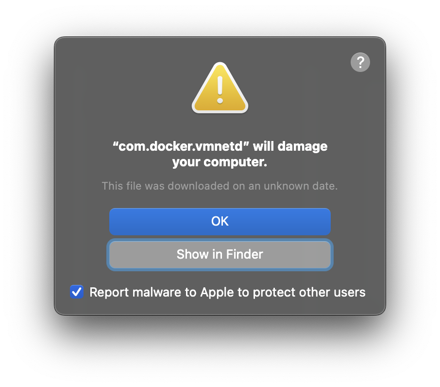
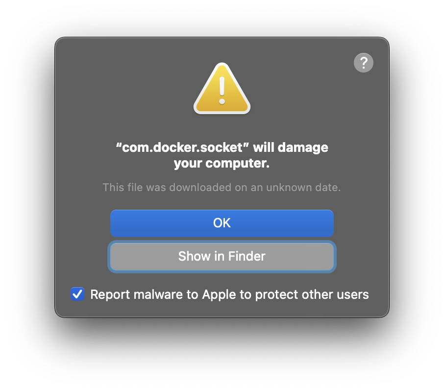

<!-- START doctoc generated TOC please keep comment here to allow auto update -->
<!-- DON'T EDIT THIS SECTION, INSTEAD RE-RUN doctoc TO UPDATE -->

- [troubleshooting](#troubleshooting)
  - [`permission denied while trying to connect to the Docker daemon socket`](#permission-denied-while-trying-to-connect-to-the-docker-daemon-socket)
  - [Malware Blocked - 'com.docker.vmnetd'](#malware-blocked---comdockervmnetd)

<!-- END doctoc generated TOC please keep comment here to allow auto update -->

> [!NOTE|label:references:]
> - [Troubleshoot topics for Docker Desktop](https://docs.docker.com/desktop/troubleshoot-and-support/troubleshoot/topics/)
> - [Troubleshoot Docker Desktop](https://docs.docker.com/desktop/troubleshoot-and-support/troubleshoot/)
> - osx:
>   - [Incompatible CPU detected](https://docs.docker.com/desktop/troubleshoot-and-support/troubleshoot/topics/#incompatible-cpu-detected)
>   - [VPNKit keeps breaking](https://docs.docker.com/desktop/troubleshoot-and-support/troubleshoot/topics/#vpnkit-keeps-breaking)
> - [windows](https://docs.docker.com/desktop/troubleshoot-and-support/troubleshoot/topics/#topics-for-windows)

## troubleshooting

```bash
# -- osx --
$ /Applications/Docker.app/Contents/MacOS/com.docker.diagnose
# create and upload the diagnostics id
$ /Applications/Docker.app/Contents/MacOS/com.docker.diagnose gather -upload
# self diagnose
$ /Applications/Docker.app/Contents/MacOS/com.docker.diagnose check
# check log
$ pred='process matches ".*(ocker|vpnkit).*" || (process in {"taskgated-helper", "launchservicesd", "kernel"} && eventMessage contains[c] "docker")'
$ /usr/bin/log stream --style syslog --level=debug --color=always --predicate "$pred"

# -- linux --
$ /opt/docker-desktop/bin/com.docker.diagnose
# create and upload the diagnostics id
$ /opt/docker-desktop/bin/com.docker.diagnose gather -upload
# self diagnose
$ /opt/docker-desktop/bin/com.docker.diagnose check
# check log
$ journalctl --user --unit=docker-desktop

# -- windows --
> C:\Program Files\Docker\Docker\resources\com.docker.diagnose.exe
# create and upload the diagnostics id
> & "C:\Program Files\Docker\Docker\resources\com.docker.diagnose.exe" gather -upload
> Expand-Archive -LiteralPath "%TEMP%\5DE9978A-3848-429E-8776-950FC869186F\20230607101602.zip" -DestinationPath "%TEMP%\5DE9978A-3848-429E-8776-950FC869186F\20230607101602"
# self diagnose
> & "C:\Program Files\Docker\Docker\resources\com.docker.diagnose.exe" check
# check log
> code $Env:LOCALAPPDATA\Docker\log
```

### `permission denied while trying to connect to the Docker daemon socket`

> [!NOTE|label:see also:]
> - [* imarslo: linux/system/change group](../../linux/system.html#modify-group)

- issue shows even if the account exists in `docker` group
  ```bash
  # account already been added in `docker` group
  $ id marslo
  uid=1100(marslo) gid=1100(marslo) groups=1100(marslo),994(docker)
  $ docker ps
  permission denied while trying to connect to the Docker daemon socket at unix:///var/run/docker.sock: Get "http://%2Fvar%2Frun%2Fdocker.sock/v1.44/containers/json": dial unix /var/run/docker.sock: connect: permission denied

  # group info
  $ getent group docker
  docker:x:994:devops,marslo
  $ getent group 994
  docker:x:994:devops,marslo

  # remote
  $ sudo gpasswd -d marslo docker
  Removing user marslo from group docker
  $ id marslo
  uid=1100(marslo) gid=1100(marslo) groups=1100(marslo)

  # re-added
  $ sudo usermod -aG docker marslo
  $ id marslo
  uid=1100(marslo) gid=1100(marslo) groups=1100(marslo),994(docker)
  $ docker ps
  permission denied while trying to connect to the Docker daemon socket at unix:///var/run/docker.sock: Get "http://%2Fvar%2Frun%2Fdocker.sock/v1.44/containers/json": dial unix /var/run/docker.sock: connect: permission denied
  ```

- root cause
  ```bash
  # docker group-id was 990, and it was changed to 994; but the `/var/run/docker.sock` wasn't been changed
  $ ls -asltrh /var/run/docker.sock
  0 srw-rw---- 1 root redwillow 0 Mar  7 15:27 /var/run/docker.sock
  ```

- solution
  ```bash
  $ sudo chown -R root:docker /var/run/docker.sock
  $ docker ps
  CONTAINER ID   IMAGE     COMMAND   CREATED   STATUS    PORTS     NAMES

  # to change all after GID changed
  $ find / -gid OLD_GID ! -type l -exec chgrp NEW_GID {} \;
  ```

### Malware Blocked - 'com.docker.vmnetd'

> [!NOTE|label:references:]
> - [#7520 - [Workaround in description] Mac is detecting Docker as a malware and keeping it from starting](https://github.com/docker/for-mac/issues/7520)
> - [Malware Blocked: “com.docker.vmnetd” was not opened because it contains malware](https://forums.docker.com/t/malware-blocked-com-docker-vmnetd-was-not-opened-because-it-contains-malware/145930)
> - [Incident Update: Docker Desktop for Mac](https://www.docker.com/blog/incident-update-docker-desktop-for-mac/)




- status
  ```bash
  $ sha256sum /Library/PrivilegedHelperTools/com.docker.vmnetd
  bed1a0468de21d1189ab560fbfcd3432b396143c067831e096553057401fac67  /Library/PrivilegedHelperTools/com.docker.vmnetd
  ```

- workaround
  ```bash
  #!/bin/bash

  # Stop the docker services
  echo "Stopping Docker..."
  sudo pkill '[dD]ocker'

  # Stop the vmnetd service
  echo "Stopping com.docker.vmnetd service..."
  sudo launchctl bootout system /Library/LaunchDaemons/com.docker.vmnetd.plist

  # Stop the socket service
  echo "Stopping com.docker.socket service..."
  sudo launchctl bootout system /Library/LaunchDaemons/com.docker.socket.plist

  # Remove vmnetd binary
  echo "Removing com.docker.vmnetd binary..."
  sudo rm -f /Library/PrivilegedHelperTools/com.docker.vmnetd

  # Remove socket binary
  echo "Removing com.docker.socket binary..."
  sudo rm -f /Library/PrivilegedHelperTools/com.docker.socket

  # Install new binaries
  echo "Install new binaries..."
  sudo cp /Applications/Docker.app/Contents/Library/LaunchServices/com.docker.vmnetd /Library/PrivilegedHelperTools/
  sudo cp /Applications/Docker.app/Contents/MacOS/com.docker.socket /Library/PrivilegedHelperTools/
  ```

  - result
    ```bash
    $ sudo sha256sum /Library/PrivilegedHelperTools/com.docker.*
    ec9c5cbef5bf903e17569393cabe452499370b5ec89bdd819054806e20a0dca1  /Library/PrivilegedHelperTools/com.docker.socket
    be868fea1cf597f45ecc1892564ccac333c79c94d0c49f26c28fc7931bede017  /Library/PrivilegedHelperTools/com.docker.vmnetd
    ```

- solution

  > [!NOTE|label:references:]
  > - [Uninstall Docker Desktop](https://docs.docker.com/desktop/uninstall/)

  - remove docker desktop
    ```bash
    $ /Applications/Docker.app/Contents/MacOS/uninstall
    Password:
    Uninstalling Docker Desktop...
    Error: unlinkat /Users/<USER_HOME>/Library/Containers/com.docker.docker/.com.apple.containermanagerd.metadata.plist: operation not permitted

    $ rm -rf ~/Library/Group\ Containers/group.com.docker
    $ rm -rf ~/.docker
    ```

  - re-intall docker desktop
    ```bash
    $ sudo hdiutil attach Docker.dmg
    $ sudo /Volumes/Docker/Docker.app/Contents/MacOS/install
    $ sudo hdiutil detach /Volumes/Docker
    ```
