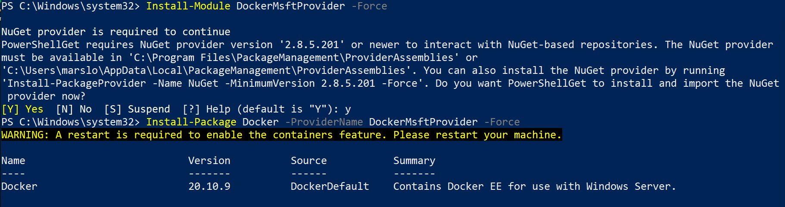
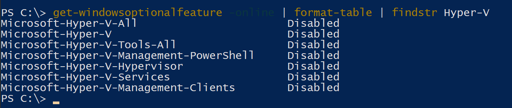

<!-- START doctoc generated TOC please keep comment here to allow auto update -->
<!-- DON'T EDIT THIS SECTION, INSTEAD RE-RUN doctoc TO UPDATE -->

- [docker-ee](#docker-ee)
  - [install](#install)
  - [upgrade](#upgrade)
  - [uninstall](#uninstall)
  - [remote access](#remote-access)
  - [exec commands](#exec-commands)
- [tricky](#tricky)
  - [running linux container in windows server](#running-linux-container-in-windows-server)
  - [FIPS 140-2 cryptographic module support](#fips-140-2-cryptographic-module-support)
  - [manual install docker-ee](#manual-install-docker-ee)
  - [DockerMsftIndex.json](#dockermsftindexjson)
- [dockerfile](#dockerfile)
- [Hyper-V](#hyper-v)
  - [install](#install-1)
  - [Windows Docker Container Hyper-V Isolation](#windows-docker-container-hyper-v-isolation)
  - [create a virtual machine with powershell by Hyper-V](#create-a-virtual-machine-with-powershell-by-hyper-v)
- [troubleshooting](#troubleshooting)
  - [could not read CA certificate](#could-not-read-ca-certificate)

<!-- END doctoc generated TOC please keep comment here to allow auto update -->


> references:
> - [Support policy for Windows Server containers in on-premises scenarios](https://docs.microsoft.com/en-us/troubleshoot/windows-server/containers/support-for-windows-containers-docker-on-premises-scenarios)
> - [Windows container requirements](https://docs.microsoft.com/en-us/virtualization/windowscontainers/deploy-containers/system-requirements)
> - [Install Docker in Windows Server 2019](https://www.virtualizationhowto.com/2020/12/install-docker-in-windows-server-2019/)
> - [Docker PowerShell Scripts for Local Development](https://geoffhudik.com/tech/2019/05/27/docker-powershell-scripts-for-local-development/)
>   - [* docker-restart-attempt.ps1](https://gist.github.com/thnk2wn/32ce1ad47882bd5b1c43e19cbf8f37f4)
>   - [docker-cloud-config-start.ps1](https://gist.github.com/thnk2wn/3222627b1cb3796c70277e7edda4a036)
>   - [run-prep.ps1](https://gist.github.com/thnk2wn/32e8bb9c68857a4b05183a33f43e2846)
>   - [docker-mysql-start.ps1](https://gist.github.com/thnk2wn/85a599be930c7bca54fb3463f158a3a8)
>   - [docker-rabbitmq-start.ps1](https://gist.github.com/thnk2wn/4bdc9e7d42df50197b53485d880f2a83)
>   - [docker-redis-start.ps1](https://gist.github.com/thnk2wn/32ce1ad47882bd5b1c43e19cbf8f37f4)
>   - [eureka-start.ps1](https://gist.github.com/thnk2wn/ad1e1dbfa5c4c96d6ca59a72a00e45c9)
>   - [eureka-wait.ps1](https://gist.github.com/thnk2wn/5366a34a71c8fcfd5e3d14722dc02975)
>   - [zz_docker_install.ps1](https://gist.githubusercontent.com/thxCode/cd8ec26795a56eb120b57675f0c067cf/raw/10d748f604764aa337864941b99d79154cbc5fc2/zz_docker_install.ps1)
> - [* Remote Management of a Windows Docker Host](https://learn.microsoft.com/en-us/virtualization/windowscontainers/management/manage_remotehost)
> - [* slonopotamus/stevedore](https://github.com/slonopotamus/stevedore)


## docker-ee

> [!WARNING]
> - [OneGet/MicrosoftDockerProvider](https://github.com/OneGet/MicrosoftDockerProvider)
>   - [#65: [PROXY] Cannot find path 'C:\[..]\DockerMsftProvider\DockerDefault_DockerSearchIndex.json' because it does not exist.](https://github.com/OneGet/MicrosoftDockerProvider/issues/65)
> - [Important Update – Deprecation of Docker Virtual Machine Images Extended to 30 April 2023](https://techcommunity.microsoft.com/t5/containers/important-update-deprecation-of-docker-virtual-machine-images/ba-p/3646272)
>
> IMPORTANT - THIS PROVIDER IS NOW DEPRECATED
> <p>
> As of May 23rd 2023 the backing service for this provider has been shutdown. You can find alternative options at [Windows Container Documentation - Setup Environment](https://learn.microsoft.com/en-us/virtualization/windowscontainers/quick-start/set-up-environment?tabs=dockerce#windows-server-1).
> For more information on the deprecation please see the following blog posts: [Updates to the Windows Container Runtime support](https://techcommunity.microsoft.com/t5/containers/updates-to-the-windows-container-runtime-support/ba-p/2788799) [Reminder - Updates to Windows Container Runtime Support](https://techcommunity.microsoft.com/t5/containers/reminder-updates-to-windows-container-runtime-support/ba-p/3620989)

### install

> [!NOTE]
> references:
> - [* Install Docker Engine - Enterprise on Windows Servers](http://man.hubwiz.com/docset/Docker.docset/Contents/Resources/Documents/docs.docker.com/install/windows/docker-ee.html)
> - [Docker-EE installtion in windows server](https://computingforgeeks.com/how-to-run-docker-containers-on-windows-server-2019/)
> - [Get started: Prep Windows for containers](https://docs.microsoft.com/en-us/virtualization/windowscontainers/quick-start/set-up-environment?tabs=Windows-Server)
> - [Install Docker Enterprise Edition for Windows Server](https://docker-docs.netlify.app/install/windows/docker-ee/)
> - [basic settings: Docker Linux Container running on Windows Server 2019](https://mountainss.wordpress.com/2020/03/31/docker-linux-container-running-on-windows-server-2019-winserv-docker-containers/)
> - [Use a script to install docker-ee](https://docs.docker.com.zh.xy2401.com/v17.12/install/windows/docker-ee/#optional-make-sure-you-have-all-required-updates)
> - [Remote Management of a Windows Docker Host](https://docs.microsoft.com/en-us/virtualization/windowscontainers/management/manage_remotehost)
> - [* Windows Server 2019 - Docker Daemon](https://mpolinowski.github.io/docs/DevOps/Windows/2019-06-13--windows-server-2019-docker-daemon/2019-06-13/)
>   - [Downloading Docker Manually](https://mpolinowski.github.io/docs/DevOps/Windows/2019-06-13--windows-server-2019-docker-daemon/2019-06-13/#downloading-docker-manually)
> - [* iMarslo : powershell modules](../../cheatsheet/windows/powershell.html#modules)
> - [Index of win/static/stable/x86_64/](https://download.docker.com/win/static/stable/x86_64/)
> - [microsoft/Windows-Containers](https://github.com/microsoft/Windows-Containers)
>   - [install-docker-ce.ps1](https://raw.githubusercontent.com/microsoft/Windows-Containers/Main/helpful_tools/Install-DockerCE/install-docker-ce.ps1)
> - [* package/DockerMsftProvider](https://www.powershellgallery.com/api/v2/package/DockerMsftProvider)
> - [Difference between Docker from DockerProvider and DockerMsftProvider](https://stackoverflow.com/a/48231887/2940319)
>   - [DockerProvider](https://www.powershellgallery.com/packages/DockerProvider)
>   - [DockerMsftProvider](https://www.powershellgallery.com/packages/DockerMsftProvider)
> - [* Docker Engine on Windows](https://learn.microsoft.com/en-us/virtualization/windowscontainers/manage-docker/configure-docker-daemon)
> - [Docker Enterprise Documentation](https://docs.mirantis.com/containers/v3.0/)
> - [* How to install Docker on Windows 10 without Hyper-V](https://www.kauffmann.nl/2019/03/04/how-to-install-docker-on-windows-10-without-hyper-v/)

```powershell
# optioinal: https://github.com/OneGet/MicrosoftDockerProvider/issues/65#issuecomment-734284852
> [Net.ServicePointManager]::SecurityProtocol = [Net.SecurityProtocolType]::Tls12
> Install-PackageProvider -Name NuGet
> Install-Module DockerMsftProvider -Force
> Install-Package Docker -ProviderName DockerMsftProvider -Force

# or
> Install-Module -Name DockerMsftProvider -Repository PSGallery -Force
> Install-Package -Name docker -ProviderName DockerMsftProvider
> Restart-Computer -Force

# or
> Install-Module DockerMsftProvider -Force
> Install-Package Docker -ProviderName DockerMsftProvider -Force
> Restart-Computer
```



- install specific docker version
  ```powershell
  > Install-Package -Name docker -ProviderName DockerMsftProvider -Force -RequiredVersion 17.06.2-ee-5
  ```

- check
  ```powershell
  > Get-Package -Name Docker -ProviderName DockerMsftProvider
  Name                           Version          Source                           ProviderName
  ----                           -------          ------                           ------------
  docker                         19.03.5          DockerDefault                    DockerMsftProvider

  > Find-Package -Name Docker -ProviderName DockerMsftProvider
  Name                           Version          Source           Summary
  ----                           -------          ------           -------
  Docker                         20.10.9          DockerDefault    Contains docker-ee for use with Windows Server.
  ```

- [find package vis proxy](https://github.com/OneGet/MicrosoftDockerProvider/issues/65#issue-489747059)
  ```powershell
  > Find-Package -Name docker -ProviderName DockerMsftProvider  -Proxy http://squid.tls.renault.fr:911 -Verbose
  VERBOSE: Using the provider 'DockerMsftProvider' for searching packages.
  VERBOSE: Download size: 0.02MB
  VERBOSE: Free space on the drive: 199788.78MB
  VERBOSE: Downloading https://dockermsft.blob.core.windows.net/dockercontainer/DockerMsftIndex.json to C:\Users\Administrator\AppData\Local\Temp\DockerMsftProvider\DockerDefault_DockerSearchIndex.json
  VERBOSE: About to download
  VERBOSE: Finished downloading
  VERBOSE: Downloaded in 0 hours, 0 minutes, 0 seconds.

  Name                           Version          Source           Summary
  ----                           -------          ------           -------
  Docker                         19.03.1          DockerDefault    Contains Docker EE for use with Windows Server.
  ```

- check module and resource
  ```powershell
  > Get-PackageSource -ProviderName DockerMsftProvider
  Name                             ProviderName     IsTrusted  Location
  ----                             ------------     ---------  --------
  DockerDefault                    DockerMsftPro... False      https://go.microsoft.com/fwlink/?LinkID=825636&clcid=0x409

  > Get-Package -Name Docker -ProviderName DockerMsftProvider
  Name                           Version          Source                           ProviderName
  ----                           -------          ------                           ------------
  docker                         20.10.9          DockerDefault                    DockerMsftProvider

  # info: C:\Program Files\WindowsPowerShell\Modules\DockerMsftProvider\1.0.0.8
  > Get-InstalledModule -Name "DockerMsftProvider"
  Version    Name                                Repository           Description
  -------    ----                                ----------           -----------
  1.0.0.8    DockerMsftProvider                  PSGallery            PowerShell module with commands fo...
  ```

- update DockerMsftProvider
  ```powershell
  > Update-Module DockerMsftProvider
  ```

- upgrade to latest version
  ```powershell
  > Install-Package -Name Docker -ProviderName DockerMsftProvider -Update -Force
    Name                           Version          Source           Summary
    ----                           -------          ------           -------
    Docker                         20.10.9          DockerDefault    Contains Docker EE for use with Windows Server.
  > Get-Package -Name Docker -ProviderName DockerMsftProvider
    Name                           Version          Source                           ProviderName
    ----                           -------          ------                           ------------
    docker                         20.10.9          DockerDefault                    DockerMsftProvider
  > docker --version
    Docker version 20.10.9, build 591094d

  > Start-Service Docker
  ```

- or to particular version
  ```powershell
  > Install-Package -Name docker -ProviderName DockerMsftProvider -RequiredVersion 18.09 -Update -Force
  ```

- [uninstall](https://docs.microsoft.com/en-us/virtualization/windowscontainers/manage-docker/configure-docker-daemon)
  ```powershell
  # clean docker images and processes
  > docker swarm leave --force
  > docker rm -f $(docker ps --all --quiet)
  > docker system prune --all --volumes

  # uninstall
  > Uninstall-Package -Name docker -ProviderName DockerMsftProvider
  > Uninstall-Module -Name DockerMsftProvider

  # clean up the network and filesystem
  > Get-HNSNetwork | Remove-HNSNetwork
  > Remove-Item -Path "C:\ProgramData\Docker" -Recurse -Force

  # get package via
  > Get-PackageProvider -Name *Docker*
  ```

- [Clean up Docker data and system components](https://docs.microsoft.com/en-us/virtualization/windowscontainers/manage-docker/configure-docker-daemon#clean-up-docker-data-and-system-components)
  ```powershell
  > Get-HNSNetwork | Remove-HNSNetwork
  > Get-ContainerNetwork | Remove-ContainerNetwork
  > Remove-Item "C:\ProgramData\Docker" -Recurse

  # close Hyper-V
  > Remove-WindowsFeature Containers
  > Remove-WindowsFeature Hyper-V

  # reboot
  > Restart-Computer -Force
  ```

- [download docker manually](https://mpolinowski.github.io/docs/DevOps/Windows/2019-06-13--windows-server-2019-docker-daemon/2019-06-13/#downloading-docker-manually)

  > [!NOTE]
  > - [OneGet/MicrosoftDockerProvider](https://github.com/OneGet/MicrosoftDockerProvider)
  > - [Install Package Docker - Windows Server 2022 error](https://learn.microsoft.com/en-us/answers/questions/1324697/install-package-docker-windows-server-2022-error)
  > - [Using a script to install Docker EE](http://www.myclass5.cn/v17.03/docker-ee-for-windows/install/#using-a-script-to-install-docker-ee)
  > - [configure-docker-daemon.md](https://github.com/MicrosoftDocs/Virtualization-Documentation/blob/live/virtualization/windowscontainers/manage-docker/configure-docker-daemon.md)

  ```powershell
  # On an online machine, download the zip file.
  > Invoke-WebRequest -UseBasicParsing -OutFile docker-19.03.3.zip https://download.docker.com/components/engine/windows-server/19.03/docker-19.03.3.zip

  # Stop Docker service if eralier version of Docker is already installed
  > Stop-Service docker

  # Extract the archive.
  > Expand-Archive docker-19.03.3.zip -DestinationPath $Env:ProgramFiles -Force

  # Clean up the zip file.
  > Remove-Item -Force docker-19.03.3.zip

  # Install Docker. This requires rebooting.
  > $null = Install-WindowsFeature containers

  > Restart-Computer -Force

  # Add Docker to the path for the current session.
  > $env:path += ';$env:ProgramFiles\docker'

  # Optionally, modify PATH to persist across sessions.
  > $newPath = '$env:ProgramFiles\docker;' +
    [Environment]::GetEnvironmentVariable('PATH', [EnvironmentVariableTarget]::Machine)
    [Environment]::SetEnvironmentVariable('PATH', $newPath, [EnvironmentVariableTarget]::Machine)

  # Register the Docker daemon as a service.
  > dockerd --register-service

  # Start the Docker service.
  > Start-Service docker

  # verify
  > docker pull hello-world:nanoserver
  > docker images
  > docker container run hello-world:nanoserver
  ```

- pull and run windows image
  ```powershell
  > docker pull mcr.microsoft.com/dotnet/samples:dotnetapp-nanoserver-2009
  > docker run mcr.microsoft.com/dotnet/samples:dotnetapp-nanoserver-2009

  # or
  > docker pull mcr.microsoft.com/windows/servercore:ltsc2019
  ```

<!--sec data-title="Use a script to install docker-ee" data-id="section0" data-show=true data-collapse=true ces-->
```powershell
# inspired from http://man.hubwiz.com/docset/Docker.docset/Contents/Resources/Documents/docs.docker.com/install/windows/docker-ee.html

# On an online machine, download the zip file.
Invoke-WebRequest -UseBasicParsing -OutFile docker-18.09.5.zip https://download.docker.com/components/engine/windows-server/18.09/docker-18.09.5.zip
# Stop Docker service
Stop-Service docker

# Extract the archive.
Expand-Archive docker-18.09.5.zip -DestinationPath $Env:ProgramFiles -Force

# Clean up the zip file.
Remove-Item -Force docker-18.09.5.zip

# Install Docker. This requires rebooting.
$null = Install-WindowsFeature containers

# Add Docker to the path for the current session.
$env:path += ";$env:ProgramFiles\docker"

# Optionally, modify PATH to persist across sessions.
$newPath = "$env:ProgramFiles\docker;" +
[Environment]::GetEnvironmentVariable("PATH",
[EnvironmentVariableTarget]::Machine)

[Environment]::SetEnvironmentVariable("PATH", $newPath,
[EnvironmentVariableTarget]::Machine)

# Register the Docker daemon as a service.
dockerd --register-service

# Start the Docker service.
Start-Service docker
```
<!--endsec-->

- check

  > [!NOTE]
  > - [imarslo: stop service & process via powershell](../../cheatsheet/windows/windows.html#stop-service--process-via-powershell)
  > - [powershell : Get-Service](https://docs.microsoft.com/en-us/powershell/module/microsoft.powershell.management/get-service?view=powershell-7.2)

  ```powershell
  > Get-Process dockerd
  Handles  NPM(K)    PM(K)      WS(K)     CPU(s)     Id  SI ProcessName
  -------  ------    -----      -----     ------     --  -- -----------
      449      28   138348      45356       4.31  16192   0 dockerd

  > Get-NetTCPConnection -LocalPort 2376
  LocalAddress                        LocalPort RemoteAddress                       RemotePort State       AppliedSetting
  ------------                        --------- -------------                       ---------- -----       --------------
  ::                                  2376      ::                                  0          Listen
  # or
  > Get-NetTCPConnection -LocalPort 2376 -State Listen -ErrorVariable $err -ErrorAction SilentlyContinue

  > Get-Service Docker
  Status   Name               DisplayName
  ------   ----               -----------
  Running  Docker             Docker Engine
  ```

#### install a specific version
```powershell
> Install-Package -Name docker -ProviderName DockerMsftProvider -Force -RequiredVersion 18.09
...
Name                      Version               Source           Summary
----                      -------               ------           -------
Docker                    18.09                 Docker           Contains Docker Engine - Enterprise for use with Windows Server...
```

### upgrade
```powershell
> Install-Package -Name docker -ProviderName DockerMsftProvider -RequiredVersion 18.09 -Update -Force

# update module
> Update-Module DockerMsftProvider
```

### [uninstall](https://learn.microsoft.com/en-us/virtualization/windowscontainers/manage-docker/configure-docker-daemon#clean-up-docker-data-and-system-components)
```powershell
# Leave any active Docker Swarm
> docker swarm leave --force

# Remove all running and stopped containers
> docker rm -f $(docker ps --all --quiet)

# Prune container data
> docker system prune --all --volumes

# Uninstall Docker PowerShell Package and Module
> Uninstall-Package -Name docker -ProviderName DockerMsftProvider
> Uninstall-Module -Name DockerMsftProvider

# Clean up Windows Networking and file system
> Get-HNSNetwork | Remove-HNSNetwork
> Remove-Item -Path "C:\ProgramData\Docker" -Recurse -Force
```

### [remote access](https://learn.microsoft.com/en-us/virtualization/windowscontainers/management/manage_remotehost)

#### via `daemon.json`
```powershell
> $configfile = @"
{
  "tls": false,
  "hosts": ["tcp://0.0.0.0:2376", "npipe://"],
  "debug": true,
  "data-root": "E:\\docker_home",
  "storage-opts": []
}
"@

> $configfile | Out-File -FilePath C:\ProgramData\docker\config\daemon.json -Encoding ascii -Force
> Start-Service Docker

# or
> Restart-Service Docker
```

- verify
  ```powershell
  > docker info
  ...
  Docker Root Dir: E:\docker_home
  ...
  WARNING: API is accessible on http://0.0.0.0:2376 without encryption.
           Access to the remote API is equivalent to root access on the host. Refer
           to the 'Docker daemon attack surface' section in the documentation for
           more information: https://docs.docker.com/go/attack-surface/

  > docker -H tcp://localhost:2376 images
  REPOSITORY          TAG                    IMAGE ID       CREATED         SIZE
  hello-world         nanoserver             e33d37034c87   33 hours ago    258MB
  ```

#### via SSL

- allow inbound connections
  ```powershell
  > New-NetFirewallRule -DisplayName 'Docker SSL Inbound' -Profile @('Domain', 'Public', 'Private') -Direction Inbound -Action Allow -Protocol TCP -LocalPort 2376
  ```

- copy the files `ca.pem`, `cert.pem` and `key.pem` from your user's docker folder on your machine
  - e.g. `c:\users\chris\.docker` to you local machine.

- confirm connection
  ```powershell
  > docker -D -H tcp://wsdockerhost.southcentralus.cloudapp.azure.com:2376 \
           --tlsverify --tlscacert=c:\users\foo\.docker\client\ca.pem \
           --tlscert=c:\users\foo\.docker\client\cert.pem \
           --tlskey=c:\users\foo\.docker\client\key.pem \
           ps
  ```

- tips
  - disable tls in `c\programdata\docker\config\daemon.json`
    ```json
    {
        "tlsverify":  false,
    }
    ```
  - connect via
    ```powershell
    > docker -H tcp://wsdockerhost.southcentralus.cloudapp.azure.com:2376 \
             --tlsverify=0 \
             version
    ```

### exec commands

> [!NOTE|label:references:]
> - [container on windows](https://learn.microsoft.com/en-us/virtualization/windowscontainers/)
>   - [Container Base Images](https://learn.microsoft.com/en-us/virtualization/windowscontainers/manage-containers/container-base-images)
>     - [windows server](https://hub.docker.com/_/microsoft-windows-server/)
>     - [windows](https://hub.docker.com/_/microsoft-windows)
>     - [nano server](https://hub.docker.com/_/microsoft-windows-nanoserver)
>     - [windows server core](https://hub.docker.com/_/microsoft-windows-servercore)

```powershell
> docker exec a8 powershell -c "Get-CimInstance Win32_Process | Select-Object ProcessId, CommandLine"
```

- image discovery
  ```powershell
  > docker pull mcr.microsoft.com/windows/servercore:ltsc2022
  ```

- [Base images for Windows Insiders](https://learn.microsoft.com/en-us/virtualization/windowscontainers/manage-containers/container-base-images#base-images-for-windows-insiders)
  - [mcr.microsoft.com/windows/servercore/insider](https://hub.docker.com/_/microsoft-windows-servercore-insider)
  - [mcr.microsoft.com/windows/nanoserver/insider](https://hub.docker.com/_/microsoft-windows-nanoserver-insider)
  - [mcr.microsoft.com/windows/server/insider:10.0.20344.1](https://hub.docker.com/_/microsoft-windows-server-insider/)
  - [mcr.microsoft.com/windows/insider](https://hub.docker.com/_/microsoft-windows-insider)

  > [!TIP]
  > - Windows Server Core vs Nanoserver
  >   - Windows Server Core and Nanoserver are the most common base images to target. The key difference between these images is that Nanoserver has a significantly smaller API surface. PowerShell, WMI, and the Windows servicing stack are absent from the Nanoserver image.
  > - [.NET Core Nano Server Dockerfile](https://github.com/dotnet/dotnet-docker)

## tricky

### running linux container in windows server

> [!NOTE]
> - [Linux containers on Windows 10](https://learn.microsoft.com/en-us/virtualization/windowscontainers/deploy-containers/linux-containers)

- [by enable experimental features in docker daemon.conf](https://mountainss.wordpress.com/2020/03/31/docker-linux-container-running-on-windows-server-2019-winserv-docker-containers/)
  - Set LCOW_SUPPORTED Variable to 1 for enabled
    ```powershell
    > [Environment]::SetEnvironmentVariable(“LCOW_SUPPORTED”, “1”, “Machine”)
    ```

  - enable experimental features in docker `daemon.conf`
    ```powershell
    > $configfile = @"
    {
        "experimental": true
    }
    "@

    > $configfile | Out-File -FilePath C:\ProgramData\docker\config\daemon.json -Encoding ascii -Force
    ```

  - deploy LCOW for it to run
    ```powershell
    > Invoke-WebRequest -Uri “https://github.com/linuxkit/lcow/releases/download/v4.14.35-v0.3.9/release.zip&#8221; -UseBasicParsing -OutFile release.zip
    > Expand-Archive release.zip -DestinationPath “$Env:ProgramFiles\Linux Containers\.”
    ```

  - make Linux containers the Default
    ```powershell
    > [Environment]::SetEnvironmentVariable(“LCOW_API_PLATFORM_IF_OMITTED”, “linux”, “Machine”)
    ```

- [by pre build docker-ee](https://computingforgeeks.com/how-to-run-docker-containers-on-windows-server-2019/)
  - uninstall current docker-ee
    ```powershell
    > Uninstall-Package -Name docker -ProviderName DockerMSFTProvider
    ```

  - enable Nested Virtualization by using Linux Virtual Machine running on Hyper-V.
    ```powershell
    > Get-VM WinContainerHost | Set-VMProcessor -ExposeVirtualizationExtensions $true
    ```

  - install pre build docker-ee
    ```powershell
    > Install-Module DockerProvider
    > Install-Package Docker -ProviderName DockerProvider -RequiredVersion preview
    ```

  - Enable LinuxKit system for running Linux containers
    ```powershell
    > [Environment]::SetEnvironmentVariable("LCOW_SUPPORTED", "1", "Machine")
    ```

    - to Switch back to running Windows containers
      ```powershell
      > [Environment]::SetEnvironmentVariable("LCOW_SUPPORTED", "$null", "Machine")
      ```

- restart docker service
  ```powershell
  > Restart-Service docker
  ```

- check
  ```powershell
  > docker run -it --rm ubuntu /bin/bash
  ```

### [FIPS 140-2 cryptographic module support](http://man.hubwiz.com/docset/Docker.docset/Contents/Resources/Documents/docs.docker.com/install/windows/docker-ee.html)
```powershell
> [System.Environment]::SetEnvironmentVariable("DOCKER_FIPS", "1", "Machine")

# regedit
> Set-ItemProperty -Path "HKLM:\System\CurrentControlSet\Control\Lsa\FipsAlgorithmPolicy\" -Name "Enabled" -Value "1"

> net stop docker
> net start docker

# check
> docker info
...
Labels:
  com.docker.security.fips=enabled
...
```

### [manual install docker-ee](https://mpolinowski.github.io/docs/DevOps/Windows/2019-06-13--windows-server-2019-docker-daemon/2019-06-13/#downloading-docker-manually)

> [!NOTE]
> - [manual install docker-ee](https://mpolinowski.github.io/docs/DevOps/Windows/2019-06-13--windows-server-2019-docker-daemon/2019-06-13/#downloading-docker-manually)
> - [#2496: Documentation on how to install Docker engine offline](https://github.com/docker/docs/issues/2496)
> - [How to Install Docker EE on Windows Server 2016 | Offline](https://mechdeveloper.medium.com/how-to-install-docker-ee-on-windows-server-2016-offline-fed1c9f13012)
> - [Getting Started with Windows Containers](https://blog.jcorioland.io/archives/2016/10/13/getting-started-with-windows-containers.html)
> - [Windows Server 2019 - Docker Daemon](https://mpolinowski.github.io/docs/DevOps/Windows/2019-06-13--windows-server-2019-docker-daemon/2019-06-13/)
> - download links
>   - [index.json](https://download.docker.com/components/engine/windows-server/index.json)
>   - [docker-17.06.2-ee-7.zip](https://download.docker.com/components/engine/windows-server/17.06/docker-17.06.2-ee-7.zip)
>   - [docker-17-06-2-ee-13.zip](https://download.docker.com/components/engine/windows-server/17.06/docker-17-06-2-ee-13.zip)
>   - [docker-17.03.0-ee.zip](https://download.docker.com/components/engine/windows-server/17.03/docker-17.03.0-ee.zip)
>   - [docker-18.09.5.zip](https://download.docker.com/components/engine/windows-server/18.09/docker-18.09.5.zip)
>   - [docker-19.03.3.zip](https://download.docker.com/components/engine/windows-server/19.03/docker-19.03.3.zip)
>   - [docker-19.03.5.zip](https://download.docker.com/components/engine/windows-server/19.03/docker-19.03.5.zip)
>   - [choco: Docker Engine 20.10.9](https://community.chocolatey.org/packages/docker-engine/20.10.9#install)
>   - [docker-1-12-2-cs2-ws-beta.zip](https://dockermsft.blob.core.windows.net/dockercontainer/docker-1-12-2-cs2-ws-beta.zip)
> - [* choco: docker engine](https://community.chocolatey.org/packages/docker-engine/#install)
>   - [version history](https://community.chocolatey.org/packages/docker-engine/#versionhistory)
> - [install_docker_msft.ps1](https://github.com/pablodav/kubernetes-for-windows/blob/feature/kubespray_k8win1803/ansible/roles/windows/docker/files/install_docker_msft.ps1)
> - [install_docker_windows_server.ps1](https://github.com/vinicius91/docker-windows-containers/blob/master/PowerShell-Scripts/install_docker_windows_server.ps1)
> - [Install Docker Engine - Enterprise on Windows Servers](http://man.hubwiz.com/docset/Docker.docset/Contents/Resources/Documents/docs.docker.com/install/windows/docker-ee.html)

- download archive
  ```powershell
  # On an online machine, download the zip file.
  Invoke-WebRequest -UseBasicParsing -OutFile docker-19.03.3.zip https://download.docker.com/components/engine/windows-server/19.03/docker-19.03.3.zip
  ```

- install
  ```powershell
  # Stop Docker service if eralier version of Docker is already installed
  > Stop-Service docker

  # Extract the archive.
  > Expand-Archive docker-19.03.3.zip -DestinationPath $Env:ProgramFiles -Force

  # Clean up the zip file.
  > Remove-Item -Force docker-19.03.3.zip

  # Install Docker. This requires rebooting.
  > $null = Install-WindowsFeature containers

  > Restart-Computer -Force

  # Add Docker to the path for the current session.
  > $env:path += ';$env:ProgramFiles\docker'

  # Optionally, modify PATH to persist across sessions.
  > $newPath = '$env:ProgramFiles\docker;' +
    [Environment]::GetEnvironmentVariable('PATH', [EnvironmentVariableTarget]::Machine)
    [Environment]::SetEnvironmentVariable('PATH', $newPath, [EnvironmentVariableTarget]::Machine)

  # Register the Docker daemon as a service.
  > dockerd --register-service

  # Start the Docker service.
  > Start-Service docker
  ```

- [another](https://github.com/OneGet/MicrosoftDockerProvider/issues/15#issuecomment-269219021)

  ```powershell
  # download
  > Start-BitsTransfer -Source https://dockermsft.blob.core.windows.net/dockercontainer/docker-1-12-2-cs2-ws-beta.zip -Destination /docker.zip
  # get sha256
  > Get-FileHash -Path /docker.zip -Algorithm SHA256

  # install
  > cp .\docker.zip C:\Users\Administrator\AppData\Local\Temp\DockerMsftProvider\Docker-1-12-2-cs2-ws-beta.zip
  > cd C:\Users\Administrator\AppData\Local\Temp\DockerMsftProvider\
  > Install-Package -Name docker -ProviderName DockerMsftProvider -Verbose

  # restart
  > Restart-Computer -Force
  ```

- [or](https://github.com/OneGet/MicrosoftDockerProvider/issues/15#issuecomment-396969826)

  ```powershell
  > $downloadURL = 'https://dockermsft.blob.core.windows.net/dockercontainer/docker-17-06-2-ee-13.zip'
  > $destination = 'C:\Users\ADMINI~1\AppData\Local\Temp\2\DockerMsftProvider\Docker-17-06-2-ee-13.zip'
  > Invoke-WebRequest -Uri $downloadURL -OutFile $destination
  > Install-Package Docker -ProviderName DockerMsftProvider -RequiredVersion $RequiredVersion -Verbose
  ```

- [install from private DockerMsftProvider](https://www.kauffmann.nl/2019/03/04/how-to-install-docker-on-windows-10-without-hyper-v/)

  ```powershell
  $paths = $env:psmodulePath.Split(';')
  $modulePath = Join-Path $paths[0] "DockerMsftProvider"
  if (!(Test-Path $modulePath)) {
    New-Item -Path $modulePath -ItemType Directory
  }
  $outfile = Join-Path $modulePath 'DockerMsftProvider.psm1'
  Invoke-WebRequest -UseBasicParsing -OutFile $outfile -Uri https://raw.githubusercontent.com/ajkauffmann/MicrosoftDockerProvider/master/DockerMsftProvider.psm1
  $outfile = Join-Path $modulePath 'DockerMsftProvider.psd1'
  Invoke-WebRequest -UseBasicParsing -OutFile $outfile https://raw.githubusercontent.com/ajkauffmann/MicrosoftDockerProvider/master/DockerMsftProvider.psd1
  Install-Package Docker -ProviderName DockerMsftProvider -Force
  ```


### DockerMsftIndex.json

> [!NOTE]
> - [Server 2016 Docker Install SHA256 verify failed. Deleting file](https://forums.docker.com/t/server-2016-docker-install-sha256-verify-failed-deleting-file/27781)

```powershell
> Invoke-WebRequest -Uri "https://dockermsft.azureedge.net/dockercontainer/DockerMsftIndex.json" `
                    -OutFile $env:USERPROFILE\AppData\Local\Temp\DockerMsftProvider\DockerDefault_DockerSearchIndex.json

# mark to read-only
(Get-Item $env:USERPROFILE\AppData\Local\Temp\DockerMsftProvider\DockerDefault_DockerSearchIndex.json).Attributes = [IO.FileAttributes]::ReadOnly
```

## dockerfile

> [!NOTE|label:references:]
> - [How to get docker inside docker working in Windows Base Image](https://forums.docker.com/t/how-to-get-docker-inside-docker-working-in-windows-base-image/101303)
> - [MicrosoftDocs/Virtualization-Documentation](https://github.com/MicrosoftDocs/Virtualization-Documentation)
>   - [Docker Engine on Windows](https://github.com/MicrosoftDocs/Virtualization-Documentation/blob/live/virtualization/windowscontainers/manage-docker/configure-docker-daemon.md)
>   - [Dockerfile on Windows](https://github.com/MicrosoftDocs/Virtualization-Documentation/blob/live/virtualization/windowscontainers/manage-docker/manage-windows-dockerfile.md)
>   - [Optimize Windows Dockerfiles](https://github.com/MicrosoftDocs/Virtualization-Documentation/blob/live/virtualization/windowscontainers/manage-docker/optimize-windows-dockerfile.md)
> - [* Dockerfile on Windows](https://learn.microsoft.com/en-us/virtualization/windowscontainers/manage-docker/manage-windows-dockerfile)
> - [Optimize Windows Dockerfiles](https://learn.microsoft.com/en-us/virtualization/windowscontainers/manage-docker/optimize-windows-dockerfile)
> - [Use containers with the Windows Insider program](https://learn.microsoft.com/en-us/virtualization/windowscontainers/deploy-containers/insider-overview)
> - [Manage Container images on Windows Admin Center](https://learn.microsoft.com/en-us/virtualization/windowscontainers/wac-tooling/wac-manage)

- sample
  ```dockerfile
  # Sample Dockerfile

  # Indicates that the windowsservercore image will be used as the base image.
  FROM mcr.microsoft.com/windows/servercore:ltsc2019

  # Metadata indicating an image maintainer.
  LABEL maintainer="jshelton@contoso.com"

  # Uses dism.exe to install the IIS role.
  RUN dism.exe /online /enable-feature /all /featurename:iis-webserver /NoRestart

  # Creates an HTML file and adds content to this file.
  RUN echo "Hello World - Dockerfile" > c:\inetpub\wwwroot\index.html

  # Sets a command or process that will run each time a container is run from the new image.
  CMD [ "cmd" ]
  ```

- sample
  ```dockerfile
  FROM mcr.microsoft.com/dotnet/framework/sdk:4.8-windowsservercore-ltsc2019
  RUN Install-PackageProvider NuGet -Force
  RUN Install-Module -Name DockerMsftProvider -Repository PSGallery -Force
  RUN Import-Packageprovider -Name DockerMsftProvider -Force
  RUN Find-Package -ProviderName DockerMsftProvider | Install-Package -Verbose -Force; exit 0
  RUN Find-Package -ProviderName DockerMsftProvider | Install-Package -Verbose -Force
  ```

- or
  ```dockerfile
  FROM mcr.microsoft.com/windows/servercore:ltsc2019
  USER ContainerAdministrator
  SHELL ["powershell", "-command"]
  RUN Set-ExecutionPolicy -ExecutionPolicy RemoteSigned
  RUN [Net.ServicePointManager]::SecurityProtocol = [Net.SecurityProtocolType]::Tls12
  RUN Install-PackageProvider -Name NuGet -Force
  RUN Install-Module -Name DockerMsftProvider -Force
  RUN Import-Module -Name DockerMsftProvider -Force
  RUN Import-Packageprovider -Name DockerMsftProvider -Force
  RUN Install-Package -Name docker -ProviderName DockerMsftProvider -Verbose -Update -Force
  ```

## Hyper-V

> [!TIP]
> - [* Hyper-V Technology Overview](https://docs.microsoft.com/en-us/windows-server/virtualization/hyper-v/hyper-v-technology-overview)
> - [* Install the Hyper-V role on Windows Server](https://docs.microsoft.com/en-us/windows-server/virtualization/hyper-v/get-started/install-the-hyper-v-role-on-windows-server)
> - [* Docker Linux Container running on Windows Server 2019](https://mountainss.wordpress.com/2020/03/31/docker-linux-container-running-on-windows-server-2019-winserv-docker-containers/)
> - [System requirements for Hyper-V on Windows Server](https://docs.microsoft.com/en-us/windows-server/virtualization/hyper-v/system-requirements-for-hyper-v-on-windows#general-requirements)
> - [* Create Virtual Machine with Hyper-V on Windows 10](https://docs.microsoft.com/en-us/virtualization/hyper-v-on-windows/quick-start/create-virtual-machine)

### install
#### in windows servers

> [!TIP]
> If you're connected locally to the server, run the command without `-ComputerName <computer_name>`.

- via commands
  ```powershell
  > Install-WindowsFeature -Name Hyper-V [-ComputerName <computer_name>] -IncludeManagementTools -Restart
  ```
  - check
    ```powershell
    > Get-WindowsFeature -ComputerName <computer_name>
    ```
- manually
  1. In **Server Manager**, on the **Manage menu**, click `Add Roles and Features`.
  1. On the Before you begin page, verify that your destination server and network environment are prepared for the role and feature you want to install. Click `Next`.
  1. On the Select installation type page, select `Role-based` or `feature-based` installation and then click `Next`.
  1. On the Select destination server page, select a server from the server pool and then click Next.
  1. On the Select server roles page, select `Hyper-V`.
  1. To add the tools that you use to create and manage virtual machines, click `Add Features`. On the Features page, click `Next`.
  1. On the Create Virtual Switches page, Virtual Machine Migration page, and Default Stores page, select the appropriate options.
  1. On the Confirm installation selections page, select `Restart the destination server automatically if required`, and then click `Install`.
  1. When installation is finished, verify that Hyper-V installed correctly. Open the All Servers page in Server Manager and select a server on which you installed Hyper-V. Check the Roles and Features tile on the page for the selected server.

#### in windows 10

> [!NOTE]
> references:
> - [Enable-WindowsOptionalFeature](https://learn.microsoft.com/en-us/powershell/module/dism/enable-windowsoptionalfeature?view=windowsserver2022-ps)
> - [Hyper-V on Windows 10](https://learn.microsoft.com/en-us/virtualization/hyper-v-on-windows/)
>   - [Install Hyper-V on Windows 10](https://learn.microsoft.com/en-us/virtualization/hyper-v-on-windows/quick-start/enable-hyper-v)
>   - [Create Virtual Machine with Hyper-V on Windows 10](https://learn.microsoft.com/en-us/virtualization/hyper-v-on-windows/quick-start/create-virtual-machine?source=recommendations)
>   - [Create a Virtual Machine with Hyper-V on Windows 10 Creators Update](https://learn.microsoft.com/en-us/virtualization/hyper-v-on-windows/quick-start/quick-create-virtual-machine)
> - [Remotely manage Hyper-V](https://learn.microsoft.com/en-us/previous-versions/windows/it-pro/windows-server-2012-r2-and-2012/dn632582(v=ws.11))
> - [DISM Technical Reference](https://learn.microsoft.com/en-us/virtualization/hyper-v-on-windows/quick-start/enable-hyper-v)

- via powershell
  ```powershell
  > Enable-WindowsOptionalFeature -Online -FeatureName Microsoft-Hyper-V -All
  ```

  - check
    ```powershell
    > Get-WindowsOptionalFeature -Online [| Where-Object {$_.State -eq "Enabled"}] [| format-table]
    ```
    

- via cmd and dism
  ```batch
  > DISM /Online /Enable-Feature /All /FeatureName:Microsoft-Hyper-V
  ```

- via manually

  1. <kbd>win</kbd> -> **Apps and Features**
  1. select **Programs and Features**
  1. select **Turn Windows Features on or off**
  1. Select **Hyper-V** and click **OK**

  

- others
  - shortcut located in : `shell:Common Administrative Tools` ( `C:\ProgramData\Microsoft\Windows\Start Menu\Programs\Administrative Tools` )
  - Hyper-V Quick Create : `%ProgramFiles%\Hyper-V\VMCreate.exe`
  - Hyper-V Manager : `%windir%\System32\mmc.exe "%windir%\System32\virtmgmt.msc"`

### [Windows Docker Container Hyper-V Isolation](https://www.virtualizationhowto.com/2020/12/install-docker-in-windows-server-2019/)
```powershell
> docker run -it --isolation=hyperv mcr.microsoft.com/windows/servercore:ltsc2019

# check
> get-process -Name vmwp
```

### [create a virtual machine with powershell by Hyper-V](https://docs.microsoft.com/en-us/virtualization/hyper-v-on-windows/quick-start/create-virtual-machine#create-a-virtual-machine-with-powershell)
```powershell
# Set VM Name, Switch Name, and Installation Media Path.
$VMName = 'TESTVM'
$Switch = 'External VM Switch'
$InstallMedia = 'C:\Users\Administrator\Desktop\en_windows_10_enterprise_x64_dvd_6851151.iso'

# Create New Virtual Machine
New-VM -Name $VMName -MemoryStartupBytes 2147483648 -Generation 2 -NewVHDPath "D:\Virtual Machines\$VMName\$VMName.vhdx" -NewVHDSizeBytes 53687091200 -Path "D:\Virtual Machines\$VMName" -SwitchName $Switch

# Add DVD Drive to Virtual Machine
Add-VMScsiController -VMName $VMName
Add-VMDvdDrive -VMName $VMName -ControllerNumber 1 -ControllerLocation 0 -Path $InstallMedia

# Mount Installation Media
$DVDDrive = Get-VMDvdDrive -VMName $VMName

# Configure Virtual Machine to Boot from DVD
Set-VMFirmware -VMName $VMName -FirstBootDevice $DVDDrive
```

## troubleshooting

> [!NOTE]
> - [Troubleshoot Visual Studio development with Docker](https://learn.microsoft.com/en-us/troubleshoot/developer/visualstudio/ide/troubleshooting-docker-errors)
>   - [Docker users group](https://learn.microsoft.com/en-us/troubleshoot/developer/visualstudio/ide/troubleshooting-docker-errors#docker-users-group)
> - [Container Tools error messages](https://learn.microsoft.com/en-us/visualstudio/containers/container-tools-error-messages?view=vs-2022)
> - [microsoft/DockerTools](https://github.com/microsoft/DockerTools)
> - [Overview of Docker remote development on Windows](https://learn.microsoft.com/en-us/windows/dev-environment/docker/overview)

### [could not read CA certificate](https://github.com/docker/for-win/issues/1746)
- solution
  ```powershell
  [Environment]::SetEnvironmentVariable("DOCKER_CERT_PATH", $null, "User")
  [Environment]::SetEnvironmentVariable("DOCKER_HOST", $null, "User")
  [Environment]::SetEnvironmentVariable("DOCKER_MACHINE_NAME", $null, "User")
  [Environment]::SetEnvironmentVariable("DOCKER_TLS_VERIFY", $null, "User")
  [Environment]::SetEnvironmentVariable("DOCKER_TOOLBOX_INSTALL_PATH", $null, "User")
  ```

- or
  ```batch
  SET DOCKER_CERT_PATH= $null, "User"
  SET DOCKER_HOST= $null, "User"
  SET DOCKER_MACHINE_NAME= $null, "User"
  SET DOCKER_TLS_VERIFY= $null, "User"
  SET DOCKER_TOOLBOX_INSTALL_PATH= $null, "User"
  ```
