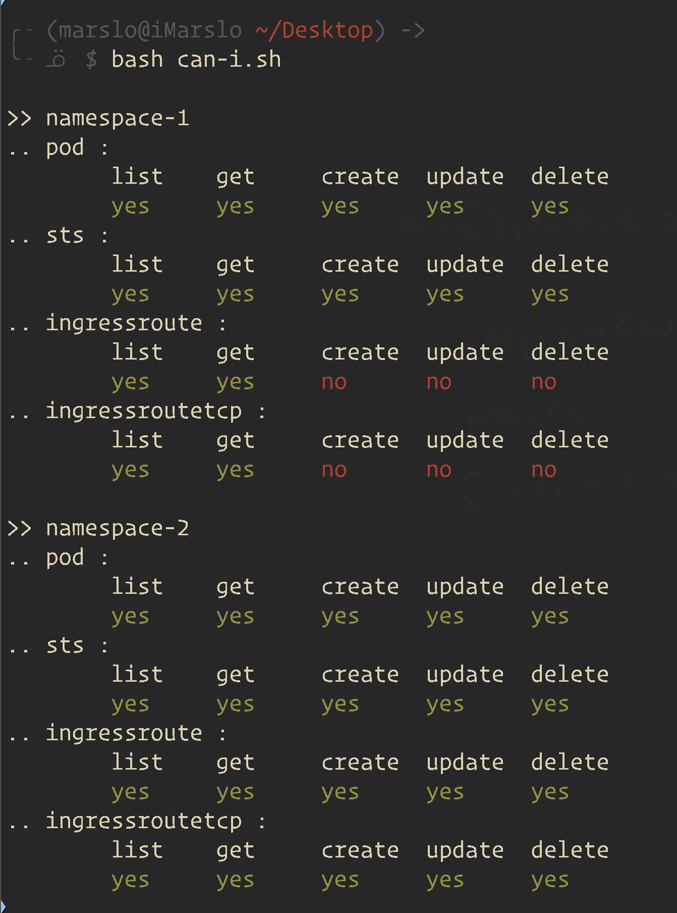

## RBAC

- kubernetes-dashboard admin

  > [!NOTE|label:references:]
  > - [* iMarslo: kubernetes-dashboard admin](./init/addons.md#rbac)

## auth

> [!NOTE|label:references:]
> - [Adding permission to exec commands in containers inside pods in a certain namespace](https://discuss.kubernetes.io/t/adding-permission-to-exec-commands-in-containers-inside-pods-in-a-certain-namespace/22821)

### `auth can-i`

> [!NOTE|label:references:]
> - [kubectl-auth-can-i - Man Page](https://www.mankier.com/1/kubectl-auth-can-i)
> - [printTable](https://stackoverflow.com/a/49180405/2940319)

```bash
$ namespace='test'
$ kubectl auth can-i get pods -n "${namespace}"
yes
$ kubectl auth can-i list pods -n "${namespace}"
yes
$ kubectl auth can-i create pods -n "${namespace}"
yes
$ kubectl auth can-i create pods/exec -n "${namespace}"
yes
$ kubectl auth can-i get pods/exec -n "${namespace}"
yes
$ kubectl auth can-i create pods --subresource=exec -n "${namespace}"
no
$ kubectl auth can-i get pods --subresource=exec -n "${namespace}"
no
```

- `auth can-i --list`

  <!--sec data-title="auth can-i --list" data-id="section0" data-show=true data-collapse=true ces-->
  - admin
    ```bash
    $ kubectl auth can-i --list
    Resources                                       Non-Resource URLs   Resource Names   Verbs
    *.*                                             []                  []               [*]
                                                    [*]                 []               [*]
    selfsubjectreviews.authentication.k8s.io        []                  []               [create]
    selfsubjectaccessreviews.authorization.k8s.io   []                  []               [create]
    selfsubjectrulesreviews.authorization.k8s.io    []                  []               [create]
                                                    [/api/*]            []               [get]
                                                    [/api]              []               [get]
                                                    [/apis/*]           []               [get]
                                                    [/apis]             []               [get]
                                                    [/healthz]          []               [get]
                                                    [/healthz]          []               [get]
                                                    [/livez]            []               [get]
                                                    [/livez]            []               [get]
                                                    [/openapi/*]        []               [get]
                                                    [/openapi]          []               [get]
                                                    [/readyz]           []               [get]
                                                    [/readyz]           []               [get]
                                                    [/version/]         []               [get]
                                                    [/version/]         []               [get]
                                                    [/version]          []               [get]
                                                    [/version]          []               [get]
    ```

  - normal user
    ```bash
    $ kubectl auth can-i --list
    Resources                                        Non-Resource URLs   Resource Names   Verbs
    *.*                                              []                  []               [*]
    rolebindings.rbac.authorization.k8s.io           []                  []               [create delete deletecollection get list patch update watch]
    roles.rbac.authorization.k8s.io                  []                  []               [create delete deletecollection get list patch update watch]
    configmaps                                       []                  []               [create delete deletecollection patch update get list watch]
    endpoints                                        []                  []               [create delete deletecollection patch update get list watch]
    persistentvolumeclaims                           []                  []               [create delete deletecollection patch update get list watch]
    pods                                             []                  []               [create delete deletecollection patch update get list watch]
    replicationcontrollers/scale                     []                  []               [create delete deletecollection patch update get list watch]
    replicationcontrollers                           []                  []               [create delete deletecollection patch update get list watch]
    services                                         []                  []               [create delete deletecollection patch update get list watch]
    daemonsets.apps                                  []                  []               [create delete deletecollection patch update get list watch]
    deployments.apps/scale                           []                  []               [create delete deletecollection patch update get list watch]
    deployments.apps                                 []                  []               [create delete deletecollection patch update get list watch]
    replicasets.apps/scale                           []                  []               [create delete deletecollection patch update get list watch]
    replicasets.apps                                 []                  []               [create delete deletecollection patch update get list watch]
    statefulsets.apps/scale                          []                  []               [create delete deletecollection patch update get list watch]
    statefulsets.apps                                []                  []               [create delete deletecollection patch update get list watch]
    horizontalpodautoscalers.autoscaling             []                  []               [create delete deletecollection patch update get list watch]
    cronjobs.batch                                   []                  []               [create delete deletecollection patch update get list watch]
    jobs.batch                                       []                  []               [create delete deletecollection patch update get list watch]
    daemonsets.extensions                            []                  []               [create delete deletecollection patch update get list watch]
    deployments.extensions/scale                     []                  []               [create delete deletecollection patch update get list watch]
    deployments.extensions                           []                  []               [create delete deletecollection patch update get list watch]
    networkpolicies.extensions                       []                  []               [create delete deletecollection patch update get list watch]
    replicasets.extensions/scale                     []                  []               [create delete deletecollection patch update get list watch]
    replicasets.extensions                           []                  []               [create delete deletecollection patch update get list watch]
    replicationcontrollers.extensions/scale          []                  []               [create delete deletecollection patch update get list watch]
    ingresses.networking.k8s.io                      []                  []               [create delete deletecollection patch update get list watch]
    networkpolicies.networking.k8s.io                []                  []               [create delete deletecollection patch update get list watch]
    poddisruptionbudgets.policy                      []                  []               [create delete deletecollection patch update get list watch]
    deployments.apps/rollback                        []                  []               [create delete deletecollection patch update]
    deployments.extensions/rollback                  []                  []               [create delete deletecollection patch update]
    localsubjectaccessreviews.authorization.k8s.io   []                  []               [create]
    selfsubjectaccessreviews.authorization.k8s.io    []                  []               [create]
    selfsubjectrulesreviews.authorization.k8s.io     []                  []               [create]
    ingresses.extensions                             []                  []               [get list create delete deletecollection patch update watch]
    pods/attach                                      []                  []               [get list watch create delete deletecollection patch update]
    pods/exec                                        []                  []               [get list watch create delete deletecollection patch update]
    pods/portforward                                 []                  []               [get list watch create delete deletecollection patch update]
    pods/proxy                                       []                  []               [get list watch create delete deletecollection patch update]
    secrets                                          []                  []               [get list watch create delete deletecollection patch update]
    services/proxy                                   []                  []               [get list watch create delete deletecollection patch update]
    bindings                                         []                  []               [get list watch]
    events                                           []                  []               [get list watch]
    limitranges                                      []                  []               [get list watch]
    namespaces/status                                []                  []               [get list watch]
    namespaces                                       []                  []               [get list watch]
    nodes                                            []                  []               [get list watch]
    persistentvolumeclaims/status                    []                  []               [get list watch]
    pods/log                                         []                  []               [get list watch]
    pods/status                                      []                  []               [get list watch]
    replicationcontrollers/status                    []                  []               [get list watch]
    resourcequotas/status                            []                  []               [get list watch]
    resourcequotas                                   []                  []               [get list watch]
    services/status                                  []                  []               [get list watch]
    controllerrevisions.apps                         []                  []               [get list watch]
    daemonsets.apps/status                           []                  []               [get list watch]
    deployments.apps/status                          []                  []               [get list watch]
    replicasets.apps/status                          []                  []               [get list watch]
    statefulsets.apps/status                         []                  []               [get list watch]
    horizontalpodautoscalers.autoscaling/status      []                  []               [get list watch]
    cronjobs.batch/status                            []                  []               [get list watch]
    jobs.batch/status                                []                  []               [get list watch]
    daemonsets.extensions/status                     []                  []               [get list watch]
    deployments.extensions/status                    []                  []               [get list watch]
    ingresses.extensions/status                      []                  []               [get list watch]
    replicasets.extensions/status                    []                  []               [get list watch]
    nodes.metrics.k8s.io                             []                  []               [get list watch]
    pods.metrics.k8s.io                              []                  []               [get list watch]
    ingresses.networking.k8s.io/status               []                  []               [get list watch]
    poddisruptionbudgets.policy/status               []                  []               [get list watch]
    persistentvolumes                                []                  []               [get list]
    ingressrouteTCP.extensions                       []                  []               [get list]
    ingressroute.extensions                          []                  []               [get list]
                                                     [/api/*]            []               [get]
                                                     [/api]              []               [get]
                                                     [/apis/*]           []               [get]
                                                     [/apis]             []               [get]
                                                     [/healthz]          []               [get]
                                                     [/healthz]          []               [get]
                                                     [/livez]            []               [get]
                                                     [/livez]            []               [get]
                                                     [/openapi/*]        []               [get]
                                                     [/openapi]          []               [get]
                                                     [/readyz]           []               [get]
                                                     [/readyz]           []               [get]
                                                     [/version/]         []               [get]
                                                     [/version/]         []               [get]
                                                     [/version]          []               [get]
                                                     [/version]          []               [get]
    serviceaccounts                                  []                  []               [impersonate create delete deletecollection patch update get list watch]
    ```
  <!--endsec-->

- or
  ```bash
  #!/usr/bin/env bash
  # shellcheck disable=SC2086,SC1090

  source ~/.marslo/bin/bash-color.sh

  while read -r namespace; do
    actions='list get create update delete'
    components='pod sts ingressroute ingressroutetcp'
    echo -e "\n>> ${namespace}";
    for _c in $components; do
      echo ".. ${_c} :";
      res='';
      for _a in $actions; do
        r="$(kubectl auth can-i ${_a} ${_c} -n ${namespace})";
        [[ 'yes' = "${r}" ]] && r="$(c Gs)${r}$(c)" || r="$(c Rs)${r}$(c)";
        res+="${r}\t";
      done;
      echo -e "\t${actions}" | tr ' ' '\t';
      echo -e "\t${res}";
    done;

  done< <(echo namespace-1 namespace-2 namespace-3 namespace-4 namespace-5 | fmt -1)
  ```

  

- more
  ```bash
  $ while read -r namespace; do
     echo -e "\n>> ${namespace}";
     echo "pod :";
     echo ".. pod list: $(kubectl auth can-i list pods -n ${namespace})";
     echo ".. pod create: $(kubectl auth can-i create pods -n ${namespace})";
     echo ".. pod create exec: $(kubectl auth can-i create pods --subresource=exec -n ${namespace})";
     echo ".. pod get exec : $(kubectl auth can-i get pods --subresource=exec -n ${namespace})";
     echo "statefulset :";
     echo ".. sts get : $(kubectl auth can-i get statefulset -n ${namespace})";
     echo ".. sts list : $(kubectl auth can-i list statefulset -n ${namespace})";
     echo ".. sts create : $(kubectl auth can-i create statefulset -n ${namespace})";
     echo "ingressroute :";
     echo ".. ingressroute : $(kubectl auth can-i get ingressroute -n ${namespace})";
     echo ".. ingressroutetcp : $(kubectl auth can-i get ingressroutetcp -n ${namespace})";
   done< <(echo namespace-1 namespace-2 namespace-3 namespace-4 namespace-5 | fmt -1)
  ```

- [`kcani`](https://github.com/marslo/dotfiles/blob/main/.marslo/bin/ffunc.sh#L1110)

### [rakkess](https://github.com/corneliusweig/rakkess)
