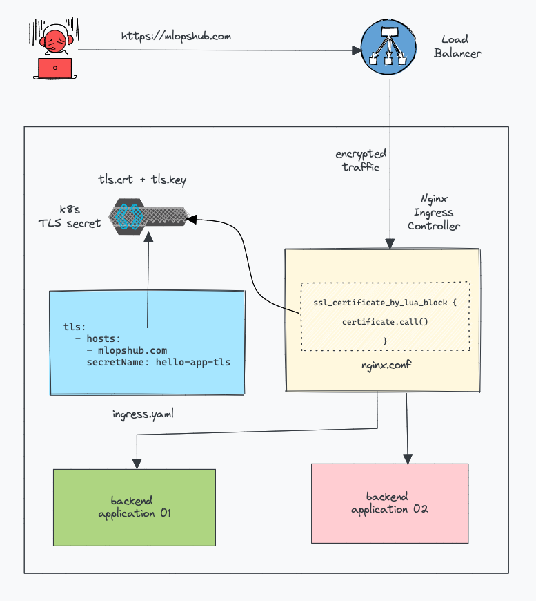

<!-- START doctoc generated TOC please keep comment here to allow auto update -->
<!-- DON'T EDIT THIS SECTION, INSTEAD RE-RUN doctoc TO UPDATE -->

- [generic](#generic)
  - [samples](#samples)
    - [etcd](#etcd)
    - [kube-apiserver](#kube-apiserver)
- [show secrets tls.crt](#show-secrets-tlscrt)
  - [create secrets](#create-secrets)
  - [duplicate secrets to the other ns](#duplicate-secrets-to-the-other-ns)
  - [show tls](#show-tls)
    - [show tls in all namespace](#show-tls-in-all-namespace)
    - [show tls.crt](#show-tlscrt)
    - [manually update server.crt and server.key](#manually-update-servercrt-and-serverkey)
- [renew both certificates and kubeconfig](#renew-both-certificates-and-kubeconfig)
  - [check info](#check-info)
    - [crt](#crt)
    - [pem for external etcd](#pem-for-external-etcd)
    - [backup](#backup)
    - [clean environment](#clean-environment)
    - [restore backup](#restore-backup)
  - [v1.12.3](#v1123)
    - [renew certificates](#renew-certificates)
    - [renew kubeconfig](#renew-kubeconfig)
    - [sync to peer controllers](#sync-to-peer-controllers)
    - [restart kubelet](#restart-kubelet)
  - [v1.15.3](#v1153)
    - [renew certificates](#renew-certificates-1)
    - [sync to peer controllers](#sync-to-peer-controllers-1)
    - [renew kubeconfig](#renew-kubeconfig-1)
    - [restart the controller components](#restart-the-controller-components)
    - [restart kubelet service](#restart-kubelet-service)
    - [verify](#verify)
  - [extend X509v3 Subject Alternative Name in `apiserver.crt`](#extend-x509v3-subject-alternative-name-in-apiservercrt)
    - [using new certificate for apiserver](#using-new-certificate-for-apiserver)
  - [renew work node](#renew-work-node)
    - [backup](#backup-1)
    - [restart `kubelet`](#restart-kubelet)
  - [certificates generation](#certificates-generation)
    - [pfx](#pfx)
- [renew kubeconfig only](#renew-kubeconfig-only)
  - [basic environment](#basic-environment)
  - [renew kubeconfig](#renew-kubeconfig-2)
    - [generate new certificate (csr)](#generate-new-certificate-csr)
    - [signing the certificate via `ca.crt`](#signing-the-certificate-via-cacrt)
    - [renew via `kubeadm alpha`](#renew-via-kubeadm-alpha)
    - [renew via `kubectl config`](#renew-via-kubectl-config)
    - [renew via `base64` manually](#renew-via-base64-manually)
    - [vaildate](#vaildate)
    - [more details](#more-details)
- [tricky](#tricky)
  - [modify default certificate to 10 years](#modify-default-certificate-to-10-years)
- [reference](#reference)
  - [required certificates](#required-certificates)
  - [Certificate paths](#certificate-paths)
  - [Configure certificates for user accounts](#configure-certificates-for-user-accounts)
  - [files are used as follows](#files-are-used-as-follows)

<!-- END doctoc generated TOC please keep comment here to allow auto update -->

> [!TIP]
> - [extenal etcd topology](https://kubernetes.io/docs/setup/production-environment/tools/kubeadm/ha-topology/#external-etcd-topology) certificates located in : `/etc/etcd/ssl`
> - [stacked etcd topology](https://kubernetes.io/docs/setup/production-environment/tools/kubeadm/ha-topology/#stacked-etcd-topology) certificates located in : `/etc/kubernetes/pki/etcd`


> references:
> - [* 创建 TLS 证书和秘钥](https://jimmysong.io/kubernetes-handbook/practice/create-tls-and-secret-key.html)
> - [* Generate Certificates Manually](https://kubernetes.io/docs/tasks/administer-cluster/certificates/)
> - [* Manual Rotation of CA Certificates](https://kubernetes.io/docs/tasks/tls/manual-rotation-of-ca-certificates/)
> - [* Certificate Management with kubeadm](https://kubernetes.io/docs/tasks/administer-cluster/kubeadm/kubeadm-certs/)
> - stacked CA mode can found from [Certificate Management with kubeadm](https://kubernetes.io/docs/tasks/administer-cluster/kubeadm/kubeadm-certs/)
> - [* PKI certificates and requirements](https://kubernetes.io/docs/setup/best-practices/certificates/#all-certificates)
> - [Manage TLS Certificates in a Cluster](https://kubernetes.io/docs/tasks/tls/managing-tls-in-a-cluster/)
> - [Renew a Kubernetes certificate with a 10-year expiration date](https://www.sobyte.net/post/2021-10/update-k8s-10y-expire-certs/)
> - [Configure Access to Multiple Clusters](https://kubernetes.io/docs/tasks/access-application-cluster/configure-access-multiple-clusters/)
> - [Dashboard使用自定义证书](https://blog.csdn.net/chenleiking/article/details/81488028)
> - [Custom certificates on Kubernetes](https://www.ibm.com/docs/en/api-connect/10.0.1.x?topic=environment-custom-certificates-kubernetes)
>   - [How to Generate a Self-Signed Certificate for Kubernetes](https://phoenixnap.com/kb/kubernetes-ssl-certificates)
> - [Certificates in a Kubernetes environment](https://www.ibm.com/docs/en/api-connect/10.0.1.x?topic=deployment-certificates-in-kubernetes-environment)
> - [Creating Self Signed Certificates on Kubernetes](https://tech.paulcz.net/blog/creating-self-signed-certs-on-kubernetes/)
> - [How To Configure Ingress TLS/SSL Certificates in Kubernetes](https://devopscube.com/configure-ingress-tls-kubernetes/)
> - [一文带你彻底厘清 Kubernetes 中的证书工作机制](https://cloud.tencent.com/developer/article/1632666)
> - [* 管理集群中的 TLS 认证](https://kubernetes.io/zh-cn/docs/tasks/tls/managing-tls-in-a-cluster/)
> - [* set up a high availability etcd cluster with kubeadm](https://kubernetes.io/docs/setup/production-environment/tools/kubeadm/setup-ha-etcd-with-kubeadm/)
> <br>
> - regenerate the kubeadm.yml
>   ```bash
>   $ sudo kubeadm config view
>   ```




# generic

- certificates for CA
  - `ca-key.pem`
  - `ca.pem`
  - `kubernetes-key.pem`
  - `kubernetes.pem`
  - `kube-proxy.pem`
  - `kube-proxy-key.pem`
  - `admin.pem`
  - `admin-key.pem`

- certificate component


  |          SERVICES         | CERTIFICATES                                     |
  |:-------------------------:|--------------------------------------------------|
  |           `etcd`          | `ca.pem`, `kubernetes-key.pem`, `kubernetes.pem` |
  |      `kube-apiserver`     | `ca.pem`, `kubernetes-key.pem`, `kubernetes.pem` |
  |         `kubelet`         | `ca.pem`                                         |
  |        `kube-proxy`       | `ca.pem`, `kube-proxy-key.pem`, `kube-proxy.pem` |
  |         `kubectl`         | `ca.pem`, `admin-key.pem`, `admin.pem`           |
  | `kube-controller-manager` | `ca-key.pem`, `ca.pem`                           |


## [samples](https://cloud.tencent.com/developer/article/1632666)
### etcd
```bash
/usr/local/bin/etcd \\
  --cert-file=/etc/etcd/kube-etcd.pem \\                   # 对外提供服务的服务器证书
  --key-file=/etc/etcd/kube-etcd-key.pem \\                # 服务器证书对应的私钥
  --peer-cert-file=/etc/etcd/kube-etcd-peer.pem \\         # peer 证书，用于 etcd 节点之间的相互访问
  --peer-key-file=/etc/etcd/kube-etcd-peer-key.pem \\      # peer 证书对应的私钥
  --trusted-ca-file=/etc/etcd/cluster-root-ca.pem \\       # 用于验证访问 etcd 服务器的客户端证书的 CA 根证书
  --peer-trusted-ca-file=/etc/etcd/cluster-root-ca.pem\\   # 用于验证 peer 证书的 CA 根证书
  ...
```

### kube-apiserver
```bash
/usr/local/bin/kube-apiserver \\
  --tls-cert-file=/var/lib/kubernetes/kube-apiserver.pem \\                             # 用于对外提供服务的服务器证书
  --tls-private-key-file=/var/lib/kubernetes/kube-apiserver-key.pem \\                  # 服务器证书对应的私钥
  --etcd-certfile=/var/lib/kubernetes/kube-apiserver-etcd-client.pem \\                 # 用于访问 etcd 的客户端证书
  --etcd-keyfile=/var/lib/kubernetes/kube-apiserver-etcd-client-key.pem \\              # 用于访问 etcd 的客户端证书的私钥
  --kubelet-client-certificate=/var/lib/kubernetes/kube-apiserver-kubelet-client.pem \\ # 用于访问 kubelet 的客户端证书
  --kubelet-client-key=/var/lib/kubernetes/kube-apiserver-kubelet-client-key.pem \\     # 用于访问 kubelet 的客户端证书的私钥
  --client-ca-file=/var/lib/kubernetes/cluster-root-ca.pem \\                           # 用于验证访问 kube-apiserver 的客户端的证书的 CA 根证书
  --etcd-cafile=/var/lib/kubernetes/cluster-root-ca.pem \\                              # 用于验证 etcd 服务器证书的 CA 根证书
  --kubelet-certificate-authority=/var/lib/kubernetes/cluster-root-ca.pem \\            # 用于验证 kubelet 服务器证书的 CA 根证书
  --service-account-key-file=/var/lib/kubernetes/service-account.pem \\                 # 用于验证 service account token 的公钥
  ...
```

# show secrets tls.crt

> [!TIP|label:references:]
> - [Quick Tip: SSL Cert Expiry from Kubernetes Secrets](https://syvarth.com/post/ssl-cert-expiry-kubernetes-secret)

## create secrets
- by command
  ```bash
  $ kubectl create secret tls <SECRET_NAME> \
            --key .devops/certs/server.key \
            --cert .devops/certs/server.crt \
            -n ingress-nginx
  ```

- by yaml
  ```bash
  $ echo "apiVersion: v1
  kind: Secret
  type: kubernetes.io/tls
  metadata:
    name: mytest-cert
    namespace: ingress-nginx
  data:
    tls.crt: $(cat $HOME/.devops/certs/server.csr | base64 -w0)
    tls.key: $(cat $HOME/.devops/certs/server.key | base64 -w0)" |
  kubectl apply -f -
  ```

## duplicate secrets to the other ns


> reference:
> - [others](https://github.com/jetstack/cert-manager/issues/494)
> - [Pro-Tip – Copying Kubernetes Secrets Between Namespaces](https://www.revsys.com/tidbits/copying-kubernetes-secrets-between-namespaces/)


```bash
$ kubectl -n ingress-nginx get secrets <SECRET_NAME> -o yaml --export | kubectl apply -n devops -f -
```

## show tls
### show tls in all namespace
```bash
$ kubectl get ingress --all-namespaces --no-headers |
          awk '{print $1}' |
          sort -u |
          while read -r ns; do
            echo "-- ${ns} --";
              kubectl -n ${ns} get secret <SECRET_NAME> -o yaml -o "jsonpath={.data['tls\.crt']}" |
                      base64 -d -w0 |
                      sed '/-----END CERTIFICATE-----/q' |
                      openssl x509 -text -noout |
                      grep 'Not'
          done
```

### show tls.crt
```bash
$ kubectl -n kube-system \
          get secrets <SECRET_NAME> \
          -o yaml \
          -o "jsonpath={.data['tls\.crt']}" |
    base64 -d -w0 |
    awk '/-BEGIN CERTIFICATE-/ && c++, /-END CERTIFICATE-/' |
    openssl x509 -text -noout |
    grep 'Not'
            Not Before: Apr 14 00:00:00 2021 GMT
            Not After : Apr 13 23:59:59 2031 GMT
```
- or
  ```bash
  $ kubectl -n kube-system \
            get secrets <SECRET_NAME> \
            -o yaml \
            -o "jsonpath={.data['tls\.crt']}" |
      base64 -d -w0 |
      sed '/-----END CERTIFICATE-----/q' |
      openssl x509 -text -noout |
      grep 'Not'
              Not Before: Sep 14 00:00:00 2021 GMT
              Not After : Aug 18 23:59:59 2022 GM
  ```

### manually update server.crt and server.key

> [!TIP|label:see also:]
> - [* iMarslo: ssl certificate in kubenernets](../../cheatsheet/ssl/ssl.md#to-kubernetes-secrets)

```bash
$ kubectl -n kube-system get secrets <SECRET_NAME> -o yaml |
    sed -r -e "s/(\s*tls.crt:)(.*)$/\1 $(cat server.crt | base64 -w0)/g" \
           -e "s/(\s*tls.key:)(.*)$/\1 $(cat server.key | base64 -w0)/g" |
  kubectl apply -f -
```

# renew both certificates and kubeconfig
## check info
### crt
```bash
$ find /etc/kubernetes/pki/ -type f -name "*.crt" -print |
       egrep -v 'ca.crt$' |
       xargs -L 1 -t -i bash -c 'openssl x509 -noout -text -in {} | grep After'
bash -c openssl x509 -noout -text -in /etc/kubernetes/pki/apiserver-kubelet-client.crt | grep After
            Not After : Sep 16 07:51:58 2020 GMT
bash -c openssl x509 -noout -text -in /etc/kubernetes/pki/apiserver.crt | grep After
            Not After : Sep 16 07:51:59 2020 GMT
bash -c openssl x509 -noout -text -in /etc/kubernetes/pki/front-proxy-client.crt | grep After
            Not After : Sep 16 07:52:00 2020 GMT
```

- or
  ```bash
  $ find /etc/kubernetes/pki/ -type f -name "*.crt" -print |
         egrep -v 'ca.crt$' |
         xargs -L 1 -t  -i bash -c 'openssl x509 -enddate -noout -in {}'
  ```

- or
  ```bash
  $ ls -1 /etc/kubernetes/pki/*.crt |
         grep -Ev 'ca.crt$' |
         xargs -L 1 -t  -i bash -c 'openssl x509 -enddate -noout -in {}'
  ```

### [pem for external etcd](https://stackoverflow.com/a/21297927/2940319)
  ```bash
  $ for i in ca client server peer; do
      echo /etc/etcd/ssl/$i.pem
      openssl x509 -enddate -noout -in /etc/etcd/ssl/$i.pem
    done
  /etc/etcd/ssl/ca.pem
  notAfter=Sep  8 10:44:00 2024 GMT
  /etc/etcd/ssl/client.pem
  notAfter=Sep  8 10:49:00 2024 GMT
  /etc/etcd/ssl/server.pem
  notAfter=Sep  8 11:03:00 2024 GMT
  /etc/etcd/ssl/peer.pem
  notAfter=Sep  8 11:03:00 2024 GMT
  ```

- or
  ```bash
  $ find /etc/etcd/ssl/ -type f -name '*.pem' |
         egrep -v '*-key.pem$' |
         xargs -L 1 -t -i bash -c 'openssl x509 -enddate -noout -in {}'
  bash -c openssl x509 -enddate -noout -in /etc/etcd/ssl/ca.pem
  notAfter=Sep  8 10:44:00 2024 GMT
  bash -c openssl x509 -enddate -noout -in /etc/etcd/ssl/client.pem
  notAfter=Sep  8 10:49:00 2024 GMT
  bash -c openssl x509 -enddate -noout -in /etc/etcd/ssl/server.pem
  notAfter=Sep  8 11:03:00 2024 GMT
  bash -c openssl x509 -enddate -noout -in /etc/etcd/ssl/peer.pem
  notAfter=Sep  8 11:03:00 2024 GMT
  ```

- or
  ```bash
  $ ls -1 /etc/etcd/ssl/*.pem |
          grep -Ev '\-key.pem$' |
          xargs -L 1 -t  -i bash -c 'openssl x509 -enddate -noout -in {}'
  ```

### backup
```bash
# timestampe=$(date +"%Y%m%d%H%M%S")
$ timestampe=$(date +"%Y%m%d")
$ backupFolder="$HOME/k8s-cert-expired-${timestampe}"

$ mkdir "${backupFolder}"
$ sudo cp -rp --parents /etc/kubernetes/pki "${backupFolder}"

# for external etcd
# sudo cp -rp --parents /etc/etcd/ssl "${backupFolder}"

# for kubelet
$ sudo cp -rp /var/lib/kubelet/config.yaml{,.backup.${timestampe}}
$ sudo cp -rp --parents /var/lib/kubelet/pki "${backupFolder}"
$ sudo cp -r /var/lib/kubelet/pki{,.backup.${timestampe}}
$ sudo cp -rp --parents /var/lib/kubelet/config.yaml "${backupFolder}"

# for kubeconfig
$ sudo cp -rp --parents /etc/kubernetes/*.conf "${backupFolder}"
$ sudo cp -rp ~/.kube/config{,.backup.${timestampe}}
```

### clean environment
```bash
# for `/etc/kubernetes/pki`

# or
$ echo {apiserver,apiserver-kubelet-client,apiserver-etcd-client,front-proxy-client} |
       fmt -1 |
       xargs -I{} bash -c "sudo cp -rp /etc/kubernetes/pki/{}.crt{,.backup.${timestampe}};
                           sudo mv /etc/kubernetes/pki/{}.key{,.backup.${timestampe}}"

# for kubeconfig
$ echo {admin,kubelet,controller-manager,scheduler} |
       fmt -1 |
       xargs -I{} bash -c "sudo mv /etc/kubernetes/{}.conf{,.backup.${timestampe}}"

$ echo {peer,healthcheck-client,server}.{crt,key} |
       fmt -1 |
       xargs -I{} bash -c "sudo mv /etc/kubernets/pki/etcd/${}{,.backup.${timestampe}}"
```

### restore backup
TBD


## v1.12.3

> [!TIP]
> - [where I can find kubeadm-config.yaml on my kubernetes cluster](where I can find kubeadm-config.yaml on my kubernetes cluster)
> - [Kubernetes by kubeadm config yamls](https://medium.com/@kosta709/kubernetes-by-kubeadm-config-yamls-94e2ee11244)
> - [kubeadm – How to “upgrade” (update) your configuration](https://blog.honosoft.com/2020/01/31/kubeadm-how-to-upgrade-update-your-configuration/)
> <p>
> for [stacked etcd topology](https://kubernetes.io/docs/setup/production-environment/tools/kubeadm/ha-topology/#stacked-etcd-topology) <br>
>
> ```bash
> $ kubectl version --short
> Client Version: v1.12.3
> Server Version: v1.12.3
> ```

> references:
> - [Renewing Kubernetes cluster certificates 1.0.2](https://www.ibm.com/docs/en/fci/1.0.2?topic=kubernetes-renewing-cluster-certificates)
> - [Renewing Kubernetes cluster certificates 1.1.0](https://www.ibm.com/docs/en/fci/1.1.0?topic=kubernetes-renewing-cluster-certificates)
> - [Renewing Kubernetes 1.10.x cluster certificates](https://www.ibm.com/docs/en/fci/1.0.3?topic=kubernetes-renewing-110x-cluster-certificates)

### renew certificates
```bash
# get target cluster kubeadm-cfg.yml
$ kubectl get cm kubeadm-config -n kube-system -o=jsonpath="{.data.ClusterConfiguration}"
$ sudo kubeadm [--config kubeadm.yml] alpha phase certs renew [commands]
```

<div class="alert alert-success hints-alert">
  <div class="hints-icon">
  <i class="fa fa-mortar-board"></i>
  </div>
  <div class="hints-container">
  <blockquote>
    <h4>Available Commands:</h4>
    <table>
      <thead>
        <tr>
          <th>commands</th>
          <th>comments</th>
        </tr>
      </thead>
      <tbody>
        <tr>
          <td><code>all</code></td>
          <td>renew all available certificates</td>
        </tr>
        <tr>
          <td><code>apiserver</code></td>
          <td>Generates the certificate for serving the kubernetes API</td>
        </tr>
        <tr>
          <td><code>apiserver-etcd-client</code></td>
          <td>Generates the client apiserver uses to access etcd</td>
        </tr>
        <tr>
          <td><code>apiserver-kubelet-client</code></td>
          <td>Generates the Client certificate for the API server to connect to kubelet</td>
        </tr>
        <tr>
          <td><code>front-proxy-client</code></td>
          <td>Generates the client for the front proxy</td>
        </tr>
        <tr>
          <td><code>etcd-healthcheck-client</code></td>
          <td>Generates the client certificate for liveness probes to healtcheck etcd</td>
        </tr>
        <tr>
          <td><code>etcd-peer</code></td>
          <td>Generates the credentials for etcd nodes to communicate with each other</td>
        </tr>
        <tr>
          <td><code>etcd-server</code></td>
          <td>Generates the certificate for serving etcd</td>
        </tr>
      </tbody>
    </table>
  </blockquote>
  </div>
</div>

- i.e.
  ```bash
  # get target cluster kubeadm-cfg.yml
  $ kubectl get cm kubeadm-config -n kube-system -o=jsonpath="{.data.ClusterConfiguration}"
  $ sudo kubeadm --config ~/kubeadm.yml alpha phase certs renew all

  # or
  $ sudo kubeadm --config ~/kubeadm.yml alpha phase certs renew etcd-server
  $ sudo kubeadm --config ~/kubeadm.yml alpha phase certs renew apiserver-kubelet-client
  $ sudo kubeadm --config ~/kubeadm.yml alpha phase certs renew front-proxy-client

  # for /etc/kubernetes/pki/*.crt
  $ echo {apiserver,apiserver-kubelet-client,front-proxy-client} |
         fmt -1 |
         xargs -I{} bash -c "sudo kubeadm --config ~/kubeadm.yml alpha phase certs renew {}"

  # for /etc/kubernetes/pki/etcd/*.crt
  $ echo {etcd-server,etcd-peer,etcd-healthcheck-client} |
         fmt -1 |
         xargs -I{} bash -c "sudo kubeadm --config ~/kubeadm.yml alpha phase certs renew {}"
  ```

#### generate new certificates
```bash
$ sudo kubeadm [--config kubeadm.yml] alpha phase certs [commands]
```

<div class="alert alert-success hints-alert">
  <div class="hints-icon">
  <i class="fa fa-mortar-board"></i>
  </div>
  <div class="hints-container">
  <blockquote>
    <table>
      <thead>
        <tr>
        <th>commands</th>
        <th>comments</th>
        </tr>
      </thead>
      <tbody>
        <tr>
          <td><code>all</code></td>
          <td>Generates all PKI assets necessary to establish the control plane</td>
        </tr>
        <tr>
          <td><code>apiserver</code></td>
          <td>Generates the certificate for serving the kubernetes API</td>
        </tr>
        <tr>
          <td><code>apiserver-etcd-client</code></td>
          <td>Generates the client apiserver uses to access etcd</td>
        </tr>
        <tr>
          <td><code>apiserver-kubelet-client</code></td>
          <td>Generates the Client certificate for the API server to connect to kubelet</td>
        </tr>
        <tr>
          <td><code>ca</code></td>
          <td>Generates the self-signed kubernetes CA to provision identities for other kuberenets components</td>
        </tr>
        <tr>
          <td><code>etcd-ca</code></td>
          <td>Generates the self-signed CA to provision identities for etcd</td>
        </tr>
        <tr>
          <td><code>etcd-healthcheck-client</code></td>
          <td>Generates the client certificate for liveness probes to healtcheck etcd</td>
        </tr>
        <tr>
          <td><code>etcd-peer</code></td>
          <td>Generates the credentials for etcd nodes to communicate with each other</td>
        </tr>
        <tr>
          <td><code>etcd-server</code></td>
          <td>Generates the certificate for serving etcd</td>
        </tr>
        <tr>
          <td><code>front-proxy-ca</code></td>
          <td>Generates the self-signed CA to provision identities for front proxy</td>
        </tr>
        <tr>
          <td><code>front-proxy-client</code></td>
          <td>Generates the client for the front proxy</td>
        </tr>
        <tr>
          <td><code>sa</code></td>
          <td>Generates a private key for signing service account tokens along with its public key</td>
        </tr>
        <tr>
          <td><code>renew</code></td>
          <td>Renews certificates for a Kubernetes cluster</td>
        </tr>
      </tbody>
    </table>
  </blockquote>
  </div>
</div>


- re-generate `/etc/kubernetes/pki/etcd/*.crt` for modify `X509 Subject Alternative Name`:
  ```bash
  $ sudo kubeadm --config ~/kubeadm.yml alpha phase certs etcd-server
  $ sudo kubeadm --config ~/kubeadm.yml alpha phase certs etcd-peer
  $ sudo kubeadm --config ~/kubeadm.yml alpha phase certs etcd-healthcheck-client

  # or
  $ echo {etcd-server,etcd-peer,etcd-healthcheck-client} |
         fmt -1 |
         xargs -I{} bash -c "sudo kubeadm --config ~/kubeadm.yml alpha phase certs {}"
  ```

  - check `X509 Subject Alternative Name`
    ```bash
    $ openssl x509 -noout -text -in /path/to/NAME.crt
    ```

  - check expire date
    ```bash
    $ openssl x509 -noout -enddate -in /path/to/NAME.crt
    ```

### renew kubeconfig
```bash
# clean all config in /etc/kubenernets/*.conf, i.e.:
# echo {admin,controller-manager,kubelet,scheduler} | fmt -1 | xargs -I{} bash -c "sudo rm -rf {}.conf"
$ sudo kubeadm [--config ~/kubeadm.yml] alpha phase kubeconfig [commands]
```

#### renew all kubeconfig
```bash
$ sudo kubeadm --config ~/kubeadm.yml alpha phase kubeconfig all
[endpoint] WARNING: port specified in controlPlaneEndpoint overrides bindPort in the controlplane address
[kubeconfig] Wrote KubeConfig file to disk: "/etc/kubernetes/admin.conf"
[kubeconfig] Wrote KubeConfig file to disk: "/etc/kubernetes/kubelet.conf"
[kubeconfig] Wrote KubeConfig file to disk: "/etc/kubernetes/controller-manager.conf"
[kubeconfig] Wrote KubeConfig file to disk: "/etc/kubernetes/scheduler.conf"

# or
$ echo {admin,controller-manager,kubelet,scheduler} |
       fmt -1 |
       xargs -I{} bash -c "sudo kubeadm --config ~/kubeadm.yml alpha phase kubeconfig {}"
```

<div class="alert alert-success hints-alert">
  <div class="hints-icon">
  <i class="fa fa-mortar-board"></i>
  </div>
  <div class="hints-container">
  <blockquote>
    <h4>Available Commands:</h4>
    <table>
      <thead>
        <tr>
        <th>commands</th>
        <th>comments</th>
        </tr>
      </thead>
      <tbody>
        <tr>
          <td><code>all</code></td>
          <td>Generates all kubeconfig files necessary to establish the control plane and the admin kubeconfig file</td>
        </tr>
        <tr>
          <td><code>admin</code></td>
          <td>Generates a kubeconfig file for the admin to use and for kubeadm itself</td>
        </tr>
        <tr>
          <td><code>controller_manager</code></td>
          <td>Generates a kubeconfig file for the controller manager to use</td>
        </tr>
        <tr>
          <td><code>kubelet</code></td>
          <td>Generates a kubeconfig file for the kubelet to use. Please note that this should be used *only* for bootstrapping purposes</td>
        </tr>
        <tr>
          <td><code>scheduler</code></td>
          <td>Generates a kubeconfig file for the scheduler to use</td>
        </tr>
        <tr>
          <td><code>user</code></td>
          <td>Outputs a kubeconfig file for an additional user</td>
        </tr>
      </tbody>
    </table>
  </blockquote>
  </div>
</div>


#### update `~/.kube/config`
```bash
$ sudo rm -rf ~/.kube/config
$ sudo cp /etc/kubernetes/admin.conf ~/.kube/config
$ sudo chown devops:devops ~/.kube/config
$ sudo chmod 644 ~/.kube/config
```

### sync to peer controllers

> [!NOTE|label:login to peer controller first]
> ```bash
> $ ssh devops@<peerController>
> ```

```bash
# for k8s certs
$ find /etc/kubernetes/pki -type f -regextype posix-extended -regex '^.+/pki/[^/]+\.(key|crt|pub)$' -print
       xargs -L1 -t -i bash -c 'sudo rsync -avzrlpgoDP -e "ssh -q -i $HOME/.ssh/id_ed25519" --rsync-path='sudo rsync' devops@<majorController>:{} {}'
# or
$ find /etc/kubernetes/pki/ -type f -regex '^.*\.\(key\|crt\|pub\)$' -print |
       xargs -L1 -t -i bash -c 'sudo rsync -avzrlpgoDP -e "ssh -q -i $HOME/.ssh/id_ed25519" --rsync-path='sudo rsync' devops@<majorController>:{} {}'
# or
$ for pkg in '*.key' '*.crt' '*.pub'; do
    sudo rsync -avzrlpgoDP \
               -e "ssh -i $HOME/.ssh/id_ed25519" \
               --rsync-path='sudo rsync' \
               devops@<majorController>:"/etc/kubernetes/pki/${pkg}" /etc/kubernetes/pki/
  done

# for stacked etcd
$ find /etc/kubernetes/pki/etcd -type f -regextype posix-extended -regex '^.*(server|healthcheck-client|peer)\.(crt|key)$' |
       xargs -L1 -t -i bash -c 'sudo rsync -avzrlpgoDP -e "ssh -q -i $HOME/.ssh/id_ed25519" --rsync-path='sudo rsync' devops@<majorController>:{} {}'
# or
$ find /etc/kubernetes/pki/etcd -type f -regex '^.*\(server\|healthcheck-client\|peer\)\.\(crt\|key\)$' |
       xargs -L1 -t -i bash -c 'sudo rsync -avzrlpgoDP -e "ssh -q -i $HOME/.ssh/id_ed25519" --rsync-path='sudo rsync' devops@<majorController>:{} {}'
# or
$ for _i in server healthcheck-client peer; do
    sudo rsync -avzrlpgoDP  \
               -e "ssh -i $HOME/.ssh/id_ed25519" \
               --rsync-path='sudo rsync' \
               devops@<majorController>"/etc/kubernetes/pki/etcd/${_i}.{crt,key}" /etc/kubernetes/pki/etcd/
 done

# for kubeconfig
$ find /etc/kubernetes -type f -regextype posix-extended -regex '^/etc/kubernetes/(admin|kubelet|controller-manager|scheduler)\.conf$' -print |
       xargs -L1 -t -i bash -c 'sudo rsync -avzrlpgoDP -e "ssh -q -i $HOME/.ssh/id_ed25519" --rsync-path='sudo rsync' devops@<majorController>:{} {}'
# or
$ find /etc/kubernetes -type f -regex '^\/etc\/kubernetes\/\(admin\|kubelet\|controller-manager\|scheduler\)\.conf$' -print |
       xargs -L1 -t -i bash -c 'sudo rsync -avzrlpgoDP -e "ssh -q -i $HOME/.ssh/id_ed25519" --rsync-path='sudo rsync' devops@<majorController>:{} {}'
# or
$ for _i in admin kubelet controller-manager scheduler; do
    sudo rsync -avzrlpgoDP \
               -e "ssh -i $HOME/.ssh/id_ed25519" \
               --rsync-path='sudo rsync' \
               devops@<majorController>:"/etc/kubernetes/${_i}.conf" /etc/kubernetes/
 done
```

### restart kubelet
#### kill all services
```bash
$ sudo kill -s SIGHUP $(pidof kube-apiserver)
$ sudo kill -s SIGHUP $(pidof kube-controller-manager)
$ sudo kill -s SIGHUP $(pidof kube-scheduler)
```

#### restart service
```bash
$ sudo rm -rf /var/lib/kubelet/pki/*
$ sudo systemctl status kubelet
$ sudo systemctl restart kubelet
$ sudo systemctl --no-pager -l status kubelet
```

## v1.15.3

> reference:
> - [Renewing Kubernetes 1.14.x cluster certificates](https://www.ibm.com/support/knowledgecenter/SSCKRH_1.0.3/platform/t_certificate_renewal_k14.html)
> - [Renew cluster certificates](https://www.alibabacloud.com/help/doc-detail/122584.htm)
> - [Certificate Management with kubeadm](https://kubernetes.io/docs/tasks/administer-cluster/kubeadm/kubeadm-certs/)
> - [kubeadm alpha](https://kubernetes.io/docs/reference/setup-tools/kubeadm/kubeadm-alpha/)
> - [kubeadm alpha](https://kubernetes-docsy-staging.netlify.app/docs/reference/setup-tools/kubeadm/kubeadm-alpha/)
> - [Kubernetes v1.15 - Administration with kubeadm](https://kubernetes.io/docs/tasks/administer-cluster/kubeadm/_print/)

> [!TIP]
> for [external etcd topology](https://kubernetes.io/docs/setup/production-environment/tools/kubeadm/ha-topology/#external-etcd-topology) <br>
>
> ```bash
> $ kubectl version --short
> Client Version: v1.15.3
> Server Version: v1.15.3
> ```

### renew certificates

> [!NOTE|label:in **major controller**]
> **NOTE**: *major controller* is the controller node bind with load balance ip.
> <br>
> the key controller node picked by keepalived. check it by using:
> ```bash
> $ ip a s "${interface}" | sed -rn 's|\W*inet[^6]\W*([0-9\.]{7,15}).*$|\1|p'
> ```
> <br>
> references:
> - [kubeadm-conf.yaml](https://raw.githubusercontent.com/marslo/mytools/controller/kubernetes/init/kubeadm-conf.yaml)

<table>
  <thead>
    <tr>
      <th style="text-align:center">CERTIFICATE FILES</th>
      <th style="text-align:center">PATH</th>
    </tr>
  </thead>
  <tbody>
    <tr>
      <td style="text-align:left">
        <ul>
          <li><code>apiserver.crt</code></li>
          <li><code>apiserver.key</code></li>
          <li><code>apiserver-kubelet-client.crt</code></li>
          <li><code>apiserver-kubelet-client.key</code></li>
          <li><code>front-proxy-client.crt</code></li>
          <li><code>front-proxy-client.key</code></li>
        </ul>
      </td>
      <td style="text-align:center"><code>/etc/kubernetes/pki</code></td>
    </tr>
  </tbody>
</table>

```bash
$ echo 'apiserver apiserver-kubelet-client front-proxy-client' |
       xargs -t -n1 sudo kubeadm alpha certs renew

# or
$ for i in apiserver apiserver-kubelet-client front-proxy-client; do
   sudo kubeadm alpha certs renew ${i}
  done
certificate for serving the Kubernetes API renewed
certificate for the API server to connect to kubelet renewed
certificate for the front proxy client renewed
```

- or
  ```bash
  $ echo 'apiserver apiserver-kubelet-client front-proxy-client' |
       xargs -t -n1 sudo kubeadm --config kubeadm.yml alpha certs renew

  # or
  $ for i in apiserver apiserver-kubelet-client front-proxy-client; do
      sudo kubeadm --config kubeadm-conf.yaml alpha certs renew ${i}
    done
  certificate for serving the Kubernetes API renewed
  certificate for the API server to connect to kubelet renewed
  certificate for the front proxy client renewed
  ```

### sync to peer controllers

> [!NOTE]
> sync renewed certificates to **peer controllers**

```bash
$ leadIP=<majorController>

$ find /etc/kubernetes/pki -type f -regextype posix-extended -regex '^.+/pki/[^/]+\.(key|crt|pub)$' -print
       xargs -L1 -t -i bash -c 'sudo rsync -avzrlpgoDP -e "ssh -q -i $HOME/.ssh/id_ed25519" --rsync-path='sudo rsync' devops@<majorController>:{} {}'
# or
$ find /etc/kubernetes/pki/ -type f -regex '^.*\.\(key\|crt\|pub\)$' -print |
       xargs -L1 -t -i bash -c 'sudo rsync -avzrlpgoDP -e "ssh -q -i $HOME/.ssh/id_ed25519" --rsync-path='sudo rsync' devops@<majorController>:{} {}'
# or
$ for pkg in '*.key' '*.crt' '*.pub'; do
    sudo rsync -avzrlpgoDP \
               --rsync-path='sudo rsync' \
               root@${leadIP}:"/etc/kubernetes/pki/${pkg}" \
               /etc/kubernetes/pki/
  done
```

- verify

  <!--sec data-title="verify" data-id="section0" data-show=true data-collapse=true ces-->
  ```bash
  $ find /etc/kubernetes/pki/ -type f -name "*.crt" -print |
             egrep -v 'ca.crt$' |
             xargs -L 1 -t  -i bash -c 'openssl x509 -enddate -noout -in {}'
  bash -c openssl x509 -enddate -noout -in /etc/kubernetes/pki/apiserver.crt
  notAfter=Sep 18 12:10:31 2021 GMT
  bash -c openssl x509 -enddate -noout -in /etc/kubernetes/pki/apiserver-kubelet-client.crt
  notAfter=Sep 18 12:10:31 2021 GMT
  bash -c openssl x509 -enddate -noout -in /etc/kubernetes/pki/front-proxy-client.crt
  notAfter=Sep 18 12:10:31 2021 GMT
  ```

  - or
    ```bash
    $ find /etc/kubernetes/pki/ -type f -name "*.crt" -print |
           xargs -L 1 -t -i bash -c 'openssl x509 -in {} -noout -text |grep "Not "'
    bash -c openssl x509 -in /etc/kubernetes/pki/ca.crt -noout -text |grep "Not "
                Not Before: Sep 17 07:51:58 2019 GMT
                Not After : Sep 14 07:51:58 2029 GMT
    bash -c openssl x509 -in /etc/kubernetes/pki/front-proxy-ca.crt -noout -text |grep "Not "
                Not Before: Sep 17 07:52:00 2019 GMT
                Not After : Sep 14 07:52:00 2029 GMT
    bash -c openssl x509 -in /etc/kubernetes/pki/apiserver.crt -noout -text |grep "Not "
                Not Before: Sep 17 07:51:58 2019 GMT
                Not After : Sep 18 12:10:31 2021 GMT
    bash -c openssl x509 -in /etc/kubernetes/pki/apiserver-kubelet-client.crt -noout -text |grep "Not "
                Not Before: Sep 17 07:51:58 2019 GMT
                Not After : Sep 18 12:10:31 2021 GMT
    bash -c openssl x509 -in /etc/kubernetes/pki/front-proxy-client.crt -noout -text |grep "Not "
                Not Before: Sep 17 07:52:00 2019 GMT
                Not After : Sep 18 12:10:31 2021 GMT
    ```
  <!--endsec-->

### renew kubeconfig

<table>
  <thead>
    <tr style="text-align:center">
      <th style="text-align:center">CONFIG FILES</th>
      <th style="text-align:center">PATH</th>
    </tr>
  </thead>
  <tbody>
    <tr>
      <td style="text-align:left">
        <ul>
          <li><code>admin.conf</code></li>
          <li><code>kubelet.conf</code></li>
          <li><code>controller-manager.conf</code></li>
          <li><code>scheduler.conf</code></li>
        </ul>
      </td>
      <td style="text-align:center"><code>/etc/kubernetes/</code></td>
    </tr>
  </tbody>
</table>

```bash
# to get kubeadm-cfg.yml
$ kubectl get cm kubeadm-config -n kube-system -o=jsonpath="{.data.ClusterConfiguration}"
$ sudo kubeadm --config kubeadm-cfg.yml init phase kubeconfig all
[kubeconfig] Using kubeconfig folder "/etc/kubernetes"
[kubeconfig] Writing "admin.conf" kubeconfig file
[kubeconfig] Writing "kubelet.conf" kubeconfig file
[kubeconfig] Writing "controller-manager.conf" kubeconfig file
[kubeconfig] Writing "scheduler.conf" kubeconfig file
```

#### setup `~/.kube/config`
```bash
$ sudo cp /etc/kubernetes/admin.conf ~/.kube/config
$ sudo chown $(id -u):$(id -g) $HOME/.kube/config
$ sudo chmod 644 $HOME/.kube/config
```

| configuration file | path      |
|:------------------:|:---------:|
| `config`           | `~/.kube` |


### [restart the controller components](https://stackoverflow.com/a/62911194)
```bash
$ sudo kill -s SIGHUP $(pidof kube-apiserver)
$ sudo kill -s SIGHUP $(pidof kube-controller-manager)
$ sudo kill -s SIGHUP $(pidof kube-scheduler)
```

- or
  ```bash
  $ echo {kube-apiserver,kube-controller-manager,kube-scheduler} |
         fmt -1 |
         xargs -I{} bash -c "sudo kill -s SIGHUP $(pidof {}) "
  ```

### restart kubelet service
```bash
$ sudo rm -rf /var/lib/kubelet/pki/*
$ sudo systemctl restart kubelet
```

- verify
  <!--sec data-title="verify" data-id="section1" data-show=true data-collapse=true ces-->
  ```bash
  $ sudo systemctl status kubelet
  ● kubelet.service - kubelet: The Kubernetes Node Agent
     Loaded: loaded (/usr/lib/systemd/system/kubelet.service; enabled; vendor preset: disabled)
    Drop-In: /usr/lib/systemd/system/kubelet.service.d
             └─10-kubeadm.conf
     Active: active (running) since Mon 2020-09-21 04:25:33 PDT; 55s ago
       Docs: https://kubernetes.io/docs/
   Main PID: 11891 (kubelet)
      Tasks: 19
     Memory: 126.5M
     CGroup: /system.slice/kubelet.service
             └─11891 /usr/bin/kubelet --bootstrap-kubeconfig=/etc/kubernetes/bootstrap-kubelet.conf --kubeconfig=/etc/...
  ...
  ```
  <!--endsec-->

### verify
#### via kubernetes api (`load.balance.ip.address:6443`)
```bash
$ echo -n |
       openssl s_client -connect x.x.x.:6443 2>&1 |
       sed -ne '/-BEGIN CERTIFICATE-/,/-END CERTIFICATE-/p' |
       openssl x509 -text -noout |
       grep Not
            Not Before: Sep 17 07:51:58 2019 GMT
            Not After : Sep 21 09:09:00 2021 GMT
```

## [extend X509v3 Subject Alternative Name in `apiserver.crt`](https://tonybai.com/2017/05/15/setup-a-ha-kubernetes-cluster-based-on-kubeadm-part2/)
```bash
$ ssh controller02

# 生成2048位的密钥对
$ openssl genrsa -out apiserver-controller02.key 2048

# 生成证书签署请求文件
$ sudo openssl req -new \
                   -key apiserver-controller02.key \
                   -subj "/CN=kube-apiserver," \
                   -out apiserver-controller02.csr

# 编辑apiserver-controller02.ext文件，内容如下：
$ cat apiserver-controller02.ext
subjectAltName = DNS:controller02,DNS:kubernetes,DNS:kubernetes.default,DNS:kubernetes.default.svc, DNS:kubernetes.default.svc.cluster.local, IP:10.96.0.1, IP:10.24.138.208

# 使用ca.key和ca.crt签署上述请求
$ sudo openssl x509 -req \
                    -in apiserver-controller02.csr \
                    -CA /etc/kubernetes/pki/ca.crt \
                    -CAkey /etc/kubernetes/pki/ca.key \
                    -CAcreateserial \
                    -out apiserver-controller02.crt \
                    -days 365 \
                    -extfile apiserver-controller02.ext
Signature ok
subject=/CN=10.24.138.208
Getting CA Private Key

# 查看新生成的证书：
$ sudo openssl x509 -noout -text -in apiserver-controller02.crt
Certificate:
    Data:
        Version: 3 (0x2)
        Serial Number: 16019625340257831745 (0xde51245f10ea0b41)
    Signature Algorithm: sha256WithRSAEncryption
        Issuer: CN=kubernetes
        Validity
            Not Before: May 12 08:40:40 2017 GMT
            Not After : May 12 08:40:40 2018 GMT
        Subject: CN=kube-apiserver,
        Subject Public Key Info:
            ... ...
        X509v3 extensions:
            X509v3 Subject Alternative Name:
                DNS:controller02, DNS:kubernetes, DNS:kubernetes.default, DNS:kubernetes.default.svc, DNS:kubernetes.default.svc.cluster.local, IP Address:10.96.0.1, IP Address:10.24.138.208
```

### using new certificate for apiserver
```bash
$ sudo cat /etc/kubernetes/manifests/kube-apiserver.yaml
..
- --tls-cert-file=/etc/kubernetes/pki/apiserver-controller02.crt
- --tls-private-key-file=/etc/kubernetes/pki/apiserver-controller02.key
..
```

## renew work node
### backup
```bash
$ mkdir k8s-cert-expired
$ sudo cp -rp /var/lib/kubelet/pki k8s-cert-expired/
$ sudo cp -r /var/lib/kubelet/pki{,.orig}
```

### restart `kubelet`
```bash
$ sudo rm -rf /var/lib/kubelet/pki/*
$ sudo systemctl restart kubelet
$ sudo systemctl status kubelet.service
```

## certificates generation
### pfx
```bash
$ grep certificate-authority-data ~/.kube/config |
       awk '{print $2}' |
       base64 -d > ca.crt
$ grep client-certificate-data ~/.kube/config |
       awk '{print $2}' |
       base64 -d > client.crt
$ grep client-key-data ~/.kube/config |
       awk '{print $2}' |
       base64 -d > client.key

$ openssl pkcs12 -export -out cert.pfx -inkey client.key -in client.crt -certfile ca.crt
Enter Export Password: marslo
Verifying - Enter Export Password: marslo

$ ls
ca.crt  cert.pfx  client.crt  client.key
```


# renew kubeconfig only
## basic environment

> [!TIP]
> ```bash
> $ kubectl version --short
> Client Version: v1.12.3
> Server Version: v1.12.3
> ```

- certs
  ```bash
  $ find /etc/kubernetes/pki/ -type f -name "*.crt" -print |
         egrep -v 'ca.crt$' |
         xargs -L 1 -t  -i bash -c 'openssl x509 -noout -text -in {} | grep After'
  bash -c openssl x509 -noout -text -in /etc/kubernetes/pki/front-proxy-client.crt | grep Not
              Not After : May 28 11:48:39 2022 GMT
  bash -c openssl x509 -noout -text -in /etc/kubernetes/pki/etcd/server.crt | grep Not
              Not After : May 28 11:48:40 2022 GMT
  bash -c openssl x509 -noout -text -in /etc/kubernetes/pki/etcd/peer.crt | grep Not
              Not After : May 28 11:48:41 2022 GMT
  bash -c openssl x509 -noout -text -in /etc/kubernetes/pki/etcd/healthcheck-client.crt | grep Not
              Not After : May 28 11:48:40 2022 GMT
  bash -c openssl x509 -noout -text -in /etc/kubernetes/pki/apiserver.crt | grep Not
              Not After : May 28 11:48:37 2022 GMT
  bash -c openssl x509 -noout -text -in /etc/kubernetes/pki/apiserver-kubelet-client.crt | grep Not
              Not After : May 28 11:48:38 2022 GMT
  bash -c openssl x509 -noout -text -in /etc/kubernetes/pki/apiserver-etcd-client.crt | grep Not
              Not After : May 28 11:48:42 2022 GMT
  ```

- [`kubectl config view`](https://networkandcode.github.io/kubernetes/2020/03/16/cluster-admin.html)
  ```bash
  $ kubectl config get-contexts
  CURRENT   NAME                          CLUSTER      AUTHINFO           NAMESPACE
  *         kubernetes-admin@kubernetes   kubernetes   kubernetes-admin

  $ kubectl config current-context
  kubernetes-admin@kubernetes

  $ kubectl config view -o jsonpath={.contexts}; echo
  [map[name:kubernetes-admin@kubernetes context:map[user:kubernetes-admin cluster:kubernetes]]]

  $ kubectl config view -o jsonpath={.users}; echo
  [map[name:kubernetes-admin user:map[client-certificate-data:REDACTED client-key-data:REDACTED]]]

  $ kubectl config view
  apiVersion: v1
  clusters:
  - cluster:
      certificate-authority-data: DATA+OMITTED
      server: https://1.2.3.4:1234
    name: kubernetes
  contexts:
  - context:
      cluster: kubernetes
      user: kubernetes-admin
    name: kubernetes-admin@kubernetes
  current-context: kubernetes-admin@kubernetes
  kind: Config
  preferences: {}
  users:
  - name: kubernetes-admin
    user:
      client-certificate-data: REDACTED
      client-key-data: REDACTED
  ```

- kubeconfig
  ```bash
  $ kubectl --kubeconfig=config get namespace
  error: the server doesn't have a resource type "namespace"

  $ sudo grep 'client-certificate-data' $HOME/.kube/config |
         awk '{print $2}' |
         base64 -d |
         openssl x509 -text -noout |
         grep -E 'Not|Subject:'

              Not Before: Dec  8 05:43:01 2020 GMT
              Not After : Dec  8 05:43:01 2021 GMT
          Subject: O=system:masters, CN=kubernetes-admin
  ```

## renew kubeconfig
> references:
> - [Configure certificates for user accounts](https://kubernetes.io/docs/setup/best-practices/certificates/#configure-certificates-for-user-accounts)
> - [kubernetes > about the cluster-admin cluster role binding](https://networkandcode.github.io/kubernetes/2020/03/16/cluster-admin.html)


<div class="alert alert-success hints-alert">
  <div class="hints-icon">
  <i class="fa fa-mortar-board"></i>
  </div>
  <div class="hints-container">
  <blockquote>

    <h4>Subjects:</h4>
    <h5>configuration files</h5>
    <table>
      <thead>
        <tr>
        <th>config</th>
        <th>subject</th>
        </tr>
      </thead>
      <tbody>
        <tr>
          <td><code>controller-manager.conf</code></td>
          <td><code>Subject: CN=system:kube-contdoller-manager</code></td>
        </tr>
        <tr>
          <td><code>admin.conf</code></td>
          <td><code>Subject: O=system:masters, CN=kubernetes-admin</code></td>
        </tr>
        <tr>
          <td><code>scheduler.conf</code></td>
          <td><code>Subject: O=system:masters, CN=system:kube-scheduler</code></td>
        </tr>
        <tr>
          <td><code>kubelet.conf</code></td>
          <td><code>Subject: O=system:nodes, CN=system:node:kubernetes-master01 ( CN=system:node:<HOSTNAME> )</code></td>
        </tr>
      </tbody>
    </table>
    <br>
    <h5>configuration files</h5>
    <table>
      <thead>
        <tr>
        <th>certs</th>
        <th>subject</th>
        </tr>
      </thead>
      <tbody>
        <tr>
          <td><code>front-proxy-client.crt</code></td>
          <td><code>Subject: CN=front-proxy-client</code></td>
        </tr>
        <tr>
          <td><code>server.crt</code></td>
          <td><code>Subject: CN=kubernetes-master01</code> ( <code>CN=HOSTNAME</code> )</td>
        </tr>
        <tr>
          <td><code>peer.crt</code></td>
          <td><code>Subject: CN=kubernetes-master01</code> ( <code>CN=HOSTNAME</code> )</td>
        </tr>
        <tr>
          <td><code>healthcheck-client.crt</code></td>
          <td><code>Subject: O=system:masters, CN=kube-etcd-healthcheck-client</code></td>
        </tr>
        <tr>
          <td><code>apiserver.crt</code></td>
          <td><code>Subject: CN=kube-apiserver</code></td>
        </tr>
        <tr>
          <td><code>apiserver-kubelet-client.crt</code></td>
          <td><code>Subject: O=system:masters, CN=kube-apiserver-kubelet-client</code></td>
        </tr>
        <tr>
          <td><code>apiserver-etcd-client.crt</code></td>
          <td><code>Subject: O=system:masters, CN=kube-apiserver-etcd-client</code></td>
        </tr>
      </tbody>
    </table>

  </blockquote>
  </div>
</div>

### generate new certificate (csr)
```bash
$ openssl req -subj "/O=system:masters/CN=kubernetes-admin" \
              -new \
              -newkey rsa:2048 \
              -nodes \
              -out marslo.csr \
              -keyout marslo.key  \
              -out marslo.csr
```

- or
  ```bash
  $ openssl genrsa -out marslo.key 2048
  $ openssl req -new -key marslo.key -out marslo.csr -subj "/O=system:masters/CN=kubernetes-admin"
  ```

### signing the certificate via `ca.crt`
```bash
$ sudo openssl x509 -req \
                    -in marslo.csr \
                    -CA /etc/kubernetes/pki/ca.crt \
                    -CAkey /etc/kubernetes/pki/ca.key \
                    -CAcreateserial \
                    -out marslo.crt \
                    -days 365 \
                    -sha256
```

- result
  ```bash
  $ ls -Altrh . /etc/kubernetes/pki/ca*
  -rw------- 1 root root 1.7K Dec  6  2018 ca.key
  -rw-r--r-- 1 root root 1.1K Dec  6  2018 ca.crt
  -rw-r--r-- 1 root root   17 Dec 15 01:31 ca.srl

  $ ls -Altrh ./
  -rw-rw-r-- 1 devops devops 1.7K Dec 15 01:31 marslo.key
  -rw-rw-r-- 1 devops devops  936 Dec 15 01:31 marslo.csr
  -rw-r--r-- 1 root   root   1021 Dec 15 01:31 marslo.crt

  $ sudo openssl x509 -in marslo.crt -text -noout | grep -E 'Subject:|Not'
              Not Before: Dec 15 09:31:55 2021 GMT
              Not After : Dec 15 09:31:55 2022 GMT
          Subject: O=system:masters, CN=kubernetes-admin
  ```

> [!TIP]
> ```bash
> $ cp ~/.kube/config config
>
> $ kubectl --kubeconfig=config get ns
> error: You must be logged in to the server (Unauthorized)
> ```

### renew via [`kubeadm alpha`](https://www.cnblogs.com/justmine/p/11314843.html)

- 1.15-
  ```bash
  $ sudo kubeadm [--config ~/kubeadm.yml] alpha phase kubeconfig all
  ```

  - renew all certs
    ```bash
    $ sudo kubeadm [--config ~/kubeadm.yml] alpha phase certs renew all
    ```
  - re-generate all certs
    ```bash
    $ sudo kubeadm [--config ~/kubeadm.yml] alpha phase certs all
    ```

- v1.15+
  ```bash
  $ sudo kubeadm [--config ~/kubeadm.yml] alpha certs renew all
  ```

  - renew all certs
    ```bash
    $ sudo kubeadm [--config ~/kubeadm.yml] alpha certs renew all
    ```

### renew via `kubectl config`

> reference:
> - [kubectlp-command#config](https://kubernetes.io/docs/reference/generated/kubectl/kubectl-commands#config)

```bash
$ kubectl config set-credentials kubernetes-admin \
                 --embed-certs=true \
                 --certificate-authority=/etc/kubernetes/pki/ca.crt \
                 --client-certificate=./marslo.crt \
                 --client-key=./marslo.key \
                 --kubeconfig=config

$ kubectl config set-context kubernetes-admin@kubernetes \
                 --cluster=kubernetes \
                 --user=kubernetes-admin
```

### renew via `base64` manually
```bash
$ sed -re "s/(.*client-certificate-data:)(.*)$/\1 $(cat marslo.crt | base64 -w0)/g" -i config
$ sed -re "s/(.*client-key-data:)(.*)$/\1 $(cat marslo.key| base64 -w0)/g" -i config
```

### vaildate
```bash
$ kubectl --kubeconfig=config get ns | grep kube
kube-public            Active   3y10d
kube-system            Active   3y10d
```

### more details

> reference:
> - [Get user and group from current-context](https://stackoverflow.com/questions/61157272/what-role-and-rolebinding-is-kubectl-associated-to)

- conf:
  ```bash
  # current kubeconfig context
  $ kubectl config view --raw -o json |
            jq ".users[] | select(.name==\"$(kubectl config view -o jsonpath='{.users[].name}')\")" |
            jq -r '.user["client-certificate-data"]' |
            base64 -d |
            openssl x509 -text |
            grep "Subject:"
          Subject: O=system:masters, CN=kubernetes-admin

  # for all confs
  $ find /etc/kubernetes/ -type f -name "*.conf" -print |
         grep -Ev 'kubelet.conf$' |
         xargs -L1 -t -i bash -c "sudo grep 'client-certificate-data' {} \
                                       | awk '{print \$2}' \
                                       | base64 -d \
                                       | openssl x509 -noout -text \
                                       | grep --color=always Subject\: \
                                 "
  bash -c sudo grep 'client-certificate-data' /etc/kubernetes/controller-manager.conf | awk '{print $2}' | base64 -d | openssl x509 -noout -text | grep --color=always Subject\:
          Subject: CN=system:kube-controller-manager
  bash -c sudo grep 'client-certificate-data' /etc/kubernetes/admin.conf | awk '{print $2}' | base64 -d | openssl x509 -noout -text | grep --color=always Subject\:
          Subject: O=system:masters, CN=kubernetes-admin
  bash -c sudo grep 'client-certificate-data' /etc/kubernetes/scheduler.conf | awk '{print $2}' | base64 -d | openssl x509 -noout -text | grep --color=always Subject\:
          Subject: O=system:masters, CN=system:kube-scheduler

  $ sudo openssl x509 -in $(sudo grep 'client-certificate' /etc/kubernetes/kubelet.conf |
         awk '{print $2}') -text -noout | grep --color=always Subject\:
          Subject: O=system:nodes, CN=system:node:kubernetes-master01
  ```

  - certs
    ```bash
    $ find /etc/kubernetes/pki/ -type f -name "*.crt" -print |
          grep -Ev 'ca.crt$' |
          xargs -L1 -t -i bash -c 'openssl x509 -noout -text -in {} | grep --color=always Subject\:'
    bash -c openssl x509 -noout -text -in /etc/kubernetes/pki/front-proxy-client.crt | grep --color=always Subject\:
            Subject: CN=front-proxy-client
    bash -c openssl x509 -noout -text -in /etc/kubernetes/pki/etcd/server.crt | grep --color=always Subject\:
            Subject: CN=kubernetes-master01
    bash -c openssl x509 -noout -text -in /etc/kubernetes/pki/etcd/peer.crt | grep --color=always Subject\:
            Subject: CN=kubernetes-master01
    bash -c openssl x509 -noout -text -in /etc/kubernetes/pki/etcd/healthcheck-client.crt | grep --color=always Subject\:
    ubject: O=system:masters, CN=kube-apiserver-etcd-client
    bash -c openssl x509 -noout -text -in /etc/kubernetes/pki/apiserver.crt | grep --color=always Subject\:
            Subject: CN=kube-apiserver
    bash -c openssl x509 -noout -text -in /etc/kubernetes/pki/apiserver-kubelet-client.crt | grep --color=always Subject\:
            Subject: O=system:masters, CN=kube-apiserver-kubelet-client
    bash -c openssl x509 -noout -text -in /etc/kubernetes/pki/apiserver-etcd-client.crt | grep --color=always Subject\:
            Subject: O=system:masters, CN=kube-apiserver-etcd-client
    ```

  - about `system:masters`
    ```bash
    $ kubectl get clusterrolebinding cluster-admin -o yaml
    $ kubectl get clusterrolebinding cluster-admin -o json | jq -r .subjects[0].name
    system:masters

    $ kubectl get clusterrolebindings -o json |
              jq -r '.items[] | select(.subjects[0].kind=="Group") | select(.subjects[0].name=="system:masters") | .metadata.name'
    cluster-admin
    ```

# tricky
## modify default certificate to 10 years

> [!NOTE|label:references:]
> - [kubeadm 证书期限调整](https://mritd.com/2020/01/21/how-to-extend-the-validity-of-your-kubeadm-certificate/)
> - [Certificate Management with kubeadm](https://kubernetes.io/docs/tasks/administer-cluster/kubeadm/kubeadm-certs/#custom-certificates)
>   - [Certificates and Certificate Signing Requests](https://kubernetes.io/docs/reference/access-authn-authz/certificate-signing-requests/#create-certificatesigningrequest)
> - [kubernetes 双向 TLS 配置](https://mritd.com/2016/09/11/kubernetes-tls-config/)

- [CertificateValidity](https://github.com/kubernetes/kubernetes/blob/master/cmd/kubeadm/app/constants/constants.go#L49)
  ```bash
  $ git clone git@github.com:kubernetes/kubernetes.git && cd Kubernetes
  $ grep CertificateValidity cmd/kubeadm/app/constants/constants.go
    // CertificateValidity defines the validity for all the signed certificates generated by kubeadm
    CertificateValidity = time.Hour * 24 * 365 * 10

  $ make cross
  ```

- [manifests/kube-controller-manager.yaml](https://mritd.com/2020/01/21/how-to-extend-the-validity-of-your-kubeadm-certificate/)
  ```bash
  $ sudo cat /etc/kubernetes/manifests/kube-controller-manager.yaml
  controllerManager:
    extraArgs:
      v: "4"
      node-cidr-mask-size: "19"
      deployment-controller-sync-period: "10s"
      # 在 kubeadm 配置文件中设置证书有效期为 10 年
      experimental-cluster-signing-duration: "86700h"
      node-monitor-grace-period: "20s"
      pod-eviction-timeout: "2m"
      terminated-pod-gc-threshold: "30"

  # renew
  $ kubeadm alpha certs renew all --use-api

  # approve
  $ kubectl -n kube-system get csr
  NAME                                 AGE  REQUESTORE        CONDITION
  kubeadm-cert-kubernetes-admin-648w4  47s  kubernetes-admin  pending

  $ kubectl certificate approve kubeadm-cert-kubernetes-admin-648w4
  certificatesigningrequest.certificates.k8s.io/kubeadm-cert-kubernetes-admin-648w4 approved
  $ kubectl -n kube-system get csr
  NAME                                 AGE  REQUESTORE        CONDITION
  kubeadm-cert-kube-apiserver-bgmcs    2s   kubernetes-admin  pending
  kubeadm-cert-kubernetes-admin-648w4  47s  kubernetes-admin  Approved,Issued

  $ kubectl certificate approve kubeadm-cert-kube-apiserver-bgmcs
  certificatesigningrequest.certificates.k8s.io/kubeadm-cert-kube-apiserver-bgmcs approved
  $ kubectl -n kube-system get csr
  NAME                                 AGE  REQUESTORE        CONDITION
  kubeadm-cert-kube-apiserver-bgmcs    2s   kubernetes-admin  Approved,Issued
  kubeadm-cert-kubernetes-admin-648w4  47s  kubernetes-admin  Approved,Issued

  $ kubectl certificate approve kubeadm-cert-kube-apiserver-kubelet-client-r9lmh
  $ kubectl certificate approve kubeadm-cert-system:kube-contrller-manager-kzx49
  $ kubectl certificate approve kubeadm-cert-font-proxy-client-9kxgj
  $ kubectl certificate approve kubeadm-cert-system:kube-scheduler-8jbb9

  $ kubectl -n kube-system get csr
  NAME                                              AGE    REQUESTORE        CONDITION
  kubeadm-cert-font-proxy-client-9kxgj              57s    kubernetes-admin  Approved,Issued
  kubeadm-cert-kube-apiserver-bgmcs                 3m9s   kubernetes-admin  Approved,Issued
  kubeadm-cert-kube-apiserver-kubelet-client-r9lmh  2m57s  kubernetes-admin  Approved,Issued
  kubeadm-cert-kubernetes-admin-648w4               4m19s  kubernetes-admin  Approved,Issued
  kubeadm-cert-system:kube-contrller-manager-kzx49  70s    kubernetes-admin  Approved,Issued
  kubeadm-cert-system:kube-scheduler-8jbb9          49s    kubernetes-admin  Approved,Issued
  ```

  - [older version : v1.15](https://stackoverflow.com/a/67101376/2940319)
    ```bash
    $ cat /etc/kubernetes/manifests/kube-controller-manager.yaml
    apiVersion: v1
    kind: Pod
    metadata:
      creationTimestamp: null
      labels:
        component: kube-controller-manager
        tier: control-plane
      name: kube-controller-manager
      namespace: kube-system
    spec:
      containers:
      - command:
        - kube-controller-manager
        ...
        - --experimental-cluster-signing-duration=87600h
        ...
    ...

    $ kubeadm alpha certs renew all --config /etc/kubernetes/kubeadm-config.yaml --use-api
    $ kubectl certificate approve ...

    # upgrade kubeconfg
    $ kubeadm init phase kubeconfig all --config /etc/kubernetes/kubeadm-config.yaml

    $ cp -i /etc/kubernetes/admin.conf $HOME/.kube/config
    $ chown $(id -u):$(id -g) $HOME/.kube/config

    # restart components
    $ docker restart $(docker ps | grep etcd  | awk '{ print $1 }')
    $ docker restart $(docker ps | grep kube-apiserver  | awk '{ print $1 }')
    $ docker restart $(docker ps | grep kube-scheduler  | awk '{ print $1 })
    $ docker restart $(docker ps | grep kube-controller  | awk '{ print $1 }')
    $ systemctl daemon-reload && systemctl restart kubelet

    # check
    $ echo | openssl s_client -showcerts -connect 127.0.0.1:6443 -servername api 2>/dev/null | openssl x509 -noout -enddate
    ```

# reference

> [!TIP]
> reference:
> - [* Kubernetes中的证书工作机制](https://blog.51cto.com/u_15127645/4342894)
> - [证书](https://kubernetes.io/zh/docs/tasks/administer-cluster/certificates/)
> - [手动档搭建 Kubernetes HA 集群](https://mritd.com/2017/07/21/set-up-kubernetes-ha-cluster-by-binary/)
> - [Certificates](https://kubernetes.io/docs/tasks/administer-cluster/certificates/)
> - [PKI certificates and requirements](https://kubernetes.io/docs/setup/best-practices/certificates/)
> - [Generate self-signed certificates](https://coreos.com/os/docs/latest/generate-self-signed-certificates.html)
> - [Certification authority root certificate expiry and renewal](https://serverfault.com/a/308100)
> - [Certificates](https://kubernetes.io/docs/concepts/cluster-administration/certificates/)
> - [CUSTOM CERTIFICATE AUTHORITY](https://choria.io/docs/configuration/custom_ca/)
> - [Certificate Authority with CFSSL](https://jite.eu/2019/2/6/ca-with-cfssl/)
> - [K8S Cluster tls Certificate Management](https://programmer.group/k8s-cluster-tls-certificate-management.html)
> - [Access Kubernetes API with Client Certificates](https://codefarm.me/2019/02/01/access-kubernetes-api-with-client-certificates/)
> - [Public-key cryptography and X.509](https://codefarm.me/2019/01/31/public-key-cryptography-and-x509/)
> - [Bootstrapping Kubernetes Clusters with kubeadm](https://codefarm.me/2019/01/28/bootstrapping-kubernetes-clusters-with-kubeadm/)
> - [how to renew the certificate when apiserver cert expired?](https://github.com/kubernetes/kubeadm/issues/581#issuecomment-421477139)
> - [Can not access my kubernetes cluster even if all my server certificates are valid](https://stackoverflow.com/a/52964957)
> - [The Cluster API Book](https://cluster-api.sigs.k8s.io/tasks/certs/generate-kubeconfig.html)
> - [K8S 集群中的认证、授权与 kubeconfig](http://www.xuyasong.com/?p=2054)
> - [Certificate Signing Requests](https://kubernetes.io/docs/reference/access-authn-authz/certificate-signing-requests/)
> - [Authenticating](https://kubernetes.io/docs/reference/access-authn-authz/authentication/)
> - [Kubernetes – KUBECONFIG and Context](https://theithollow.com/2019/02/11/kubernetes-kubeconfig-and-context/)
> - [The connection to the server x.x.x.:6443 was refused - did you specify the right host or port? Kubernetes](https://stackoverflow.com/a/65409311/2940319)
> - [Troubleshooting kubectl Error: The connection to the server x.x.x.x:6443 was refused – did you specify the right host or port?](https://www.thegeekdiary.com/troubleshooting-kubectl-error-the-connection-to-the-server-x-x-x-x6443-was-refused-did-you-specify-the-right-host-or-port/)

## required certificates

| DEFAULT CN                      |         PARENT CA         |  O (IN SUBJECT)  |      KIND      |                         HOSTS (SAN)                         |
|:--------------------------------|:-------------------------:|:----------------:|:--------------:|:-----------------------------------------------------------:|
| `kube-etcd`                     |          etcd-ca          |         -        | server, client | `hostname` <br> `Host_IP` <br> `localhost` <br> `127.0.0.1` |
| `kube-etcd-peer`                |          etcd-ca          |         -        | server, client | `hostname` <br> `Host_IP` <br> `localhost` <br> `127.0.0.1` |
| `kube-etcd-healthcheck-client`  |          etcd-ca          |         -        |     client     |                              -                              |
| `kube-apiserver-etcd-client`    |          etcd-ca          | `system:masters` |     client     |                              -                              |
| `kube-apiserver`                |       kubernetes-ca       |         -        |     server     |          `hostname`, `Host_IP`, `advertise_IP`, [1]         |
| `kube-apiserver-kubelet-client` |       kubernetes-ca       | `system:masters` |     client     |                              -                              |
| `front-proxy-client`            | kubernetes-front-proxy-ca |         -        |     client     |                              -                              |

## [Certificate paths](https://kubernetes.io/docs/setup/best-practices/certificates/#certificate-paths)

| DEFAULT CN                      | RECOMMENDED KEY PATH           | RECOMMENDED CERT PATH          | COMMAND                   | KEY ARGUMENT                 | CERT ARGUMENT                                                               |
|:--------------------------------|:-------------------------------|--------------------------------|---------------------------|------------------------------|-----------------------------------------------------------------------------|
| `etcd-ca`                       | `etcd/ca.key`                  | `etcd/ca.crt`                  | `kube-apiserver`          | -                            | `--etcd-cafile`                                                             |
| `kube-apiserver-etcd-client`    | `apiserver-etcd-client.key`    | `apiserver-etcd-client.crt`    | `kube-apiserver`          | `--etcd-keyfile`             | `--etcd-certfile`                                                           |
| `kubernetes-ca`                 | `ca.key`                       | `ca.crt`                       | `kube-apiserver`          | -                            | `--client-ca-file`                                                          |
| `kubernetes-ca`                 | `ca.key`                       | `ca.crt`                       | `kube-controller-manager` | `--cluster-signing-key-file` | `--client-ca-file` <br> `--root-ca-file` <br> `--cluster-signing-cert-file` |
| `kube-apiserver`                | `apiserver.key`                | `apiserver.crt`                | `kube-apiserver`          | `--tls-private-key-file`     | `--tls-cert-file`                                                           |
| `kube-apiserver-kubelet-client` | `apiserver-kubelet-client.key` | `apiserver-kubelet-client.crt` | `kube-apiserver`          | `--kubelet-client-key`       | `--kubelet-client-certificate`                                              |
| `front-proxy-ca`                | `front-proxy-ca.key`           | `front-proxy-ca.crt`           | `kube-apiserver`          | -                            | `--requestheader-client-ca-file`                                            |
| `front-proxy-ca`                | `front-proxy-ca.key`           | `front-proxy-ca.crt`           | `kube-controller-manager` | -                            | `--requestheader-client-ca-file`                                            |
| `front-proxy-client`            | `front-proxy-client.key`       | `front-proxy-client.crt`       | `kube-apiserver`          | `--proxy-client-key-file`    | `--proxy-client-cert-file`                                                  |
| `etcd-ca`                       | `etcd/ca.key`                  | `etcd/ca.crt`                  | `etcd`                    | -                            | `--trusted-ca-file` <br> `--peer-trusted-ca-file`                           |
| `kube-etcd`                     | `etcd/server.key`              | `etcd/server.crt`              | `etcd`                    | `--key-file`                 | `--cert-file`                                                               |
| `kube-etcd-peer`                | `etcd/peer.key`                | `etcd/peer.crt`                | `etcd`                    | `--peer-key-file`            | `--peer-cert-file`                                                          |
| `etcd-ca`                       | -                              | `etcd/ca.crt`                  | `etcdctl`                 | -                            | `--cacert`                                                                  |
| `kube-etcd-healthcheck-client`  | `etcd/healthcheck-client.key`  | `etcd/healthcheck-client.crt`  | `etcdctl`                 | `--key`                      | `--cert`                                                                    |

## [Configure certificates for user accounts](https://kubernetes.io/docs/setup/best-practices/certificates/#configure-certificates-for-user-accounts)

| FILENAME                  | CREDENTIAL NAME            | DEFAULT CN                          |  O (IN SUBJECT)  |
|:--------------------------|----------------------------|-------------------------------------|:----------------:|
| `admin.conf`              | default-admin              | `kubernetes-admin`                  | `system:masters` |
| `kubelet.conf`            | default-auth               | `system:node:<nodeName>` (see note) |  `system:nodes`  |
| `controller-manager.conf` | default-controller-manager | `system:kube-controller-manager`    |         -        |
| `scheduler.conf`          | default-scheduler          | `system:kube-scheduler`             |         -        |

## files are used as follows

| FILENAME                    | COMMAND                     | COMMENT                                                               |
| :-------------------------- | :-------------------------: | --------------------------------------------------------------------- |
| `admin.conf`                | `kubectl`                   | Configures administrator user for the cluster                         |
| `kubelet.conf`              | `kubelet`                   | One required for each node in the cluster.                            |
| `controller-manager.conf`   | `kube-controller-manager`   | Must be added to manifest in manifests/kube-controller-manager.yaml   |
| `scheduler.conf`            | `kube-scheduler`            | Must be added to manifest in manifests/kube-scheduler.yaml            |
