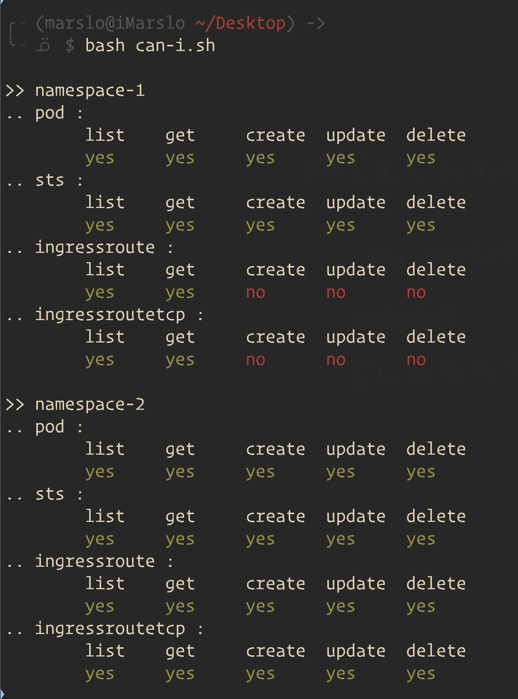

<!-- START doctoc generated TOC please keep comment here to allow auto update -->
<!-- DON'T EDIT THIS SECTION, INSTEAD RE-RUN doctoc TO UPDATE -->

- [oneline command](#oneline-command)
  - [create](#create)
  - [pods and containers](#pods-and-containers)
    - [windows pod](#windows-pod)
    - [static pod](#static-pod)
    - [nodeAffinity](#nodeaffinity)
    - [pod with termination message](#pod-with-termination-message)
    - [pod with quota](#pod-with-quota)
    - [pod with two containers](#pod-with-two-containers)
    - [initContainers](#initcontainers)
    - [share process namespace](#share-process-namespace)
    - [memory-request-list](#memory-request-list)
  - [deploy](#deploy)
  - [daemonset](#daemonset)
    - [problem detector](#problem-detector)
    - [`secretRef`: env with secrets in pod](#secretref-env-with-secrets-in-pod)
    - [envvars](#envvars)
    - [probe](#probe)
  - [AdmissionConfiguration](#admissionconfiguration)
  - [pv](#pv)
    - [pv pod](#pv-pod)
    - [pvc](#pvc)
  - [cm](#cm)
  - [ClusterRole](#clusterrole)
  - [namesapce](#namesapce)
    - [pod security standards with namespace labels](#pod-security-standards-with-namespace-labels)
- [kubectl](#kubectl)
  - [disable daemonset](#disable-daemonset)
  - [Using set commands to modify objects before creation](#using-set-commands-to-modify-objects-before-creation)
  - [Using --edit to modify objects before creation](#using---edit-to-modify-objects-before-creation)
  - [secrets](#secrets)
    - [via kubectl](#via-kubectl)
    - [via config file](#via-config-file)
    - [via cmd](#via-cmd)
  - [auth](#auth)
    - [`auth can-i`](#auth-can-i)
- [kubecolor](#kubecolor)

<!-- END doctoc generated TOC please keep comment here to allow auto update -->

> [!NOTE|label:references:]
> - [* kubectl Cheat Sheet](https://kubernetes.io/docs/reference/kubectl/cheatsheet/)
> - [* Cheatsheet - Kubectl](https://dockerlabs.collabnix.com/kubernetes/cheatsheets/kubectl.html)
> - [* kubectl cheatsheet](https://kapeli.com/cheat_sheets/Kubernetes.docset/Contents/Resources/Documents/index)
> - [* Configure Pods and Containers](https://kubernetes.io/docs/tasks/configure-pod-container/)
> - [* user-guide/kubectl-cheatsheet.md](https://github.com/fabric8io/kansible/blob/master/vendor/k8s.io/kubernetes/docs/user-guide/kubectl-cheatsheet.md)
> - [Assign Memory Resources to Containers and Pods](https://kubernetes.io/docs/tasks/configure-pod-container/assign-memory-resource/)
> - [Imperative Commands](https://kubernetes.io/docs/tasks/manage-kubernetes-objects/imperative-command/)
>   - [How to create objects](https://kubernetes.io/docs/tasks/manage-kubernetes-objects/imperative-command/#how-to-create-objects)
>     - `run`: Create a new Pod to run a Container.
>     - `expose`: Create a new Service object to load balance traffic across Pods.
>     - `autoscale`: Create a new Autoscaler object to automatically horizontally scale a controller, such as a Deployment.
>     - `create`: `create <objecttype> [<subtype>] <instancename>`
>       - i.e.: `kubectl create service nodeport <myservicename>`
>   - [How to update objects](https://kubernetes.io/docs/tasks/manage-kubernetes-objects/imperative-command/#how-to-update-objects)
>     - `scale` : Horizontally scale a controller to add or remove Pods by updating the replica count of the controller.
>     - `annotate` : Add or remove an annotation from an object.
>     - `label` : Add or remove a label from an object.
>     - `set <field>` : `Set an aspect of an object.`
>     - `edit` : Directly edit the raw configuration of a live object by opening its configuration in an editor.
>     - `patch` : Directly modify specific fields of a live object by using a patch string. For more details on patch strings, see the patch section in [API Conventions](https://git.k8s.io/community/contributors/devel/sig-architecture/api-conventions.md#patch-operations).
>   - [How to view an object](https://kubernetes.io/docs/tasks/manage-kubernetes-objects/imperative-command/#how-to-view-an-object)
>     - `get`
>     - `describe`
>     - `logs`

# oneline command
## create

> [!NOTE|label:references:]
> - [Authorization Overview](https://kubernetes.io/docs/reference/access-authn-authz/authorization/)

```bash
$ kubectl create -f - -o yaml << EOF
apiVersion: authorization.k8s.io/v1
kind: SelfSubjectAccessReview
spec:
  resourceAttributes:
    group: apps
    resource: deployments
    verb: create
    namespace: dev
EOF
```

- [or](https://kubernetes.io/docs/reference/kubectl/cheatsheet/#creating-objects)
  ```bash
  $ kubectl apply -f - <<EOF
  apiVersion: v1
  kind: Secret
  metadata:
    name: mysecret
  type: Opaque
  data:
    password: $(echo -n "s33msi4" | base64 -w0)
    username: $(echo -n "jane" | base64 -w0)
  EOF
  ```

- [or](https://github.com/fabric8io/kansible/blob/master/vendor/k8s.io/kubernetes/docs/user-guide/kubectl-cheatsheet.md)
  ```bash
  $ cat <<EOF | kubectl create -f -
  apiVersion: v1
  kind: Pod
  metadata:
    name: busybox-sleep
  spec:
    containers:
    - name: busybox
      image: busybox
      args:
      - sleep
      - "1000000"
  ---
  apiVersion: v1
  kind: Pod
  metadata:
    name: busybox-sleep-less
  spec:
    containers:
    - name: busybox
      image: busybox
      args:
      - sleep
      - "1000"
  EOF

  # Create a secret with several keys
  $ cat <<EOF | kubectl create -f -
  apiVersion: v1
  kind: Secret
  metadata:
    name: mysecret
  type: Opaque
  data:
    password: $(echo "s33msi4" | base64)
    username: $(echo "jane" | base64)
  EOF
  ```

## [pods and containers](https://kubernetes.io/docs/tasks/configure-pod-container/)

### [windows pod](https://kubernetes.io/docs/tasks/configure-pod-container/configure-runasusername/)
```yaml
apiVersion: v1
kind: Pod
metadata:
  name: run-as-username-pod-demo
spec:
  securityContext:
    windowsOptions:
      runAsUserName: "ContainerUser"
  containers:
  - name: run-as-username-demo
    image: mcr.microsoft.com/windows/servercore:ltsc2019
    command: ["ping", "-t", "localhost"]
  nodeSelector:
    kubernetes.io/os: windows
```

### [static pod](https://kubernetes.io/docs/tasks/configure-pod-container/static-pod/)
```yaml
$ mkdir -p /etc/kubernetes/manifests/
$ cat <<EOF >/etc/kubernetes/manifests/static-web.yaml
apiVersion: v1
kind: Pod
metadata:
  name: static-web
  labels:
    role: myrole
spec:
  containers:
    - name: web
      image: nginx
      ports:
        - name: web
          containerPort: 80
          protocol: TCP
EOF
```


### [nodeAffinity](https://kubernetes.io/docs/tasks/configure-pod-container/assign-pods-nodes-using-node-affinity/)
```yaml
apiVersion: v1
kind: Pod
metadata:
  name: nginx
spec:
  affinity:
    nodeAffinity:
      requiredDuringSchedulingIgnoredDuringExecution:
        nodeSelectorTerms:
        - matchExpressions:
          - key: disktype
            operator: In
            values:
            - ssd
  containers:
  - name: nginx
    image: nginx
    imagePullPolicy: IfNotPresent
```

### [pod with termination message](https://kubernetes.io/docs/tasks/debug/debug-application/determine-reason-pod-failure/)
```yaml
apiVersion: v1
kind: Pod
metadata:
  name: termination-demo
spec:
  containers:
  - name: termination-demo-container
    image: debian
    command: ["/bin/sh"]
    args: ["-c", "sleep 10 && echo Sleep expired > /dev/termination-log"]
```

### [pod with quota](https://kubernetes.io/docs/tasks/debug/debug-application/debug-running-pod/)
```yaml
apiVersion: apps/v1
kind: Deployment
metadata:
  name: nginx-deployment
spec:
  selector:
    matchLabels:
      app: nginx
  replicas: 2
  template:
    metadata:
      labels:
        app: nginx
    spec:
      containers:
      - name: nginx
        image: nginx
        resources:
          limits:
            memory: "128Mi"
            cpu: "500m"
        ports:
        - containerPort: 80
```

- or [pods quotation](https://kubernetes.io/docs/tasks/administer-cluster/manage-resources/quota-pod-namespace/)
  ```yaml
  apiVersion: v1
  kind: ResourceQuota
  metadata:
    name: pod-demo
  spec:
    hard:
      pods: "2"
  ```

### [pod with two containers](https://kubernetes.io/docs/tasks/access-application-cluster/communicate-containers-same-pod-shared-volume/)
```bash
apiVersion: v1
kind: Pod
metadata:
  name: two-containers
spec:
  restartPolicy: Never
  volumes:
  - name: shared-data
    emptyDir: {}
  containers:
  - name: nginx-container
    image: nginx
    volumeMounts:
    - name: shared-data
      mountPath: /usr/share/nginx/html
  - name: debian-container
    image: debian
    volumeMounts:
    - name: shared-data
      mountPath: /pod-data
    command: ["/bin/sh"]
    args: ["-c", "echo Hello from the debian container > /pod-data/index.html"]
```

### [initContainers](https://kubernetes.io/docs/tasks/configure-pod-container/configure-pod-initialization/)
```yaml
apiVersion: v1
kind: Pod
metadata:
  name: init-demo
spec:
  containers:
  - name: nginx
    image: nginx
    ports:
    - containerPort: 80
    volumeMounts:
    - name: workdir
      mountPath: /usr/share/nginx/html
  # These containers are run during pod initialization
  initContainers:
  - name: install
    image: busybox:1.28
    command:
    - wget
    - "-O"
    - "/work-dir/index.html"
    - http://info.cern.ch
    volumeMounts:
    - name: workdir
      mountPath: "/work-dir"
  dnsPolicy: Default
  volumes:
  - name: workdir
    emptyDir: {}
```

### [share process namespace](https://kubernetes.io/docs/tasks/configure-pod-container/share-process-namespace/)
```yaml
apiVersion: v1
kind: Pod
metadata:
  name: nginx
spec:
  shareProcessNamespace: true
  containers:
  - name: nginx
    image: nginx
  - name: shell
    image: busybox:1.28
    securityContext:
      capabilities:
        add:
        - SYS_PTRACE
    stdin: true
    tty: true
```

### [memory-request-list](https://kubernetes.io/docs/tasks/configure-pod-container/assign-memory-resource/)
```yaml
apiVersion: v1
kind: Pod
metadata:
  name: memory-demo
  namespace: mem-example
spec:
  containers:
  - name: memory-demo-ctr
    image: polinux/stress
    resources:
      requests:
        memory: "100Mi"
      limits:
        memory: "200Mi"
    command: ["stress"]
    args: ["--vm", "1", "--vm-bytes", "150M", "--vm-hang", "1"]
```

## [deploy](https://kubernetes.io/docs/tasks/manage-kubernetes-objects/declarative-config/)
```yaml
apiVersion: apps/v1
kind: Deployment
metadata:
  name: nginx-deployment
spec:
  selector:
    matchLabels:
      app: nginx
  minReadySeconds: 5
  template:
    metadata:
      labels:
        app: nginx
    spec:
      containers:
      - name: nginx
        image: nginx:1.14.2
        ports:
        - containerPort: 80
```

## daemonset
### [problem detector](https://kubernetes.io/docs/tasks/debug/debug-cluster/monitor-node-health/)
- ds
  ```yaml
  apiVersion: apps/v1
  kind: DaemonSet
  metadata:
    name: node-problem-detector-v0.1
    namespace: kube-system
    labels:
      k8s-app: node-problem-detector
      version: v0.1
      kubernetes.io/cluster-service: "true"
  spec:
    selector:
      matchLabels:
        k8s-app: node-problem-detector
        version: v0.1
        kubernetes.io/cluster-service: "true"
    template:
      metadata:
        labels:
          k8s-app: node-problem-detector
          version: v0.1
          kubernetes.io/cluster-service: "true"
      spec:
        hostNetwork: true
        containers:
        - name: node-problem-detector
          image: registry.k8s.io/node-problem-detector:v0.1
          securityContext:
            privileged: true
          resources:
            limits:
              cpu: "200m"
              memory: "100Mi"
            requests:
              cpu: "20m"
              memory: "20Mi"
          volumeMounts:
          - name: log
            mountPath: /log
            readOnly: true
        volumes:
        - name: log
          hostPath:
            path: /var/log/
  ```

- cm
  ```yaml
  apiVersion: apps/v1
  kind: DaemonSet
  metadata:
    name: node-problem-detector-v0.1
    namespace: kube-system
    labels:
      k8s-app: node-problem-detector
      version: v0.1
      kubernetes.io/cluster-service: "true"
  spec:
    selector:
      matchLabels:
        k8s-app: node-problem-detector
        version: v0.1
        kubernetes.io/cluster-service: "true"
    template:
      metadata:
        labels:
          k8s-app: node-problem-detector
          version: v0.1
          kubernetes.io/cluster-service: "true"
      spec:
        hostNetwork: true
        containers:
        - name: node-problem-detector
          image: registry.k8s.io/node-problem-detector:v0.1
          securityContext:
            privileged: true
          resources:
            limits:
              cpu: "200m"
              memory: "100Mi"
            requests:
              cpu: "20m"
              memory: "20Mi"
          volumeMounts:
          - name: log
            mountPath: /log
            readOnly: true
          - name: config # Overwrite the config/ directory with ConfigMap volume
            mountPath: /config
            readOnly: true
        volumes:
        - name: log
          hostPath:
            path: /var/log/
        - name: config # Define ConfigMap volume
          configMap:
            name: node-problem-detector-config
  ```

### [`secretRef`: env with secrets in pod](https://kubernetes.io/docs/tasks/inject-data-application/distribute-credentials-secure/#create-a-secret-directly-with-kubectl)
- single secret
  ```bash
  $ kubectl create secret generic backend-user --from-literal=backend-username='backend-admin'

  $ cat << EOF | kubectl apply -f -
  apiVersion: v1
  kind: Pod
  metadata:
    name: env-single-secret
  spec:
    containers:
    - name: envars-test-container
      image: nginx
      env:
      - name: SECRET_USERNAME
        valueFrom:
          secretKeyRef:
            name: backend-user
            key: backend-username
  EOF

  $ kubectl exec -i -t env-single-secret -- /bin/sh -c 'echo $SECRET_USERNAME'
  backend-admin
  ```

- multiple secrets
  ```bash
  $ kubectl create secret generic backend-user --from-literal=backend-username='backend-admin'
  $ kubectl create secret generic db-user --from-literal=db-username='db-admin'

  $ cat << EOF | kubectl apply -f -
    apiVersion: v1
    kind: Pod
    metadata:
      name: envvars-multiple-secrets
    spec:
      containers:
      - name: envars-test-container
        image: nginx
        env:
        - name: BACKEND_USERNAME
          valueFrom:
            secretKeyRef:
              name: backend-user
              key: backend-username
        - name: DB_USERNAME
          valueFrom:
            secretKeyRef:
              name: db-user
              key: db-username
  EOF

  $ kubectl exec -i -t envvars-multiple-secrets -- /bin/sh -c 'env | grep _USERNAME'
  DB_USERNAME=db-admin
  BACKEND_USERNAME=backend-admin
  ```

- from secret
  ```bash
  $ kubectl create secret generic test-secret \
            --from-literal=username='my-app' \
            --from-literal=password='39528$vdg7Jb'

  $ cat << EOF | kubectl apply -f -
  apiVersion: v1
  kind: Pod
  metadata:
    name: envfrom-secret
  spec:
    containers:
    - name: envars-test-container
      image: nginx
      envFrom:
      - secretRef:
          name: test-secret
  EOF

  $ kubectl exec -i -t envfrom-secret -- /bin/sh -c 'echo "username: $username\npassword: $password\n"'
  username: my-app
  password: 39528$vdg7Jb
  ```

### [envvars](https://kubernetes.io/docs/tasks/inject-data-application/define-interdependent-environment-variables/)
```yaml
apiVersion: v1
kind: Pod
metadata:
  name: dependent-envars-demo
spec:
  containers:
    - name: dependent-envars-demo
      args:
        - while true; do echo -en '\n'; printf UNCHANGED_REFERENCE=$UNCHANGED_REFERENCE'\n'; printf SERVICE_ADDRESS=$SERVICE_ADDRESS'\n';printf ESCAPED_REFERENCE=$ESCAPED_REFERENCE'\n'; sleep 30; done;
      command:
        - sh
        - -c
      image: busybox:1.28
      env:
        - name: SERVICE_PORT
          value: "80"
        - name: SERVICE_IP
          value: "172.17.0.1"
        - name: UNCHANGED_REFERENCE
          value: "$(PROTOCOL)://$(SERVICE_IP):$(SERVICE_PORT)"
        - name: PROTOCOL
          value: "https"
        - name: SERVICE_ADDRESS
          value: "$(PROTOCOL)://$(SERVICE_IP):$(SERVICE_PORT)"
        - name: ESCAPED_REFERENCE
          value: "$$(PROTOCOL)://$(SERVICE_IP):$(SERVICE_PORT)"
```

### [probe](https://kubernetes.io/docs/tasks/configure-pod-container/configure-liveness-readiness-startup-probes/)
```yaml
apiVersion: v1
kind: Pod
metadata:
  labels:
    test: liveness
  name: liveness-exec
spec:
  containers:
  - name: liveness
    image: registry.k8s.io/busybox
    args:
    - /bin/sh
    - -c
    - touch /tmp/healthy; sleep 30; rm -f /tmp/healthy; sleep 600
    livenessProbe:
      exec:
        command:
        - cat
        - /tmp/healthy
      initialDelaySeconds: 5
      periodSeconds: 5
```

## [AdmissionConfiguration](https://kubernetes.io/docs/tasks/configure-pod-container/enforce-standards-admission-controller/)

> [!NOTE]
> - [Migrate from PodSecurityPolicy to the Built-In PodSecurity Admission Controller](https://kubernetes.io/docs/tasks/configure-pod-container/migrate-from-psp/)

```yaml
apiVersion: apiserver.config.k8s.io/v1 # see compatibility note
kind: AdmissionConfiguration
plugins:
- name: PodSecurity
  configuration:
    apiVersion: pod-security.admission.config.k8s.io/v1
    kind: PodSecurityConfiguration
    # Defaults applied when a mode label is not set.
    #
    # Level label values must be one of:
    # - "privileged" (default)
    # - "baseline"
    # - "restricted"
    #
    # Version label values must be one of:
    # - "latest" (default)
    # - specific version like "v1.27"
    defaults:
      enforce: "privileged"
      enforce-version: "latest"
      audit: "privileged"
      audit-version: "latest"
      warn: "privileged"
      warn-version: "latest"
    exemptions:
      # Array of authenticated usernames to exempt.
      usernames: []
      # Array of runtime class names to exempt.
      runtimeClasses: []
      # Array of namespaces to exempt.
      namespaces: []
```


## [pv](https://kubernetes.io/docs/tasks/configure-pod-container/configure-persistent-volume-storage/)
```yaml
apiVersion: v1
kind: PersistentVolume
metadata:
  name: task-pv-volume
  labels:
    type: local
spec:
  storageClassName: manual
  capacity:
    storage: 10Gi
  accessModes:
    - ReadWriteOnce
  hostPath:
    path: "/mnt/data"
```

### [pv pod](https://kubernetes.io/docs/tasks/configure-pod-container/configure-persistent-volume-storage/)
```yaml
apiVersion: v1
kind: Pod
metadata:
  name: task-pv-pod
spec:
  volumes:
    - name: task-pv-storage
      persistentVolumeClaim:
        claimName: task-pv-claim
  containers:
    - name: task-pv-container
      image: nginx
      ports:
        - containerPort: 80
          name: "http-server"
      volumeMounts:
        - mountPath: "/usr/share/nginx/html"
          name: task-pv-storage
```

### [pvc](https://kubernetes.io/docs/tasks/configure-pod-container/configure-persistent-volume-storage/)
```yaml
apiVersion: v1
kind: PersistentVolumeClaim
metadata:
  name: task-pv-claim
spec:
  storageClassName: manual
  accessModes:
    - ReadWriteOnce
  resources:
    requests:
      storage: 3Gi
```

## [cm](https://kubernetes.io/docs/tasks/configure-pod-container/configure-pod-configmap/)
```yaml
# Download the sample files into `configure-pod-container/configmap/` directory
wget https://kubernetes.io/examples/configmap/game.properties -O configure-pod-container/configmap/game.properties
wget https://kubernetes.io/examples/configmap/ui.properties -O configure-pod-container/configmap/ui.properties

# Create the ConfigMap
kubectl create configmap game-config --from-file=configure-pod-container/configmap/
```

## [ClusterRole](https://kubernetes.io/docs/reference/access-authn-authz/authentication/)
```yaml
apiVersion: rbac.authorization.k8s.io/v1
kind: ClusterRole
metadata:
  name: impersonator
rules:
- apiGroups: [""]
  resources: ["users", "groups", "serviceaccounts"]
  verbs: ["impersonate"]

# or
apiVersion: rbac.authorization.k8s.io/v1
kind: ClusterRole
metadata:
  name: scopes-and-uid-impersonator
rules:
# Can set "Impersonate-Extra-scopes" header and the "Impersonate-Uid" header.
- apiGroups: ["authentication.k8s.io"]
  resources: ["userextras/scopes", "uids"]
  verbs: ["impersonate"]

# or
apiVersion: rbac.authorization.k8s.io/v1
kind: ClusterRole
metadata:
  name: limited-impersonator
rules:
# Can impersonate the user "jane.doe@example.com"
- apiGroups: [""]
  resources: ["users"]
  verbs: ["impersonate"]
  resourceNames: ["jane.doe@example.com"]

# Can impersonate the groups "developers" and "admins"
- apiGroups: [""]
  resources: ["groups"]
  verbs: ["impersonate"]
  resourceNames: ["developers","admins"]

# Can impersonate the extras field "scopes" with the values "view" and "development"
- apiGroups: ["authentication.k8s.io"]
  resources: ["userextras/scopes"]
  verbs: ["impersonate"]
  resourceNames: ["view", "development"]

# Can impersonate the uid "06f6ce97-e2c5-4ab8-7ba5-7654dd08d52b"
- apiGroups: ["authentication.k8s.io"]
  resources: ["uids"]
  verbs: ["impersonate"]
  resourceNames: ["06f6ce97-e2c5-4ab8-7ba5-7654dd08d52b"]
```

## namesapce
### [pod security standards with namespace labels](https://kubernetes.io/docs/tasks/configure-pod-container/enforce-standards-namespace-labels/)
```yaml
apiVersion: v1
kind: Namespace
metadata:
  name: my-baseline-namespace
  labels:
    pod-security.kubernetes.io/enforce: baseline
    pod-security.kubernetes.io/enforce-version: v1.27

    # We are setting these to our _desired_ `enforce` level.
    pod-security.kubernetes.io/audit: restricted
    pod-security.kubernetes.io/audit-version: v1.27
    pod-security.kubernetes.io/warn: restricted
    pod-security.kubernetes.io/warn-version: v1.27
```

# kubectl
## disable daemonset

> [!NOTE|label:referfences:]
> - [how to scale kubernetes daemonset to 0?](https://stackoverflow.com/a/57533340/2940319)

```bash
$ kubectl patch daemonset <name-of-daemon-set> \
          -n <namespace> \
          -p '{"spec": {"template": {"spec": {"nodeSelector": {"non-existing": "true"}}}}}'
```

## [Using set commands to modify objects before creation](https://kubernetes.io/docs/tasks/manage-kubernetes-objects/imperative-command/#using-set-commands-to-modify-objects-before-creation)
```bash
$ kubectl create service clusterip my-svc --clusterip="None" -o yaml --dry-run=client |
  kubectl set selector --local -f - 'environment=qa' -o yaml |
  kubectl create -f -
```

## [Using --edit to modify objects before creation](https://kubernetes.io/docs/tasks/manage-kubernetes-objects/imperative-command/#using-edit-to-modify-objects-before-creation)
```bash
$ kubectl create service clusterip my-svc --clusterip="None" -o yaml --dry-run=client > /tmp/srv.yaml
$ kubectl create --edit -f /tmp/srv.yaml
```

## secrets

> [!NOTE|label:referencs:]
> - [Managing Secrets using kubectl](https://kubernetes.io/docs/tasks/configmap-secret/managing-secret-using-kubectl/)
> - [Managing Secrets using Configuration File](https://kubernetes.io/docs/tasks/configmap-secret/managing-secret-using-config-file/)

### via kubectl
```bash
# with raw data
$ kubectl create secret generic db-user-pass \
          --from-literal=username=admin \
          --from-literal=password='S!B\*d$zDsb='

# with source file
$ echo -n 'admin' > ./username.txt
$ echo -n 'S!B\*d$zDsb=' > ./password.txt

$ kubectl create secret generic db-user-pass \
          --from-file=./username.txt \
          --from-file=./password.txt
# or
$ kubectl create secret generic db-user-pass \
          --from-file=username=./username.txt \
          --from-file=password=./password.txt
```

### via config file
```bash
$ echo -n 'admin'        | base64   # YWRtaW4=
$ echo -n '1f2d1e2e67df' | base64   # MWYyZDFlMmU2N2Rm

$ cat << EOF | kubectl create -f -
apiVersion: v1
kind: Secret
metadata:
  name: mysecret
type: Opaque
data:
  username: YWRtaW4=
  password: MWYyZDFlMmU2N2Rm
EOF

# or : https://kapeli.com/cheat_sheets/Kubernetes.docset/Contents/Resources/Documents/index
$ cat << EOF | kubectl create -f -
apiVersion: v1
kind: Secret
metadata:
  name: mysecret
type: Opaque
data:
  password: $(echo "admin" | base64)
  username: $(echo "1f2d1e2e67df" | base64)
EOF
```

### [via cmd](https://kubernetes.io/docs/tasks/inject-data-application/distribute-credentials-secure/#create-a-secret-directly-with-kubectl)
```bash
$ kubectl create secret generic test-secret \
          --from-literal='username=my-app' \
          --from-literal='password=39528$vdg7Jb'
```

## auth

> [!NOTE|label:references:]
> - [Adding permission to exec commands in containers inside pods in a certain namespace](https://discuss.kubernetes.io/t/adding-permission-to-exec-commands-in-containers-inside-pods-in-a-certain-namespace/22821)

### `auth can-i`

> [!NOTE|label:references:]
> - [kubectl-auth-can-i - Man Page](https://www.mankier.com/1/kubectl-auth-can-i)
> - [printTable](https://stackoverflow.com/a/49180405/2940319)

```bash
$ namespace='test'
$ kubectl auth can-i get pods -n "${namespace}"
yes
$ kubectl auth can-i list pods -n "${namespace}"
yes
$ kubectl auth can-i create pods -n "${namespace}"
yes
$ kubectl auth can-i create pods/exec -n "${namespace}"
yes
$ kubectl auth can-i get pods/exec -n "${namespace}"
yes
$ kubectl auth can-i create pods --subresource=exec -n "${namespace}"
no
$ kubectl auth can-i get pods --subresource=exec -n "${namespace}"
no
```

- or
  ```bash
  #!/usr/bin/env bash
  # shellcheck disable=SC2086,SC1090

  source ~/.marslo/bin/bash-color.sh

  while read -r namespace; do
    actions='list get create update delete'
    components='pod sts ingressroute ingressroutetcp'
    echo -e "\n>> ${namespace}";
    for _c in $components; do
      echo ".. ${_c} :";
      res='';
      for _a in $actions; do
        r="$(kubectl auth can-i ${_a} ${_c} -n ${namespace})";
        [[ 'yes' = "${r}" ]] && r="$(c Gs)${r}$(c)" || r="$(c Rs)${r}$(c)";
        res+="${r}\t";
      done;
      echo -e "\t${actions}" | tr ' ' '\t';
      echo -e "\t${res}";
    done;

  done< <(echo namespace-1 namespace-2 namespace-3 namespace-4 namespace-5 | fmt -1)
  ```

  

- more
  ```bash
  $ while read -r namespace; do
     echo -e "\n>> ${namespace}";
     echo "pod :";
     echo ".. pod list: $(kubectl auth can-i list pods -n ${namespace})";
     echo ".. pod create: $(kubectl auth can-i create pods -n ${namespace})";
     echo ".. pod create exec: $(kubectl auth can-i create pods --subresource=exec -n ${namespace})";
     echo ".. pod get exec : $(kubectl auth can-i get pods --subresource=exec -n ${namespace})";
     echo "statefulset :";
     echo ".. sts get : $(kubectl auth can-i get statefulset -n ${namespace})";
     echo ".. sts list : $(kubectl auth can-i list statefulset -n ${namespace})";
     echo ".. sts create : $(kubectl auth can-i create statefulset -n ${namespace})";
     echo "ingressroute :";
     echo ".. ingressroute : $(kubectl auth can-i get ingressroute -n ${namespace})";
     echo ".. ingressroutetcp : $(kubectl auth can-i get ingressroutetcp -n ${namespace})";
   done< <(echo namespace-1 namespace-2 namespace-3 namespace-4 namespace-5 | fmt -1)
  ```

# kubecolor

> [!NOTE|label:references:]
> - [hidetatz/kubecolor](https://github.com/hidetatz/kubecolor)

- [* iMarslo: devenv/go](../../linux/devenv.html#go)
- kubecolor
  ```bash
  # install via go
  $ go install github.com/hidetatz/kubecolor/cmd/kubecolor@latest
  # or
  $ go get -u github.com/hidetatz/kubecolor/cmd/kubecolor

  # brew
  $ brew install hidetatz/tap/kubecolor
  ```

- config
  ```bash
  # autocomplete
  $ cat >> ~/.bashrc << EOF
  alias k='kubecolor '
  alias kubectl='kubecolor '
  alias kc='kubecolor -n kube-system'

  complete -o default -F __start_kubectl kubecolor
  while read -r _i; do
    complete -o default -F __start_kubectl "${_i}"
  done < <(alias | sed -rn "s:^alias.(.+)=.kubec.+.$:\1:p)
  EOF
  ```
