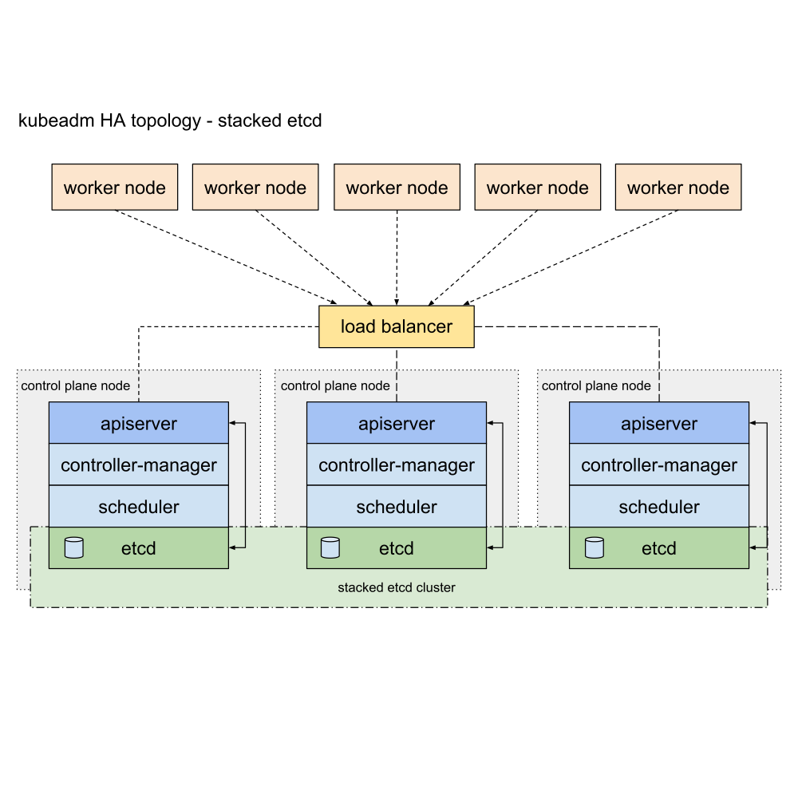

<!-- START doctoc generated TOC please keep comment here to allow auto update -->
<!-- DON'T EDIT THIS SECTION, INSTEAD RE-RUN doctoc TO UPDATE -->
**Table of Contents**  *generated with [DocToc](https://github.com/thlorenz/doctoc)*

- [extenal etcd](#extenal-etcd)
  - [certificates](#certificates)
    - [certificate signing request](#certificate-signing-request)
  - [configuration](#configuration)
    - [enable service](#enable-service)
  - [verify](#verify)

<!-- END doctoc generated TOC please keep comment here to allow auto update -->



- [extenal etcd topology](https://kubernetes.io/docs/setup/production-environment/tools/kubeadm/ha-topology/#external-etcd-topology) certificates located in : `/etc/etcd/ssl`


> You need:
> - Three or more machines that meet kubeadm's minimum requirements for the control-plane nodes. Having an odd number of control plane nodes can help with leader selection in the case of machine or zone failure.
>   - including a container runtime, already set up and working
> - Three or more machines that meet kubeadm's minimum requirements for the workers
>   - including a container runtime, already set up and working
> - Full network connectivity between all machines in the cluster (public or private network)
> - Superuser privileges on all machines using sudo
>   - You can use a different tool; this guide uses sudo in the examples.
> - SSH access from one device to all nodes in the system
> - kubeadm and kubelet already installed on all machines.
>
> And you also need:
> - Three or more additional machines, that will become etcd cluster members. Having an odd number of members in the etcd cluster is a requirement for achieving optimal voting quorum.
>   - These machines again need to have kubeadm and kubelet installed.
>   - These machines also require a container runtime, that is already set up and working.
>
> See External etcd topology for context.

- [stacked etcd topology](https://kubernetes.io/docs/setup/production-environment/tools/kubeadm/ha-topology/#stacked-etcd-topology) certificates located in : `/etc/kubernetes/pki/etcd`


> You need:
> - Three or more machines that meet kubeadm's minimum requirements for the control-plane nodes. Having an odd number of control plane nodes can help with leader selection in the case of machine or zone failure.
>   - including a container runtime, already set up and working
> - Three or more machines that meet kubeadm's minimum requirements for the workers
>   - including a container runtime, already set up and working
> - Full network connectivity between all machines in the cluster (public or private network)
> - Superuser privileges on all machines using sudo
>   - You can use a different tool; this guide uses sudo in the examples.
> - SSH access from one device to all nodes in the system
> - kubeadm and kubelet already installed on all machines.
>
> See Stacked etcd topology for context.




> references:
> - [Clustering Guide](https://etcd.io/docs/v2.3/clustering/)
> - [clustering.md](https://github.com/etcd-io/etcd/blob/release-3.4/Documentation/op-guide/clustering.md)
> - [Setting up Etcd Cluster with TLS Authentication Enabled](https://medium.com/nirman-tech-blog/setting-up-etcd-cluster-with-tls-authentication-enabled-49c44e4151bb)
> - [CONFIGURING ETCD RBAC](https://docs.projectcalico.org/reference/etcd-rbac/)
> - [Deploy a secure etcd cluster](https://pcocc.readthedocs.io/en/latest/deps/etcd-production.html)
> - [Set up a High Availability etcd Cluster with kubeadm](https://kubernetes.io/docs/setup/production-environment/tools/kubeadm/setup-ha-etcd-with-kubeadm/)
> - [Creating Highly Available Clusters with kubeadm](https://kubernetes.io/docs/setup/production-environment/tools/kubeadm/high-availability/)



# extenal etcd
## certificates
```bash
$ sudo mkdir -p /etc/etcd/ssl
```

### certificate signing request


> generate the etcd certificates in major kubernetes master. and sync to the others following kuberentes masters.


```bash
$ sudo bash -c 'cat > /etc/etcd/ssl/ca-config.json' << EOF
{
    "signing": {
        "default": {
            "expiry": "43800h"
        },
        "profiles": {
            "server": {
                "expiry": "43800h",
                "usages": [
                    "signing",
                    "key encipherment",
                    "server auth",
                    "client auth"
                ]
            },
            "client": {
                "expiry": "43800h",
                "usages": [
                    "signing",
                    "key encipherment",
                    "client auth"
                ]
            },
            "peer": {
                "expiry": "43800h",
                "usages": [
                    "signing",
                    "key encipherment",
                    "server auth",
                    "client auth"
                ]
            }
        }
    }
}
EOF
```

- ca
  ```bash
  $ sudo bash -c 'cat > /etc/etcd/ssl/ca-csr.json' << EOF
  {
      "CN": "etcd",
      "key": {
          "algo": "rsa",
          "size": 2048
      }
  }
  EOF

  $ sudo /usr/local/bin/cfssl gencert \
         -initca ca-csr.json \
         | sudo /usr/local/bin/cfssljson -bare ca -
  ```

- client
  ```bash
  $ sudo bash -c 'cat > /etc/etcd/ssl/client.json' << EOF
  {
      "CN": "client",
      "key": {
          "algo": "ecdsa",
          "size": 256
      }
  }
  EOF

  $ sudo /usr/local/bin/cfssl gencert \
         -ca=ca.pem \
         -ca-key=ca-key.pem \
         -config=ca-config.json \
         -profile=client client.json \
         | sudo /usr/local/bin/cfssljson -bare client
  ```

- result
  ```bash
  $ ls
  ca-config.json  ca.csr  ca-csr.json  ca-key.pem  ca.pem  client.csr  client.json  client-key.pem  client.pem
  ```

- sync to the others masters
  ```bash
  $ for _host in master02 master03; do
      ssh ${_host} 'sudo mkdir -p /etc/etcd/ssl'
      rsync -avzrlpgoDP \
            --rsync-path='sudo rsync' \
            /etc/etcd/ssl/*.pem \
            ${_host}:/etc/etcd/ssl/
      rsync -avzrlpgoDP \
            --rsync-path='sudo rsync' \
            /etc/etcd/ssl/ca-config.json \
            ${_host}:/etc/etcd/ssl/
    done
  ```

## configuration
- `etcd.service`
  ```bash
  $ sudo bash -c 'cat >/etc/systemd/system/etcd.service' << EOF
  [Install]
  WantedBy=multi-user.target

  [Unit]
  Description=Etcd Server
  Documentation=https://github.com/marslo/mytools
  Conflicts=etcd.service
  Conflicts=etcd2.service

  [Service]
  Type=notify
  WorkingDirectory=/var/lib/etcd/
  Restart=always
  RestartSec=5s
  EnvironmentFile=-/etc/etcd/etcd.conf
  ExecStart=/bin/bash -c "GOMAXPROCS=$(nproc) /usr/local/bin/etcd"
  Restart=on-failure
  RestartSec=5
  LimitNOFILE=65536

  [Install]
  WantedBy=multi-user.target
  EOF
  ```

- `etcd.conf`
  ```bash
  $ etcdInitialCluster="master01=https://192.168.100.200:2380"
  etcdInitialCluster+=",master02=https://192.168.100.201:2380"
  etcdInitialCluster+=",master03=https://192.168.100.202:2380"

  $ interface=$(netstat -nr | grep -E 'UG|UGSc' | grep -E '^0.0.0|default' | grep -E '[0-9.]{7,15}' | awk -F' ' '{print $NF}')
  $ ipAddr=$(ip a s "${interface}" | sed -rn 's|\W*inet[^6]\W*([0-9\.]{7,15}).*$|\1|p')

  $ sudo bash -c 'cat > /etc/etcd/etcd.conf' << EOF
  ETCD_NAME=$(hostname)
  ETCD_DATA_DIR="/var/lib/etcd/default.etcd"
  #ETCD_WAL_DIR=""
  #ETCD_SNAPSHOT_COUNT="10000"
  #ETCD_HEARTBEAT_INTERVAL="100"
  #ETCD_ELECTION_TIMEOUT="1000"
  ETCD_LISTEN_PEER_URLS="https://0.0.0.0:2380"
  ETCD_LISTEN_CLIENT_URLS="https://0.0.0.0:2379"
  #ETCD_MAX_SNAPSHOTS="5"
  #ETCD_MAX_WALS="5"
  #ETCD_CORS=""

  #[cluster]
  ETCD_INITIAL_ADVERTISE_PEER_URLS="https://${ipAddr}:2380"
  # if you use different ETCD_NAME (e.g. test), set ETCD_INITIAL_CLUSTER value for this name, i.e. "test=http://
  ..."
  ETCD_INITIAL_CLUSTER="${etcdInitialCluster}"
  ETCD_INITIAL_CLUSTER_STATE="new"
  ETCD_INITIAL_CLUSTER_TOKEN="etcd-cluster"
  ETCD_ADVERTISE_CLIENT_URLS="https://${ipAddr}:2379"
  #ETCD_DISCOVERY=""
  #ETCD_DISCOVERY_SRV=""
  #ETCD_DISCOVERY_FALLBACK="proxy"
  #ETCD_DISCOVERY_PROXY=""
  #ETCD_STRICT_RECONFIG_CHECK="false"
  #ETCD_AUTO_COMPACTION_RETENTION="0"

  #[proxy]
  #ETCD_PROXY="off"
  #ETCD_PROXY_FAILURE_WAIT="5000"
  #ETCD_PROXY_REFRESH_INTERVAL="30000"
  #ETCD_PROXY_DIAL_TIMEOUT="1000"
  #ETCD_PROXY_WRITE_TIMEOUT="5000"
  #ETCD_PROXY_READ_TIMEOUT="0"

  #[security]
  ETCD_CERT_FILE="/etc/etcd/ssl/server.pem"
  ETCD_KEY_FILE="/etc/etcd/ssl/server-key.pem"
  ETCD_CLIENT_CERT_AUTH="true"
  ETCD_TRUSTED_CA_FILE="/etc/etcd/ssl/ca.pem"
  ETCD_AUTO_TLS="true"
  ETCD_PEER_CERT_FILE="/etc/etcd/ssl/peer.pem"
  ETCD_PEER_KEY_FILE="/etc/etcd/ssl/peer-key.pem"
  #ETCD_PEER_CLIENT_CERT_AUTH="false"
  ETCD_PEER_TRUSTED_CA_FILE="/etc/etcd/ssl/ca.pem"
  ETCD_PEER_AUTO_TLS="true"

  #[logging]
  #ETCD_DEBUG="false"
  # examples for -log-package-levels etcdserver=WARNING,security=DEBUG
  #ETCD_LOG_PACKAGE_LEVELS=""
  #[profiling]
  #ETCD_ENABLE_PPROF="false"
  #ETCD_METRICS="basic"
  EOF
  ```

### enable service
```bash
$ sudo systemctl daemon-reload
$ sudo systemctl enable --now etcd
$ sudo systemctl start etcd.service
```

## verify
```bash
$ sudo systemctl status etcd
$ sudo /usr/local/bin/etcdctl --ca-file /etc/etcd/ssl/ca.pem \
                              --cert-file /etc/etcd/ssl/client.pem \
                              --key-file /etc/etcd/ssl/client-key.pem \
                              --endpoints https://192.168.100.200:2379,https://192.168.100.201:2379,https://192.168.100.202:2379 \
                              cluster-health
```

- tips
  ```bash
  $ alias etcdctl="sudo /usr/local/bin/etcdctl --ca-file /etc/etcd/ssl/ca.pem --cert-file /etc/etcd/ssl/client.pem --key-file /etc/etcd/ssl/client-key.pem --endpoints https://192.168.100.200:2379,https://192.168.100.201:2379,https://192.168.100.202:2379"
  $ etcdctl cluster-health
  member ae76391b129**** is healthy: got healthy result from https://192.168.100.200:2379
  member cda996b3ea5a*** is healthy: got healthy result from https://192.168.100.201:2379
  member e295a3c1654e*** is healthy: got healthy result from https://192.168.100.202:2379
  cluster is healthy
  ```
