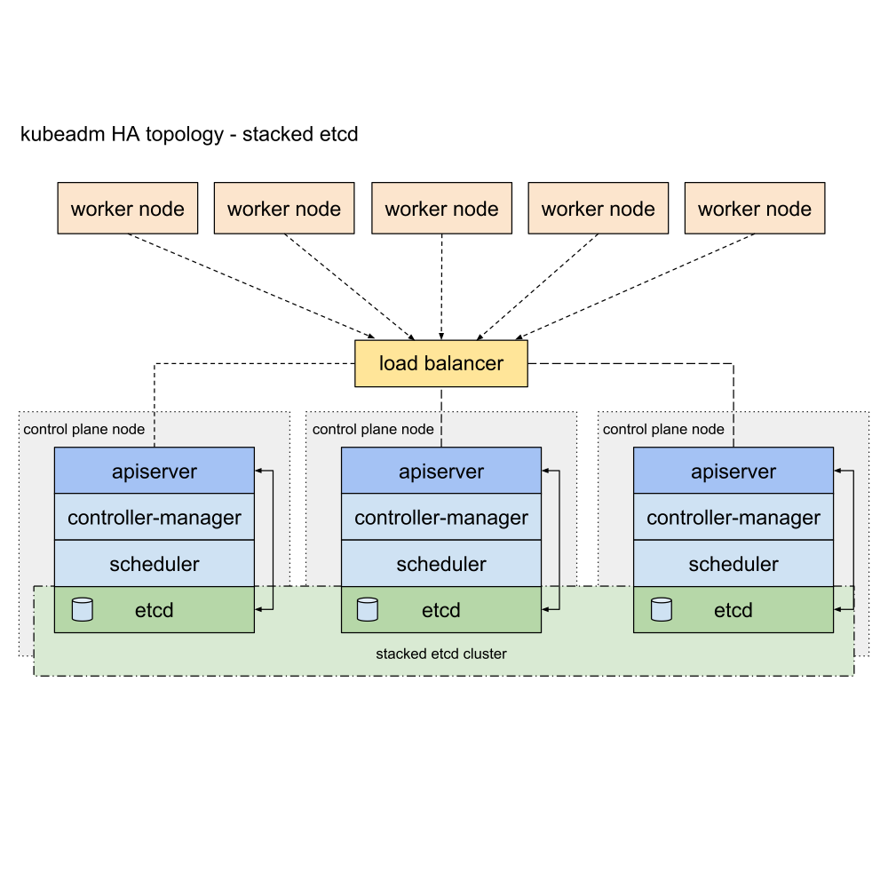

<!-- START doctoc generated TOC please keep comment here to allow auto update -->
<!-- DON'T EDIT THIS SECTION, INSTEAD RE-RUN doctoc TO UPDATE -->

- [extenal etcd](#extenal-etcd)
  - [certificates](#certificates)
    - [certificate signing request](#certificate-signing-request)
  - [configuration](#configuration)
    - [enable service](#enable-service)
  - [verify](#verify)
- [stacked etcd](#stacked-etcd)
  - [configuration](#configuration-1)
  - [operate](#operate)
    - [debug into stacked etcd cluster](#debug-into-stacked-etcd-cluster)
    - [replacing a failed etcd member](#replacing-a-failed-etcd-member)

<!-- END doctoc generated TOC please keep comment here to allow auto update -->



> references:
> - [* etcd tutorials](https://etcd.io/docs/v3.6/tutorials/)
>   - [* How to Add and Remove Members](https://etcd.io/docs/v3.6/tutorials/how-to-deal-with-membership/)
>   - [clustering guide](https://etcd.io/docs/v2.3/clustering/) | [clustering.md](https://github.com/etcd-io/etcd/blob/release-3.4/Documentation/op-guide/clustering.md)
>   - [runtime reconfiguration](https://etcd.io/docs/v3.3/op-guide/runtime-configuration/)
> - [* configuration flags](https://etcd.io/docs/v3.3/op-guide/configuration/)
>   - [etcd.conf.yml.sample](https://github.com/etcd-io/etcd/blob/release-3.4/etcd.conf.yml.sample)
> - [setting up etcd cluster with tls authentication enabled](https://medium.com/nirman-tech-blog/setting-up-etcd-cluster-with-tls-authentication-enabled-49c44e4151bb)
> - [configuring etcd rbac](https://docs.projectcalico.org/reference/etcd-rbac/)
> - [deploy a secure etcd cluster](https://pcocc.readthedocs.io/en/latest/deps/etcd-production.html)
> - [set up a high availability etcd cluster with kubeadm](https://kubernetes.io/docs/setup/production-environment/tools/kubeadm/setup-ha-etcd-with-kubeadm/)
> - [creating highly available clusters with kubeadm](https://kubernetes.io/docs/setup/production-environment/tools/kubeadm/high-availability/)
> - [etcd backup and restore in kubernetes: step by step](https://k21academy.com/docker-kubernetes/etcd-backup-restore-in-k8s-step-by-step/)
> - [operating etcd clusters for kubernetes](https://kubernetes.io/docs/tasks/administer-cluster/configure-upgrade-etcd) | [operating etcd clusters for kubernetes](https://pwittrock.github.io/docs/tasks/administer-cluster/configure-upgrade-etcd/)
> - [understand how the etcd cluster is configured](https://docs.bitnami.com/kubernetes/infrastructure/etcd/get-started/understand-default-configuration/)
> - [tutorial: set up a secure and highly available etcd cluster](https://thenewstack.io/tutorial-set-up-a-secure-and-highly-available-etcd-cluster/)


- [extenal etcd topology](https://kubernetes.io/docs/setup/production-environment/tools/kubeadm/ha-topology/#external-etcd-topology) certificates located in : `/etc/etcd/ssl`

  

  > [!TIP]
  > You need:
  > - Three or more machines that meet kubeadm's minimum requirements for the control-plane nodes. Having an odd number of control plane nodes can help with leader selection in the case of machine or zone failure.
  >   - including a container runtime, already set up and working
  > - Three or more machines that meet kubeadm's minimum requirements for the workers
  >   - including a container runtime, already set up and working
  > - Full network connectivity between all machines in the cluster (public or private network)
  > - Superuser privileges on all machines using sudo
  >   - You can use a different tool; this guide uses sudo in the examples.
  > - SSH access from one device to all nodes in the system
  > - kubeadm and kubelet already installed on all machines.
  >
  > And you also need:
  > - Three or more additional machines, that will become etcd cluster members. Having an odd number of members in the etcd cluster is a requirement for achieving optimal voting quorum.
  >   - These machines again need to have kubeadm and kubelet installed.
  >   - These machines also require a container runtime, that is already set up and working.
  >
  > See External etcd topology for context.

- [stacked etcd topology](https://kubernetes.io/docs/setup/production-environment/tools/kubeadm/ha-topology/#stacked-etcd-topology) certificates located in : `/etc/kubernetes/pki/etcd`

  

  > [!TIP]
  > You need:
  > - Three or more machines that meet kubeadm's minimum requirements for the control-plane nodes. Having an odd number of control plane nodes can help with leader selection in the case of machine or zone failure.
  >   - including a container runtime, already set up and working
  > - Three or more machines that meet kubeadm's minimum requirements for the workers
  >   - including a container runtime, already set up and working
  > - Full network connectivity between all machines in the cluster (public or private network)
  > - Superuser privileges on all machines using sudo
  >   - You can use a different tool; this guide uses sudo in the examples.
  > - SSH access from one device to all nodes in the system
  > - kubeadm and kubelet already installed on all machines.
  >
  > See Stacked etcd topology for context.


# extenal etcd
## certificates
```bash
$ sudo mkdir -p /etc/etcd/ssl
```

### certificate signing request


> generate the etcd certificates in major kubernetes master. and sync to the others following kuberentes masters.


```bash
$ sudo bash -c 'cat > /etc/etcd/ssl/ca-config.json' << EOF
{
    "signing": {
        "default": {
            "expiry": "43800h"
        },
        "profiles": {
            "server": {
                "expiry": "43800h",
                "usages": [
                    "signing",
                    "key encipherment",
                    "server auth",
                    "client auth"
                ]
            },
            "client": {
                "expiry": "43800h",
                "usages": [
                    "signing",
                    "key encipherment",
                    "client auth"
                ]
            },
            "peer": {
                "expiry": "43800h",
                "usages": [
                    "signing",
                    "key encipherment",
                    "server auth",
                    "client auth"
                ]
            }
        }
    }
}
EOF
```

- ca
  ```bash
  $ sudo bash -c 'cat > /etc/etcd/ssl/ca-csr.json' << EOF
  {
      "CN": "etcd",
      "key": {
          "algo": "rsa",
          "size": 2048
      }
  }
  EOF

  $ sudo /usr/local/bin/cfssl gencert \
         -initca ca-csr.json \
         | sudo /usr/local/bin/cfssljson -bare ca -
  ```

- client
  ```bash
  $ sudo bash -c 'cat > /etc/etcd/ssl/client.json' << EOF
  {
      "CN": "client",
      "key": {
          "algo": "ecdsa",
          "size": 256
      }
  }
  EOF

  $ sudo /usr/local/bin/cfssl gencert \
         -ca=ca.pem \
         -ca-key=ca-key.pem \
         -config=ca-config.json \
         -profile=client client.json \
         | sudo /usr/local/bin/cfssljson -bare client
  ```

- result
  ```bash
  $ ls
  ca-config.json  ca.csr  ca-csr.json  ca-key.pem  ca.pem  client.csr  client.json  client-key.pem  client.pem
  ```

- sync to the others masters
  ```bash
  $ for _host in master02 master03; do
      ssh ${_host} 'sudo mkdir -p /etc/etcd/ssl'
      rsync -avzrlpgoDP \
            --rsync-path='sudo rsync' \
            /etc/etcd/ssl/*.pem \
            ${_host}:/etc/etcd/ssl/
      rsync -avzrlpgoDP \
            --rsync-path='sudo rsync' \
            /etc/etcd/ssl/ca-config.json \
            ${_host}:/etc/etcd/ssl/
    done
  ```

## configuration
- `etcd.service`
  ```bash
  $ sudo bash -c 'cat >/etc/systemd/system/etcd.service' << EOF
  [Install]
  WantedBy=multi-user.target

  [Unit]
  Description=Etcd Server
  Documentation=https://github.com/marslo/mytools
  Conflicts=etcd.service
  Conflicts=etcd2.service

  [Service]
  Type=notify
  WorkingDirectory=/var/lib/etcd/
  Restart=always
  RestartSec=5s
  EnvironmentFile=-/etc/etcd/etcd.conf
  ExecStart=/bin/bash -c "GOMAXPROCS=$(nproc) /usr/local/bin/etcd"
  Restart=on-failure
  RestartSec=5
  LimitNOFILE=65536

  [Install]
  WantedBy=multi-user.target
  EOF
  ```

- `etcd.conf`
  ```bash
  $ etcdInitialCluster="master01=https://192.168.100.200:2380"
  etcdInitialCluster+=",master02=https://192.168.100.201:2380"
  etcdInitialCluster+=",master03=https://192.168.100.202:2380"

  $ interface=$(netstat -nr | grep -E 'UG|UGSc' | grep -E '^0.0.0|default' | grep -E '[0-9.]{7,15}' | awk -F' ' '{print $NF}')
  $ ipAddr=$(ip a s "${interface}" | sed -rn 's|\W*inet[^6]\W*([0-9\.]{7,15}).*$|\1|p')

  $ sudo bash -c 'cat > /etc/etcd/etcd.conf' << EOF
  ETCD_NAME=$(hostname)
  ETCD_DATA_DIR="/var/lib/etcd/default.etcd"
  #ETCD_WAL_DIR=""
  #ETCD_SNAPSHOT_COUNT="10000"
  #ETCD_HEARTBEAT_INTERVAL="100"
  #ETCD_ELECTION_TIMEOUT="1000"
  ETCD_LISTEN_PEER_URLS="https://0.0.0.0:2380"
  ETCD_LISTEN_CLIENT_URLS="https://0.0.0.0:2379"
  #ETCD_MAX_SNAPSHOTS="5"
  #ETCD_MAX_WALS="5"
  #ETCD_CORS=""

  #[cluster]
  ETCD_INITIAL_ADVERTISE_PEER_URLS="https://${ipAddr}:2380"
  # if you use different ETCD_NAME (e.g. test), set ETCD_INITIAL_CLUSTER value for this name, i.e. "test=http://
  ..."
  ETCD_INITIAL_CLUSTER="${etcdInitialCluster}"
  ETCD_INITIAL_CLUSTER_STATE="new"
  ETCD_INITIAL_CLUSTER_TOKEN="etcd-cluster"
  ETCD_ADVERTISE_CLIENT_URLS="https://${ipAddr}:2379"
  #ETCD_DISCOVERY=""
  #ETCD_DISCOVERY_SRV=""
  #ETCD_DISCOVERY_FALLBACK="proxy"
  #ETCD_DISCOVERY_PROXY=""
  #ETCD_STRICT_RECONFIG_CHECK="false"
  #ETCD_AUTO_COMPACTION_RETENTION="0"

  #[proxy]
  #ETCD_PROXY="off"
  #ETCD_PROXY_FAILURE_WAIT="5000"
  #ETCD_PROXY_REFRESH_INTERVAL="30000"
  #ETCD_PROXY_DIAL_TIMEOUT="1000"
  #ETCD_PROXY_WRITE_TIMEOUT="5000"
  #ETCD_PROXY_READ_TIMEOUT="0"

  #[security]
  ETCD_CERT_FILE="/etc/etcd/ssl/server.pem"
  ETCD_KEY_FILE="/etc/etcd/ssl/server-key.pem"
  ETCD_CLIENT_CERT_AUTH="true"
  ETCD_TRUSTED_CA_FILE="/etc/etcd/ssl/ca.pem"
  ETCD_AUTO_TLS="true"
  ETCD_PEER_CERT_FILE="/etc/etcd/ssl/peer.pem"
  ETCD_PEER_KEY_FILE="/etc/etcd/ssl/peer-key.pem"
  #ETCD_PEER_CLIENT_CERT_AUTH="false"
  ETCD_PEER_TRUSTED_CA_FILE="/etc/etcd/ssl/ca.pem"
  ETCD_PEER_AUTO_TLS="true"

  #[logging]
  #ETCD_DEBUG="false"
  # examples for -log-package-levels etcdserver=WARNING,security=DEBUG
  #ETCD_LOG_PACKAGE_LEVELS=""
  #[profiling]
  #ETCD_ENABLE_PPROF="false"
  #ETCD_METRICS="basic"
  EOF
  ```

### enable service
```bash
$ sudo systemctl daemon-reload
$ sudo systemctl enable --now etcd
$ sudo systemctl start etcd.service
```

## verify
```bash
$ sudo systemctl status etcd
$ sudo /usr/local/bin/etcdctl --ca-file /etc/etcd/ssl/ca.pem \
                              --cert-file /etc/etcd/ssl/client.pem \
                              --key-file /etc/etcd/ssl/client-key.pem \
                              --endpoints https://192.168.100.200:2379,https://192.168.100.201:2379,https://192.168.100.202:2379 \
                              cluster-health
```

- tips
  ```bash
  $ alias etcdctl="sudo /usr/local/bin/etcdctl --ca-file /etc/etcd/ssl/ca.pem --cert-file /etc/etcd/ssl/client.pem --key-file /etc/etcd/ssl/client-key.pem --endpoints https://192.168.100.200:2379,https://192.168.100.201:2379,https://192.168.100.202:2379"
  $ etcdctl cluster-health
  member ae76391b129**** is healthy: got healthy result from https://192.168.100.200:2379
  member cda996b3ea5a*** is healthy: got healthy result from https://192.168.100.201:2379
  member e295a3c1654e*** is healthy: got healthy result from https://192.168.100.202:2379
  cluster is healthy
  ```

# stacked etcd

## configuration
```bash
$ sudo cat /etc/kubernetes/manifests/etcd.yaml
```

## operate
### debug into stacked etcd cluster


references:
> - [replacing a failed etcd member](https://docs.openshift.com/container-platform/3.11/admin_guide/assembly_replace-etcd-member.html)
> It is recommended to back up this directory to an off-cluster location before removing the contents. <br>
> You can remove this backup after a successful restore
> <br>
> ```bash
> $ sudo rm -rf /var/lib/etcd/*
>
> # or
> $ sudo mv /var/lib/etcd/member{,.backup}
> ```


```bash
$ docker run -it \
             -v /var/lib/etcd:/var/lib/etcd \
             -v /etc/kubernetes/pki/etcd:/etc/kubernetes/pki/etcd \
             -p 2380:2380 \
             -p 2379:2379 \
             --network=host \
             k8s.gcr.io/etcd:3.2.24

$ etcdctl --ca-file /etc/kubernetes/pki/etcd/ca.crt \
          --cert-file /etc/kubernetes/pki/etcd/peer.crt \
          --key-file /etc/kubernetes/pki/etcd/peer.key \
          -endpoints=https://10.0.0.1:2379,https://10.0.0.2:2379,https://10.0.0.3:2379 \
          member list
```

- more
  ```bash
  $ etcdctl member list
  $ etcdctl member remove <id>

  # peerURL using port 2380 by default. clientURL using 2379 by default
  $ etcdctl member add <hostname> <peerURL:2380>

  $ etcdctl member update <id> <peerURL:2380>
  ```

- add [tag `--initial-cluster-state=existing`](https://etcd.io/docs/v3.3/op-guide/configuration/) in `/etc/kubernetes/manifests/etcd.yaml`
  ```bash
  $ sudo cat /etc/kubernetes/manifests/etcd.yaml
  apiVersion: v1
  kind: Pod
  metadata:
    ...
  spec:
    containers:
    - command:
      - etcd
      - --advertise-client-urls=https://10.0.0.2:2379
      - --initial-advertise-peer-urls=https://10.0.0.2:2380
      - --initial-cluster=member1=https://10.0.0.1:2380,member3=https://10.0.0.3:2380,member2=https://10.0.0.2:2380
      - --listen-client-urls=https://10.0.0.2:2379
      - --listen-peer-urls=https://10.0.0.2:2380
      - --name=member2
      - --cert-file=/etc/kubernetes/pki/etcd/server.crt
      - --client-cert-auth=true
      - --data-dir=/var/lib/etcd
      - --key-file=/etc/kubernetes/pki/etcd/server.key
      - --peer-cert-file=/etc/kubernetes/pki/etcd/peer.crt
      - --peer-client-cert-auth=true
      - --peer-key-file=/etc/kubernetes/pki/etcd/peer.key
      - --peer-trusted-ca-file=/etc/kubernetes/pki/etcd/ca.crt
      - --snapshot-count=10000
      - --trusted-ca-file=/etc/kubernetes/pki/etcd/ca.crt
      - --initial-cluster-state=existing
      image: k8s.gcr.io/etcd:3.2.24
      imagePullPolicy: IfNotPresent
      livenessProbe:
        exec:
          command:
          - /bin/sh
          - -ec
          - ETCDCTL_API=3 etcdctl --endpoints=https://10.0.0.1:2379,https://10.0.0.2:2379,https://10.0.0.3:2379 --cacert=/etc/kubernetes/pki/etcd/ca.crt --cert=/etc/kubernetes/pki/etcd/healthcheck-client.crt --key=/etc/kubernetes/pki/etcd/healthcheck-client.key get foo
  ...
  ```

### [replacing a failed etcd member](https://kubernetes.io/docs/tasks/administer-cluster/configure-upgrade-etcd/#replacing-a-failed-etcd-member)

> [!TIP]
> consider a three-member etcd cluster. Let the URLs be:
> - `member1=http://10.0.0.1`
> - `member2=http://10.0.0.2`
> - `member3=http://10.0.0.3`
> When `member1` fails, replace it with `member4=http://10.0.0.4`.

* get member id of failed member
  ```bash
  $ etcdctl --endpoints=http://10.0.0.2,http://10.0.0.3 member list

  8211f1d0f64f3269, started, member1, http://10.0.0.1:2380, http://10.0.0.1:2379
  91bc3c398fb3c146, started, member2, http://10.0.0.2:2380, http://10.0.0.2:2379
  fd422379fda50e48, started, member3, http://10.0.0.3:2380, http://10.0.0.3:2379
  ```

* remove failed member
  ```bash
  $ etcdctl member remove 8211f1d0f64f3269
  Removed member 8211f1d0f64f3269 from cluster
  ```

* add new members
  ```bash
  $ etcdctl member add member4 --peer-urls=http://10.0.0.4:2380
  Member 2be1eb8f84b7f63e added to cluster ef37ad9dc622a7c4
  ```

* start new member with IP
  ```bash
  $ export ETCD_NAME="member4"
  $ export ETCD_INITIAL_CLUSTER="member2=http://10.0.0.2:2380,member3=http://10.0.0.3:2380,member4=http://10.0.0.4:2380"
  $ export ETCD_INITIAL_CLUSTER_STATE=existing
  $ etcd [flags]
  ```

* additional options

  > [!TIP]
  > - Update the `--etcd-servers` flag for the Kubernetes API servers to make Kubernetes aware of the configuration changes, then restart the Kubernetes API servers.
  > - Update the load balancer configuration if a load balancer is used in the deployment.
