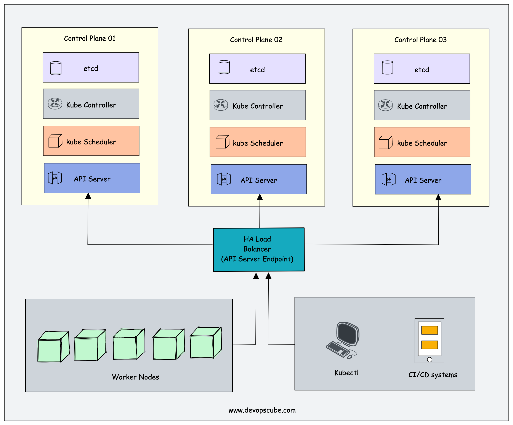
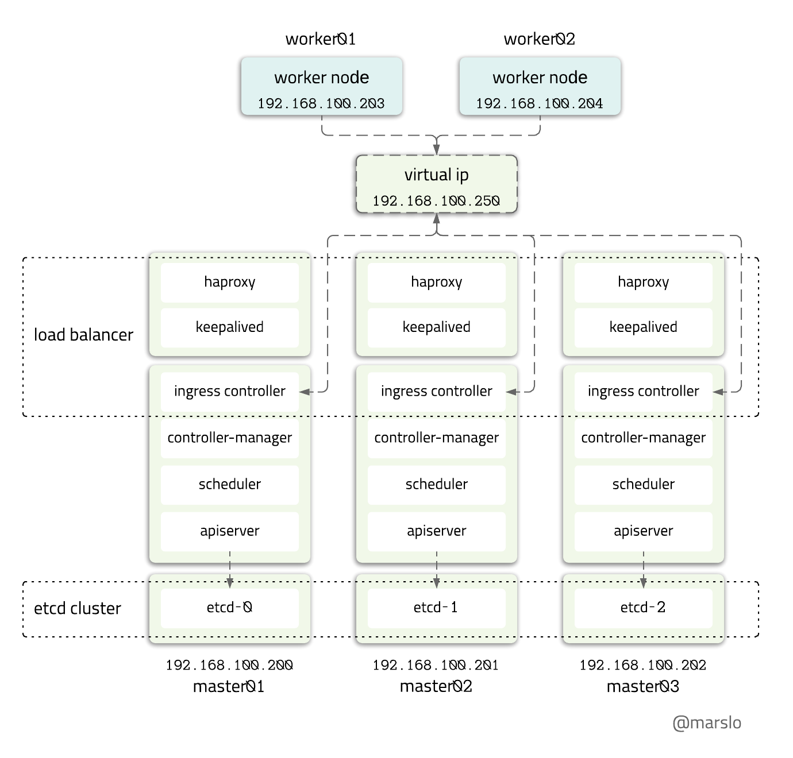

<!-- START doctoc generated TOC please keep comment here to allow auto update -->
<!-- DON'T EDIT THIS SECTION, INSTEAD RE-RUN doctoc TO UPDATE -->

- [tools](#tools)
  - [cfssl & cfssljson](#cfssl--cfssljson)
  - [etcd](#etcd)
  - [keepalived](#keepalived)
  - [haproxy](#haproxy)
  - [helm](#helm)
- [external etcd](#external-etcd)

<!-- END doctoc generated TOC please keep comment here to allow auto update -->



> [!TIP|label:references]
> - [extenal etcd topology](https://kubernetes.io/docs/setup/production-environment/tools/kubeadm/ha-topology/#external-etcd-topology) certificates located in : `/etc/etcd/ssl`
> - [stacked etcd topology](https://kubernetes.io/docs/setup/production-environment/tools/kubeadm/ha-topology/#stacked-etcd-topology) certificates located in : `/etc/kubernetes/pki/etcd`
> - [Proposal for a highly available control plane configuration for ‘kubeadm’ deployments](https://docs.google.com/document/d/1lH9OKkFZMSqXCApmSXemEDuy9qlINdm5MfWWGrK3JYc/edit#heading=h.y7gwwlt138dt)
> - [Proposal for kubeadm self-hosted HA deployment](https://docs.google.com/document/d/1P3oUJ_kdaRSTlGONujadGBpYegjn4RjBNZLHZ4zU7lI/edit#heading=h.yhn2qqumird1)
> - [kubeadm upgrades / self-hosting / HA v1.8 implementation working group](https://docs.google.com/document/d/16CEsBSSGm3sMpvB_cFnKnqqi1OxhIcyX3lVwBpIyMHc/edit#heading=h.w7i4ksrweimp)
> - [Ansible Tutorial: Setup HAProxy and HTTPS from Let’s Encrypt with Ansible](https://www.happycoders.eu/devops/ansible-tutorial-setup-haproxy-https-lets-encrypt/)
> - [* Kubernetes High Availability](https://devopscube.com/kubernetes-high-availability/)


## tools
### cfssl & cfssljson
```bash
$ sudo bash -c "curl -o /usr/local/bin/cfssl https://pkg.cfssl.org/R1.2/cfssl_linux-amd64"
$ sudo bash -c "curl -o /usr/local/bin/cfssljson https://pkg.cfssl.org/R1.2/cfssljson_linux-amd64"
$ sudo chmod +x /usr/local/bin/cfssl*
```

### etcd
```bash
$ curl -fsSL https://github.com/etcd-io/etcd/releases/download/v3.3.15/etcd-v3.3.15-linux-amd64.tar.gz |
       sudo tar -xzv --strip-components=1 -C /usr/local/bin/
```

### keepalived


> references:
> - [Step 26 - KeepAliveD](https://malaty.net/how-to-setup-and-configure-on-prem-kubernetes-high-available-cluster-part-5/)


```bash
$ mkdir -p ~/temp
$ sudo mkdir -p /etc/keepalived/

$ curl -fsSL ${keepaliveDownloadUrl}/keepalived-2.0.18.tar.gz | tar xzf - -C ~/temp

$ pushd .
$ cd ~/temp/keepalived-2.0.18
$ ./configure && make
$ sudo make install
$ sudo cp keepalived/keepalived.service /etc/systemd/system/
$ popd
$ rm -rf ~/temp
```

### haproxy
```bash
$ curl -fsSL http://www.haproxy.org/download/2.0/src/haproxy-2.0.6.tar.gz | tar xzf - -C ~

$ pushd .
$ cd ~/haproxy-2.0.6
$ make TARGET=linux-glibc \
       USE_LINUX_TPROXY=1 \
       USE_ZLIB=1 \
       USE_REGPARM=1 \
       USE_PCRE=1 \
       USE_PCRE_JIT=1 \
       USE_OPENSSL=1 \
       SSL_INC=/usr/include \
       SSL_LIB=/usr/lib \
       ADDLIB=-ldl \
       USE_SYSTEMD=1
$ sudo make install
$ sudo cp haproxy /usr/sbin/
$ sudo cp examples/haproxy.init /etc/init.d/haproxy && sudo chmod +x $_
$ popd
$ rm -rf ~/haproxy-2.0.6
```

### helm
```bash
$ curl -fsSL \
       https://get.helm.sh/helm-v2.14.3-linux-amd64.tar.gz |
       sudo tar -xzv --strip-components=1 -C /usr/local/bin/

$ while read -r _i; do
    sudo chmod +x "/usr/local/bin/${_i}"
done < <(echo helm tiller)
```

- configuration
  ```bash
  $ helm init
  $ helm init --client-only

  $ kubectl -n kube-system create serviceaccount tiller
  $ kubectl create clusterrolebinding tiller-cluster-rule \
                   --clusterrole=cluster-admin \
                   --serviceaccount=kube-system:tiller
  $ kubectl -n kube-system patch deploy \
                  tiller-deploy -p '{"spec":{"template":{"spec":{"serviceAccount":"tiller"}}}}'

  $ helm repo add jetstack https://charts.jetstack.io
  ```

## external etcd


