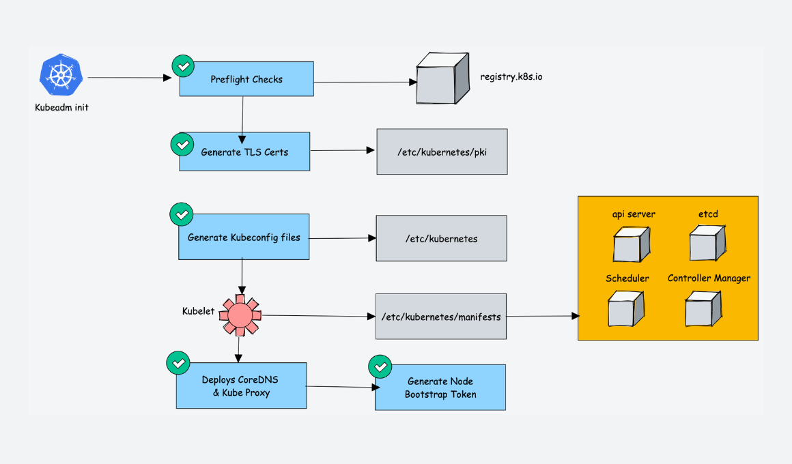

<!-- START doctoc generated TOC please keep comment here to allow auto update -->
<!-- DON'T EDIT THIS SECTION, INSTEAD RE-RUN doctoc TO UPDATE -->

- [kubeadm init](#kubeadm-init)
  - [synopsis](#synopsis)
  - [options](#options)
  - [init workflow](#init-workflow)
- [ha cluster step by step](#ha-cluster-step-by-step)
  - [basic environment](#basic-environment)
    - [cfssl](#cfssl)
    - [etcd](#etcd)
    - [keepalive](#keepalive)
  - [extend etcd](#extend-etcd)
    - [configuration](#configuration)
    - [ca and client certs](#ca-and-client-certs)
    - [peer](#peer)
    - [enable etcd service](#enable-etcd-service)
    - [HAProxy](#haproxy)
  - [kubeadm init](#kubeadm-init-1)
    - [kubeadm-conf.yaml](#kubeadm-confyaml)
    - [init controller](#init-controller)
    - [sync PKI](#sync-pki)
  - [sample](#sample)
    - [set up a high availability etcd cluster with kubeadm](#set-up-a-high-availability-etcd-cluster-with-kubeadm)
- [tips](#tips)
  - [kubeadm init](#kubeadm-init-2)
- [tear down](#tear-down)

<!-- END doctoc generated TOC please keep comment here to allow auto update -->




> references:
> - [* Install Kubernetes Cluster on Centos 8 With Kubeadm and CRI-O](https://tayeh.me/posts/install-kubernetes-cluster-on-centos-8-with-kubeadm-crio/)
> - [* imarslo : belloHAKubeCluster.sh](https://raw.githubusercontent.com/marslo/mytools/master/kubernetes/belloHAKubeCluster.sh)
> - [手动档搭建 Kubernetes HA 集群](https://mritd.com/2017/07/21/set-up-kubernetes-ha-cluster-by-binary/)
> - [kube-up.sh](https://github.com/kubernetes/kubernetes/blob/master/cluster/kube-up.sh)
> - [Set up a High Availability etcd Cluster with kubeadm](https://kubernetes.io/docs/setup/production-environment/tools/kubeadm/setup-ha-etcd-with-kubeadm/)
> - [Configuring each kubelet in your cluster using kubeadm](https://kubernetes.io/docs/setup/production-environment/tools/kubeadm/kubelet-integration/)
> - [Creating a cluster with kubeadm v1.21](https://v1-21.docs.kubernetes.io/docs/setup/production-environment/tools/kubeadm/create-cluster-kubeadm/)
> - [使用 kubeadm 创建集群](https://kubernetes.io/zh/docs/setup/production-environment/tools/kubeadm/create-cluster-kubeadm/)
> - [* 一步步打造基于Kubeadm的高可用Kubernetes集群-第一部分](https://tonybai.com/2017/05/15/setup-a-ha-kubernetes-cluster-based-on-kubeadm-part1/)
> - [* 一步步打造基于Kubeadm的高可用Kubernetes集群-第二部分](https://tonybai.com/2017/05/15/setup-a-ha-kubernetes-cluster-based-on-kubeadm-part2/)
> - [* 以Kubeadm方式安装的Kubernetes集群的探索](https://tonybai.com/2017/01/24/explore-kubernetes-cluster-installed-by-kubeadm/)
> - [* 使用Kubeadm搭建Kubernetes HA（1.10.1）](https://blog.csdn.net/chenleiking/article/details/80136449)
> - [* 使用Kubeadm + HAProxy + Keepalived部署高可用Kubernetes集群](https://blog.csdn.net/chenleiking/article/details/84841394)
> - [* 在 CentOS 上部署 Kubernetes 集群](https://jimmysong.io/kubernetes-handbook/practice/install-kubernetes-on-centos.html)
> - [Bootstrapping clusters with kubeadm](https://kubernetes.io/docs/setup/production-environment/tools/kubeadm/)
> - [Customizing components with the kubeadm API](https://kubernetes.io/docs/setup/production-environment/tools/kubeadm/control-plane-flags/)
> - [Set up a High Availability etcd Cluster with kubeadm](https://kubernetes.io/docs/setup/production-environment/tools/kubeadm/setup-ha-etcd-with-kubeadm/)
> - [Considerations for large clusters](https://kubernetes.io/docs/setup/best-practices/cluster-large/)
> - [PKI certificates and requirements](https://kubernetes.io/docs/setup/best-practices/certificates/)
> - [* kubeadm init](https://kubernetes.io/docs/reference/setup-tools/kubeadm/kubeadm-init)
> - [creating a cluster with kubeadm](https://kubernetes.io/docs/setup/production-environment/tools/kubeadm/create-cluster-kubeadm/)
> - * setup on-prem kubernetes
>   - [part 1](https://malaty.net/how-to-setup-and-configure-on-prem-kubernetes-high-available-cluster-part-1/)
>   - [part 2](https://malaty.net/how-to-setup-and-configure-on-prem-kubernetes-high-available-cluster-part-2/)
>   - [part 3](https://malaty.net/how-to-setup-and-configure-on-prem-kubernetes-high-available-cluster-part-3/)
>   - [part 4](https://malaty.net/how-to-setup-and-configure-on-prem-kubernetes-high-available-cluster-part-4/)
>   - [part 5](https://malaty.net/how-to-setup-and-configure-on-prem-kubernetes-high-available-cluster-part-5/)
> - certificate
>   - [* etcd集群TLS设置](https://cloud-atlas.readthedocs.io/zh_CN/latest/kubernetes/deploy/etcd/etcd_tls.html)
>   - [* Setting up Etcd Cluster with TLS Authentication Enabled](https://medium.com/nirman-tech-blog/setting-up-etcd-cluster-with-tls-authentication-enabled-49c44e4151bb)
>   - [Generate self-signed certificates](https://github.com/coreos/docs/blob/master/os/generate-self-signed-certificates.md)
>   - [* 创建 TLS 证书和秘钥](https://jimmysong.io/kubernetes-handbook/practice/create-tls-and-secret-key.html)
>   - [* kubernetes学习记录（9）—— 集群基于CA签名的安全设置](https://cloud.tencent.com/developer/article/1008770?areaSource=106001.1)
> - [CRI-O : How To Setup Kubernetes Cluster Using Kubeadm](https://devopscube.com/setup-kubernetes-cluster-kubeadm/)
> - configuration
>   - [Important Kubernetes Cluster Configurations](https://devopscube.com/kubernetes-cluster-configurations/)
> - [* coredns 被误删了，可以通过重新应用 coredns 的 Deployment 或 DaemonSet 配置文件来恢复](https://blog.csdn.net/u011197085/article/details/139395947)
>


# kubeadm init
## [synopsis](https://kubernetes.io/docs/reference/setup-tools/kubeadm/kubeadm-init/#synopsis)
```
preflight                    Run pre-flight checks
certs                        Certificate generation
  /ca                          Generate the self-signed Kubernetes CA to provision identities for other Kubernetes components
  /apiserver                   Generate the certificate for serving the Kubernetes API
  /apiserver-kubelet-client    Generate the certificate for the API server to connect to kubelet
  /front-proxy-ca              Generate the self-signed CA to provision identities for front proxy
  /front-proxy-client          Generate the certificate for the front proxy client
  /etcd-ca                     Generate the self-signed CA to provision identities for etcd
  /etcd-server                 Generate the certificate for serving etcd
  /etcd-peer                   Generate the certificate for etcd nodes to communicate with each other
  /etcd-healthcheck-client     Generate the certificate for liveness probes to healthcheck etcd
  /apiserver-etcd-client       Generate the certificate the apiserver uses to access etcd
  /sa                          Generate a private key for signing service account tokens along with its public key
kubeconfig                   Generate all kubeconfig files necessary to establish the control plane and the admin kubeconfig file
  /admin                       Generate a kubeconfig file for the admin to use and for kubeadm itself
  /kubelet                     Generate a kubeconfig file for the kubelet to use *only* for cluster bootstrapping purposes
  /controller-manager          Generate a kubeconfig file for the controller manager to use
  /scheduler                   Generate a kubeconfig file for the scheduler to use
kubelet-start                Write kubelet settings and (re)start the kubelet
control-plane                Generate all static Pod manifest files necessary to establish the control plane
  /apiserver                   Generates the kube-apiserver static Pod manifest
  /controller-manager          Generates the kube-controller-manager static Pod manifest
  /scheduler                   Generates the kube-scheduler static Pod manifest
etcd                         Generate static Pod manifest file for local etcd
  /local                       Generate the static Pod manifest file for a local, single-node local etcd instance
upload-config                Upload the kubeadm and kubelet configuration to a ConfigMap
  /kubeadm                     Upload the kubeadm ClusterConfiguration to a ConfigMap
  /kubelet                     Upload the kubelet component config to a ConfigMap
upload-certs                 Upload certificates to kubeadm-certs
mark-control-plane           Mark a node as a control-plane
bootstrap-token              Generates bootstrap tokens used to join a node to a cluster
kubelet-finalize             Updates settings relevant to the kubelet after TLS bootstrap
  /experimental-cert-rotation  Enable kubelet client certificate rotation
addon                        Install required addons for passing conformance tests
  /coredns                     Install the CoreDNS addon to a Kubernetes cluster
  /kube-proxy                  Install the kube-proxy addon to a Kubernetes cluster
```

## [options](https://kubernetes.io/docs/reference/setup-tools/kubeadm/kubeadm-init/#options)
- `--apiserver-advertise-address string`
- `--apiserver-bind-port int32`     Default: 6443
- `--apiserver-cert-extra-sans strings`
- `--cert-dir string`     Default: "/etc/kubernetes/pki"
- `--certificate-key string`
- `--config string`
- `--control-plane-endpoint string`
- `--cri-socket string`
- `--dry-run`
- `--feature-gates string` : A set of key=value pairs that describe feature gates for various features
  - `PublicKeysECDSA=true|false` (ALPHA - default=false)
  - `RootlessControlPlane=true|false` (ALPHA - default=false)
  - `UnversionedKubeletConfigMap=true|false` (BETA - default=true)
- `-h`, `--help`
- `--ignore-preflight-errors strings`
- `--image-repository string`     Default: "k8s.gcr.io"
- `--kubernetes-version string`     Default: "stable-1"
- `--node-name string`
- `--patches string`
- `--pod-network-cidr string`
- `--service-cidr string`     Default: "10.96.0.0/12"
- `--service-dns-domain string`     Default: "cluster.local"
- `--skip-certificate-key-print`
- `--skip-phases strings`
- `--skip-token-print`
- `--token string`
- `--token-ttl duration`     Default: 24h0m0s
- `--upload-certs`
- `--rootfs string`

## [init workflow](https://kubernetes.io/docs/reference/setup-tools/kubeadm/implementation-details/#kubeadm-init-workflow-internal-design)
1. [preflight checks](https://kubernetes.io/docs/reference/setup-tools/kubeadm/implementation-details/#preflight-checks)
1. [generate the necessary certificates](https://kubernetes.io/docs/reference/setup-tools/kubeadm/implementation-details/#generate-the-necessary-certificates)
1. [generate kubeconfig files for control plane components](https://kubernetes.io/docs/reference/setup-tools/kubeadm/implementation-details/#generate-kubeconfig-files-for-control-plane-components)
1. [generate static pod manifests for control plane components](https://kubernetes.io/docs/reference/setup-tools/kubeadm/implementation-details/#generate-static-pod-manifests-for-control-plane-components)
  * api server
  * controller-manager
  * scheduler

  > [!TIP]
  > kubeadm writes static Pod manifest files for control plane components to `/etc/kubernetes/manifests`
  > static pod manifest generation for control plane components can be invoked individually with the [`kubeadm init phase control-plane all`](https://kubernetes.io/docs/reference/setup-tools/kubeadm/kubeadm-init-phase/#cmd-phase-control-plane) command
  >
  > references:
  > - [using custom images](https://kubernetes.io/docs/reference/setup-tools/kubeadm/kubeadm-init/#custom-images)

1. [generate static pod manifest for local etcd](https://kubernetes.io/docs/reference/setup-tools/kubeadm/implementation-details/#generate-static-pod-manifest-for-local-etcd)
1. [wait for the control plane to come up](https://kubernetes.io/docs/reference/setup-tools/kubeadm/implementation-details/#wait-for-the-control-plane-to-come-up)

  > [!TIP]
  > kubeadm waits (upto 4m0s) until `localhost:6443/healthz` (kube-apiserver liveness) returns `ok`. However in order to detect deadlock conditions, kubeadm fails fast if `localhost:10255/healthz` (kubelet liveness) or `localhost:10255/healthz/syncloop` (kubelet readiness) don't return `ok` within 40s and 60s respectively.

1. [save the kubeadm clusterconfiguration in a configmap for later reference](https://kubernetes.io/docs/reference/setup-tools/kubeadm/implementation-details/#save-the-kubeadm-clusterconfiguration-in-a-configmap-for-later-reference)
1. [mark the node as control-plane](https://kubernetes.io/docs/reference/setup-tools/kubeadm/implementation-details/#mark-the-node-as-control-plane)

  > [!TIP]
  > Please note that:
  > - The `node-role.kubernetes.io/master` taint is deprecated and will be removed in **kubeadm version 1.25**
  > - Mark control-plane phase phase can be invoked individually with the [`kubeadm init phase mark-control-plane`](https://kubernetes.io/docs/reference/setup-tools/kubeadm/kubeadm-init-phase/#cmd-phase-mark-control-plane) command

1. [configure tls-bootstrapping for node joining](https://kubernetes.io/docs/reference/setup-tools/kubeadm/implementation-details/#configure-tls-bootstrapping-for-node-joining)
  * [create a bootstrap token](https://kubernetes.io/docs/reference/setup-tools/kubeadm/implementation-details/#create-a-bootstrap-token)
  * [allow joining nodes to call csr api](https://kubernetes.io/docs/reference/setup-tools/kubeadm/implementation-details/#allow-joining-nodes-to-call-csr-api)
  * [Setup auto approval for new bootstrap tokens](https://kubernetes.io/docs/reference/setup-tools/kubeadm/implementation-details/#setup-auto-approval-for-new-bootstrap-tokens)
  * [setup nodes certificate rotation with auto approval](https://kubernetes.io/docs/reference/setup-tools/kubeadm/implementation-details/#setup-nodes-certificate-rotation-with-auto-approval)
  * [create the public cluster-info configmap](https://kubernetes.io/docs/reference/setup-tools/kubeadm/implementation-details/#create-the-public-cluster-info-configmap)
1. [install addons](https://kubernetes.io/docs/reference/setup-tools/kubeadm/implementation-details/#install-addons)
  * [proxy](https://kubernetes.io/docs/reference/setup-tools/kubeadm/implementation-details/#proxy)
  * [dns](https://kubernetes.io/docs/reference/setup-tools/kubeadm/implementation-details/#dns)


# ha cluster step by step

> [!TIP]
> ```bash
> # hostname
> controller01Name='controller01'
> controller02Name='controller02'
> controller03Name='controller03'
>
> # ipaddress
> controller01IP='192.168.100.200'
> controller01IP='192.168.100.201'
> controller01IP='192.168.100.202'
> virtualIP='192.168.100.250'
>
> leadIP="${controller01IP}"
> leadName="${controller01Name}"
>
> k8sVer='v1.15.3'
> cfsslDownloadUrl='https://pkg.cfssl.org/R1.2'
>
> etcdVer='v3.3.15'
> etcdDownloadUrl='https://github.com/etcd-io/etcd/releases/download'
> etcdSSLPath='/etc/etcd/ssl'
> etcdInitialCluster="${controller01Name}=https://${controller01IP}:2380,${controller02Name}=https://${controller02IP}:2380,${controller03Name}=https://${controller03IP}:2380"
>
> keepaliveVer='2.0.18'
> haproxyVer='2.0.6'
> helmVer='v2.14.3'
>
> interface=$(netstat -nr | grep -E 'UG|UGSc' | grep -E '^0.0.0|default' | grep -E '[0-9.]{7,15}' | awk -F' ' '{print $NF}')
> ipAddr=$(ip a s "${interface}" | sed -rn 's|\W*inet[^6]\W*([0-9\.]{7,15}).*$|\1|p')
> peerName=$(hostname)
> ```

## basic environment
### cfssl
```bash
$ sudo bash -c "curl -o /usr/local/bin/cfssl ${cfsslDownloadUrl}/cfssl_linux-amd64"
$ sudo bash -c "curl -o /usr/local/bin/cfssljson ${cfsslDownloadUrl}/cfssljson_linux-amd64"
$ sudo chmod +x /usr/local/bin/cfssl*
```

- cfssl in osx

  > [!NOTE|label:references:]
  > - [go: Download and install](https://go.dev/doc/install)
  > - [cfssl](https://github.com/cloudflare/cfssl)
  > - [SettingGOPATH](https://github.com/golang/go/wiki/SettingGOPATH)
  > - [GOBIN not set: cannot run go install](https://stackoverflow.com/a/60464581/2940319)
  >  - `GOPATH` : `$ go env -w GOPATH=/path/to`
  >  - `GOBIN` : `$ go env -w GOBIN=/path/to/bin`

  ```bash
  $ git clone git@github.com:cloudflare/cfssl.git && cd cfssl
  $ make
  go build -ldflags "-s -w -X github.com/cloudflare/cfssl/cli/version.version=1.6.4" -o bin/cfssl ./cmd/cfssl
  go build -ldflags "-s -w -X github.com/cloudflare/cfssl/cli/version.version=1.6.4" -o bin/cfssl-bundle ./cmd/cfssl-bundle
  go build -ldflags "-s -w -X github.com/cloudflare/cfssl/cli/version.version=1.6.4" -o bin/cfssl-certinfo ./cmd/cfssl-certinfo
  go build -ldflags "-s -w -X github.com/cloudflare/cfssl/cli/version.version=1.6.4" -o bin/cfssl-newkey ./cmd/cfssl-newkey
  go build -ldflags "-s -w -X github.com/cloudflare/cfssl/cli/version.version=1.6.4" -o bin/cfssl-scan ./cmd/cfssl-scan
  go build -ldflags "-s -w -X github.com/cloudflare/cfssl/cli/version.version=1.6.4" -o bin/cfssljson ./cmd/cfssljson
  go build -ldflags "-s -w -X github.com/cloudflare/cfssl/cli/version.version=1.6.4" -o bin/mkbundle ./cmd/mkbundle
  go build -ldflags "-s -w -X github.com/cloudflare/cfssl/cli/version.version=1.6.4" -o bin/multirootca ./cmd/multirootca
  $ ls bin/
  cfssl  cfssl-bundle  cfssl-certinfo  cfssl-newkey  cfssl-scan  cfssljson  mkbundle  multirootca

  # using `~/go/bin` by default
  $ go env -w GOPATH=/usr/local

  $ make install
  go install ./cmd/cfssl
  go install ./cmd/cfssl-bundle
  go install ./cmd/cfssl-certinfo
  go install ./cmd/cfssl-newkey
  go install ./cmd/cfssl-scan
  go install ./cmd/cfssljson
  go install ./cmd/mkbundle
  go install ./cmd/multirootca
  $ ls -altrh /usr/local/bin
  -rwxr-xr-x    1 marslo staff  21M Apr 13 22:36 cfssl
  -rwxr-xr-x    1 marslo staff  14M Apr 13 22:36 cfssl-bundle
  -rwxr-xr-x    1 marslo staff  18M Apr 13 22:36 cfssl-certinfo
  -rwxr-xr-x    1 marslo staff  14M Apr 13 22:36 cfssl-newkey
  -rwxr-xr-x    1 marslo staff  14M Apr 13 22:36 cfssl-scan
  -rwxr-xr-x    1 marslo staff  11M Apr 13 22:36 cfssljson
  -rwxr-xr-x    1 marslo staff 6.9M Apr 13 22:36 mkbundle
  -rwxr-xr-x    1 marslo staff  21M Apr 13 22:36 multirootca
  ```


  <!--sec data-title="go env" data-id="section1" data-show=true data-collapse=true ces-->
  ```bash
  $ go env
  GO111MODULE=""
  GOARCH="amd64"
  GOBIN=""
  GOCACHE="/Users/marslo/Library/Caches/go-build"
  GOENV="/Users/marslo/Library/Application Support/go/env"
  GOEXE=""
  GOEXPERIMENT=""
  GOFLAGS=""
  GOHOSTARCH="amd64"
  GOHOSTOS="darwin"
  GOINSECURE=""
  GOMODCACHE="/usr/local/pkg/mod"
  GONOPROXY=""
  GONOSUMDB=""
  GOOS="darwin"
  GOPATH="/usr/local"
  GOPRIVATE=""
  GOPROXY="https://proxy.golang.org,direct"
  GOROOT="/usr/local/Cellar/go/1.19.4/libexec"
  GOSUMDB="sum.golang.org"
  GOTMPDIR=""
  GOTOOLDIR="/usr/local/Cellar/go/1.19.4/libexec/pkg/tool/darwin_amd64"
  GOVCS=""
  GOVERSION="go1.19.4"
  GCCGO="gccgo"
  GOAMD64="v1"
  AR="ar"
  CC="clang"
  CXX="clang++"
  CGO_ENABLED="1"
  GOMOD="/Users/marslo/iMarslo/tools/git/utils/kubernetes/cfssl/go.mod"
  GOWORK=""
  CGO_CFLAGS="-g -O2"
  CGO_CPPFLAGS=""
  CGO_CXXFLAGS="-g -O2"
  CGO_FFLAGS="-g -O2"
  CGO_LDFLAGS="-g -O2"
  PKG_CONFIG="pkg-config"
  GOGCCFLAGS="-fPIC -arch x86_64 -m64 -pthread -fno-caret-diagnostics -Qunused-arguments -fmessage-length=0 -fdebug-prefix-map=/var/folders/s3/mg_f3cv54nn7y758j_t46zt40000gn/T/go-build3539971251=/tmp/go-build -gno-record-gcc-switches -fno-common"
  ```
  <!--endsec-->

### etcd
```bash
$ curl -sSL ${etcdDownloadUrl}/${etcdVer}/etcd-${etcdVer}-linux-amd64.tar.gz |
            sudo tar -xzv --strip-components=1 -C /usr/local/bin/
```

### keepalive


> references:
> - [Step 26 - KeepAliveD](https://malaty.net/how-to-setup-and-configure-on-prem-kubernetes-high-available-cluster-part-5/)
> - [Keepalived](https://www.kancloud.cn/pshizhsysu/linux/1799759)
>   - [单网卡多VIP](https://www.kancloud.cn/pshizhsysu/linux/2005698)
>   - [双网卡绑VIP](https://www.kancloud.cn/pshizhsysu/linux/2005724)
>   - [别名VIP和辅助VIP](https://www.kancloud.cn/pshizhsysu/linux/2005859)


```bash
$ mkdir -p ~/temp
$ sudo mkdir -p /etc/keepalived/

$ curl -fsSL ${keepaliveDownloadUrl}/keepalived-${keepaliveVer}.tar.gz |
       tar xzf - -C ~/temp
$ cd ~/temp/keepalived-${keepaliveVer}
$ ./configure && make
$ sudo make install
$ sudo cp keepalived/keepalived.service /etc/systemd/system/

$ sudo bash -c 'cat > /etc/keepalived/keepalived.conf' <<EOF
! Configuration File for keepalived
global_defs {
  router_id LVS_DEVEL
}
vrrp_script check_apiserver {
  script "/etc/keepalived/check_apiserver.sh"
  interval 3
  weight -2
  fall 10
  rise 2
}
vrrp_instance VI_1 {
  state MASTER
  interface ${interface}
  virtual_router_id 51
  priority 101
  authentication {
    auth_type PASS
    auth_pass 4be37dc3b4c90194d1600c483e10ad1d
  }
  virtual_ipaddress {
    ${virtualIpAddr}
  }
  track_script {
    check_apiserver
  }
}
EOF

$ sudo bash -c 'cat > /etc/keepalived/check_apiserver.sh' <<EOF
#!/bin/sh
errorExit() {
  echo "*** \$*" 1>&2
  exit 1
}
curl --silent --max-time 2 --insecure https://localhost:6443/ -o /dev/null || errorExit "Error GET https://localhost:6443/"
if ip addr | grep -q ${virtualIpAddr}; then
    curl --silent --max-time 2 --insecure https://${virtualIpAddr}:6443/ -o /dev/null || errorExit "Error GET https://${virtualIpAddr}:6443/"
fi
EOF

$ sudo systemctl enable keepalived.service
$ sudo systemctl start keepalived.service
```

## extend etcd
- prepare
  ```bash
  $ sudo mkdir -p ${etcdSSLPath}
  $ cd ${etcdSSLPath}
  ```

> [!TIP]
> setup certificate in **primary control plane node**


|     FILE     | DESCRIPTION                                                         |
|:------------:|---------------------------------------------------------------------|
|   `ca.csr`   | The signing request that the Root will sign                         |
|   `ca.pem`   | The unsigned intermediate so it’s useless, you can discard this one |
| `ca-key.pem` | The private key for your CA, do not lose this or share it           |


### configuration


> generate the default json file:
> ```bash
> $ cfssl print-defaults config > ca-config.json
> $ cfssl print-defaults csr > ca-csr.json
> ```


- `ca-config.json`
  ```bash
  controller01 $ sudo bash -c 'cat > ${etcdSSLPath}/ca-config.json' << EOF
  {
      "signing": {
          "default": {
              "expiry": "43800h"
          },
          "profiles": {
              "server": {
                  "expiry": "43800h",
                  "usages": [
                      "signing",
                      "key encipherment",
                      "server auth",
                      "client auth"
                  ]
              },
              "client": {
                  "expiry": "43800h",
                  "usages": [
                      "signing",
                      "key encipherment",
                      "client auth"
                  ]
              },
              "peer": {
                  "expiry": "43800h",
                  "usages": [
                      "signing",
                      "key encipherment",
                      "server auth",
                      "client auth"
                  ]
              }
          }
      }
  }
  EOF
  ```

- CA
  ```bash
  controller01 $ sudo bash -c 'cat > ${etcdSSLPath}/ca-csr.json' << EOF
  {
      "CN": "etcd",
      "key": {
          "algo": "rsa",
          "size": 2048
      }
  }
  EOF
  ```

- client
  ```bash
  controller01 $ sudo bash -c 'cat > ${etcdSSLPath}/client.json' << EOF
  {
      "CN": "client",
      "key": {
          "algo": "ecdsa",
          "size": 256
      }
  }
  EOF
  ```

### ca and client certs
```bash
$ cd ${etcdSSLPath}

# ca
$ sudo /usr/local/bin/cfssl gencert \
       -initca ca-csr.json |
       sudo /usr/local/bin/cfssljson -bare ca -

# client
$ sudo /usr/local/bin/cfssl gencert \
       -ca=ca.pem \
       -ca-key=ca-key.pem \
       -config=ca-config.json \
       -profile=client client.json |
       sudo /usr/local/bin/cfssljson -bare client
```

- result
  ```bash
  controller01 $ ls
  ca-config.json  ca.csr  ca-csr.json  ca-key.pem  ca.pem
  ...
  controller01 $ ls
  ca-config.json  ca.csr  ca-csr.json  ca-key.pem  ca.pem  client.csr  client.json  client-key.pem  client.pem
  ```

- check expired time
  ```bash
  $ openssl x509 -in ca.pem -text -noout | grep -w Not
              Not Before: Sep 10 10:44:00 2019 GMT
              Not After : Sep  8 10:44:00 2024 GMT
  ```
- verify
  ```bash
  $ ls /etc/etcd/ssl/*.pem |
       grep -Ev 'key.pem$' |
       xargs -L 1 -t  -i bash -c 'openssl verify -CAfile ca.pem {}'
  bash -c openssl verify -CAfile ca.pem /etc/etcd/ssl/ca.pem
  /etc/etcd/ssl/ca.pem: OK
  bash -c openssl verify -CAfile ca.pem /etc/etcd/ssl/client.pem
  /etc/etcd/ssl/client.pem: OK
  bash -c openssl verify -CAfile ca.pem /etc/etcd/ssl/peer.pem
  /etc/etcd/ssl/peer.pem: OK
  bash -c openssl verify -CAfile ca.pem /etc/etcd/ssl/server.pem
  /etc/etcd/ssl/server.pem: OK
  ```

#### copy certs

> [!TIP]
> copy ected certificates to **peer control nodes**

```bash
# running in primary control plane node
$ for i in {2..3}; do
  ssh master0${i} 'sudo mkdir -p ${etcdSSLPath}'
  for pkg in ca-config.json  ca-key.pem  ca.pem  client-key.pem  client.pem; do
    rsync -avzrlpgoDP \
          --rsync-path='sudo rsync' \
          ${etcdSSLPath}/${pkg} \
          master0${i}:${etcdSSLPath}/
  done
done

# or running in peer control nodes one by one
$ for pkg in ca-config.json  ca-key.pem  ca.pem  client-key.pem  client.pem; do
  sudo rsync -avzrlpgoDP \
             --rsync-path='sudo rsync' \
             root@${leadHost}:${etcdSSLPath}/${pkg} \
             ${etcdSSLPath}/
done
```

### peer

> [!TIP]
> running in all masters

```bash
$ sudo bash -c "/usr/local/bin/cfssl print-defaults csr > ${etcdSSLPath}/config.json"
$ sudo sed -i '0,/CN/{s/example\.net/'"${peerName}"'/}' ${etcdSSLPath}/config.json
$ sudo sed -i 's/www\.example\.net/'"${ipAddr}"'/' ${etcdSSLPath}/config.json
$ sudo sed -i 's/example\.net/'"${peerName}"'/' ${etcdSSLPath}/config.json

$ cd ${etcdSSLPath}/
$ ls
ca-config.json  ca-csr.json  ca.pem      client.json     client.pem
ca.csr          ca-key.pem   client.csr  client-key.pem  config.json

$ sudo /usr/local/bin/cfssl gencert \
       -ca=ca.pem \
       -ca-key=ca-key.pem \
       -config=ca-config.json \
       -profile=server config.json |
       sudo /usr/local/bin/cfssljson -bare server

$ sudo /usr/local/bin/cfssl gencert \
       -ca=ca.pem \
       -ca-key=ca-key.pem \
       -config=ca-config.json \
       -profile=peer config.json |
       sudo /usr/local/bin/cfssljson -bare peer

# in peer control nodes
$ ls
ca-config.json  ca.pem          client.pem   peer.csr      peer.pem    server-key.pem
ca-key.pem      client-key.pem  config.json  peer-key.pem  server.csr  server.pem
```

- [or](https://kubernetes.io/zh-cn/docs/tasks/tls/managing-tls-in-a-cluster/) ( just example )
  ```bash
  $ cat <<EOF | cfssl genkey - | cfssljson -bare server
  {
    "hosts": [
      "my-svc.my-namespace.svc.cluster.local",
      "my-pod.my-namespace.pod.cluster.local",
      "192.0.2.24",
      "10.0.34.2"
    ],
    "CN": "my-pod.my-namespace.pod.cluster.local",
    "key": {
      "algo": "ecdsa",
      "size": 256
    }
  }
  EOF
  ```


### enable etcd service

> [!TIP]
> running in all masters

```bash
$ sudo bash -c 'cat >/etc/systemd/system/etcd.service' <<EOF
[Install]
WantedBy=multi-user.target
[Unit]
Description=Etcd Server
Documentation=https://github.com/Marslo/mytools
Conflicts=etcd.service
Conflicts=etcd2.service
[Service]
Type=notify
WorkingDirectory=/var/lib/etcd/
Restart=always
RestartSec=5s
EnvironmentFile=-/etc/etcd/etcd.conf
ExecStart=/bin/bash -c "GOMAXPROCS=$(nproc) /usr/local/bin/etcd"
Restart=on-failure
RestartSec=5
LimitNOFILE=65536
[Install]
WantedBy=multi-user.target
EOF

$ sudo bash -c 'cat > /etc/etcd/etcd.conf' <<EOF
ETCD_NAME=${peerName}
ETCD_DATA_DIR="/var/lib/etcd/default.etcd"
#ETCD_WAL_DIR=""
#ETCD_SNAPSHOT_COUNT="10000"
#ETCD_HEARTBEAT_INTERVAL="100"
#ETCD_ELECTION_TIMEOUT="1000"
ETCD_LISTEN_PEER_URLS="https://0.0.0.0:2380"
ETCD_LISTEN_CLIENT_URLS="https://0.0.0.0:2379"
#ETCD_MAX_SNAPSHOTS="5"
#ETCD_MAX_WALS="5"
#ETCD_CORS=""
#
#[cluster]
ETCD_INITIAL_ADVERTISE_PEER_URLS="https://${ipAddr}:2380"
# if you use different ETCD_NAME (e.g. test), set ETCD_INITIAL_CLUSTER value for this name, i.e. "test=http://
..."
ETCD_INITIAL_CLUSTER="${etcdInitialCluster}"
ETCD_INITIAL_CLUSTER_STATE="new"
ETCD_INITIAL_CLUSTER_TOKEN="etcd-cluster"
ETCD_ADVERTISE_CLIENT_URLS="https://${ipAddr}:2379"
#ETCD_DISCOVERY=""
#ETCD_DISCOVERY_SRV=""
#ETCD_DISCOVERY_FALLBACK="proxy"
#ETCD_DISCOVERY_PROXY=""
#ETCD_STRICT_RECONFIG_CHECK="false"
#ETCD_AUTO_COMPACTION_RETENTION="0"
#
#[proxy]
#ETCD_PROXY="off"
#ETCD_PROXY_FAILURE_WAIT="5000"
#ETCD_PROXY_REFRESH_INTERVAL="30000"
#ETCD_PROXY_DIAL_TIMEOUT="1000"
#ETCD_PROXY_WRITE_TIMEOUT="5000"
#ETCD_PROXY_READ_TIMEOUT="0"
#
#[security]
ETCD_CERT_FILE="${etcdSSLPath}/server.pem"
ETCD_KEY_FILE="${etcdSSLPath}/server-key.pem"
ETCD_CLIENT_CERT_AUTH="true"
ETCD_TRUSTED_CA_FILE="${etcdSSLPath}/ca.pem"
ETCD_AUTO_TLS="true"
ETCD_PEER_CERT_FILE="${etcdSSLPath}/peer.pem"
ETCD_PEER_KEY_FILE="${etcdSSLPath}/peer-key.pem"
#ETCD_PEER_CLIENT_CERT_AUTH="false"
ETCD_PEER_TRUSTED_CA_FILE="${etcdSSLPath}/ca.pem"
ETCD_PEER_AUTO_TLS="true"
#
#[logging]
#ETCD_DEBUG="false"
# examples for -log-package-levels etcdserver=WARNING,security=DEBUG
#ETCD_LOG_PACKAGE_LEVELS=""
#[profiling]
#ETCD_ENABLE_PPROF="false"
#ETCD_METRICS="basic"
EOF

$ sudo systemctl daemon-reload
$ sudo systemctl enable --now etcd
$ sudo systemctl start etcd.service
```

### HAProxy

> [!TIP]
> for HA-Proxy version 2.0.6

```bash
$ sudo bash -c 'cat > /etc/haproxy/haproxy.cfg' <<EOF
#---------------------------------------------------------------------
# Example configuration for a possible web application.  See the
# full configuration options online.
#
#   http://haproxy.1wt.eu/download/2.0/doc/configuration.txt
#
#---------------------------------------------------------------------

#---------------------------------------------------------------------
# Global settings
#---------------------------------------------------------------------
global
    # to have these messages end up in /var/log/haproxy.log you will
    # need to:
    #
    # 1) configure syslog to accept network log events.  This is done
    #    by adding the '-r' option to the SYSLOGD_OPTIONS in
    #    /etc/sysconfig/syslog
    #
    # 2) configure local2 events to go to the /var/log/haproxy.log
    #   file. A line like the following can be added to
    #   /etc/sysconfig/syslog
    #
    #    local2.*                       /var/log/haproxy.log
    #
    log         127.0.0.1 local2

    chroot      /var/lib/haproxy
    pidfile     /var/run/haproxy.pid
    maxconn     4000
    user        haproxy
    group       haproxy
    daemon

    # turn on stats unix socket
    stats socket /var/lib/haproxy/stats

#---------------------------------------------------------------------
# common defaults that all the 'listen' and 'backend' sections will
# use if not designated in their block
#---------------------------------------------------------------------
defaults
    mode                    http
    log                     global
    option                  httplog
    option                  dontlognull
    option http-server-close
    option forwardfor       except 127.0.0.0/8
    option                  redispatch
    retries                 3
    timeout http-request    10s
    timeout queue           1m
    timeout connect         10s
    timeout client          1m
    timeout server          1m
    timeout http-keep-alive 10s
    timeout check           10s
    maxconn                 3000

#---------------------------------------------------------------------
# kubernetes apiserver frontend which proxys to the backends
#---------------------------------------------------------------------
frontend kubernetes-apiserver
    mode                 tcp
    bind                 *:16443
    option               tcplog
    default_backend      kubernetes-apiserver

#---------------------------------------------------------------------
# round robin balancing between the various backends
#---------------------------------------------------------------------
backend kubernetes-apiserver
    mode        tcp
    balance     roundrobin
    option      tcplog
    option      tcp-check
    server      ${controller01Name}    ${controller01IP}:6443 check
    server      ${controller02Name}    ${controller02IP}:6443 check
    server      ${controller03Name}    ${controller03IP}:6443 check

#---------------------------------------------------------------------
# collection haproxy statistics message
#---------------------------------------------------------------------
listen stats
#   bind                 *:1080
    bind                 :8000
    stats auth           <admin>:<password>
    maxconn              50
    stats refresh        10s
    stats realm          HAProxy\ Statistics
    stats uri            /healthy

$ sudo systemctl enable haproxy.service
$ sudo systemctl start haproxy.service
$ sudo ss -lnt | grep -E "16443|8080"
```

## kubeadm init

### kubeadm-conf.yaml

> [!TIP]
> create kubeconfig in all masters

```bash
$ cat > kubeadm-conf.yaml <<EOF
apiVersion: kubeadm.k8s.io/v1beta2
kind: ClusterConfiguration
kubernetesVersion: ${k8sVer}
controlPlaneEndpoint: "${virtualIpAddr}:6443"
etcd:
  external:
    endpoints:
      - https://${master1Ip}:2379
      - https://${master2Ip}:2379
      - https://${master3Ip}:2379
    caFile: ${etcdSSLPath}/ca.pem
    certFile: ${etcdSSLPath}/client.pem
    keyFile: ${etcdSSLPath}/client-key.pem
networking:
  dnsDomain: cluster.local
  podSubnet: 10.244.0.0/16
  serviceSubnet: 10.96.0.0/12
apiServer:
  certSANs:
    - ${virtualIpAddr}
    - ${master1Ip}
    - ${master1Name}
    - ${master2Ip}
    - ${master2Name}
    - ${master3Ip}
    - ${master3Name}
  extraArgs:
    etcd-cafile: ${etcdSSLPath}/ca.pem
    etcd-certfile: ${etcdSSLPath}/client.pem
    etcd-keyfile: ${etcdSSLPath}/client-key.pem
  timeoutForControlPlane: 4m0s
imageRepository: k8s.gcr.io
clusterName: "dc5tst-cluster"
EOF
```

### init controller

> [!TIP]
> init controller in **primary control plane node** ONLY

```bash
$ sudo modprobe br_netfilter
$ sudo sysctl net.bridge.bridge-nf-call-iptables=1
$ sudo sysctl net.bridge.bridge-nf-call-ip6tables=1
$ sudo swapoff -a
$ sudo bash -c "sed -e 's:^\\(.*swap.*\\)$:# \\1:' -i /etc/fstab"
$ setenforce 0
$ sudo bash -c "sed 's/^SELINUX=enforcing$/SELINUX=permissive/' -i /etc/selinux/config"

$ sudo kubeadm init --config kubeadm-conf.yaml --ignore-preflight-errors=all
$ mkdir -p "$HOME/.kube"
$ sudo cp -i /etc/kubernetes/admin.conf "$HOME/.kube/config"
$ sudo chown "$(id -u)":"$(id -g)" "$HOME/.kube/config"
```

### sync PKI

> [!TIP]
> sync PKI in **peer controller nodes** ONLY

```bash
$ find /etc/kubernetes/pki -type f -regextype posix-extended -regex '^.+/pki/[^/]+\.(key|crt|pub)$' -print
       xargs -L1 -t -i bash -c 'sudo rsync -avzrlpgoDP -e "ssh -q -i $HOME/.ssh/id_ed25519" --rsync-path='sudo rsync' devops@<majorController>:{} {}'
# or
$ find /etc/kubernetes/pki/ -type f -regex '^.*\.\(key\|crt\|pub\)$' -print |
       xargs -L1 -t -i bash -c 'sudo rsync -avzrlpgoDP -e "ssh -q -i $HOME/.ssh/id_ed25519" --rsync-path='sudo rsync' devops@<majorController>:{} {}'
# or
$ for pkg in '*.key' '*.crt' '*.pub'; do
  sudo rsync -avzrlpgoDP \
             --rsync-path='sudo rsync' \
             root@${leadIP}:"/etc/kubernetes/pki/${pkg}" \
             /etc/kubernetes/pki/
done

$ sudo rm -rf /etc/kubernetes/pki/apiserver*
$ sudo cp -r /root/etcd* /etc/kubernetes/pki/
```

## sample
### [set up a high availability etcd cluster with kubeadm](https://kubernetes.io/docs/setup/production-environment/tools/kubeadm/setup-ha-etcd-with-kubeadm/)
```bash
# Update HOST0, HOST1 and HOST2 with the IPs of your hosts
export HOST0=10.0.0.6
export HOST1=10.0.0.7
export HOST2=10.0.0.8

# update NAME0, NAME1 and NAME2 with the hostnames of your hosts
export NAME0="infra0"
export NAME1="infra1"
export NAME2="infra2"

# create temp directories to store files that will end up on other hosts.
mkdir -p /tmp/${HOST0}/ /tmp/${HOST1}/ /tmp/${HOST2}/

HOSTS=(${HOST0} ${HOST1} ${HOST2})
NAMES=(${NAME0} ${NAME1} ${NAME2})

for i in "${!HOSTS[@]}"; do
HOST=${HOSTS[$i]}
NAME=${NAMES[$i]}
cat << EOF > /tmp/${HOST}/kubeadmcfg.yaml
---
apiVersion: "kubeadm.k8s.io/v1beta3"
kind: InitConfiguration
nodeRegistration:
    name: ${NAME}
localAPIEndpoint:
    advertiseAddress: ${HOST}
---
apiVersion: "kubeadm.k8s.io/v1beta3"
kind: ClusterConfiguration
etcd:
    local:
        serverCertSANs:
        - "${HOST}"
        peerCertSANs:
        - "${HOST}"
        extraArgs:
            initial-cluster: ${NAMES[0]}=https://${HOSTS[0]}:2380,${NAMES[1]}=https://${HOSTS[1]}:2380,${NAMES[2]}=https://${HOSTS[2]}:2380
            initial-cluster-state: new
            name: ${NAME}
            listen-peer-urls: https://${HOST}:2380
            listen-client-urls: https://${HOST}:2379
            advertise-client-urls: https://${HOST}:2379
            initial-advertise-peer-urls: https://${HOST}:2380
EOF
done
```

- Generate the certificate authority

  > [!TIP]
  > to generate:
  > - `/etc/kubernetes/pki/etcd/ca.crt`
  > - `/etc/kubernetes/pki/etcd/ca.key`

  ```bash
  $ kubeadm init phase certs etcd-ca
  ```

- Create certificates for each member
  ```bash
  kubeadm init phase certs etcd-server --config=/tmp/${HOST2}/kubeadmcfg.yaml
  kubeadm init phase certs etcd-peer --config=/tmp/${HOST2}/kubeadmcfg.yaml
  kubeadm init phase certs etcd-healthcheck-client --config=/tmp/${HOST2}/kubeadmcfg.yaml
  kubeadm init phase certs apiserver-etcd-client --config=/tmp/${HOST2}/kubeadmcfg.yaml
  cp -R /etc/kubernetes/pki /tmp/${HOST2}/
  # cleanup non-reusable certificates
  find /etc/kubernetes/pki -not -name ca.crt -not -name ca.key -type f -delete

  kubeadm init phase certs etcd-server --config=/tmp/${HOST1}/kubeadmcfg.yaml
  kubeadm init phase certs etcd-peer --config=/tmp/${HOST1}/kubeadmcfg.yaml
  kubeadm init phase certs etcd-healthcheck-client --config=/tmp/${HOST1}/kubeadmcfg.yaml
  kubeadm init phase certs apiserver-etcd-client --config=/tmp/${HOST1}/kubeadmcfg.yaml
  cp -R /etc/kubernetes/pki /tmp/${HOST1}/
  find /etc/kubernetes/pki -not -name ca.crt -not -name ca.key -type f -delete

  kubeadm init phase certs etcd-server --config=/tmp/${HOST0}/kubeadmcfg.yaml
  kubeadm init phase certs etcd-peer --config=/tmp/${HOST0}/kubeadmcfg.yaml
  kubeadm init phase certs etcd-healthcheck-client --config=/tmp/${HOST0}/kubeadmcfg.yaml
  kubeadm init phase certs apiserver-etcd-client --config=/tmp/${HOST0}/kubeadmcfg.yaml
  # No need to move the certs because they are for HOST0

  # clean up certs that should not be copied off this host
  find /tmp/${HOST2} -name ca.key -type f -delete
  find /tmp/${HOST1} -name ca.key -type f -delete
  ```

- copy certificates and kubeadm configs
  ```bash
  USER=ubuntu
  HOST=${HOST1}
  scp -r /tmp/${HOST}/* ${USER}@${HOST}:
  ssh ${USER}@${HOST}
  USER@HOST $ sudo -Es
  root@HOST $ chown -R root:root pki
  root@HOST $ mv pki /etc/kubernetes/
  ```

- create the static pod manifests
  ```bash
  root@HOST0 $ kubeadm init phase etcd local --config=/tmp/${HOST0}/kubeadmcfg.yaml
  root@HOST1 $ kubeadm init phase etcd local --config=$HOME/kubeadmcfg.yaml
  root@HOST2 $ kubeadm init phase etcd local --config=$HOME/kubeadmcfg.yaml
  ```
- [optional]: check the cluster health
  ```bash
  docker run --rm -it \
             --net host \
             -v /etc/kubernetes:/etc/kubernetes k8s.gcr.io/etcd:${ETCD_TAG} etcdctl \
             --cert /etc/kubernetes/pki/etcd/peer.crt \
             --key /etc/kubernetes/pki/etcd/peer.key \
             --cacert /etc/kubernetes/pki/etcd/ca.crt \
             --endpoints https://${HOST0}:2379 \
             endpoint health \
             --cluster
  ...
  https://[HOST0 IP]:2379 is healthy: successfully committed proposal: took = 16.283339ms
  https://[HOST1 IP]:2379 is healthy: successfully committed proposal: took = 19.44402ms
  https://[HOST2 IP]:2379 is healthy: successfully committed proposal: took = 35.926451ms
  ```

# tips

## kubeadm init

> [!TIP]
> `kubeadm init` also exposes a flag called `--skip-phases` that can be used to skip certain phases.
> The flag accepts a list of phase names and the names can be taken from the above ordered list.
> ```bash
> $ sudo kubeadm init phase control-plane all --config=configfile.yaml
> $ sudo kubeadm init phase etcd local --config=configfile.yaml
>
> # you can now modify the control plane and etcd manifest files
> $ sudo kubeadm init --skip-phases=control-plane,etcd --config=configfile.yaml
> ```

#### [kubeadm init phase control-plane](https://kubernetes.io/docs/reference/setup-tools/kubeadm/kubeadm-init-phase/#cmd-phase-control-plane)
- control plane
  ```bash
  $ kubeadm init phase control-plane [flags]
  ```
- all
  ```bash
  $ kubeadm init phase control-plane all [flags] [--config config.yaml]
  ```
- apiserver
  ```bash
  $ kubeadm init phase control-plane apiserver [flags]
  ```

  > [!TIP]
  > options:
  > - `-h`, `--help`
  > - `--apiserver-advertise-address <string>`
  > - `--apiserver-bind-port <int32>`     Default: `6443`
  > - `--apiserver-extra-args <comma-separated 'key=value' pairs>`
  > - `--cert-dir <string>`               Default: `"/etc/kubernetes/pki"`
  > - `--config <string>`
  > - `--control-plane-endpoint <string>`
  > - `--dry-run`
  > - `--feature-gates <string>`
  > - `--image-repository <string>`       Default: `"k8s.gcr.io"`
  > - `--kubernetes-version <string>`     Default: `"stable-1"`
  > - `--patches <string>`
  > - `--service-cidr <string>`           Default: `"10.96.0.0/12"`
  > - `--rootfs <string>`

- controller-manager
  ```bash
  $ kubeadm init phase control-plane controller-manager [flags]
  ```

  > [!TIP]
  > options:
  > - `-h`, `--help`
  > - `--cert-dir <string>`               Default: `"/etc/kubernetes/pki"`
  > - `--config <string>`
  > - `--apiserver-extra-args <comma-separated 'key=value' pairs>`
  > - `--dry-run`
  > - `--image-repository <string>`       Default: `"k8s.gcr.io"`
  > - `--kubernetes-version <string>`     Default: `"stable-1"`
  > - `--patches <string>`
  > - `--pod-network-cidr <string>`
  > - `--rootfs <string>`

- scheduler
  ```bash
  $ kubeadm init phase control-plane scheduler [flags]
  ```

  > [!TIP]
  > options:
  > - `-h`, `--help`
  > - `--cert-dir <string>`               Default: `"/etc/kubernetes/pki"`
  > - `--config <string>`
  > - `--dry-run`
  > - `--image-repository <string>`       Default: `"k8s.gcr.io"`
  > - `--kubernetes-version <string>`     Default: `"stable-1"`
  > - `--patches <string>`
  > - `--scheduler-extra-args <comma-separated 'key=value' pairs>`
  > - `--rootfs <string>`


#### [kubeadm init phase etcd](https://kubernetes.io/docs/reference/setup-tools/kubeadm/kubeadm-init-phase/#cmd-phase-etcd)
- etcd
  ```bash
  $ kubeadm init phase etcd [flags]
  ```
- local
  ```bash
  $ kubeadm init phase etcd local [flags]
  ```

  > [!TIP]
  > options:
  > - `-h`, `--help`
  > - `--cert-dir <string>`               Default: `"/etc/kubernetes/pki"`
  > - `--config <string>`
  > - `--image-repository <string>`       Default: `"k8s.gcr.io"`
  > - `--patches <string>`
  > - `--rootfs <string>`

#### [kubeadm init phase upload-config](https://kubernetes.io/docs/reference/setup-tools/kubeadm/kubeadm-init-phase/#cmd-phase-upload-certs)
```bash
$ kubeadm init phase upload-certs [flags]
```

> [!TIP]
> options:
> - `-h`, `--help`
> - `--certificate-key <string>`
> - `--config <string>`
> - `--kubeconfig <string>`     Default: `"/etc/kubernetes/admin.conf"`
> - `--skip-certificate-key-print`
> - `--upload-certs`
> - `--rootfs <string>`


#### [kubeadm init phase mark-control-plane](https://kubernetes.io/docs/reference/setup-tools/kubeadm/kubeadm-init-phase/#cmd-phase-mark-control-plane)
```bash
$ kubeadm init phase mark-control-plane [flags] [--config config.yaml] [--node-name myNode]
```

#### [kubeadm init phase bootstrap-token](https://kubernetes.io/docs/reference/setup-tools/kubeadm/kubeadm-init-phase/#cmd-phase-mark-control-plane)
```bash
$ kubeadm init phase bootstrap-token [flags] [--kubeconfig <string>] [--config <string>] [--skip-token-print]
```

#### [kubeadm init phase kubelet-finalize](https://kubernetes.io/docs/reference/setup-tools/kubeadm/kubeadm-init-phase/#cmd-phase-kubelet-finalize-all)
- kubelet-finalize
  ```bash
  $ kubeadm init phase kubelet-finalize [flags]
  ```
- kubelet-finalize-all
  ```bash
  $ kubeadm init phase kubelet-finalize all [flags] [--cert-dir /etc/kubernetes/pki] [--config <string>]
  ```
- kubelet-finalize-cert-rotation
  ```bash
  $ kubeadm init phase kubelet-finalize experimental-cert-rotation [flags] [--cert-dir /etc/kubernetes/pki] [--config <string>]
  ```

# tear down
```bash
$ kubectl drain <node name> --delete-local-data --force --ignore-daemonsets
$ kubectl delete node <node name>

$ sudo kubeadm reset
[preflight] Running pre-flight checks.
[reset] Stopping the kubelet service.
[reset] Unmounting mounted directories in "/var/lib/kubelet"
[reset] Removing kubernetes-managed containers.
[reset] Deleting contents of stateful directories: [/var/lib/kubelet /etc/cni/net.d /var/lib/dockershim /var/run/kubernetes /var/lib/etcd]
[reset] Deleting contents of config directories: [/etc/kubernetes/manifests /etc/kubernetes/pki]
[reset] Deleting files: [/etc/kubernetes/admin.conf /etc/kubernetes/kubelet.conf /etc/kubernetes/bootstrap-kubelet.conf /etc/kubernetes/controller-manager.conf /etc/kubernetes/scheduler.conf]

$ sudo systemctl stop kubelet
$ sudo systemctl stop docker
$ sudo systemctl stop containerd
$ sudo systemctl disable --now kubelet
$ sudo systemctl disable --now docker
$ sudo systemctl disable --now containerd

$ docker system prune -a -f

$ sudo ifconfig cni0 down
$ sudo ifconfig flannel.1 down
$ sudo rm -rf /etc/kubernetes /var/lib/cni /var/lib/kubelet/* /etc/cni/net.d /etc/cni/ ~/.kube/
$ sudo rm -rf /var/log/pods

# or
$ sudo rm -rf /etc/kubernetes
$ sudo rm -rf /var/lib/cni
$ sudo rm -rf /var/lib/kubelet/*
$ sudo rm -rf /etc/cni/net.d
$ sudo rm -rf /etc/cni/
$ rm -rf ~/.kube/

$ sudo apt-get purge kubeadm kubectl kubelet kubernetes-cni kube*
$ sudo apt-get autoremove
# or
$ sudo dnf clean all

$ sudo iptables -P INPUT ACCEPT
$ sudo iptables -P FORWARD ACCEPT
$ sudo iptables -P OUTPUT ACCEPT
# or
$ sudo iptables -P INPUT ACCEPT && sudo iptables -P FORWARD ACCEPT && sudo iptables -P OUTPUT ACCEPT

$ sudo iptables -t nat -F
$ sudo iptables -t mangle -F
$ sudo iptables -F
$ sudo iptables -X
# or
$ sudo iptables -F && sudo iptables -t nat -F && sudo iptables -t mangle -F && sudo iptables -X
```
