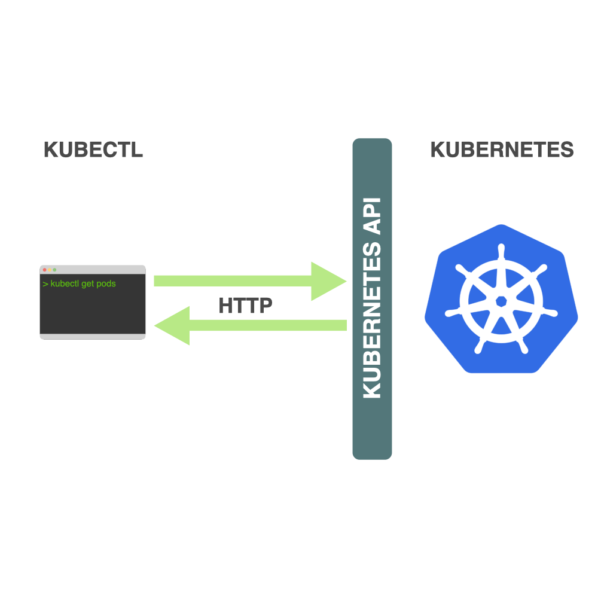

<!-- START doctoc generated TOC please keep comment here to allow auto update -->
<!-- DON'T EDIT THIS SECTION, INSTEAD RE-RUN doctoc TO UPDATE -->
**Table of Contents**  *generated with [DocToc](https://github.com/thlorenz/doctoc)*

- [what is kubectl](#what-is-kubectl)
- [get](#get)
  - [get all](#get-all)
  - [get cluster status](#get-cluster-status)
  - [get po](#get-po)
- [list](#list)
  - [list image from a single deploy](#list-image-from-a-single-deploy)
  - [list Container images by Pod](#list-container-images-by-pod)
  - [list all Container images in all namespaces](#list-all-container-images-in-all-namespaces)
  - [list Container images filtering by Pod namespace](#list-container-images-filtering-by-pod-namespace)
  - [list Container images using a go-template instead of jsonpath](#list-container-images-using-a-go-template-instead-of-jsonpath)
  - [list all quota](#list-all-quota)
  - [get apiservers](#get-apiservers)
  - [get apiresources](#get-apiresources)
  - [check etcd](#check-etcd)

<!-- END doctoc generated TOC please keep comment here to allow auto update -->


## [what is kubectl](https://learnk8s.io/blog/kubectl-productivity/#introduction-what-is-kubectl-)


> reference:
> - [23 Advanced kubectl commands](https://medium.com/faun/kubectl-commands-cheatsheet-43ce8f13adfb)


## get
> [output options](https://learnk8s.io/blog/kubectl-productivity/#3-use-the-custom-columns-output-format):
> `-o custom-columns=<header>:<jsonpath>[,<header>:<jsonpath>]...`

### get all
```bash
$ k get all -A
```

### get cluster status
```bash
$ k get cs
NAME                 STATUS    MESSAGE             ERROR
controller-manager   Healthy   ok
scheduler            Healthy   ok
etcd-1               Healthy   {"health":"true"}
etcd-2               Healthy   {"health":"true"}
etcd-0               Healthy   {"health":"true"}
```

### get po
- name
  ```bash
  $ k -n devops get po -o custom-columns='NAME:metadata.name'
  ```
- or
  ```bash
  $ k -n devops get deploy jenkins -o custom-columns="NAME:metadata.name, IMAGES:..image"
  NAME              IMAGES
  jenkins   jenkins/jenkins:2.187
  ```

## list
### list image from a single deploy
```bash
$ k -n devops get deployment jenkins -o=jsonpath='{.spec.template.spec.containers[:1].image}'
jenkins/jenkins:2.187
```
- or
  ```bash
  $ k -n devops get deploy jenkins -o jsonpath="{..image}"
  jenkins/jenkins:2.187
  ```

### [list Container images by Pod](https://kubernetes.io/docs/tasks/access-application-cluster/list-all-running-container-images/#list-container-images-by-pod)
```bash
$ k get pods --all-namespaces -o=jsonpath="{..image}" -l app=nginx
```

- [or](https://learnk8s.io/blog/kubectl-productivity/#3-use-the-custom-columns-output-format)
  ```bash
  $ k -n <namespace> get po \
      -o custom-columns='NAME:metadata.name,IMAGES:spec.containers[*].image'
  ```

- [or](https://stackoverflow.com/a/60038868/2940319)
  
  ```bash
  $ k -n <namespace> get po <pod_name> -o jsonpath="{..containerID}"

  # or
  $ k -n <namespace> get po <pod_name> \
      -o go-template \
      --template="{{ range .status.containerStatuses }}{{ .containerID }}{{end}}"
  ```
  

### [list all Container images in all namespaces](https://kubernetes.io/docs/tasks/access-application-cluster/list-all-running-container-images/#list-all-container-images-in-all-namespaces)
```bash
$ k get pods --all-namespaces -o jsonpath="{.items[*].spec.containers[*].image}"
```
- or
  ```bash
  $ k get pods --all-namespaces -o jsonpath="{..image}" |
    tr -s '[[:space:]]' '\n' |
    sort |
    uniq -c
  ```

### [list Container images filtering by Pod namespace](https://kubernetes.io/docs/tasks/access-application-cluster/list-all-running-container-images/#list-container-images-filtering-by-pod-namespace)
```bash
$ k -n kube-system get pods -o jsonpath="{..image}"
```

### [list Container images using a go-template instead of jsonpath](https://kubernetes.io/docs/tasks/access-application-cluster/list-all-running-container-images/#list-container-images-using-a-go-template-instead-of-jsonpath)

```bash
$ k get po --all-namespaces \
           -o go-template \
           --template="{{range .items}}{{range .spec.containers}}{{.image}} {{end}}{{end}}"
```


- [or](https://stackoverflow.com/a/52736186/2940319)
  ```bash
  $ k get deploy \
          -o=jsonpath="{range .items[*]}{'\n'}{.metadata.name}{':\t'}{range .spec.template.spec.containers[*]}{.image}{', '}{end}{end}"
  ```

### list all quota
```bash
$ for _i in $(k get ns --no-headers | awk -F' ' '{print $1}'); do
    echo ------------- ${_i} ------------
    k -n ${_i} describe quota
  done
```

### get apiservers
```bash
 $ k get --raw=/apis
```

### get apiresources
- check available
  ```bash
  $ k api-resources
  $ k api-versions
  ```

- check apiservices registered
  ```bash
  $ k get apiservices.apiregistration.k8s.io
  $ k get apiservices.apiregistration.k8s.io v1beta1.metrics.k8s.io -o yaml
  ```

### check etcd
```bash
$ k get --raw=/healthz/etcd
ok
```
