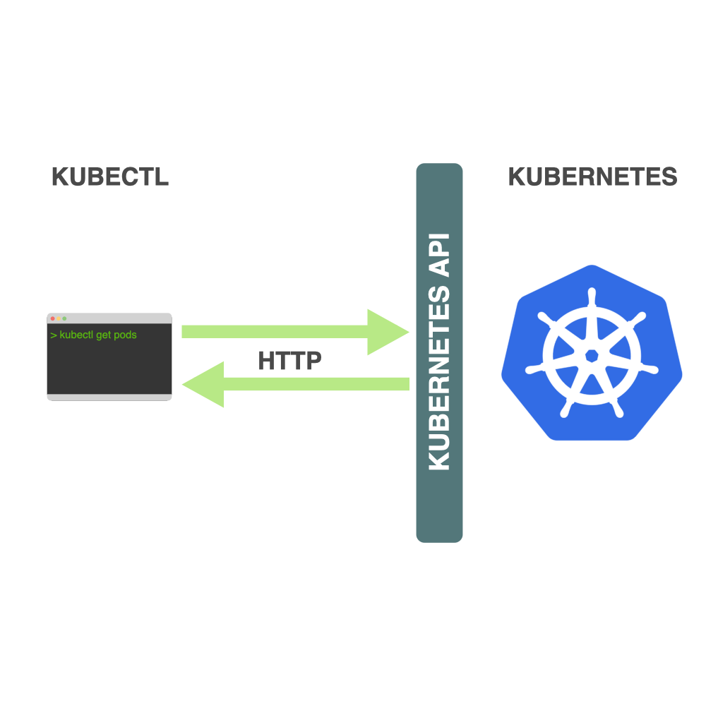

<!-- START doctoc generated TOC please keep comment here to allow auto update -->
<!-- DON'T EDIT THIS SECTION, INSTEAD RE-RUN doctoc TO UPDATE -->

- [what is kubectl](#what-is-kubectl)
- [install](#install)
  - [osx](#osx)
  - [linux](#linux)
  - [windows](#windows)
- [get](#get)
  - [get all](#get-all)
  - [get cluster status](#get-cluster-status)
  - [get po](#get-po)
  - [get all images](#get-all-images)
- [list](#list)
  - [list image from a single deploy](#list-image-from-a-single-deploy)
  - [list Container images by Pod](#list-container-images-by-pod)
  - [list all Container images in all namespaces](#list-all-container-images-in-all-namespaces)
  - [list Container images filtering by Pod namespace](#list-container-images-filtering-by-pod-namespace)
  - [list Container images using a go-template instead of jsonpath](#list-container-images-using-a-go-template-instead-of-jsonpath)
  - [list all quota](#list-all-quota)
  - [check api server healthy](#check-api-server-healthy)
  - [get apiservers](#get-apiservers)
  - [get apiresources](#get-apiresources)
  - [check etcd](#check-etcd)
- [output format](#output-format)
- [patch](#patch)
  - [json patch path](#json-patch-path)
- [apply](#apply)
- [rollback](#rollback)
  - [check history](#check-history)
  - [upgrade with CHANGE-CAUSE](#upgrade-with-change-cause)
  - [check comments](#check-comments)
  - [check replicasets](#check-replicasets)

<!-- END doctoc generated TOC please keep comment here to allow auto update -->

## [what is kubectl](https://learnk8s.io/blog/kubectl-productivity/#introduction-what-is-kubectl-)
- [kubectl](https://kubernetes.io/docs/reference/kubectl/)




> reference:
> - [* Cheatsheet - Kubectl](https://dockerlabs.collabnix.com/kubernetes/cheatsheets/kubectl.html)
> - [* kubectl cheatsheet](https://kapeli.com/cheat_sheets/Kubernetes.docset/Contents/Resources/Documents/index)
> - [23 Advanced kubectl commands](https://medium.com/faun/kubectl-commands-cheatsheet-43ce8f13adfb)
> - [使用 kubectl 管理 Secret](https://kubernetes.io/zh-cn/docs/tasks/configmap-secret/managing-secret-using-kubectl/)
> - [JSONPath Support](https://kubernetes.io/docs/reference/kubectl/jsonpath/)
> - [Basic JSONPath Rules](https://docs.vmware.com/en/VMware-Carbon-Black-Cloud/services/carbon-black-cloud-user-guide/GUID-FBC6C73E-3807-4207-96FF-CF7EE7CE7AB8.html)
> - [Command line tool (kubectl)](https://kubernetes.io/docs/reference/kubectl)
>   - [* Custom columns](https://kubernetes.io/docs/reference/kubectl/#custom-columns)


## install

> [!NOTE]
> references:
> - [install and set up kubectl](https://pwittrock.github.io/docs/tasks/tools/install-kubectl/)
>   - [install and set up kubectl on macos](https://kubernetes.io/docs/tasks/tools/install-kubectl-macos/)
>   - [install and set up kubectl on linux](https://kubernetes.io/docs/tasks/tools/install-kubectl-linux/)
>   - [install and set up kubectl on windows](https://kubernetes.io/docs/tasks/tools/install-kubectl-windows/)
> - [Amazon EKS.pdf](https://docs.aws.amazon.com/pdfs/eks/latest/userguide/eks-ug.pdf)
>   - [installing or updating kubectl](https://docs.aws.amazon.com/eks/latest/userguide/install-kubectl.html)
>
> info:
> ```bash
> $ uname | awk '{print tolower($0)}'
> darwin
> $ curl -s https://storage.googleapis.com/kubernetes-release/release/stable.txt
> v1.26.2
> ```

```bash
$ curl -LO https://storage.googleapis.com/kubernetes-release/release/`curl -s https://storage.googleapis.com/kubernetes-release/release/stable.txt`/bin/$(uname | awk '{print tolower($0)}')/amd64/kubectl
$ chmod +x ./kubectl
$ sudo mv ./kubectl /usr/local/bin/kubectl

# verify
$ kubectl version --client --short
Flag --short has been deprecated, and will be removed in the future. The --short output will become the default.
Client Version: v1.25.3
Kustomize Version: v4.5.
```
- kubectl-convert

  > [!NOTE]
  > A plugin for Kubernetes command-line tool kubectl, which allows you to convert manifests between different API versions. This can be particularly helpful to migrate manifests to a non-deprecated api version with newer Kubernetes release.

  ```bash
  # intel
  $ curl -LO "https://dl.k8s.io/release/$(curl -L -s https://dl.k8s.io/release/stable.txt)/bin/darwin/amd64/kubectl-convert"
  # apple silicon
  $ curl -LO "https://dl.k8s.io/release/$(curl -L -s https://dl.k8s.io/release/stable.txt)/bin/darwin/arm64/kubectl-convert"

  $ chmod +x ./kubectl-convert
  $ sudo mv ./kubectl-convert /usr/local/bin/kubectl-convert
  $ sudo chown root: /usr/local/bin/kubectl-convert
  ```

- sha256 check
  ```bash
  $ curl -LO https://storage.googleapis.com/kubernetes-release/release/`curl -s https://storage.googleapis.com/kubernetes-release/release/stable.txt`/bin/$(uname | awk '{print tolower($0)}')/amd64/kubectl
  $ curl -LO https://storage.googleapis.com/kubernetes-release/release/`curl -s https://storage.googleapis.com/kubernetes-release/release/stable.txt`/bin/$(uname | awk '{print tolower($0)}')/amd64/kubectl.sha256
  $ echo "$(cat kubectl.sha256)  kubectl" | shasum -a 256 --check
  ```

### osx
```bash
# intel
$ curl -LO "https://dl.k8s.io/release/$(curl -L -s https://dl.k8s.io/release/stable.txt)/bin/darwin/amd64/kubectl"

# apple silicon
$ curl -LO "https://dl.k8s.io/release/$(curl -L -s https://dl.k8s.io/release/stable.txt)/bin/darwin/arm64/kubectl"

# or via brew
$ brew install kubectl
```

#### completion

> [!NOTE]
> The Homebrew installation of bash-completion v2 sources all the files in the `BASH_COMPLETION_COMPAT_DIR` directory, that's why the latter two methods work

```
$ brew install bash-completion           # Bash 3.2
$ brew install bash-completion@2         # Bash 4.1+
$ kubectl completion bash > $(brew --prefix)/etc/bash_completion.d/kubectl
```

### linux
```bash
$ curl -LO https://storage.googleapis.com/kubernetes-release/release/`curl -s https://storage.googleapis.com/kubernetes-release/release/stable.txt`/bin/$(uname | awk '{print tolower($0)}')/amd64/kubectl
$ chmod +x ./kubectl
$ sudo mv ./kubectl /usr/local/bin/kubectl
```

#### completion
```bash
$ echo 'source <(kubectl completion bash)' >> ~/.bash_profile
$ kubectl completion bash > /usr/local/etc/bash_completion.d/kubectl
$ echo 'alias k=kubectl' >> ~/.bash_profile
$ echo 'complete -o default -F __start_kubectl k' >> ~/.bash_profile
```

### windows
```bash
> choco install kubernetes-cli

> cd %USERPROFILE%
> mkdir .kube
> touch .kube/config
```

## get


> reference:
> - [output options](https://learnk8s.io/blog/kubectl-productivity/#3-use-the-custom-columns-output-format):
>   ```bash
>   -o custom-columns=<header>:<jsonpath>[,<header>:<jsonpath>]...
>   ```


### get all
```bash
$ kubectl get all -A
```

### get cluster status
```bash
$ kubectl get cs
NAME                 STATUS    MESSAGE             ERROR
controller-manager   Healthy   ok
scheduler            Healthy   ok
etcd-1               Healthy   {"health":"true"}
etcd-2               Healthy   {"health":"true"}
etcd-0               Healthy   {"health":"true"}
```

### get po
- name
  ```bash
  $ kubectl -n devops get po -o custom-columns='NAME:metadata.name'
  ```
- or
  ```bash
  $ kubectl -n devops get deploy jenkins -o custom-columns="NAME:metadata.name, IMAGES:..image"
  NAME              IMAGES
  jenkins   jenkins/jenkins:2.187
  ```

- [get where pods are running](https://faun.pub/kubectl-commands-cheatsheet-43ce8f13adfb)
  ```bash
  $ kubectl get pod -o=custom-columns=NAME:.metadata.name,STATUS:.status.phase,NODE:.spec.nodeName \
                    --all-namespaces
  ```

- sort pods by nodeName
  ```bash
  $ kubectl get pods -o wide --sort-by="{.spec.nodeName}"
  ```

- sort by restart count
  ```bash
  $ kubectl get pods --sort-by="{.status.containerStatuses[:1].restartCount}"
  ```

- sort by age
  ```bash
  $ kubectl get replicasets -o wide --sort-by=.metadata.creationTimestamp
  ```
  - [or](https://discuss.kubernetes.io/t/get-pods-descending-sorted-from-age/5545/2)
    ```bash
    $ kubectl get pods --sort-by=.status.startTime
    ```
  - [or](https://stackoverflow.com/a/66015183/2940319)
    ```bash
    $ kubectl get pods --field-selector=status.phase=Pending \
                       --sort-by=.metadata.creationTimestamp |
              awk 'match($5,/^[1-5]d/) {print $0}'
    ```

### get all images
```bash
$ kubectl get pods --all-namespaces \
                   -o jsonpath="{..image}" |
          tr -s '[[:space:]]' '\n' |
          sort |
          uniq -c
```

## list
### list image from a single deploy
```bash
$ kubectl -n devops get deployment jenkins -o=jsonpath='{.spec.template.spec.containers[:1].image}'
jenkins/jenkins:2.187
```
- or
  ```bash
  $ kubectl -n devops get deploy jenkins -o jsonpath="{..image}"
  jenkins/jenkins:2.187
  ```

### [list Container images by Pod](https://kubernetes.io/docs/tasks/access-application-cluster/list-all-running-container-images/#list-container-images-by-pod)
```bash
$ kubectl get pods --all-namespaces -o=jsonpath="{..image}" -l app=nginx
```

- [or](https://learnk8s.io/blog/kubectl-productivity/#3-use-the-custom-columns-output-format)
  ```bash
  $ kubectl -n <namespace> get po \
      -o custom-columns='NAME:metadata.name,IMAGES:spec.containers[*].image'
  ```

- [or](https://stackoverflow.com/a/60038868/2940319)
  
  ```bash
  $ kubectl -n <namespace> get po <pod_name> -o jsonpath="{..containerID}"

  # or
  $ kubectl -n <namespace> get po <pod_name> \
      -o go-template \
      --template="{{ range .status.containerStatuses }}{{ .containerID }}{{end}}"
  ```
  

### [list all Container images in all namespaces](https://kubernetes.io/docs/tasks/access-application-cluster/list-all-running-container-images/#list-all-container-images-in-all-namespaces)
```bash
$ kubectl get pods --all-namespaces -o jsonpath="{.items[*].spec.containers[*].image}"
```
- or
  ```bash
  $ kubectl get pods --all-namespaces -o jsonpath="{..image}" |
    tr -s '[[:space:]]' '\n' |
    sort |
    uniq -c
  ```

### [list Container images filtering by Pod namespace](https://kubernetes.io/docs/tasks/access-application-cluster/list-all-running-container-images/#list-container-images-filtering-by-pod-namespace)
```bash
$ kubectl -n kube-system get pods -o jsonpath="{..image}"
```

### [list Container images using a go-template instead of jsonpath](https://kubernetes.io/docs/tasks/access-application-cluster/list-all-running-container-images/#list-container-images-using-a-go-template-instead-of-jsonpath)

```bash
$ kubectl get po --all-namespaces \
           -o go-template \
           --template="{{range .items}}{{range .spec.containers}}{{.image}} {{end}}{{end}}"
```


- [or](https://stackoverflow.com/a/52736186/2940319)
  ```bash
  $ kubectl get deploy \
          -o=jsonpath="{range .items[*]}{'\n'}{.metadata.name}{':\t'}{range .spec.template.spec.containers[*]}{.image}{', '}{end}{end}"
  ```

### list all quota
```bash
$ for _i in $(kubectl get ns --no-headers | awk -F' ' '{print $1}'); do
    echo ------------- ${_i} ------------
    kubectl -n ${_i} describe quota
  done
```

### check api server healthy
```bash
$ kubectl get apiservice
```
- delete apiservers
  ```bash
  $ kubectl delete apiservice v1beta1.metrics.k8s.io
  ```

### get apiservers
```bash
 $ kubectl get --raw=/apis
```

### get apiresources
- check available
  ```bash
  $ kubectl api-resources
  $ kubectl api-versions
  ```

- check apiservices registered
  ```bash
  $ kubectl get apiservices.apiregistration.k8s.io
  $ kubectl get apiservices.apiregistration.k8s.io v1beta1.metrics.k8s.io -o yaml
  ```

  <!--sec data-title="details" data-id="section0" data-show=true data-collapse=true ces-->
  ```bash
  $ kubectl get apiservices.apiregistration.k8s.io
  NAME                                   SERVICE                      AVAILABLE                 AGE
  v1.                                    Local                        True                      4y
  v1.apps                                Local                        True                      4y
  v1.authentication.k8s.io               Local                        True                      4y
  v1.authorization.k8s.io                Local                        True                      4y
  v1.autoscaling                         Local                        True                      4y
  v1.batch                               Local                        True                      4y
  v1.monitoring.coreos.com               Local                        True                      168d
  v1.networking.k8s.io                   Local                        True                      4y
  v1.rbac.authorization.k8s.io           Local                        True                      4y
  v1.storage.k8s.io                      Local                        True                      4y
  v1beta1.admissionregistration.k8s.io   Local                        True                      4y
  v1beta1.apiextensions.k8s.io           Local                        True                      4y
  v1beta1.apps                           Local                        True                      4y
  v1beta1.authentication.k8s.io          Local                        True                      4y
  v1beta1.authorization.k8s.io           Local                        True                      4y
  v1beta1.batch                          Local                        True                      4y
  v1beta1.certificates.k8s.io            Local                        True                      4y
  v1beta1.coordination.k8s.io            Local                        True                      4y
  v1beta1.events.k8s.io                  Local                        True                      4y
  v1beta1.extensions                     Local                        True                      4y
  v1beta1.metrics.k8s.io                 kube-system/metrics-server   False (ServiceNotFound)   188d
  v1beta1.policy                         Local                        True                      4y
  v1beta1.rbac.authorization.k8s.io      Local                        True                      4y
  v1beta1.scheduling.k8s.io              Local                        True                      4y
  v1beta1.storage.k8s.io                 Local                        True                      4y
  v1beta2.apps                           Local                        True                      4y
  v2beta1.autoscaling                    Local                        True                      4y
  v2beta2.autoscaling                    Local                        True                      4y0

  $ kubectl get apiservices.apiregistration.k8s.io v1beta1.metrics.k8s.io -o yaml --export
  apiVersion: apiregistration.k8s.io/v1
  kind: APIService
  metadata:
    name: v1beta1.metrics.k8s.io
  spec:
    group: metrics.k8s.io
    groupPriorityMinimum: 100
    insecureSkipTLSVerify: true
    service:
      name: prometheus-adapter
      namespace: monitoring
    version: v1beta1
    versionPriority: 100
  status:
    conditions:
    - lastTransitionTime: 2022-08-15T14:10:39Z
      message: all checks passed
      reason: Passed
      status: "True"
      type: Available
  ```
  <!--endsec-->

- troubleshooting

  > [!NOTE|label:references:]
  > ```
  > $ kubectl api-resources
  > error: unable to retrieve the complete list of server APIs: metrics.k8s.io/v1beta1: the server is currently unable to handle the request
  > ```
  > - references:
  >   - [#1223: "couldn't get resource list" error](https://github.com/kubernetes/client-go/issues/1223)
  >   - [#11772: Couldn't get resource list for metrics error](https://github.com/helm/helm/issues/11772)
  >   - [#157: couldn't get resource list for metrics.k8s.io/v1beta1: the server is currently unable to handle the request](https://github.com/kubernetes-sigs/metrics-server/issues/157)
  >   - [Configure Service Accounts for Pods](https://kubernetes.io/docs/tasks/configure-pod-container/configure-service-account/)

  ```bash
  $ kubectl get apiservices.apiregistration.k8s.io
  NAME                                   SERVICE                      AVAILABLE                 AGE
  v1beta1.metrics.k8s.io                 kube-system/metrics-server   False (ServiceNotFound)   188d

  # remove metrics.k8s.io
  $ kubectl delete apiservices.apiregistration.k8s.io v1beta1.metrics.k8s.io

  # debug
  $ kubectl get secrets $(kubectl -n kube-system get sa metrics-server -o 'jsonpath={.secrets[].name}')
  Error from server (NotFound): secrets "metrics-server-token-mr49q" not found

  $ kubectl get secrets $(kubectl -n kube-system get sa metrics-server -o 'jsonpath={.secrets[].name}') \
            -o "jsonpath={.data.ca\.crt}" |
            base64 -d |
            openssl x509 -text -noout |
            grep Not
  # get token
  $ kubectl get secrets $(kubectl -n kube-system get sa metrics-server -o 'jsonpath={.secrets[].name}') \
            -o "jsonpath={.data.token}" |
            base64 -d -w0
  # get namespace
  $ kubectl get secrets $(kubectl -n kube-system get sa metrics-server -o 'jsonpath={.secrets[].name}') \
            -o "jsonpath={.data.namespace}" |
            base64 -d -w0
  ```

### check etcd
```bash
$ kubectl get --raw=/healthz/etcd
ok
```

## output format

> [!NOTE|label:references:]
> - [Kubectl output options](https://gist.github.com/so0k/42313dbb3b547a0f51a547bb968696ba)
> - [Getting Custom Output From Kubectl With Examples](https://technekey.com/customizing-the-kubectl-output/)


## patch

```bash

$ kubectl patch deploy dev-jenkins -n devops-ci \
          --type='json' \
          -p='[{"op": "replace", "path": "/spec/template/spec/containers/0/image", "value": "jenkins/jenkins:2.461-jdk17"}]'
```

### json patch path

> [!TIP]
> - jsonpath vs. json patch path
>> ```
>> {.spec.template.spec.containers[0].image}
>> →
>> /spec/template/spec/containers/0/image
>> ```

```bash
$ kubectl -n devops-ci get deployment dev-jenkins -o json |
          jq -r 'paths(scalars) as $p | select(getpath($p) | tostring | test(".*jenkins.*")) |
          "/"+($p | map(tostring) | join("/")) + " = " + (getpath($p) | tostring)'
/metadata/labels/app = dev-jenkins
/metadata/name = dev-jenkins
/metadata/selfLink = /apis/extensions/v1beta1/namespaces/devops-ci/deployments/dev-jenkins
/spec/selector/matchLabels/app = dev-jenkins
/spec/template/metadata/labels/app = dev-jenkins
/spec/template/spec/containers/0/env/0/value = -Duser.timezone='America/Los_Angeles' -Dhudson.model.DirectoryBrowserSupport.CSP="" -Djenkins.slaves.NioChannelSelector.disabled=true -Djenkins.slaves.JnlpSlaveAgentProtocol3.enabled=false -Djava.awt.headless=true -Djenkins.security.ClassFilterImpl.SUPPRESS_WHITELIST=true -Dhudson.model.ParametersAction.keepUndefinedParameters=true -Dcom.cloudbees.workflow.rest.external.ChangeSetExt.resolveCommitAuthors=true -Djenkins.install.runSetupWizard=true -Dpermissive-script-security.enabled=true -DsessionTimeout=1440 -DsessionEviction=43200 -Dfile.encoding=UTF-8 -Dsun.jnu.encoding=utf-8 -Dgroovy.grape.report.downloads=true -Divy.message.logger.level=4 -Dhudson.plugins.active_directory.ActiveDirectorySecurityRealm.forceLdaps=false -Djenkins.model.Jenkins.logStartupPerformance=true -Dhudson.security.csrf.DefaultCrumbIssuer.EXCLUDE_SESSION_ID=true -Djsch.client_pubkey='ssh-rsa,ssh-ed25519,ecdsa-sha2-nistp256,ecdsa-sha2-nistp384,ecdsa-sha2-nistp521,rsa-sha2-512,rsa-sha2-256' -Djsch.server_host_key='ssh-rsa,ssh-ed25519,ecdsa-sha2-nistp256,ecdsa-sha2-nistp384,ecdsa-sha2-nistp521,rsa-sha2-512,rsa-sha2-256' -Xms32g -Xmx32g -XX:+AlwaysPreTouch -XX:+HeapDumpOnOutOfMemoryError -XX:HeapDumpPath=/var/jenkins_home/logs -XX:+UseG1GC -XX:+UseStringDeduplication -XX:+ParallelRefProcEnabled -XX:+DisableExplicitGC -XX:+UnlockDiagnosticVMOptions -XX:+UnlockExperimentalVMOptions -verbose:gc -XX:+PrintGC -XX:+PrintGCDetails -XX:ErrorFile=/var/jenkins_home/logs/hs_err_%p.log -XX:+LogVMOutput -XX:LogFile=/var/jenkins_home/logs/jvm.log -XX:InitialRAMPercentage=50.0 -XX:MaxRAMPercentage=50.0 -Xlog:gc*=info,gc+heap=debug,gc+ref*=debug,gc+ergo*=trace,gc+age*=trace:file=/var/jenkins_home/logs/gc-%t.log:utctime,pid,level,tags:filecount=2,filesize=100M
/spec/template/spec/containers/0/env/1/value = -Dorg.jenkinsci.remoting.engine.JnlpProtocol3.disabled=false
/spec/template/spec/containers/0/image = artifactory.marvell.com/it-devops-dockerub-remote/jenkins/jenkins:2.512-jdk21
/spec/template/spec/containers/0/name = dev-jenkins
/spec/template/spec/containers/0/volumeMounts/0/mountPath = /var/jenkins_home
/spec/template/spec/containers/0/volumeMounts/0/name = dev-jenkins-home
/spec/template/spec/serviceAccount = dev-jenkins-admin
/spec/template/spec/serviceAccountName = dev-jenkins-admin
/spec/template/spec/volumes/0/name = dev-jenkins-home
/spec/template/spec/volumes/0/persistentVolumeClaim/claimName = dev-jenkins-pvc
/status/conditions/0/message = ReplicaSet "dev-jenkins-569fcd784c" has successfully progressed.
```

| **PURPOSE**               | **JSON PATCH PATH**                                                      | **JSONPATH EXPRESSION**                                                                 |
| ------------------------- | ------------------------------------------------------------------------ | --------------------------------------------------------------------------------------- |
| Used for                  | Modifying fields in `kubectl patch --type=json`                          | Reading/querying values in `kubectl get -o jsonpath=...`                                |
| Syntax                    | Slash-separated path (`/a/b/0/c`)                                        | Dot notation with array indexing (`{.a.b[0].c}`)                                        |
| Array access              | Index with `/0/`                                                         | Index with `[0]`                                                                        |
| Wildcards / filters       | Not supported                                                            | Supported                                                                               |
| Field quoting or escaping | Follows [RFC 6902 JSON Patch](https://tools.ietf.org/html/rfc6902) rules | Follows [JSONPath syntax](https://kubernetes.io/docs/reference/kubectl/jsonpath/) rules |

| **FIELD**       | **JSON PATCH PATH**                      | **JSONPATH EXPRESSION**                     |
| --------------- | ---------------------------------------- | ------------------------------------------- |
| Container image | `/spec/template/spec/containers/0/image` | `{.spec.template.spec.containers[0].image}` |
| Container name  | `/spec/template/spec/containers/0/name`  | `{.spec.template.spec.containers[0].name}`  |

## apply

> [!NOTE|label:referenecs]
> - [kube apply](https://www.mankier.com/1/kubectl-apply)
> - [Declarative Management of Kubernetes Objects Using Configuration Files](https://kubernetes.io/docs/tasks/manage-kubernetes-objects/declarative-config/)
> - [Understanding the Kubectl Apply Command](https://luispreciado.blog/posts/kubernetes/core-concepts/kubectl-apply)
> - [How kubectl apply command works?](https://technos.medium.com/how-kubectl-apply-command-works-d092121056d3)

- oneline cmd
  ```bash
  $ cat << EOF | kubectl create -f -
  apiVersion: v1
  kind: Secret
  metadata:
    name: mysecret
  type: Opaque
  data:
    password: $(echo "admin" | base64)
    username: $(echo "1f2d1e2e67df" | base64)
  EOF
  ```

- [`edit-last-applied`](https://www.mankier.com/1/kubectl-apply-edit-last-applied)

  ```bash
  # Edit the last-applied-configuration annotations by type/name in YAML
  kubectl apply edit-last-applied deployment/nginx

  # Edit the last-applied-configuration annotations by file in JSON
  kubectl apply edit-last-applied -f deploy.yaml -o json
  ```

## rollback

> [!NOTE|label:references:]
> -[** How do you rollback deployments in Kubernetes?](https://learnk8s.io/kubernetes-rollbacks)

```bash
# format
$ kubectl rollout undo deployment <name> --to-revision=<n>

# -- i.e.: --
# rollout to specific version ( 3 )
$ kubectl -n devops-ci rollout undo deployment/devops-dev-jenkins --to-revision=3

# -- check rollout status --
$ kubectl -n devops-ci rollout status deployment/devops-dev-jenkins
# or
$ kubectl -n devops-ci get deploy devops-dev-jenkins -o jsonpath='{.spec.template.spec.containers[*].image}'
```

### check history
```bash
$ kubectl -n devops-ci rollout history deployment/dev-jenkins
deployment.extensions/dev-jenkins
REVISION  CHANGE-CAUSE
...
48        <none>
49        <none>

$ kubectl -n devops-ci get replicasets -l app=dev-jenkins --sort-by=.metadata.creationTimestamp
NAME                            DESIRED   CURRENT   READY   AGE
...
dev-jenkins-f6846c86d    0         0         0       31d
dev-jenkins-569fcd784c   1         1         1       5h21m
```

### upgrade with CHANGE-CAUSE
```bash
# with --record
$ kubectl -n devops-ci set image deployment/dev-jenkins dev-jenkins=artifactory.marvell.com/it-devops-dockerub-remote/jenkins/jenkins:2.512-jdk21 --record
Flag --record has been deprecated, --record will be removed in the future
deployment.extensions/dev-jenkins image updated

$ kubectl -n devops-ci rollout history deployment/dev-jenkins
deployment.extensions/dev-jenkins
REVISION  CHANGE-CAUSE
...
48        <none>
49        kubectl set image deployment/dev-jenkins dev-jenkins=artifactory.marvell.com/it-devops-dockerub-remote/jenkins/jenkins:2.512-jdk21 --kubeconfig=/Users/marslo/iMarslo/job/devops/env/linux/dc5-ssdfw8/.kube/config --namespace=devops-ci --record=tru

# with annotate
# -- update --
$ kubectl -n devops-ci set image deployment/dev-jenkins dev-jenkins=artifactory.marvell.com/it-devops-dockerub-remote/jenkins/jenkins:2.512-jdk21 --record
# -- annotate --
$ kubectl -n devops-ci annotate deployment dev-jenkins kubernetes.io/change-cause="Upgrade Jenkins to 2.512-jdk21 @ $(date +'%F %T')"

$ kubectl -n devops-ci rollout history deployment/dev-jenkins
$ kubectl -n devops-ci rollout history deployment/dev-jenkins
deployment.extensions/dev-jenkins
REVISION  CHANGE-CAUSE
...
48        <none>
49        upgrade dev jenkins to 2.512-jdk21 @ 2025-06-02 20:45:16
```

### check comments
```bash
$ kubectl -n devops-ci get rs -l app=dev-jenkins \
          -o jsonpath='{range .items[*]}{"REV: "}{.metadata.annotations.deployment\.kubernetes\.io/revision}{"  CAUSE: "}{.metadata.annotations.kubernetes\.io/change-cause}{"\n"}{end}'
Warning: short name "rs" could also match lower priority resource replicasets.apps
REV: 49  CAUSE: upgrade dev jenkins to 2.512-jdk21 @ 2025-06-02 20:45:16
REV: 44  CAUSE:
...

# or
$ kubectl -n devops-ci rollout history deployment/dev-jenkins
deployment.extensions/dev-jenkins
REVISION  CHANGE-CAUSE
...
48        <none>
49        upgrade dev jenkins to 2.512-jdk21 @ 2025-06-02 20:45:16
```

### check replicasets
```bash
$ kubectl -n devops-ci get replicasets -l app=dev-jenkins --sort-by=.metadata.creationTimestamp
NAME                     DESIRED   CURRENT   READY   AGE
...
dev-jenkins-f6846c86d    0         0         0       31d
dev-jenkins-569fcd784c   1         1         1       5h30m

# show timestamp
$ kubectl -n devops-ci get replicasets -l app=devops-dev-jenkins \
          -o=jsonpath='{range .items[*]}{"REVISION: "}{.metadata.annotations.deployment\.kubernetes\.io/revision}{"\tCREATED: "}{.metadata.creationTimestamp}{"\n"}{end}' |
  sort
...
REVISION: 48  CREATED: 2025-05-02T23:36:56Z
REVISION: 49  CREATED: 2025-06-02T22:19:17Z
```
