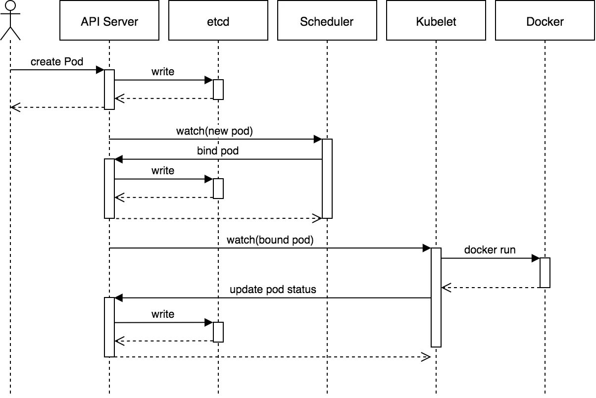
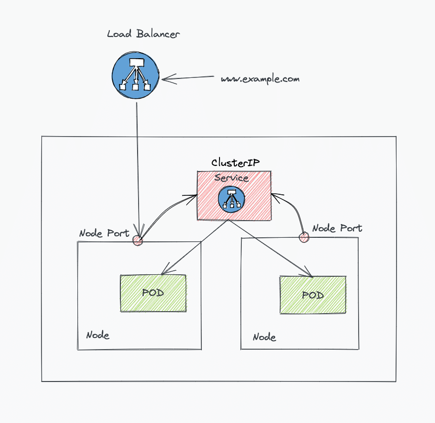
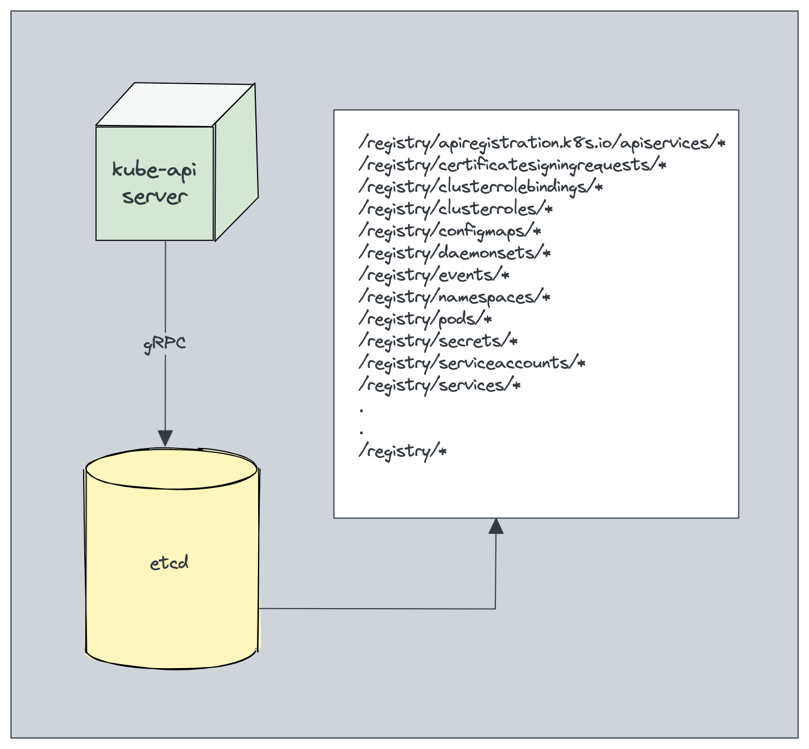

<!-- START doctoc generated TOC please keep comment here to allow auto update -->
<!-- DON'T EDIT THIS SECTION, INSTEAD RE-RUN doctoc TO UPDATE -->

- [core design principles](#core-design-principles)
  - [constants and well-known values and paths](#constants-and-well-known-values-and-paths)
    - [`/etc/kubernetes/manifests`](#etckubernetesmanifests)
    - [`/etc/kubernetes`](#etckubernetes)
    - [names of certificates and key files](#names-of-certificates-and-key-files)
  - [API server](#api-server)
    - [static pod manifest](#static-pod-manifest)
    - [other api server flags](#other-api-server-flags)
  - [controller manager](#controller-manager)
    - [static Pod manifest](#static-pod-manifest)
    - [other flags](#other-flags)
  - [flow](#flow)
    - [pod creation](#pod-creation)
    - [ingress traffic](#ingress-traffic)
- [ports and protocols](#ports-and-protocols)
  - [contol plane](#contol-plane)
  - [worker node(s)](#worker-nodes)
- [architecture](#architecture)
  - [control pannel](#control-pannel)
    - [kube-apiserver](#kube-apiserver)
    - [etcd](#etcd)
    - [kube-scheduler](#kube-scheduler)
    - [controller manager](#controller-manager-1)
    - [ccm : cloud controller manager](#ccm--cloud-controller-manager)
  - [work node](#work-node)
    - [kubelet](#kubelet)
    - [kube proxy](#kube-proxy)
    - [cri-o : container runtime](#cri-o--container-runtime)
- [jsonpath](#jsonpath)
- [options](#options)
  - [explain](#explain)
- [kubectl alias](#kubectl-alias)
  - [`__start_kubectl`](#__start_kubectl)
  - [`_complete_alias`](#_complete_alias)
  - [kubecolor](#kubecolor)
- [token](#token)
  - [check token](#check-token)
  - [generate token](#generate-token)
- [tear down](#tear-down)
- [references](#references)

<!-- END doctoc generated TOC please keep comment here to allow auto update -->

> [!TIP]
> `kubernetes.io` add `/_print` as suffix in the url, it will show pages into one page
> i.e.:
> - [https://kubernetes.io/docs/setup/best-practices/](https://kubernetes.io/docs/setup/best-practices/)
> - [https://kubernetes.io/docs/setup/best-practices/_print/](https://kubernetes.io/docs/setup/best-practices/_print/)
> - [* ramitsurana/awesome-kubernetes](https://github.com/ramitsurana/awesome-kubernetes) | [Awesome Kubernetes](https://ramitsurana.github.io/awesome-kubernetes/)
> - [ibm-cloud-architecture/refarch-cloudnative-devops-kubernetes](https://github.com/ibm-cloud-architecture/refarch-cloudnative-devops-kubernetes)


# [core design principles](https://kubernetes.io/docs/reference/setup-tools/kubeadm/implementation-details/#core-design-principles)
## [constants and well-known values and paths](https://kubernetes.io/docs/reference/setup-tools/kubeadm/implementation-details/#constants-and-well-known-values-and-paths)

### `/etc/kubernetes/manifests`

> [!TIP]
> `/etc/kubernetes/manifests` as the path where kubelet should look for static Pod manifests. Names of static Pod manifests are:
> - `etcd.yaml`
> - `kube-apiserver.yaml`
> - `kube-controller-manager.yaml`
> - `kube-scheduler.yaml`

### `/etc/kubernetes`

> [!TIP]
> - [important kubernetes cluster configurations](https://devopscube.com/kubernetes-cluster-configurations/)
> `/etc/kubernetes/` as the path where kubeconfig files with identities for control plane components are stored. Names of kubeconfig files are:
> - `kubelet.conf` (bootstrap-kubelet.conf during TLS bootstrap)
> - `controller-manager.conf`
> - `scheduler.conf`
> - `admin.conf` for the cluster admin and kubeadm itself

### names of certificates and key files

> [!TIP]
> - `ca.crt`, `ca.key` for the Kubernetes certificate authority
> - `apiserver.crt`, `apiserver.key` for the API server certificate
> - `apiserver-kubelet-client.crt`, `apiserver-kubelet-client.key` for the client certificate used by the API server to connect to the kubelets securely
> - `sa.pub`, `sa.key` for the key used by the controller manager when signing ServiceAccount
> - `front-proxy-ca.crt`, `front-proxy-ca.key` for the front proxy certificate authority
> - `front-proxy-client.crt`, `front-proxy-client.key` for the front proxy client

## [API server](https://kubernetes.io/docs/reference/setup-tools/kubeadm/implementation-details/#api-server)

### [static pod manifest](https://kubernetes.io/docs/tasks/configure-pod-container/static-pod/)

> [!TIP]
> - `apiserver-advertise-address` and `apiserver-bind-port` to bind to; if not provided, those value defaults to the IP address of the default network interface on the machine and port `6443`
> - `service-cluster-ip-range` to use for services
> - If an external etcd server is specified, the `etcd-servers` address and related TLS settings (`etcd-cafile`, `etcd-certfile`, `etcd-keyfile`);
>   - if an external etcd server is not be provided, a local etcd will be used ( via host network )
> - If a cloud provider is specified, the corresponding `--cloud-provider` is configured, together with the `--cloud-config` path if such file exists (this is experimental, alpha and will be removed in a future version)

### other api server flags

- `--insecure-port=0` to avoid insecure connections to the api server
- `--enable-bootstrap-token-auth=true` to enable the BootstrapTokenAuthenticator authentication module. See TLS Bootstrapping for more details
- `--allow-privileged` to true (required e.g. by kube proxy)
- `--requestheader-client-ca-file` to front-proxy-ca.crt
- `--enable-admission-plugins` to:
  - `NamespaceLifecycle` e.g. to avoid deletion of system reserved namespaces
  - `LimitRanger` and `ResourceQuota` to enforce limits on namespaces
  - `ServiceAccount` to enforce service account automation
  - `PersistentVolumeLabel` attaches region or zone labels to PersistentVolumes as defined by the cloud provider (This admission controller is deprecated and will be removed in a future version. It is not deployed by kubeadm by default with v1.9 onwards when not explicitly opting into using gce or aws as cloud providers)
  - `DefaultStorageClass` to enforce default storage class on PersistentVolumeClaim objects
  - `DefaultTolerationSeconds`
  - `NodeRestriction` to limit what a kubelet can modify (e.g. only pods on this node)
- `--kubelet-preferred-address-types` to `InternalIP`,`ExternalIP`,`Hostname`; this makes `kubectl logs` and other API server-kubelet communication work in environments where the hostnames of the nodes aren't resolvable
- Flags for using certificates generated in previous steps:
  - `--client-ca-file` to `ca.crt`
  - `--tls-cert-file` to `apiserver.crt`
  - `--tls-private-key-file` to `apiserver.key`
  - `--kubelet-client-certificate` to `apiserver-kubelet-client.crt`
  - `--kubelet-client-key` to `apiserver-kubelet-client.key`
  - `--service-account-key-file` to `sa.pub`
  - `--requestheader-client-ca-file` to `front-proxy-ca.crt`
  - `--proxy-client-cert-file` to `front-proxy-client.crt`
  - `--proxy-client-key-file` to `front-proxy-client.key`
- Other flags for securing the front proxy (API Aggregation) communications:
  - `--requestheader-username-headers=X-Remote-User`
  - `--requestheader-group-headers=X-Remote-Group`
  - `--requestheader-extra-headers-prefix=X-Remote-Extra-`
  - `--requestheader-allowed-names=front-proxy-client`

## [controller manager](https://kubernetes.io/docs/reference/setup-tools/kubeadm/implementation-details/#controller-manager)

### [static Pod manifest](https://kubernetes.io/docs/tasks/configure-pod-container/static-pod/)

> [!TIP]
> - If kubeadm is invoked specifying a `--pod-network-cidr`, the subnet manager feature required for some CNI network plugins is enabled by setting:
>   - `--allocate-node-cidrs=true`
>   - `--cluster-cidr` and `--node-cidr-mask-size` flags according to the given CIDR
> - If a cloud provider is specified, the corresponding `--cloud-provider` is specified, together with the `--cloud-config` path if such configuration file exists (this is experimental, alpha and will be removed in a future version)

### other flags
- `--controllers` enabling all the default controllers plus `BootstrapSigner` and `TokenCleaner` controllers for TLS bootstrap. See TLS Bootstrapping for more details
- `--use-service-account-credentials` to true
- Flags for using certificates generated in previous steps:
  - `--root-ca-file` to ca.crt
  - `--cluster-signing-cert-file` to `ca.crt`, if External CA mode is disabled, otherwise to `""`
  - `--cluster-signing-key-file` to `ca.key`, if External CA mode is disabled, otherwise to `""`
  - `--service-account-private-key-file` to sa.key

## flow
### pod creation

[](https://medium.com/jorgeacetozi/kubernetes-master-components-etcd-api-server-controller-manager-and-scheduler-3a0179fc8186)

### ingress traffic



# [ports and protocols](https://kubernetes.io/docs/reference/ports-and-protocols/)
## contol plane

| PROTOCOL | DIRECTION | PORT RANGE  | PURPOSE                 | USED BY              |
|----------|-----------|-------------|-------------------------|----------------------|
| TCP      | Inbound   | `6443`      | Kubernetes API server   | All                  |
| TCP      | Inbound   | `2379-2380` | etcd server client API  | kube-apiserver, etcd |
| TCP      | Inbound   | `10250`     | Kubelet API             | Self, Control plane  |
| TCP      | Inbound   | `10259`     | kube-scheduler          | Self                 |
| TCP      | Inbound   | `10257`     | kube-controller-manager | Self                 |


## worker node(s)
| PROTOCOL | DIRECTION | PORT RANGE    | PURPOSE                                                                               | USED BY             |
|----------|-----------|---------------|---------------------------------------------------------------------------------------|---------------------|
| TCP      | Inbound   | `10250`       | Kubelet API                                                                           | Self, Control plane |
| TCP      | Inbound   | `30000-32767` | [NodePort Services](https://kubernetes.io/docs/concepts/services-networking/service/) | All                 |


# [architecture](https://devopscube.com/kubernetes-architecture-explained/)


## control pannel

### kube-apiserver


### etcd


### kube-scheduler


### controller manager


### ccm : cloud controller manager


## work node

> [!NOTE]
> - [supported endpoints](https://kubernetes.io/docs/setup/production-environment/tools/kubeadm/install-kubeadm/)
> - linux
>
> | RUNTIME                           | PATH TO UNIX DOMAIN SOCKET                 |
> |-----------------------------------|--------------------------------------------|
> | containerd                        | unix:///var/run/containerd/containerd.sock |
> | CRI-O                             | unix:///var/run/crio/crio.sock             |
> | Docker Engine (using cri-dockerd) | unix:///var/run/cri-dockerd.sock           |
>
> - windows
>
> | RUNTIME                           | PATH TO UNIX DOMAIN SOCKET             |
> |-----------------------------------|----------------------------------------|
> | containerd                        | npipe:////./pipe/containerd-containerd |
> | Docker Engine (using cri-dockerd) | npipe:////./pipe/cri-dockerd           |

### kubelet


### kube proxy


### cri-o : container runtime


# jsonpath

> [!NOTE|label:references:]
> - [JSONPath Support](https://kubernetes.io/docs/reference/kubectl/jsonpath/)
> - [how to make kubectl jsonpath output on separate lines](https://downey.io/notes/dev/kubectl-jsonpath-new-lines/)
> - [JSONPath Reference](https://support.smartbear.com/readyapi/docs/testing/jsonpath-reference.html)
> - [Basic JSONPath Rules](https://docs.vmware.com/en/VMware-Carbon-Black-Cloud/services/carbon-black-cloud-user-guide/GUID-FBC6C73E-3807-4207-96FF-CF7EE7CE7AB8.html)
> - [Playing with kubectl output](https://gist.github.com/so0k/42313dbb3b547a0f51a547bb968696ba)

# options
## explain
```bash
$ kubectl explain hpa
KIND:     HorizontalPodAutoscaler
VERSION:  autoscaling/v1

DESCRIPTION:
     configuration of a horizontal pod autoscaler.

FIELDS:
   apiVersion <string>
   ...
```

- or
  ```bash
  $ kubectl explain configmap
  KIND:     ConfigMap
  VERSION:  v1

  DESCRIPTION:
       ConfigMap holds configuration data for pods to consume.

  FIELDS:
     apiVersion <string>
       APIVersion defines the versioned schema of this representation of an
       object. Servers should convert recognized schemas to the latest internal
       value, and may reject unrecognized values. More info:
       https://git.k8s.io/community/contributors/devel/api-conventions.md#resources
       ...
  ```

# [kubectl alias](https://learnk8s.io/blog/kubectl-productivity/)
## `__start_kubectl`
```bash
$ echo 'source <(kubectl completion bash)' >> ~/.bashrc
$ cat >> ~/.bashrc <<EOF
alias k='kubectl'
alias kc='kubectl -n kube-system'
alias ki='kubectl -n ingress-ngxin'
alias kk='kubectl -n kubernetes-dashboard'
for _i in k kc ki kk; do complete -F __start_kubectl "${_i}"; done
EOF
$ source ~/.bashrc
```

## `_complete_alias`
```bash
$ sudo dnf install -y bash-completion

# download bash_completion.sh for kubectl
$ curl -fsSL https://github.com/cykerway/complete-alias/raw/master/complete_alias -o ~/.bash_completion.sh
# or rhel/centos
$ sudo curl -fsSL https://github.com/marslo/dotfiles/raw/main/.marslo/.completion/complete_alias -o /etc/profile.d/complete_alias.sh
$ sudo chmod +x !$

$ cat >> ~/.bashrc << EOF
command -v kubectl >/dev/null && source <(kubectl completion bash)
test -f ~/.bash_completion.sh && source ~/.bash_completion.sh
# or
# test -f /etc/profile.d/complete_alias.sh && source /etc/profile.d/complete_alias.sh

alias k='kubectl'
alias kc='kubectl -n kube-system'
alias ki='kubectl -n ingress-ngxin'
alias kk='kubectl -n kubernetes-dashboard'
alias km='kubectl -n monitoring'

complete -o default -F __start_kubectl kubecolor
complete -o nosort -o bashdefault -o default -F _complete_alias $(alias | sed -rn 's/^alias ([^=]+)=.+kubec.+$/\1/p' | xargs)
EOF

$ source ~/.bashrc
```

## kubecolor

```bash
$ [[ -d /tmp/kubecolor ]] && sudo mkdir -p /tmp/kubecolor
$ curl -fsSL https://github.com/hidetatz/kubecolor/releases/download/v0.0.25/kubecolor_0.0.25_Linux_x86_64.tar.gz | tar xzf - -C /tmp/kubecolor
$ sudo mv /tmp/kubecolor/kubecolor /usr/local/bin/
$ sudo chmod +x /usr/local/bin/kubecolor
```

# token
## check token
```bash
$ sudo kubeadm token list
TOKEN                     TTL         EXPIRES                     USAGES                   DESCRIPTION   EXTRA GROUPS
bop765.brol9nsrw820gmbi   <forever>   <never>                     authentication,signing   <none>        system:bootstrappers:kubeadm:default-node-token
khhfwa.jvkvrpiknx4o6ffy   19h         2018-07-13T11:37:43+08:00   authentication,signing   <none>        system:bootstrappers:kubeadm:default-node-token
```

## generate token

> [!NOET|label:see also:]
> - [* iMarslo: get join command](./init/kubeadm/kubeadm.md#get-join-command)
> - [* iMarslo: retrive join command](./init/kubeadm/kubeadm.md#retrive-join-command)

```bash
$ sudo kubeadm token create --print-join-command
kubeadm join 192.168.1.100:6443 --token lhb1ln.oj0fqwgd1yl7l9xp --discovery-token-ca-cert-hash sha256:cba8df87dcb70c83c19af72c02e4886fcc7b0cf05319084751e6ece688443bde

$ sudo kubeadm token create --print-join-command --ttl=0
kubeadm join 192.168.1.100:6443 --token bop765.brol9nsrw820gmbi --discovery-token-ca-cert-hash sha256:c8650c56faf72b8bf71c576f0d13f44c93bea2d21d4329c64bb97cba439af5c3
```

# [tear down](https://kubernetes.io/docs/setup/production-environment/tools/kubeadm/create-cluster-kubeadm/#tear-down)

> [!TIP]
> - [How to completely uninstall kubernetes](https://stackoverflow.com/a/71503087/2940319)
> - [* iMarslo: kubeadm reset and teardown](./init/kubeadm/kubeadm.md#kubeadm-reset-and-teardown)

- ubuntu
  ```bash
  $ kubectl drain <node name> --delete-local-data --force --ignore-daemonsets
  $ kubectl delete node <node name>

  $ sudo kubeadm  reset
  [preflight] Running pre-flight checks.
  [reset] Stopping the kubelet service.
  [reset] Unmounting mounted directories in "/var/lib/kubelet"
  [reset] Removing kubernetes-managed containers.
  [reset] Deleting contents of stateful directories: [/var/lib/kubelet /etc/cni/net.d /var/lib/dockershim /var/run/kubernetes /var/lib/etcd]
  [reset] Deleting contents of config directories: [/etc/kubernetes/manifests /etc/kubernetes/pki]
  [reset] Deleting files: [/etc/kubernetes/admin.conf /etc/kubernetes/kubelet.conf /etc/kubernetes/bootstrap-kubelet.conf /etc/kubernetes/controller-manager.conf /etc/kubernetes/scheduler.conf]

  $ systemctl stop kubelet
  $ docker system prune -a -f
  $ systemctl stop docker

  $ sudo rm -rf /etc/kubernetes/
  $ sudo rm -rf /var/lib/cni/
  $ sudo rm -rf /var/lib/kubelet/*
  $ sudo rm -rf /etc/cni/
  $ sudo ifconfig cni0 down
  $ sudo ifconfig flannel.1 down

  $ rm -rf ~/.kube/

  $ sudo apt purge kubeadm kubectl kubelet kubernetes-cni kube*
  $ sudo apt autoremove
  ```

- CentOS/RHEL
  ```bash
  $ kubectl drain <node name> --delete-local-data --force --ignore-daemonsets
  $ kubectl delete node <node name>

  $ sudo kubeadm reset -f --v=5
  $ docker system prune -a -f

  # stop and disable services
  $ systemctl stop kubelet
  $ systemctl disable kubelet
  $ systemctl stop docker
  $ systemctl disable docker
  $ systemctl stop crio
  # or
  $ systemctl disable crio
  $ sudo rm -rf /etc/systemd/system/multi-user.target.wants/kubelet.service
  $ sudo rm -rf /etc/systemd/system/multi-user.target.wants/docker.service
  $ sudo rm -rf /usr/lib/systemd/system/docker.service
  $ sudo rm -rf /usr/lib/systemd/system/kubelet.service.d/

  # network interface
  $ sudo ifconfig cni0 down
  $ sudo ip link delete cni0
  $ sudo ifconfig flannel.1 down
  $ sudo ip link delete flannel.1
  $ sudo ifconfig docker0 down
  $ sudo ip link delete docker0
  $ sudo ifconfig vxlan.calico down
  $ sudo ip link delete vxlan.calico

  $ sudo yum versionlock delete docker-ce
  $ sudo yum versionlock delete docker-ce-cli
  $ sudo yum versionlock delete kubeadm
  $ sudo yum versionlock delete kubelet
  $ sudo yum versionlock delete kubectl
  $ sudo yum versionlock delete kubernetes-cni
  # or
  $ sudo yum versionlock clear
  $ sudo yum remove -y docker-ce docker-ce-cli containerd.io kubectl kubeadm kubelet kubernetes-cni
  $ sudo yum autormeove

  $ sudo rm -rf /etc/cni /etc/kubernetes /etc/docker $HOME/.kube
  $ sudo rm -rf /usr/libexec/docker /usr/libexec/kubernetes

  $ sudo rm -rf /var/lib/etcd/               # optional
  $ sudo rm -rf /var/lib/kubelet/ /var/lib/dockershim /var/lib/yum/repos/x86_64/7/kubernetes /var/log/pods /var/log/containers
  $ sudo rm -rf /var/run/docker.sock
  $ sudo rm -rf /var/cache/yum/x86_64/7/kubernetes

  $ sudo yum clean all
  $ sudo rm -rf /var/cache/yum
  $ sudo yum makecache
  $ sudo yum check-update
  ```

# references


> - references:
>   - [* Play with Kubernetes](https://labs.play-with-k8s.com/)
>   - [* Glossary](https://kubernetes.io/docs/reference/glossary/?fundamental=true)
>   - [* Install Kubernetes Cluster on Centos 8 With Kubeadm and CRI-O](https://tayeh.me/posts/install-kubernetes-cluster-on-centos-8-with-kubeadm-crio/)
>   - [* 在 CentOS 上部署 Kubernetes 集群](https://jimmysong.io/kubernetes-handbook/practice/install-kubernetes-on-centos.html)
>   - [* Kubernetes 中文指南/云原生应用架构实战手册](https://jimmysong.io/kubernetes-handbook/)
>   - [* Create static Pods](https://kubernetes.io/docs/tasks/configure-pod-container/static-pod/)
>   - [* Implementation details](https://kubernetes.io/docs/reference/setup-tools/kubeadm/implementation-details/#core-design-principles)
>   - [* Scheduling, Preemption and Eviction](https://kubernetes.io/docs/concepts/scheduling-eviction/_print/)
>   - [* Resource Management for Pods and Containers](https://kubernetes.io/docs/concepts/configuration/manage-resources-containers/)
>   - [* Administer a Cluster](https://kubernetes.io/docs/tasks/administer-cluster/)
>   - [* Kubernetes概念辨析](https://cloud-atlas.readthedocs.io/zh_CN/latest/kubernetes/concepts/index.html)
>   - [* Step by step installation of 3-nodes Kubernetes Cluster on CentOS 8](https://akyriako.medium.com/how-to-install-a-kubernetes-cluster-on-centos-8-1f9c5acd9c0e)
>   - [* KUBERNETES INSTALLATION ON CENTOS 8](https://www.topcoder.com/thrive/articles/kubernetes-installation-on-centos-8)
>   - [* Reference > Configuration APIs](https://kubernetes.io/docs/reference/config-api/)
>   - [KUBERNETES: AN OVERVIEW](https://thenewstack.io/kubernetes-an-overview)
>   - [What Is Kubernetes: A Container Orchestration Platform](https://www.metricfire.com/blog/what-is-kubernetes-a-container-orchestration-platform/)
>   - [KUBERNETES, OPEN-SOURCE CONTAINER ORCHESTRATION TECHNOLOGY](https://quintagroup.com/cms/technology/kubernetes)
>   - [Boosting your kubectl productivity](https://learnk8s.io/blog/kubectl-productivity/)
>   - [23 Advanced kubectl commands](https://medium.com/faun/kubectl-commands-cheatsheet-43ce8f13adfb)
>   - [8 Kubernetes Tips and Tricks](https://www.ibm.com/cloud/blog/8-kubernetes-tips-and-tricks)
>   - [Linux namespace简介](https://blog.csdn.net/chenleiking/article/details/87915185)
>   - [Well-Known Labels, Annotations and Taints](https://kubernetes.io/docs/reference/labels-annotations-taints)
>   - [* best practices](https://kubernetes.io/docs/setup/best-practices/_print/)
>   - [12 Kubernetes Configuration Best Practices](https://cloud.redhat.com/blog/12-kubernetes-configuration-best-practices)
>   - [Best Kubernetes Certifications for 2023 [Ranked]](https://devopscube.com/best-kubernetes-certifications/)
>   - [Important Kubernetes Cluster Configurations](https://devopscube.com/kubernetes-cluster-configurations/)
>   - Kubernetes Architecture
>     - [Kubernetes Architecture Explained [Comprehensive Guide]](https://devopscube.com/kubernetes-architecture-explained/)
>   - [* How to Access Kubernetes API Server](https://blog.codefarm.me/2021/12/18/access-kubernetes/)
>   - [Kubernetes（k8s）基础概念介绍](https://www.cnblogs.com/liugp/p/16345473.html)
>   - [Migrating a cluster from flannel to Calico](https://docs.projectcalico.org/v3.9/getting-started/kubernetes/installation/migration-from-flannel)
>   - [Kubernetes 网络组件](https://linux.cn/article-10003-1.html)
>
> - resources:
>   - [Free Kubernetes Ebook: Kubernetes up and running](https://devopscube.com/free-kubernetes-ebook/)
>   - [How to Learn Kubernetes (Complete Roadmap & Resources)](https://devopscube.com/learn-kubernetes-complete-roadmap/)
>   - [kelseyhightower/kubernetes-the-hard-way](https://github.com/kelseyhightower/kubernetes-the-hard-way)
>   - [* Kubernetes Tutorials For Beginners: 43 Comprehensive Guides](https://devopscube.com/kubernetes-tutorials-beginners/)
>   - [* How to Setup Jenkins Build Agents on Kubernetes Pods](https://devopscube.com/jenkins-build-agents-kubernetes/)
>   - [Kubernetes Learning Resources](https://devopscube.com/kubernetes/)
>   - [Kubernetes Documentation/Tasks](https://kubernetes.io/docs/tasks/)

