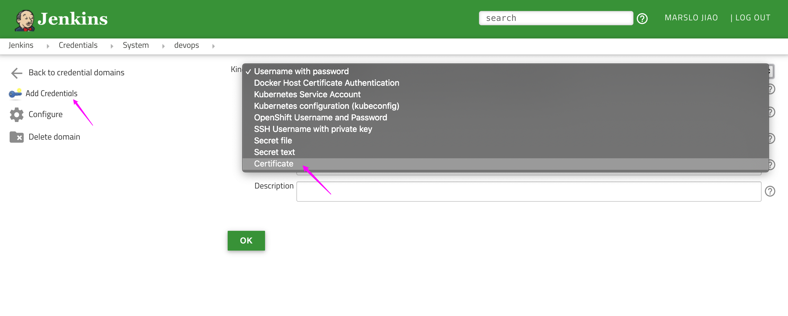

<!-- START doctoc generated TOC please keep comment here to allow auto update -->
<!-- DON'T EDIT THIS SECTION, INSTEAD RE-RUN doctoc TO UPDATE -->
**Table of Contents**  *generated with [DocToc](https://github.com/thlorenz/doctoc)*

- [generate credentials](#generate-credentials)
- [configure in jenkins](#configure-in-jenkins)

<!-- END doctoc generated TOC please keep comment here to allow auto update -->

### generate credentials
#### ca.crt
```bash
$ grep certificate-authority-data ~/.kube/config | awk -F': ' '{print $NF}' |  base64 -d > ca.crt
# OR
$ sudo cat /etc/kubernetes/pki/ca.crt
```

#### client.crt & client.key
```bash
$ grep client-certificate-data ~/.kube/config | awk -F': ' '{print $NF}' |  base64 -d > client.crt
$ grep client-key-data ~/.kube/config | awk -F': ' '{print $NF}' |  base64 -d > client.key
```

#### cert.pfx
```bash
$ openssl pkcs12 -export -out cert.pfx -inkey client.key -in client.crt -certfile ca.crt
Enter Export Password:
Verifying - Enter Export Password:

$ ls
ca.crt  cert.pfx  client.crt  client.key
```

### configure in jenkins
* Go to `Manage Jenkins` -> `Configure System` or `Manage Jenkins` -> `Manage Nodes and Clouds` -> `Configure Clouds`
* `Add a new Cloud` -> `Kuberentes`
    * `Name`: <Anything you want>
    * `Kubernetes URL`:
        * get from `$ kubectl cluster-info`
        * using `https://kubernetes.default.svc.cluster.local`
    * `Kubernetes server certificate key`: content of `ca.crt`. (`$ cat ca.crt`)
    * `Credentials`:
        * `Add` -> `Jenkins`
        * **Kind**: `Certificate`



    * Setup in Jenkins

